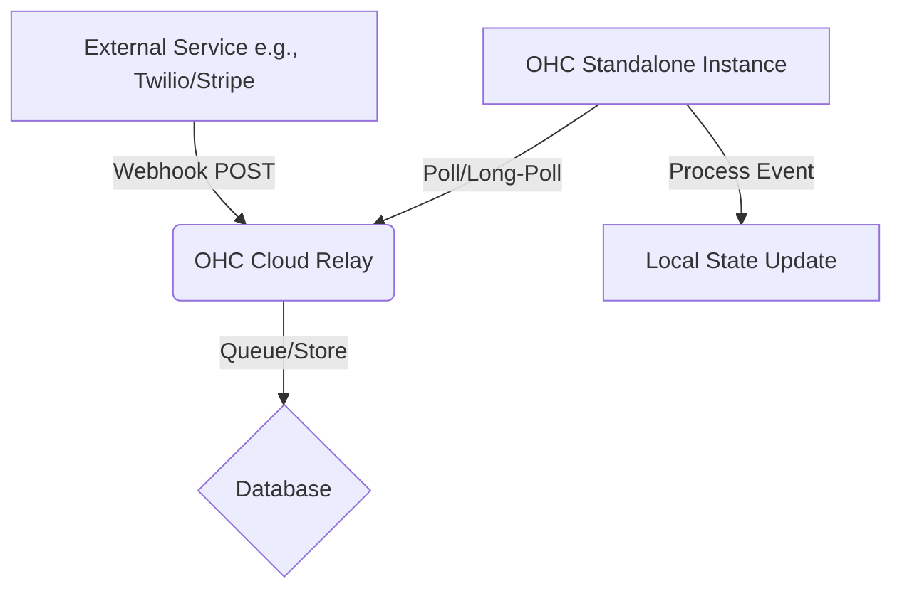

# Tool Integration Research Report Q2

## Executive Summary
This report evaluates third-party tool integrations to expand the capabilities of the OneHumanCorp (OHC) platform. The focus is exclusively on tools that solve real, day-to-day problems for non-technical small business owners, operating across both Cloud and Standalone environments. Seven categories were investigated: Social Media, Calendaring, Email Marketing, Payment Processing, Shipping, SMS Notifications, and Video Conferencing.

## Methodology
Research was conducted by evaluating market leaders in each category against the following criteria:
1. **Utility for SMBs:** Does it solve a tangible pain point?
2. **Ease of Use:** Can a non-technical owner set it up without managing API keys or complex configurations?
3. **Architecture Compatibility:** Can it function in both a multi-tenant Cloud and a local Standalone environment?

## Category Evaluations

### 1. Social Media Integration: WhatsApp Business
**Tool Evaluated:** WhatsApp Business API
**Problem:** Fragmented communication across personal phones, apps, and OHC.
**Solution:** A Unified Inbox within OHC.
**Cloud/Standalone Viability:** Cloud is straightforward via webhooks. Standalone requires a relay architecture to receive incoming webhooks locally.
**Priority:** P1

### 2. Calendar & Scheduling: Calendly
**Tool Evaluated:** Calendly
**Problem:** Double-bookings and time wasted negotiating meeting slots via email.
**Solution:** Embedded booking widget that syncs with personal calendars.
**Cloud/Standalone Viability:** High viability across both.
**Priority:** P1

### 3. Email Marketing: Mailchimp
**Tool Evaluated:** Mailchimp (Intuit)
**Problem:** Manual export/import of customer lists to send newsletters.
**Solution:** Automated background sync of the OHC customer list to a Mailchimp audience.
**Cloud/Standalone Viability:** High viability across both via API polling/sync.
**Priority:** P2

### 4. Payment Processing: Localized Providers (Paytm & Alipay)
**Tool Evaluated:** Paytm (India), Alipay (China)
**Problem:** High cart abandonment due to lack of local, trusted payment options.
**Solution:** Dynamic checkout options offering localized gateways based on currency/region.
**Cloud/Standalone Viability:** Cloud is straightforward. Standalone requires careful handling of payment confirmation callbacks.
**Priority:** P1

### 5. Shipping & Logistics: Shippo
**Tool Evaluated:** Shippo
**Problem:** Manual data entry for shipping rates and label generation.
**Solution:** Real-time rate calculation at checkout and one-click label generation in the dashboard.
**Cloud/Standalone Viability:** High viability across both. Standalone may have advantages communicating with local USB label printers.
**Priority:** P1

### 6. SMS & Notifications: Twilio
**Tool Evaluated:** Twilio
**Problem:** Unread emails leading to missed appointments and unnotified customers.
**Solution:** Automated outbound SMS for critical events (reminders, shipping updates).
**Cloud/Standalone Viability:** Outbound SMS is highly viable for both. Inbound (two-way) SMS requires webhook relays for Standalone.
**Priority:** P1

### 7. Video Conferencing: Zoom
**Tool Evaluated:** Zoom Workplace
**Problem:** Manual generation and distribution of video meeting links.
**Solution:** Automated link generation attached to online appointment bookings.
**Cloud/Standalone Viability:** High viability across both via OAuth API integration.
**Priority:** P2

## Architectural Considerations for Standalone Mode

The primary challenge identified across multiple tools (WhatsApp, Paytm/Alipay, Twilio) is handling asynchronous webhooks in the Standalone environment. Since the local app does not have a public-facing IP address, external services cannot push data to it directly.

**Recommendation:** Develop a lightweight "Cloud Relay" service specifically for routing webhooks to Standalone instances via polling or WebSockets.

## Comparison Table

| Category | Recommended Tool | Priority | Scope | Standalone Complexity |
| :--- | :--- | :--- | :--- | :--- |
| Social Media | WhatsApp | P1 | Large | High (Webhooks) |
| Calendar | Calendly | P1 | Medium | Low |
| Email Marketing | Mailchimp | P2 | Medium | Low |
| Payments | Paytm / Alipay | P1 | Large | High (Webhooks) |
| Shipping | Shippo | P1 | Medium | Low |
| SMS | Twilio | P1 | Medium | Medium (If 2-way) |
| Video | Zoom | P2 | Medium | Low |

## Next Steps
1. Review and approve the generated issue briefs located in `docs/research/`.
2. Prioritize the P1 issues for the upcoming sprint.
3. Initiate an architecture design review for the "Cloud Relay" necessary for Standalone webhook support.