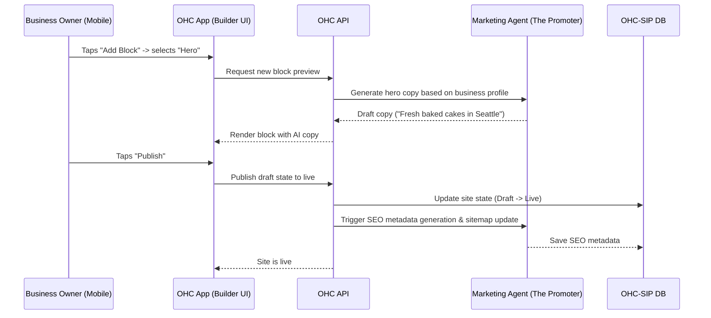

# [architecture] Website & Storefront Builder Architecture

## Title
[architecture] Implement Zero-Code Mobile-First Website & Storefront Builder

## Problem Statement
Small business owners like Maya (baker) and Carlos (handyman) need a beautiful, functional website to sell their products and services, but they find platforms like Shopify and Wix too complex. They do not understand "DNS", "SSL", "SEO", or even "padding and margins". They just want a beautiful storefront that looks great on a phone, takes payments, and lets them change a photo or price in seconds from their mobile device. The current gap is that existing builders are either too complex (requiring desktop access and design skills) or too basic (just a link-in-bio). OHC needs a builder that makes setting up a premium, functional storefront as easy as posting an Instagram story.

## Research Report
### Market Context & Competitive Analysis
- **Shopify:** Powerful but overwhelming. The theme editor requires a desktop monitor to be usable. Customizing sections often requires diving into Liquid code or paying for apps. Too complex for a solo baker or handyman.
- **Wix / Squarespace:** Highly customizable but bloated. They offer thousands of settings that confuse non-technical users. Mobile editing is notoriously difficult; users often break their mobile layout while editing on desktop.
- **GoDaddy (Airo):** Easy setup, but the result often looks cheap or dated. Customization is rigid, and the platform lacks native booking/e-commerce integrations without pricey add-ons.
- **OHC's Unfair Advantage:** True mobile-first editing. The builder restricts users to a "Premium by Default" design system (Glassmorphism, 20px blur, Outfit/Inter fonts) so they literally cannot make an ugly site. AI agents handle the heavy lifting (copywriting, SEO, image compression).

### Key Findings
1. Users abandon site building if they have to write their own copy or source their own images.
2. 80% of small business administration by our target personas happens on a mobile device (375px viewport).
3. The concept of "Publishing" a draft vs. live state is often confusing. Users expect a simple "Make Live" button and an easy way to preview.
4. Setting up custom domains is the #1 drop-off point in the onboarding funnel for other platforms.

## Design Doc

### 1. Key Design Decisions
- **Block-Based, Not Pixel-Perfect:** The builder uses predefined, highly polished "Blocks" (e.g., Hero, Product Grid) rather than free-form drag-and-drop. This guarantees mobile responsiveness and aesthetic excellence.
- **Premium by Default:** No hex color pickers or pixel padding inputs. Users select from curated "Vibes" (color palettes and typography pairings) managed by the platform.
- **AI-Driven Content:** When a user adds a text or testimonial block, the Marketing AI agent auto-generates draft copy based on the business profile.
- **Invisible Infrastructure:** SEO, SSL, and image optimization happen automatically. The user never sees a setting for "meta tags" or "SSL certificate provisioning".

### 2. Architecture Diagram

### 3. Content Blocks Definition
- **Hero:** Main headline, AI-generated subheadline, primary CTA (e.g., "Order Now"), and a background image or video.
- **Product Grid:** Dynamically syncs with the user's OHC product catalog. Displays images, prices, and "Add to Cart" or "Pre-order" buttons.
- **Service/Booking Calendar:** Connects to the Operations Agent's booking system. Displays available time slots for services like tutoring or repairs.
- **Text & Media:** For "About Us" or story sections. AI auto-drafts the story based on onboarding inputs.
- **Testimonials:** Connects to Customer Success Agent. Automatically pulls 5-star reviews from past orders.
- **Contact Form:** Simple lead capture that routes messages to the customer inbox.

### 4. Templates & Customization
- **Templates (Vibes):** Instead of structural templates, users choose "Vibes" (e.g., "Elegant", "Playful", "Minimalist"). A vibe dictates the typography (Outfit + Inter), corner radius, and color palette.
- **Customization:** Users can tap a block to swap the photo, edit the text (or ask AI to rewrite it), and toggle visibility. They cannot move elements within a block, ensuring the design remains intact.

### 5. Publishing Flow (Draft -> Live)
- **Auto-Save:** All changes are automatically saved to a `draft` state.
- **Preview:** Users can toggle between "Edit" and "Preview" mode. Preview shows exactly how the site will look to customers.
- **Publish:** A single "Go Live" button pushes the `draft` state to `live`.

### 6. SEO & Domain Provisioning
- **Automatic SEO:** Upon publishing, the Marketing Agent automatically reads the page content and generates the title tag, meta description, and alt tags for images. It also generates an XML sitemap.
- **Custom Domains & SSL:**
  - Free Tier: Users get a `[business].ohc.app` subdomain automatically.
  - Paid Tier: Users can connect a custom domain. The UI provides a dead-simple, 3-step wizard. The backend handles DNS verification and SSL provisioning seamlessly.

### 7. Mobile UX Flow (375px First)
1. **Dashboard:** Tap "Edit Website".
2. **Editor:** A full-screen preview of the site. A floating FAB at the bottom says "+ Add Section".
3. **Edit Mode:** Tapping any section opens a bottom sheet with simple controls (e.g., "Change Photo", "Rewrite Text", "Hide Section").
4. **Publishing:** A sticky header bar contains a "Go Live" button.

### 8. AI Agent Integration Points
- **The Promoter (Marketing):** Generates placeholder text, rewrites copy on demand, and automatically handles all SEO meta tags.
- **The Manager (Operations):** Feeds live inventory data to the Product Grid block and availability to the Booking block.
- **The Ambassador (Customer Success):** Feeds verified reviews into the Testimonials block.

## Implementation Prompt
"Implement the UI and backend logic for the Zero-Code Website Builder. The frontend must be fully functional on a 375px mobile screen. Implement the 'Hero' and 'Product Grid' blocks first. Create the draft vs. live state mechanism in the backend. Ensure that when a user adds a text block, the system calls the Marketing AI agent to generate draft copy based on the tenant's profile. Build the 'Publish' button that pushes draft state to live and triggers automatic SEO metadata generation. Do not expose any advanced CSS or technical settings to the user."

## Priority
P0

## Estimated Scope
Large
