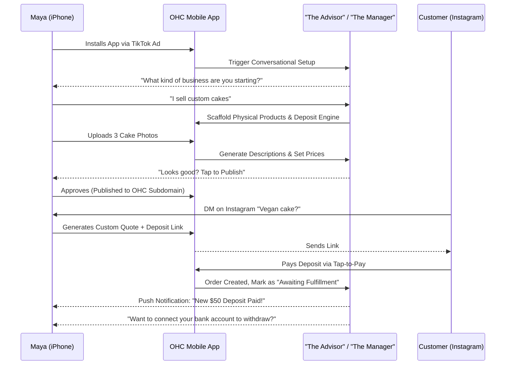
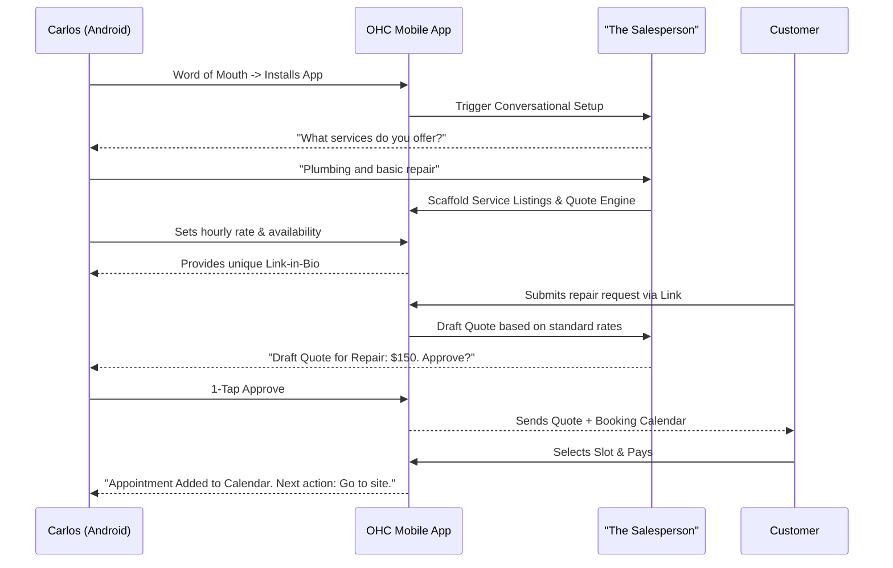
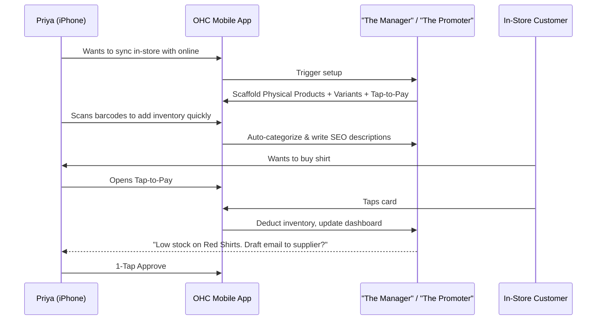
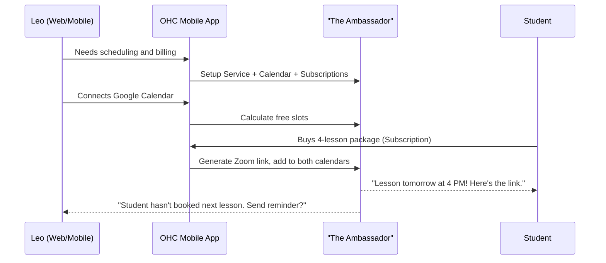
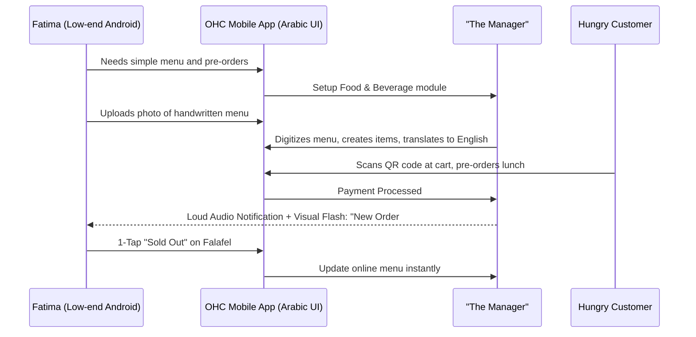

# Oracle: [Business Journey Architecture]

## Title
Business Journey Architecture: End-to-End Persona Workflows

## Problem Statement
Small business owners—from bakers to handymen—often abandon software platforms because the journey from discovery to the first successful sale is disjointed, requires technical knowledge, or demands too much manual configuration. OHC needs a standardized, fully mapped end-to-end user journey architecture for our core personas. This architecture must ensure that anyone can go from "zero to live business" in under 10 minutes from their mobile phone, with AI handling the friction points invisibly. Without this map, feature development risks drifting away from the mobile-first, "grandmother test" mandate.

## Research Report
*   **Goal**: Define the complete business journey for five core personas: Maya (Baker), Carlos (Handyman), Priya (Boutique Owner), Leo (Music Tutor), and Fatima (Food Cart Operator).
*   **Competitive Analysis**:
    *   **Shopify**: Excellent for product inventory, but onboarding is complex and desktop-heavy. Requires manually setting up themes and reading manuals to configure shipping.
    *   **Wix/Squarespace**: Good for portfolios, but booking and e-commerce require paid add-ons and significant drag-and-drop effort on a desktop.
    *   **GoDaddy**: Easy to start, but rigid. Upgrading features often involves navigating dense control panels.
*   **OHC Advantage**: The "Zero to Live in 10 Minutes" promise. Mobile-native creation, AI-driven configuration (e.g., automatically generating product descriptions or service menus from a few photos or chat messages), and a completely unified system without separate "plugins" or "apps."
*   **Key Findings**:
    *   Friction points happen at: writing descriptions, setting up payment gateways, and figuring out "what to do next" after publishing.
    *   Success is defined differently: For Maya, it's a paid deposit. For Leo, it's a booked slot. The platform must dynamically adjust the "Activation" success criteria.

## Design Doc
### Key Design Decisions
1.  **Conversational Onboarding**: Instead of forms, use "The Advisor" (AI) to ask 3-4 questions via a chat-like interface to instantly scaffold the business structure.
2.  **Deferred Configuration**: Only ask for critical path items upfront (Name, Main Offering). Defer non-critical setup (Taxes, Custom Domain, Logo) until after the first transaction.
3.  **Unified Activation State**: The system maintains an "Activation Score" for each tenant, guiding the user via "Next Best Action" cards on the mobile dashboard.
4.  **Mobile-First Interaction**: All actions are swipeable, tap-friendly, and require minimal text entry.

### Persona Journey Sequence Diagrams

#### 1. Maya (Baker) - Physical Products & Custom Orders

#### 2. Carlos (Handyman) - Services & Quotes

#### 3. Priya (Boutique Owner) - Hybrid Inventory & Subscriptions

#### 4. Leo (Music Tutor) - Booking & Subscriptions

#### 5. Fatima (Food Cart) - Pre-orders & High Velocity

### UI Wireframes & Mobile UX Flow (375px First)

**Screen 1: The AI Onboarding Chat (Glassmorphism UI)**
*   **Header**: "Welcome to OneHumanCorp" (Subtle motion background)
*   **Content**: Chat bubbles from "The Advisor".
    *   Bubble: "Hi Maya! Let's get your business online. What do you sell?"
    *   Input: Text field with voice-to-text prominently featured.
*   **Action**: "Next" button (Primary color, 44px touch target).

**Screen 2: The "Activation" Dashboard**
*   **Header**: "Maya's Cakes" (Status: Draft)
*   **Content**: A "Next Best Action" card taking up the top half.
    *   Card: "Add your first product" with a large "+ Add Photo" button.
*   **Footer**: 4-icon tab bar (Home, Orders, Chat, Settings).

**Screen 3: The 1-Tap AI Approval Flow**
*   **Overlay**: A modal sliding up from the bottom.
*   **Content**: "The Manager drafted a product description for 'Vegan Chocolate Cake'." (Shows preview).
*   **Actions**: Two side-by-side buttons: "Looks Good (Publish)" and "Edit".

## Implementation Prompt
"Implement the foundational structure for the 'Conversational Onboarding' and 'Next Best Action' dashboard components. This should be a mobile-first, responsive Next.js implementation adhering strictly to OHC Premium Design Standards (Glassmorphism tokens, Outfit/Inter typography). The user should be greeted by a mock 'Advisor' agent that asks 2-3 setup questions. Based on their answers, the dashboard should render a dynamic 'Next Best Action' card guiding them towards activation (e.g., 'Add a product' or 'Connect calendar'). Include full Playwright E2E tests simulating the onboarding journey on a 375px viewport. Do not hardcode database schemas; ensure components are wired correctly for backend state management."

## Priority
P0

## Estimated Scope
Large
