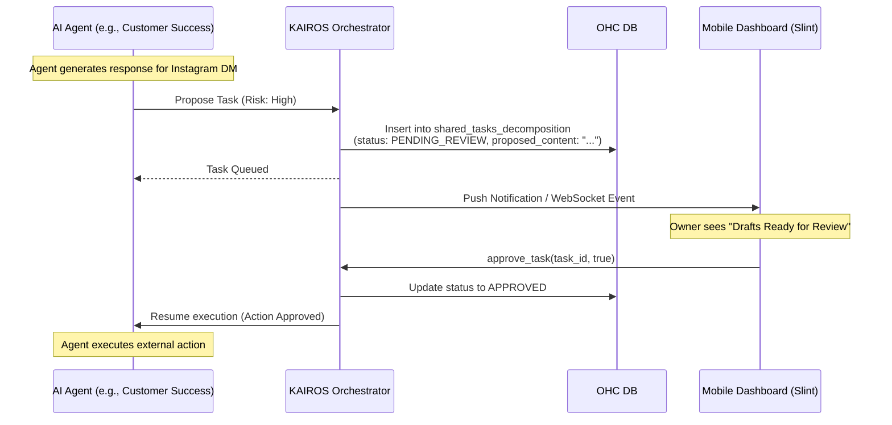

# Architecture Design: AI Agent Approval Workflow Engine

## 1. Problem Statement
Non-technical business owners need absolute trust and control over their business operations. While AI agents (like "The Promoter" or "The Ambassador") can autonomously generate content, execute marketing campaigns, and handle customer service, allowing them to execute high-risk actions (e.g., publishing social media posts, sending customer emails, refunding payments) without human oversight introduces unacceptable risk and anxiety.

We need a "Draft-for-Review" workflow engine within the KAIROS Orchestrator. This engine will allow agents to submit proposed high-risk actions into a pending state. The business owner can then review these proposals in a plain-language interface and execute them with a single tap from their mobile dashboard.

## 2. Research & Existing Implementation Review
Based on our codebase analysis, elements of the Draft-for-Review workflow have already been prototyped or partially integrated:
- **Database Schema**: The `shared_tasks_decomposition` table already includes `action_risk`, `approval_status`, and `proposed_content` columns (via migration `051_shared_tasks_decomposition.sql`).
- **Protobuf Definitions**: The `SharedTask` message in `src/proto/hub.proto` includes these fields. There is also an `ApproveTaskRequest` and `ApproveTaskResponse`.
- **Backend Services**: `TaskManager::approve_task` in `src/server/tasks.rs` and `HubService::approve_task` in `src/server/lib.rs` are present but currently only mutate in-memory state (`RwLock<HashMap>`) instead of persisting to PostgreSQL/SQLite databases.
- **Frontend**: `src/app/dashboard.slint` contains a `PendingApproval` struct, a visual rendering loop for "Drafts Ready for Review", and an `approve_task(string)` callback.

## 3. Design Decisions

### 3.1 Data Model
The existing `shared_tasks_decomposition` schema is robust.
- `action_risk` (String): Classifies the risk of the action (`low`, `medium`, `high`, `critical`).
- `approval_status` (String): Follows a state machine (`PENDING_REVIEW`, `APPROVED`, `REJECTED`).
- `proposed_content` (String/JSON): The exact content/action to be executed upon approval (e.g., the text of an email, or the payload for a refund).

### 3.2 Action Risk Assessment
The system defines risk levels:
- **Low (Auto-Execute)**: Updating internal inventory tags, organizing files, parsing analytics. No approval needed.
- **Medium/High (Draft-for-Review)**: Sending external emails, publishing social media content, responding to DMs, issuing quotes. These are paused and sent to the Pending Approval Queue.
- **Critical (Strict Review)**: Issuing refunds, modifying terms of service. Requires explicit 2FA or re-authentication if supported.

### 3.3 System Architecture Flow

### 3.4 API & Orchestrator Integration
The Orchestrator must intercept tasks generated by agents.
- When an agent proposes a task, the Orchestrator evaluates the `action_risk`.
- If `action_risk` >= `medium`, the Orchestrator halts the agent's workflow and sets `approval_status` to `PENDING_REVIEW`.
- The task is pushed to the client via the existing Teammate Mesh or fetched via a REST/gRPC polling endpoint for `pending_approvals`.

### 3.5 Mobile-First UI Guidelines
- **Plain Language:** The approval prompt must be entirely jargon-free. ("Maya, The Ambassador drafted a reply to a vegan cake inquiry. Tap to send.")
- **Preview:** The `proposed_content` must be clearly visible.
- **One-Tap Actions:** A large, accessible "Approve" button and a smaller "Edit" or "Reject" button. Touch targets must be >= 44x44px.

## 4. Implementation Prompt for Engineer Agents

**Priority:** P0 (Critical)
**Estimated Scope:** Medium

**User-Facing Outcome:** Business owners will see a "Drafts Ready for Review" section on their mobile dashboard. They can read what their AI agents have prepared (e.g., an email to a customer) and tap "Approve" to send it instantly.

**Acceptance Criteria:**
1. **Database Persistence:** The `TaskManager::approve_task` method in `src/server/tasks.rs` must be updated to securely persist the `approval_status` (`APPROVED` or `REJECTED`) and update the `status` column to PostgreSQL and SQLite databases, replacing the purely in-memory implementation.
2. **API Completeness:** Ensure the `ApproveTask` RPC endpoint in `src/server/lib.rs` successfully calls the updated database persistence method and handles errors gracefully.
3. **Frontend Wiring:** Verify the Slint dashboard correctly populates the pending approvals list from the backend and successfully routes the `approve_task` callback to the gRPC API.
4. **Testing:** Write unit and/or E2E tests covering the complete Draft-for-Review lifecycle from a task entering `PENDING_REVIEW` to the user hitting "Approve".