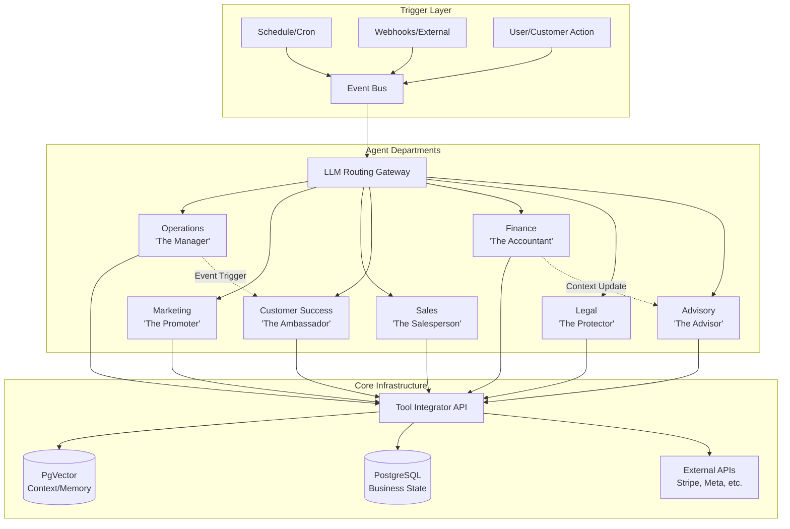

# [Architecture] AI Agent Department

## Title
AI Agent Department Architecture

## Problem Statement
Small business owners (bakers, handymen, boutique owners, tutors, food cart operators) face an overwhelming amount of complexity when trying to run their operations. They need to manage inventory, process orders, answer customer queries, post on social media, update their website, and handle financials. Current market solutions (Shopify, Wix, Squarespace) provide tools but expect the user to act as the operator. Non-technical users find this complexity unmanageable, leading to abandonment or reliance on expensive third-party professionals. They need a system where AI agents invisibly act as their "staff" (departments) to handle these day-to-day operations seamlessly without technical configuration.

## Research Report
### Current Market Landscape
*   **Shopify:** Offers "Sidekick" which is primarily a conversational AI for answering questions or suggesting edits, but not a fully autonomous agentic workforce that runs distinct departments in the background. Setup takes 30-60 minutes and requires technical understanding.
*   **Wix:** Provides "Wix AI" for website generation and some copy, but lacks deep operational automation (e.g., proactive customer follow-ups or automated inventory reordering).
*   **Squarespace:** Good for portfolios but limited agentic capabilities; mostly static templates with basic commerce.
*   **GoDaddy:** "Airo" offers some automation but remains limited in scope and depth for full business operations.

### Pain Points Addressed
*   **Time Starvation:** Business owners don't have time to update their catalog, track inventory, and reply to Instagram DMs simultaneously.
*   **Technical Jargon:** Users are alienated by terms like "SEO," "CRM," or "Payment Gateway." They understand concepts like "The Manager," "The Promoter," and "The Accountant."
*   **Context Fragmentation:** Systems don't share context. A sale in the store doesn't automatically trigger a "Thank You" email or update the accounting ledger without complex Zapier setups.

### Proposed Solution Concept
A unified architecture where the system acts as an "Agentic OS." The business operations are divided into familiar "Departments" acting as AI agents:
1.  **Operations ("The Manager"):** Day-to-day execution (orders, inventory, bookings).
2.  **Marketing & Advertising ("The Promoter"):** Visibility (website design, SEO, social media).
3.  **Sales & Acquisition ("The Salesperson"):** Growth (quotes, leads, referrals).
4.  **Customer Success ("The Ambassador"):** Retention (messages, review requests, re-engagement).
5.  **Finance & Payments ("The Accountant"):** Money (payments, reporting, taxes).
6.  **Legal & Compliance ("The Protector"):** Risk (contracts, terms, GDPR).
7.  **Business Advisory ("The Advisor"):** Strategy (health reports, recommendations).

## Design Doc

### Architecture Diagram

### Mobile UX Flow (375px)
*   **Dashboard View:** A clean interface showing "What happened today" (e.g., "3 new orders," "2 DMs answered by the Ambassador"). No complex graphs by default, just plain-language summaries.
*   **Department Hub:** A simple tap menu listing the departments (Manager, Promoter, Accountant, etc.).
*   **Approval Queue:** A swipeable list (Tinder-style or simple checklist) for actions requiring manual approval (e.g., "The Promoter drafted an Instagram post. Approve to publish?").
*   **Settings/Tuning:** Simple sliders or toggles for agent autonomy (e.g., "Auto-reply to common questions" [ON/OFF], "Notify me before sending quotes" [ON/OFF]).

### Key Design Decisions
*   **Familiar Metaphors:** Agents are branded as human-like departments (e.g., "The Manager") to build trust and simplify the mental model for non-technical users.
*   **Event-Driven Coordination:** Agents don't just act in isolation; an action by one (Operations fulfilling an order) triggers an event that another agent (Customer Success) can pick up to send a personalized "Thank you" email.
*   **Memory & Context:** All agents share a centralized memory store (pgvector embeddings). The Customer Success agent knows about a recent refund processed by the Finance agent.
*   **Progressive Autonomy:** Agents start with "Draft-for-review" mode and can be promoted to "Auto-execute" as the business owner builds trust.
*   **Tenant Budgeting:** AI token usage and tool executions are tracked and throttled per tenant ID to manage costs effectively across different pricing tiers.

## Implementation Prompt
**Task for Implementer:**
Implement the core orchestration routing and event coordination layer for the AI Agent Departments.
1.  **User-Facing Outcome:** A system where an incoming event (e.g., a new order, a customer message, or a scheduled cron) is correctly routed to the appropriate AI "Department" (Operations, Customer Success, etc.) based on the event context. The system should allow agents to emit secondary events that other departments can consume.
2.  **CUJ (Critical User Journey):**
    *   A customer places an order (Event emitted).
    *   The "Operations" agent processes the order and updates inventory, then emits an "Order Processed" event.
    *   The "Customer Success" agent consumes the "Order Processed" event and generates a draft "Thank You" message for the user's approval queue.
3.  **Acceptance Criteria:**
    *   Create a robust routing mechanism that maps event types to specific agent departments.
    *   Implement an event bus (or utilize the existing Teammate Mesh architecture) that allows agents to publish and subscribe to cross-department events.
    *   Provide a standard interface for agents to read/write context to the shared memory layer.
    *   Include at least one end-to-end test simulating the flow of a single event triggering multiple agents in sequence. No network calls to external LLMs; mock the AI responses.
    *   Ensure all new infrastructure handles multi-tenancy correctly (e.g., extracting `tenant_id` properly and isolating contexts).

## Priority
P0 (Critical)

## Estimated Scope
Large
