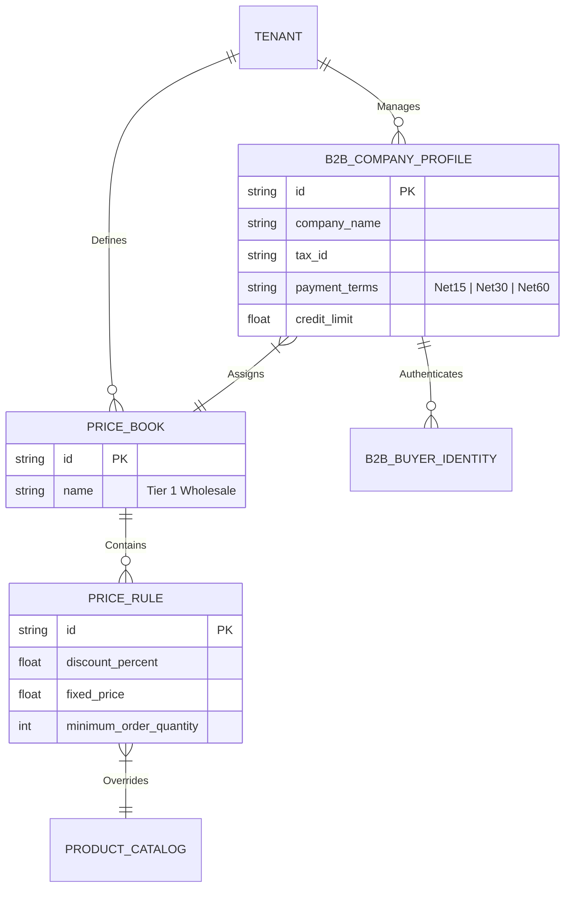
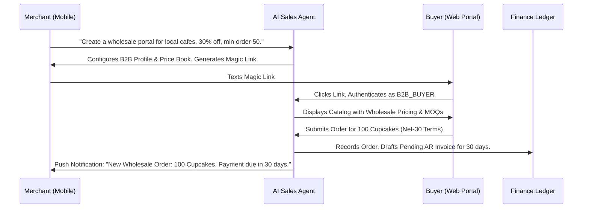

# Title: Universal Autonomous B2B & Wholesale Trading Engine

## Problem Statement
Successful solopreneurs inevitably scale into B2B. Maya (baker) gets asked by local cafes to supply them wholesale. Priya (boutique owner) needs a streamlined way to reorder from her suppliers. Currently, offering custom wholesale pricing, Minimum Order Quantities (MOQs), and Net-30 payment terms requires expensive enterprise software (like Shopify Plus) or messy spreadsheets and email threads. Small business owners lack a zero-configuration way to instantly spin up a secure, private wholesale portal, negotiate quotes, and track delayed invoice terms from their phone.

## Research Report
- **Competitor Analysis:** Shopify gates native B2B features behind Shopify Plus ($2000+/mo). Standard plans require clunky third-party apps and confusing discount tag systems. Wix and Squarespace offer rudimentary member areas but lack deep B2B logic (Net terms, quote negotiation, MOQs).
- **The OHC Gap:** OHC's current `Unified Capacity and Inventory Ledger` and `Instant Localized Invoicing` are highly optimized for direct-to-consumer (D2C) transactions. We lack the relational data models (Price Books, Company Profiles) and AI coordination necessary to present authenticated business buyers with custom catalogs, negotiate bulk pricing, and manage accounts receivable ledgers asynchronously.
- **Strategic Opportunity:** Democratizing B2B features for micro-SMBs allows OHC to capture the entire supply chain network, enabling OHC merchants to easily buy and sell from one another.

## Design Doc

### Architecture Diagram

### Mobile UX Flow (375px First)
1. **The Catalyst Action:** In the Catalog tab, the merchant taps a new "B2B / Wholesale" toggle.
2. **AI Configuration Chat:** Instead of complex forms, the AI asks: "Who gets wholesale pricing, and what's the deal?" The merchant types: "Give 20% off to local coffee shops if they buy 10 items."
3. **The Portal Card (Translucent UI):** A macOS-style card appears with a shareable magic link and a list of approved `B2B_COMPANY_PROFILE`s.
4. **The Buyer Experience:** A buyer opening the link on their phone sees a clean, branded, passwordless login. Once verified via email OTP, they see the merchant's catalog seamlessly adjusted to their specific `PRICE_BOOK`, with clear markers for "Minimum 10 required".

### AI Agent Integration Points
*   **AI Sales Department:** Acts as an autonomous quote negotiator. If a buyer requests 500 items but asks for a 40% discount, the agent consults the merchant's margin rules and can auto-approve or counter-offer immediately.
*   **AI Finance Department:** Monitors the Net-30/Net-60 ledgers. Autonomously sends polite SMS/email reminders to buyers on day 28, 30, and 35.

### Key Design Decisions
*   **Unified Inventory:** B2B and D2C share the exact same underlying `PRODUCT_CATALOG`. `PRICE_BOOK`s act as a presentation layer override. No duplicate inventory data.
*   **Passwordless B2B Identity:** Wholesale buyers authenticate via secure Magic Links mapped to a `B2B_BUYER_IDENTITY`, completely removing password management friction.
*   **Strict Multi-Tenant Isolation:** The API gateway must validate that the `B2B_BUYER_IDENTITY` is explicitly authorized by the `TENANT` to view the associated `PRICE_BOOK`.

## Implementation Prompt
Implement the underlying data models and API endpoints for the Universal B2B Trading Engine.
Create the `B2B_COMPANY_PROFILE`, `PRICE_BOOK`, and `PRICE_RULE` entities. Build the secure authorization middleware to allow a `B2B_BUYER_IDENTITY` to authenticate via a magic link and retrieve a catalog view that dynamically applies their assigned `PRICE_BOOK` discounts and Minimum Order Quantities (MOQs).
Integrate this system with the existing Order API to support deferred payment terms (e.g., Net-30), creating a pending ledger entry rather than requiring immediate payment gateway capture. Ensure all database operations are strictly scoped to the host tenant. Do not build the frontend UI; focus entirely on the backend data model, multi-tenant isolation rules, and the AI function call definitions (`create_price_book`, `approve_b2b_buyer`, `draft_net_term_invoice`).

**Acceptance Criteria:**
1. A tenant can create a `PRICE_BOOK` with specific discount rules and MOQs.
2. A tenant can create a `B2B_COMPANY_PROFILE` and assign a `PRICE_BOOK` to it.
3. An API endpoint can return the catalog, correctly overriding prices based on the authenticated buyer's assigned `PRICE_BOOK`.
4. An order can be placed with "Net-30" terms, resulting in a successful order creation without immediate payment capture.

## Priority
P1 (High)

## Estimated Scope
Medium
