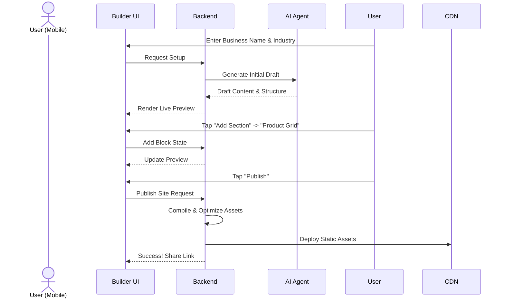

# [architecture] Website & Storefront Builder

## Problem Statement
Small business owners lack the technical expertise to build and maintain a professional online presence. They need a simple, mobile-first, and highly performant website and storefront builder that requires zero coding knowledge. The current ecosystem lacks a truly accessible tool that allows users to launch a functional business site in under 10 minutes from their mobile device.

## Research Report
### Competitive Analysis
- **Shopify:** Powerful but overwhelming for non-technical users. Requires significant time investment.
- **Wix/Squarespace:** Drag-and-drop complexity is high; templates often break on mobile.
- **OHC Advantage:** OHC's builder must be radically simple. AI handles the heavy lifting of design, SEO, and optimization, allowing users to focus purely on content. The interface must be primarily touch-driven and mobile-first.

## Design Doc

### Architecture Diagram

```mermaid
graph TD
    subgraph Client [Mobile/Web Client]
        A[Website Builder UI]
        B[Live Preview Engine]
    end

    subgraph API [Backend API]
        C[Storefront Service]
        D[AI Marketing Agent]
        E[Asset Optimizer]
    end

    subgraph Storage [Data Layer]
        F[(PostgreSQL - Site Drafts/Config)]
        G[Edge CDN - Live Assets]
        H[Cloud Storage - Uploads]
    end

    A <-->|State Updates| C
    A -->|Generate Content| D
    B <--|Render Draft| C
    A -->|Upload Image| E
    E -->|Store WebP| H
    C <-->|Persist| F
    C -->|Publish| G
```

### Key Components

1.  **Content Blocks:** Pre-defined functional units (Hero, Product Grid, Service Booking, Testimonials, Contact Form) rather than low-level HTML/CSS elements.
2.  **Templates & Customization:** Users select "vibes" and primary colors. Strict constraints ensure aesthetic quality and performance. AI generates initial drafts based on basic business info.
3.  **Publishing Lifecycle:** Drafts are saved instantly. The "Publish" action compiles the state into static, edge-cached assets (HTML/CSS/WebP) for zero-latency delivery.
4.  **Automated SEO:** AI generates meta tags, JSON-LD schema, and sitemaps invisibly.
5.  **Custom Domains & SSL:** Auto-provisioned free subdomains. Automated SSL management for custom domains.

### Mobile UX Flow (375px First)



1.  **Setup Wizard:** Minimal input required (Name, Industry). AI auto-generates a complete functional draft instantly.
2.  **Editing:** Touch-friendly "Add Section" and reorder handles. No precise drag-and-drop. Text input uses native mobile keyboards.
3.  **Publishing:** Single-tap action. Clear feedback and immediate access to the live URL and shareable links.

### Key Design Decisions
-   **Constraint over Flexibility:** Limiting customization ensures users cannot build "ugly" or non-performant sites.
-   **Static Compilation:** Publishing generates static assets for maximum performance and security, rather than dynamic rendering on every request.
-   **AI-First Generation:** Staring at a blank canvas is the biggest hurdle. AI provides a 90% complete starting point.

## Implementation Prompt
**Task:** Implement the Website & Storefront Builder backend services and frontend UI.
**Outcome:** A user can successfully complete the setup wizard, edit their site using pre-defined content blocks, preview the changes, and publish the site to a live, accessible URL.
**Acceptance Criteria:**
- The builder UI must be fully functional and responsive on a 375px mobile screen.
- AI generation must produce a coherent initial draft based on minimal input.
- Publishing must result in a publicly accessible, optimized static site.
- SEO metadata and SSL must be handled automatically without user intervention.
- Include comprehensive unit and E2E tests covering the complete creation and publishing flow.

## Priority
P0 (Critical)

## Estimated Scope
Large
