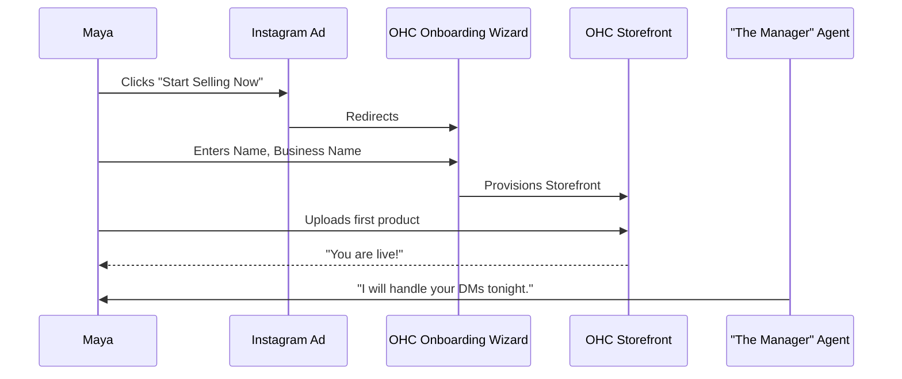
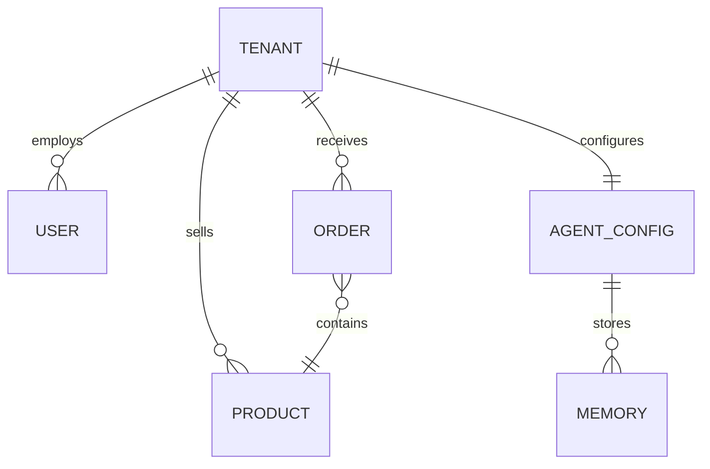

# OHC Architecture Design Report: Business Journey & Data Model

## Problem Statement
Small business owners (like Maya the baker or Carlos the handyman) face immense friction when trying to establish an online presence. Existing tools require assembling a disjointed tech stack (website builder, booking calendar, payment processor, CRM) and often demand manual configuration of complex settings (DNS, SSL, webhooks). This complexity prevents them from going live quickly, costing them potential revenue and stunting growth.

## Research Report
*   **Current State**: Users rely on manual workflows (e.g., taking orders via Instagram DMs and logging them in a notebook).
*   **Competitive Analysis**:
    *   **Shopify**: Powerful but complex. Requires navigating a steep learning curve and understanding technical concepts like liquid templates or app integrations.
    *   **Wix/Squarespace**: Focuses heavily on the website builder, but lacks integrated, out-of-the-box business logic (like unified inboxes or AI-driven customer support).
*   **The OHC Gap**: OHC needs a cohesive, zero-code architecture that seamlessly integrates a mobile-first storefront, a robust data model, and invisible AI agents to handle the complexity automatically.

## Business Journey Architecture (Persona: Maya)
*   **Acquisition**: Maya discovers OHC via an Instagram ad highlighting "zero-code storefronts in minutes." The CTA is "Start Selling Now."
*   **Onboarding**: Wizard flow requests only Name, Business Name, and Instagram Handle. Complex settings (shipping, taxes) are deferred.
*   **Activation**: Maya adds her first cake photo and links her Stripe account. Success is defined by receiving her first order within 48 hours.
*   **Retention**: Maya receives daily push notifications summarizing "The Manager" AI agent's handling of DMs.
*   **Revenue**: Maya upgrades to the $9/mo Starter tier when she exceeds the 10-product limit of the Free tier.
*   **Referral**: Maya shares her success on TikTok using her OHC portfolio link, driving organic signups.

## Data Model Architecture
*   **Entities**: `Tenant` (Business), `User` (Owner/Staff), `Product`, `Order`, `Agent`, `Memory`.
*   **Relationships**: A `Tenant` has many `Products` and `Orders`. A `Tenant` has one configured `Agent` department schema.
*   **Multi-tenancy**: Strict isolation via `tenant_id` on all tables. Row-level security (RLS) policies enforce access.
*   **Access Patterns**: The mobile app frequently queries the `Order` table for active fulfillments. The AI Agent frequently queries the `Memory` and `Product` tables to answer customer questions accurately.

## AI Agent Department Architecture
*   **Operations ("The Manager")**: Triggered by new webhook events (e.g., Stripe payment success). Coordinates fulfillment status updates.
*   **Customer Success ("The Ambassador")**: Triggered by incoming customer messages. Queries `Order` status to provide autonomous updates. Drafts responses for complex queries requiring human approval.
*   **Coordination**: Departments communicate via a unified event bus (Kafka/Redis PubSub). Memory is stored in a shared vector database.

## Mobile-First Architecture Review
*   **Offline Support**: Order viewing and basic product editing must work offline (SQLite caching). Image uploads are queued and synced upon reconnection.
*   **Performance**: Core interactive elements must load under 1.5s on 3G networks. Payload sizes must be strictly optimized (under 500KB initial JS).

## Multi-Tenant SaaS Tier Architecture
*   **Free ($0)**: 10 Products, 1 AI Dept, 100 Actions/mo, OHC subdomain. Upgrades presented when the 11th product is added.
*   **Starter ($9/mo)**: 100 Products, 3 AI Depts, 1000 Actions/mo, Custom Domain.
*   **Pro ($29/mo)**: Unlimited Products, 10 AI Depts, Unlimited Actions, SSL Custom Domain.

## Implementation Prompt
Design and implement the core database schema enforcing strict multi-tenancy for `Tenant`, `User`, `Product`, and `Order` entities. Ensure all queries automatically scope to the authenticated user's `tenant_id`. Implement a robust data access layer that supports high-frequency reads from the mobile app (orders) and the AI agent (product catalog/memory) while maintaining <1.5s response times.

## Priority
P0

## Estimated Scope
Large

*Note: All designs prioritize the non-technical business owner, adhering to OHC's Visual Excellence and "grandmother test" standards.*
