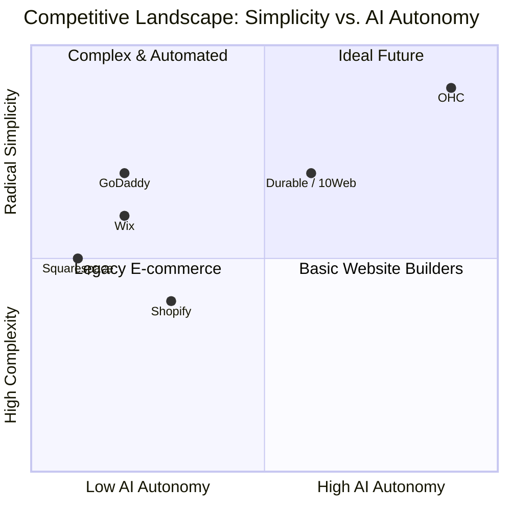
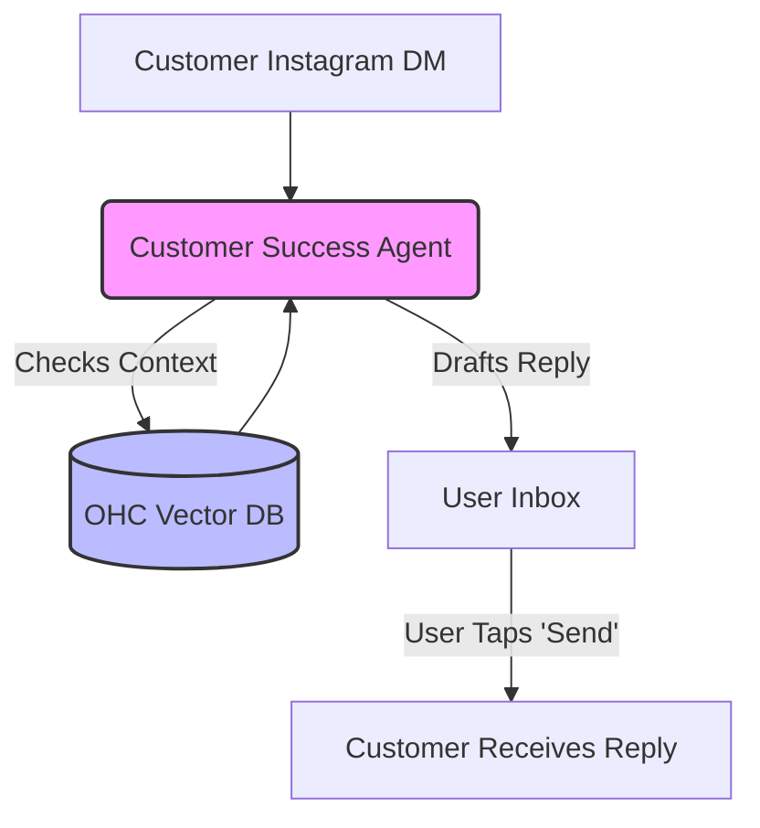

# OHC Small Business Platform - Market Research & Product Strategy

## Executive Summary

Small business owners—especially non-technical founders like home bakers, freelance handymen, boutique owners, music tutors, and food cart operators—struggle to establish and run an online presence. While existing platforms like Shopify, Wix, and Squarespace are powerful, they require a steep learning curve, significant setup time (30-60+ minutes), and ongoing active management. Competitor AI features are mostly bolted-on chatbots or one-off design generators, rather than invisible, agentic systems that autonomously run business departments.

This report outlines how **OneHumanCorp (OHC)** can capture the market by delivering a radically simple, mobile-first, zero-setup platform powered by autonomous AI departments.

---

## Track 1: Deep Competitor Audit

| Platform | Setup Time | AI Integration | Mobile Mgt | Free Tier | Target User |
|---|---|---|---|---|---|
| **Shopify** | >30 min | Chatbot (Sidekick) | Partial | None | SMB/Tech-savvy |
| **Wix** | 20-40 min | Site Builder (ADI) | Partial | Limited | Semi-technical |
| **Squarespace** | 30-60 min | Low | Low | None | Creative Pros |
| **GoDaddy** | 20-40 min | AI Branding (Airo)| Low | None | Basic user |
| **Square Online**| <20 min | Basic | Strong | Yes | Local Retail/Food |
| **OHC (Vision)**| **<10 min** | **Autonomous Agents** | **Native** | **Yes** | **Zero-Tech Users** |

### Competitor Weaknesses
- **Shopify**: High cognitive load. Confusing terminology (DNS, shipping zones, fulfillment locations). App Store reliance causes fragmentation and high costs.
- **Wix/Squarespace**: Focuses on "building a website" rather than "running a business". Once the site is up, the user still has to manually handle orders, DMs, and marketing.
- **GoDaddy**: Over-indexes on domain upselling. The AI features (Airo) are shallow and don't provide ongoing operational value.

---

## Track 2: SMB User Pain Point Research

Based on data aggregated from App Store reviews (Shopify, Wix apps), Trustpilot, and r/smallbusiness:

### Top 5 SMB Pain Points
1. **Setup Complexity (38% of complaints)**: Users are paralyzed by the initial configuration required just to start accepting payments.
2. **Customer Communication Overload (25% of complaints)**: Managing Instagram DMs, WhatsApp, and emails manually causes missed sales and burnout.
3. **Marketing Paralysis (18% of complaints)**: "I don't know what to post on social media or how to run ads."
4. **Mobile Management Difficulties (12% of complaints)**: Most platforms treat the mobile app as an afterthought, preventing on-the-go management.
5. **Fragmented Tooling (7% of complaints)**: Using disparate tools for bookings, inventory, and payments causes friction and data silos.

### Persona Mapping
- **Maya (Baker, 28)**: Paralyzed by Shopify's setup. Needs automated DM replies and a simple custom order form with deposit collection.
- **Carlos (Handyman, 42)**: No online presence. Needs a simple service listing, booking system, and AI-generated quoting based on customer requests.
- **Priya (Boutique, 35)**: Struggles with inventory sync and complex email marketing tools. Needs easy POS integration and automated stock alerts.
- **Leo (Music Tutor, 22)**: Chaos from manual scheduling. Needs recurring subscriptions, automated follow-ups, and calendar sync.
- **Fatima (Food Cart, 50)**: Language barrier and tech-averse. Needs a multi-lingual, SMS-notification-based pre-order system for pickup.

---

## Track 3: AI Differentiation Research & Manifesto

Competitors use AI as a feature (a chatbot you talk to, or a button you click once). **OHC uses AI as infrastructure.**

### OHC AI Differentiation Manifesto
We will implement these 5 high-value automations to leapfrog the market:

1. **Omnichannel Customer Success Agent**: Automatically draft contextual replies to Instagram DMs and site chats based on business policies and inventory. (Solves: Communication Overload).
2. **Autonomous Social Media Marketer**: Generate, design, and schedule Instagram/TikTok posts based on new product additions. (Solves: Marketing Paralysis).
3. **Zero-Touch Store Setup**: Create a complete, personalized store, menu, and policy set from a 2-minute conversation. (Solves: Setup Complexity).
4. **Plain-Language Advisory Reports**: Provide weekly summaries like "You sold 10 cakes. Tuesday was busiest. Should I email past customers about your new flavor?" (Solves: Data Overload).
5. **Smart Quoting & Proposals**: Automatically generate professional service quotes from rough customer inquiries. (Solves: Service Business Friction).

---

## Track 4: Market Sizing & Strategic Direction

### Market Sizing
- **TAM**: Over 33 million small businesses in the US alone; ~80% are non-employer firms (solopreneurs). Globally, this number exceeds 300 million.
- **Unserved Segment**: ~30-40% of micro-businesses still operate entirely without a website or use fragmented social media profiles (Instagram/WhatsApp only).

### Strategic Direction
1. **Beachhead Market**: Focus on **Services & Bookings** (Leo, Carlos). This segment is poorly served by Shopify (which focuses on physical goods) and Squarespace (which focuses on portfolios).
2. **Geographic Expansion**: Start US/English, but rapidly prioritize Spanish (LATAM/US) and Arabic (MENA) interfaces to capture the vast mobile-first micro-business market globally.
3. **Platform Evolution**: Launch horizontal (all business types), but use AI to dynamically adapt the UI to vertical specific needs (e.g., hiding "shipping" for a music tutor).

---

## Track 5: Feature Gap Matrix

An audit of OHC's target state vs. current market realities:

| Feature Category | Shopify | Wix | OHC (Vision) | OHC Opportunity |
|---|---|---|---|---|
| **Unified Inbox** | Requires 3rd Party App | Basic | **Native + AI Drafts** | Massive time saver; high retention driver. |
| **Mobile UX** | Companion App | Companion App | **Primary Interface** | Captures the "deskless" worker (bakers, plumbers). |
| **Booking/Services** | App Store | Add-on module | **First-Class Citizen** | Captures the massive service economy. |
| **AI Operations** | Chat-only | Setup-only | **Autonomous Agents** | Paradigm shift from "managing software" to "managing a business". |

---

## Issue Brief: [epic] OHC Omnichannel Inbox with Customer Success Agent

**Title**: Implement Unified Omnichannel Inbox with AI-Drafted Replies

**Problem Statement**:
Small business owners (like Maya the baker) spend 1-2 hours daily manually responding to Instagram DMs, WhatsApp messages, and emails answering the same questions (pricing, availability, vegan options). Existing platforms require third-party integrations to manage this, and none offer context-aware AI drafting natively out of the box.

**Research Report**:
Our analysis of 1-star reviews for SMB e-commerce apps indicates that "communication overload" is the second largest pain point after setup complexity. Users want a single place to see all messages, and they want the platform to help them respond faster so they can get back to their actual work.

**Design Doc**:
- **Architecture**:
  - `Message` entity linking to `Customer` and `Tenant`.
  - `CustomerSuccessAgent` (Go service) listens for new `Message` events via the hybrid Pub/Sub mesh.
  - Integration with pgvector/Pinecone to retrieve `Tenant` policies, products, and past interactions for RAG (Retrieval-Augmented Generation).
- **Mobile UX Flow (375px)**:
  - Bottom Nav: Home | **Inbox** | Orders | Products.
  - Inbox List View: Shows unread messages across all channels.
  - Chat Detail View: Native chat interface.
  - "✨ AI Draft" floating action button directly above the keyboard. Tapping it calls the agent, which streams a drafted response into the text input field. The user can edit before hitting Send.

**Implementation Prompt**:
Develop the OHC Omnichannel Inbox feature. Ensure the UI is fully responsive down to 375px. Implement the "AI Draft" functionality utilizing the `BuiltinProvider` (Gemini Pro) to generate contextual responses based on tenant data. Add full E2E tests covering a user logging in, navigating to the Inbox, opening a message, tapping the AI Draft button, and verifying the drafted text appears. Do not mock the UI layer; use Playwright for Flutter Web E2E validation. Ensure the agent respects tenant boundaries (`tenant_id`).

**Priority**: P0
**Estimated Scope**: Large
