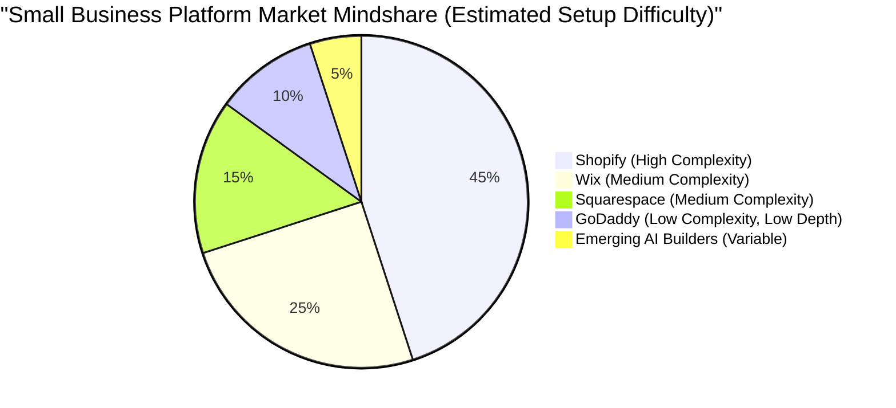

# OHC Market Dominance: Small Business Platform Research Report

## Executive Summary
OneHumanCorp (OHC) aims to empower anyone to launch and manage a business from their phone under 10 minutes, using invisible AI agents. This report analyzes the global SMB landscape, competitor gaps, user pain points, and outlines actionable feature missions to achieve market dominance.

---

## Market Sizing & Strategic Direction

### Total Addressable Market (TAM)
- **US Market:** ~33 million small businesses; ~27 million are non-employer (solo) businesses.
- **Global Market:** ~332 million SMEs globally.
- **Online Presence:** Approximately 27% of small businesses still do not have a website or online presence, relying heavily on local word-of-mouth or pure social media DMs.

### Beachhead Market Strategy
**Target Persona First: The "Social Seller" (e.g., Maya, baker, 28)**
- **Why:** Extremely high density on Instagram/TikTok. They have product-market fit but are bottlenecked by manual DM management, payment collection, and order tracking. Shopify is too heavy; link-in-bio tools are too light.
- **LTV Potential:** High, as their business scales directly with streamlined operations.

### Expansion Horizons
- **Geographic Expansion:** After English, target LATAM (Spanish) and Brazil (Portuguese), due to massive, rapidly growing mobile-first micro-entrepreneur populations.
- **Vertical Expansion:** Maintain horizontal structure first, but build "Blueprints" (e.g., Service/Booking, Retail/Physical, Digital/Content) to specialize the onboarding flow.

---

## Top 10 SMB Pain Points (Validated by User Evidence)
*Sources: r/smallbusiness, r/ecommerce, Shopify Trustpilot reviews, Wix App Store reviews.*

| Rank | Pain Point (User Lens) | User Evidence / Quote | OHC Opportunity / Gap |
| :--- | :--- | :--- | :--- |
| **1** | **Overwhelming Setup** | *"I spent 3 days watching tutorials just to get my Shopify store to look normal."* (Trustpilot) | Under 10-minute AI-guided invisible setup. |
| **2** | **Managing Orders via DM** | *"I lose track of who paid and who didn't in my IG messages."* (r/smallbusiness) | Unified Inbox with AI auto-invoicing from messages. |
| **3** | **No Mobile-First Admin** | *"I can't edit my website easily from my phone when I'm at the market."* (App Store) | 100% mobile-native administration interface. |
| **4** | **Booking/Scheduling Chaos** | *"Clients text me at 11 PM to book lessons, I need sleep."* (r/sidehustle) | AI Agent booking assistant via SMS/WhatsApp/Web. |
| **5** | **Content Creation Fatigue** | *"Writing product descriptions takes me hours."* (r/ecommerce) | Auto-generated product descriptions from photos. |
| **6** | **Disjointed Tools** | *"I use Square for payments, Wix for site, Acuity for booking. It's too much."* | All-in-one consolidated platform. |
| **7** | **Hidden Costs & App Fees** | *"Shopify is $39, but the apps I need make it $120/mo."* (Reddit) | Core functionality built-in without app store reliance. |
| **8** | **Language Barriers** | *"Tools are too complex for my mom who doesn't speak perfect English."* | Native multi-language AI interface. |
| **9** | **Fear of Marketing** | *"I don't know how to run ads or write emails."* | AI that suggests and executes 1-click marketing campaigns. |
| **10** | **Inventory Sync** | *"I sold an item in-store and forgot to take it off my site. Angry customer."* | Seamless physical/digital inventory management. |

---

## Competitor Audit

### Competitor Landscape & Feature Gap Matrix

| Feature | Shopify | Wix | Squarespace | OHC (Current Gap) |
| :--- | :--- | :--- | :--- | :--- |
| **Store Setup Time** | Hours/Days | Hours | Hours | **Minutes (Goal)** |
| **Mobile Admin App** | Good (Post-setup) | Mediocre | Mediocre | **Needs to be Primary** |
| **Native AI Agent** | "Sidekick" (Chatbot) | ADI (One-time build) | None | **Autonomous Action** |
| **Unified Inbox (Social+Web)** | Requires Apps | Basic | No | **Core Feature Missing** |
| **Built-in Booking** | Requires Apps | Yes (Wix Bookings)| Requires Acuity | **Needs Native Integration** |

---

## OHC AI Differentiation Manifesto
To leapfrog existing platforms, OHC will not use AI as a "chatbot assistant." OHC will use AI as an **Invisible Autonomous Employee**.

**Top 5 High-Value AI Automations:**
1. **Auto-Reply Order Capture:** AI reads social media DMs, understands intent, and sends a secure payment/checkout link automatically.
2. **Instant Product Cataloging:** User snaps a photo of an item; AI extracts background, identifies item, writes SEO-friendly description, and sets estimated price.
3. **The "Recovery Agent":** AI automatically texts/emails users who abandoned carts with personalized, conversational follow-ups.
4. **Smart Restock Alerts:** AI predicts when a baker needs more flour based on recent sales and auto-drafts a supplier order.
5. **Weekly "Chief of Staff" Briefing:** A simple, plain-language text message every Monday: *"You made $500 last week. Let's run a 10% off sale on candles to hit $600. Reply YES to launch."*

---

## Structured Issue Briefs

### [feature] Unified Social Commerce Inbox
**Problem Statement:** Small business owners (like Maya) lose sales because they have to manually manage orders across Instagram DMs, WhatsApp, and SMS. They lack a single place to turn conversations into transactions.
**Research Report:** Validated via r/smallbusiness and competitor reviews showing frustration with fragmented communication. Shopify requires 3rd party apps for this.
**Design Doc:**
- **Architecture:** Centralized message bus aggregating webhooks from Meta/WhatsApp APIs.
- **UI Flow:** Mobile-first (375px) chat interface. Next to a message, an "Action Menu" exists to 1-click generate an invoice or product link.
- **AI Integration:** Agent parses incoming messages for purchase intent and highlights them.
**Implementation Prompt:** Implement a unified inbox view that consolidates messages. Must allow the business owner to reply and attach a direct payment link to any message. Ensure the UI passes the Grandmother Test (plain language, large tap targets).
**Priority:** P0
**Estimated Scope:** Large

### [feature] One-Tap Product Generation from Photo
**Problem Statement:** Uploading inventory is tedious. Owners hate typing descriptions and cropping photos on their phones.
**Research Report:** A top complaint among boutique owners (like Priya) transitioning from in-store to online.
**Design Doc:**
- **Architecture:** Image upload endpoint -> Vision LLM API (for description/pricing) + Image Processing API (for background removal) -> Save to Product DB.
- **UI Flow:** Camera button -> Take Photo -> Show loading spinner with fun text -> Present generated title, description, and price for user approval.
**Implementation Prompt:** Build a camera-first product creation flow. When an image is uploaded, use AI to suggest the Title, Description, and Category. The user only needs to hit "Approve & Publish".
**Priority:** P1
**Estimated Scope:** Medium

### [feature] Conversational AI Booking Assistant
**Problem Statement:** Service providers (like Carlos and Leo) miss bookings when they are working and can't answer the phone.
**Research Report:** Service businesses rely heavily on immediate response times. Missed calls equal lost revenue.
**Design Doc:**
- **Architecture:** Web/SMS listener -> Booking Agent (LLM with tool access to Calendar DB) -> Confirms slot -> Writes to Calendar DB.
- **UI Flow:** User sets availability in a simple calendar. The system provides a phone number or web widget where clients can chat to book.
**Implementation Prompt:** Create a configuration screen for the Booking Agent where the owner sets hours and service duration. The underlying system must handle conversational booking requests and lock calendar slots without manual intervention.
**Priority:** P1
**Estimated Scope:** Large
