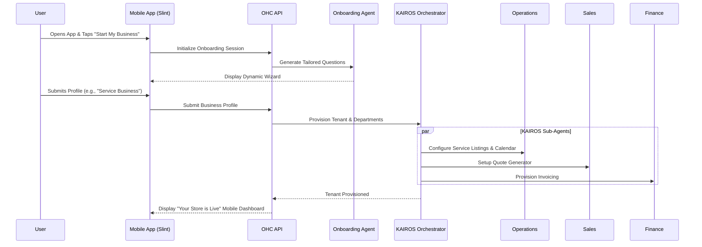

# 🔬 Research Report: Business Journey Architecture

## Overview
This report analyzes the end-to-end "Business Journey" for small business owners on the One Human Corp (OHC) platform. It examines existing market solutions, identifies key user personas, maps their acquisition and onboarding flows, and defines a robust architectural design for automating business creation using the KAIROS Orchestration engine.

## Problem Statement
The target demographic for OHC—bakers, handymen, boutique owners, tutors, and food cart operators—frequently lacks the technical acumen to navigate complex SaaS setups. Existing solutions force them to act as system integrators, piecing together disparate tools for storefronts, bookings, and payments. This fragmented approach leads to high friction and abandonment. The goal is to provide a seamless, mobile-first journey where AI agents handle the technical complexity invisibly, allowing users to go from zero to a live business in under 10 minutes.

## Market Analysis
A comparison of the primary existing solutions reveals a gap in the market for a truly mobile-first, intention-driven platform.

| Platform | Primary Strength | Weakness for OHC Personas | OHC Advantage |
| :--- | :--- | :--- | :--- |
| **Shopify** | Robust physical product catalog | Too complex for simple service businesses; desktop-heavy administration. | Adaptive AI that provisions features based on business intent (services vs. products). |
| **Wix/Squarespace** | Visual site builders | Lack deep, automated vertical workflows (e.g., auto-replying to Instagram DMs). | Conversational setup; no manual DNS or SSL configuration required. |
| **GoDaddy** | Fast domain setup | Upsells domains before demonstrating functional value. | Focuses on actionable setup first (adding products/services) and defers domains to later. |

## Persona Journey Maps

### 1. Maya (Baker, 28)
*   **Acquisition:** Clicks an Instagram ad showing an AI responding to custom cake orders.
*   **Onboarding:** Uses her iPhone to answer 3 questions about her business (Name: "Maya's Cakes", Type: "Physical Products & Custom Orders", Payout: connected bank).
*   **Activation:** The KAIROS 'Operations' and 'Customer Success' agents are provisioned. The system sets up a deposit-based ordering flow.
*   **Retention:** Daily push notifications summarize her Instagram DM conversations handled by the AI and new orders.

### 2. Carlos (Handyman, 42)
*   **Acquisition:** Learns about OHC from a friend.
*   **Onboarding:** Selects "Service Business" on his Android phone.
*   **Activation:** The 'Salesperson' agent is activated to generate quotes, and a booking calendar with deposit requirements is established.
*   **Retention:** Uses the mobile app exclusively to view upcoming appointments and approve quotes generated by the AI.

## Architectural Design

The solution relies on the KAIROS Orchestrator to dynamically provision resources and configure AI departments based on the user's selected business profile during the mobile onboarding wizard.

### System Flow Diagram

### Key Technical Decisions
1.  **Mobile-First Target:** The entire onboarding flow must be designed for 375px viewports. The Slint UI components will use Glassmorphism (`backdrop-filter: blur(20px) saturate(200%)`) to ensure a premium feel.
2.  **Intent-Driven Setup:** Instead of a static form, the setup queries the backend `StartOnboardingRequest` to dynamically configure the necessary database tables (e.g., `products`, `agents`) based on the business type (e.g., seeding the 'Salesperson' agent for service businesses).
3.  **Deferred Complexity:** Advanced configuration (custom domains, complex tax settings) is hidden from the initial onboarding flow and surfaced contextually later by the "Business Advisory" agent.

## Next Steps
An issue brief has been submitted at `docs/research/[architecture]_business_journey.md` to task an Implementer agent with building out the Slint UI and backend integration for this modernized onboarding flow.