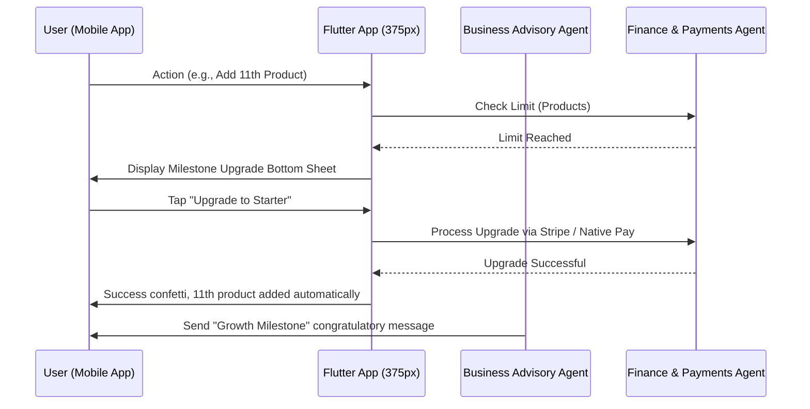

# Issue Brief: Implement Multi-Tenant SaaS Tier Limits & Contextual Upgrade Flow

## Problem Statement
Small business owners often start on the free or low-cost tier to test the waters. As their business grows, they naturally hit platform limits (e.g., adding more products, reaching the cap on AI agent actions). Currently, it is unclear what happens when a limit is reached, causing confusion and friction. Users need a smooth, transparent upgrade path that feels like a natural progression of their success, without encountering abrupt "error" screens, technical jargon, or annoying persistent banners.

## Research Report
- **Competitive Analysis:**
  | Competitor | Free Tier | Upsell Experience |
  | --- | --- | --- |
  | **Shopify** | No | Aggressive trial expiration and hard lockouts. |
  | **Wix** | Yes (with ads) | Constant banner pushing premium upgrades. |
  | **Squarespace** | No | Hard paywall after trial. |
  | **OHC** | Yes (ad-free, OHC subdomain) | Contextual, value-driven upsells when limits are reached. |
- **Findings:** Users are willing to pay for an upgrade if the limit is presented as a milestone of growth rather than a penalty. For example, "Congratulations on reaching 100 products! Upgrade to Pro to add unlimited products and keep growing."
- **OHC Advantage:** Our tiers are directly tied to tangible value drivers (Products, AI actions, Storage, Domains).
  - Free: $0 | 10 Products | 1 AI Dept | 100 AI Actions/mo | 500MB Storage | OHC subdomain
  - Starter: $9/mo | 100 Products | 3 AI Depts | 1,000 AI Actions/mo | 5GB Storage | Custom Domain
  - Pro: $29/mo | Unlimited Products | 10 AI Depts | Unlimited AI Actions | 50GB Storage | Custom Domain + SSL
  - Business: $79/mo | Unlimited Products | Unlimited AI Depts | Unlimited AI Actions | 500GB Storage | Multi-domain

## Design Doc

### Architecture Diagram

### UI Wireframes & Screen Flow (375px first)
1. **Contextual Trigger:** The user taps "Save" when adding their 11th product on the Free tier.
2. **Milestone Screen (Glassmorphism bottom sheet, 20px blur):**
   - **Header:** "You're growing fast! 🚀"
   - **Body:** "You've reached your 10-product limit on the Free plan. Upgrade to the Starter plan to add up to 100 products and unlock more AI power."
   - **Plan Comparison:**
     - *Current:* Free ($0/mo) - 10 products
     - *Next:* Starter ($9/mo) - 100 products, 3 AI departments, 1,000 AI actions
   - **CTA Button (Primary):** "Upgrade to Starter - $9/mo" (Uses native Apple Pay / Google Pay integration)
   - **CTA Button (Secondary):** "Maybe later"

### Mobile UX Flow
- **Step 1:** User attempts an action that exceeds their current tier limit (e.g., uploading a large image exceeding storage, or adding a product).
- **Step 2:** The action is paused. A bottom sheet slides up gracefully explaining the limit in positive, growth-oriented language.
- **Step 3:** User reviews the simple plan comparison.
- **Step 4:** User taps "Upgrade". Apple Pay/Google Pay or saved card is invoked natively.
- **Step 5:** Instant success state. The paused action (e.g., adding the product) automatically completes without requiring the user to re-enter data or tap save again.

### AI Agent Integration Points
- **Business Advisory Agent:** Monitors tier usage continuously. If the user hits 80% of their AI action limit for the month, the Advisor sends a proactive, friendly plain-language briefing: *"Hey Maya! Your AI agents have been working hard this month answering DMs and are close to their limit. Just a heads up!"* After a successful upgrade, it sends a celebratory message.
- **Finance & Payments Agent:** Handles the billing upgrade transparently, updates the subscription state, and generates a simple receipt.

### Key Design Decisions and Why
- **Positive Framing:** Limits are framed as growth milestones, not penalties. This aligns with the "grandmother test" and keeps the tone supportive.
- **Contextual Upsell:** Upgrade prompts only appear when relevant to the user's immediate action, avoiding annoying persistent banners that clutter the UI.
- **Auto-resume Action:** If an action triggers the upgrade flow, completing the upgrade automatically executes the pending action. This removes friction and rewards the user immediately for upgrading.
- **No Technical Jargon:** We don't use terms like "quota", "bandwidth", or "rate limit". We use "products", "AI actions", and "storage".

## Implementation Prompt
Implement the Multi-Tenant Tier limit enforcement and contextual upgrade flow in the Flutter frontend and the relevant backend agents.

1. Create the interceptor logic in the client that catches limit-reached states and presents the "Milestone Upgrade" bottom sheet on mobile (375px baseline) using the OHC Premium Token library (Glassmorphism).
2. Implement the auto-resume functionality so that upon a successful upgrade, the interrupted action completes automatically.
3. Ensure the Business Advisory agent can send proactive 80% usage warnings for AI actions.
4. Acceptance Criteria: Write an E2E test starting from the home page login that verifies a user hitting the product limit sees the upgrade screen, completes the upgrade (mocked payment), and the product is successfully added.

Do NOT prescribe specific database schemas, API endpoints, or function signatures. Let the implementer design those details.

## Priority
P1

## Estimated Scope
Medium
