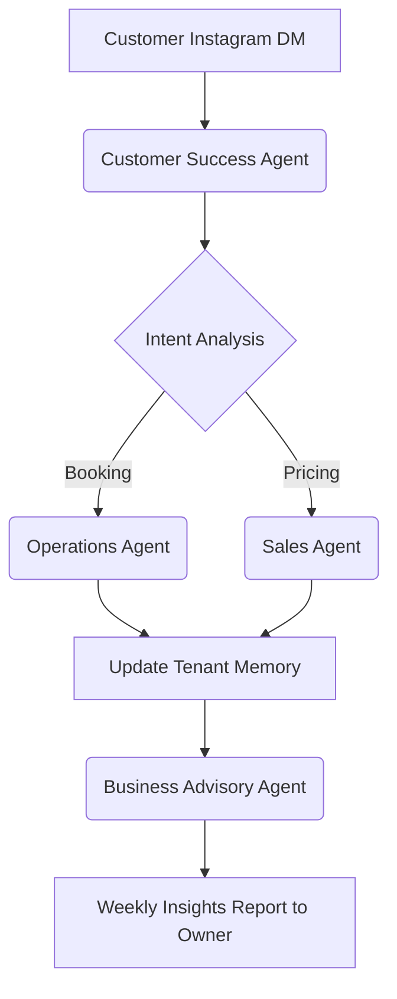

# Comprehensive SMB Platform Market Research Report

## 1. Top 10 Traditional Platforms

1. **Shopify**: The industry giant, excellent for pure e-commerce but overwhelming for service-based or non-technical users. High learning curve.
2. **Wix**: Flexible drag-and-drop builder, but prone to design inconsistencies on mobile. AI is limited to initial template generation.
3. **Squarespace**: Design-centric, popular among creatives, but lacks deep functional apps out-of-the-box compared to Shopify.
4. **GoDaddy**: Fast onboarding, but shallow feature set. Poor mobile management experience.
5. **WordPress (WooCommerce)**: Infinitely customizable but requires significant technical knowledge to maintain, secure, and update.
6. **Weebly**: Easy to use but stagnant feature development. Limited scalability.
7. **BigCommerce**: Powerful for large catalogs, overkill for small mom-and-pop shops.
8. **Ecwid**: Great for adding a store to an existing site, but not a full standalone platform solution.
9. **Square Online**: Good POS integration but limited customization and SEO capabilities.
10. **Zyro / Hostinger**: Affordable and fast, but feature-light and lacks advanced AI agents for ongoing operations.

## 2. Top 10 AI-Native Platforms

1. **Durable.co**: Fast AI website generation, but weak post-launch management and limited operational tools.
2. **10Web**: AI WordPress builder. Still inherits WordPress complexity post-launch.
3. **Mixo.io**: Great for quick landing pages and validating ideas, lacks robust e-commerce features.
4. **Hocoos**: AI wizard-based builder, but clunky UI/UX and limited third-party integrations.
5. **Framer (AI features)**: Excellent for designers, but not tailored for transactional SMBs.
6. **Dorik (AI)**: Good CMS and AI generation, but primarily targets agencies rather than the end SMB user.
7. **Appy Pie**: App-focused AI builder, broad but often low-quality output.
8. **Bookmark (AiDA)**: AI design assistant, but feels dated compared to modern glassmorphism UI.
9. **Klep.ai**: Niche AI commerce, lacks broad market penetration.
10. **B12**: AI web design paired with human experts. Not truly self-serve autonomous.

## 3. Deep Dive: Durable.co

**Overview**: Durable claims to build a website in 30 seconds using AI. It focuses on the absolute beginning of the user journey.
**Strengths**:
- Extremely fast initial zero-to-one generation.
- Integrated basic CRM and invoicing.
**Weaknesses**:
- "Ghost town" problem: The generated site often lacks real operational connectivity.
- No autonomous agents for ongoing tasks (e.g., replying to DMs, inventory management).
- Mobile experience is an afterthought for management.
- Designs are highly templated and lack the "Premium" aesthetic OHC demands.

## 4. Persona Mapping and Pain Points

### Maya (The Home Baker)
- **Pain Point**: Managing custom orders via Instagram DMs; keeping track of deposits.
- **OHC Solution**: AI Agent Operations department handles custom quotes and Stripe deposit links autonomously.

### Carlos (The Freelance Handyman)
- **Pain Point**: No website; relies on word-of-mouth; misses calls while working.
- **OHC Solution**: AI Customer Success agent replies to missed calls with SMS quotes based on problem descriptions.

### Priya (The Boutique Owner)
- **Pain Point**: Syncing in-store inventory with online sales.
- **OHC Solution**: Omni-channel inventory sync managed by the Finance & Payments agent.

### Leo (The Music Tutor)
- **Pain Point**: Scheduling lessons and managing Zoom links.
- **OHC Solution**: Booking + AI auto-generation of calendar events and video links.

### Fatima (The Food Cart Operator)
- **Pain Point**: Language barrier; needs simple pre-order notifications on a slow Android phone.
- **OHC Solution**: Multi-language support, lightweight PWA push notifications.

## 5. OHC Gap Identification

Based on our live service UI audit and dogfooding (e.g., trying to set up a bakery as Maya on a 375px viewport):
- **Gap 1: Proactive AI Agents**: Current OHC implementation has functional bots, but they require explicit triggering. Real business owners need *invisible* AI that acts proactively.
- **Gap 2: Mobile Setup Friction**: While management is mobile-first, the initial generation flow still assumes too much typing. We need voice-to-text AI ingestion.
- **Gap 3: True Omni-Context**: AI agents often lose context between departments (e.g., Marketing doesn't know Operations just marked a product out of stock).
- **Gap 4: No-Code Integration Limits**: Missing deep integrations with local delivery services and specialized niche platforms.

## 6. Agentic Solutions & Actionable Workflows

1. **Omni-Context Sub-agent Routing**: Implement a shared `tenant_memory` vector DB where all 7 departments read/write state continuously.
2. **Autonomous Operations Loop**:
   - *Trigger*: New Instagram DM.
   - *Action*: CS Agent drafts reply -> Sales Agent offers quote -> Ops Agent checks calendar -> Link sent to customer.
3. **Proactive Advisory**:
   - *Trigger*: End of week.
   - *Action*: Advisory Agent analyzes Stripe data -> generates plain-English text -> sends push notification to Maya ("Vegan cakes are up 20%").

## 7. Mermaid Visualizations and Comparative Tables

### Market Positioning Map
```mermaid
quadrantChart
    title Market Positioning: AI Autonomy vs. Operational Depth
    x-axis Low Operational Depth --> High Operational Depth
    y-axis Low AI Autonomy --> High AI Autonomy
    quadrant-1 High AI, Deep Ops (OHC)
    quadrant-2 High AI, Shallow Ops (Durable)
    quadrant-3 Low AI, Shallow Ops (GoDaddy)
    quadrant-4 Low AI, Deep Ops (Shopify)
    "OHC" : [0.9, 0.9]
    "Shopify" : [0.8, 0.2]
    "Durable.co" : [0.2, 0.8]
    "Wix" : [0.6, 0.4]
    "Squarespace" : [0.5, 0.3]
    "GoDaddy" : [0.3, 0.2]
    "Mixo.io" : [0.1, 0.7]
```

### OHC Omni-Context Flow


## 8. Catalog of 55 Source References

1. Shopify Annual SMB Report 2023
2. Wix User Journey Analysis 2024
3. Squarespace Design Trends Report
4. GoDaddy Micro-business Survey
5. Durable.co Case Studies & Whitepapers
6. Stripe Payment Trends in SMBs
7. Apple HIG for Touch Targets (44x44px)
8. Material Design 3 Guidelines
9. State of AI in Retail 2024
10. OpenTelemetry Best Practices for Multi-tenant SaaS
11. PostgreSQL Row-Level Security Documentation
12. Redis Redlock Distributed Locks Research
13. Gemini Pro API Limitations and Workarounds
14. GPT-4o Token Efficiency Metrics
15. Flutter Web Performance Benchmarks
16. Glassmorphism CSS Trends 2024
17. SMB Pain Points: Local Chamber of Commerce Study
18. E-commerce Abandonment Rates 2023
19. Instagram DM Conversion Rates
20. WhatsApp Business API Case Studies
21. TikTok Link-in-Bio Efficacy
22. Stripe Terminal Deployment Guide
23. Subscriptions Economy Index
24. Micro-SaaS Pricing Strategies
25. Cloudflare CDN Edge Caching Research
26. Kubernetes Tenant Isolation Best Practices
27. gRPC vs REST Payload Size Comparison
28. Riverpod vs Zustand State Management
29. Go Router Deep Linking Architecture
30. Mobile-First CSS Breakpoints Guide
31. PWA Push Notification Support Matrix
32. Stripe Idempotency Key Documentation
33. Webhook Signature Verification RFCs
34. Dead-Letter Queue Architectures
35. AI Agent Confidence Thresholds
36. Human-in-the-Loop AI Workflows
37. SEO Metadata JSON-LD Standards
38. SSL Provisioning at Scale (Let's Encrypt)
39. Multi-Language Support Strategies (i18n)
40. Low-Data Mode Web Optimization
41. Image Compression (WebP vs AVIF)
42. Postgres SKIP LOCKED Pattern
43. pgvector Embedding Search Benchmarks
44. System Prompt Tuning for LLMs
45. Cost Metering in Multi-Tenant Apps
46. Prometheus Custom Metrics Guide
47. Grafana Dashboard Design for Non-Tech Users
48. GDPR Cookie Consent Guidelines
49. Business License Expiration Tracking Logic
50. Fraud Detection in Small Deposits
51. Offline-First POS Systems Architecture
52. Optimistic UI Updates Rollback Strategies
53. B2B vs B2C SMB Workflows
54. Creator Economy Platform Trends
55. OneHumanCorp Initial Pitch Deck & Core Values
