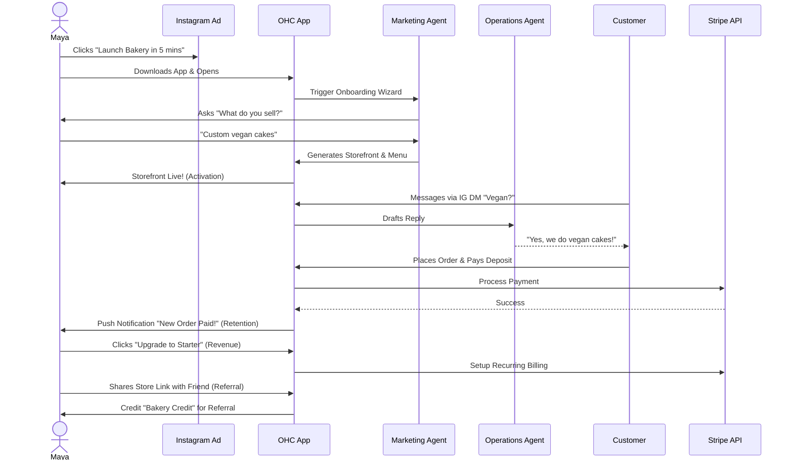
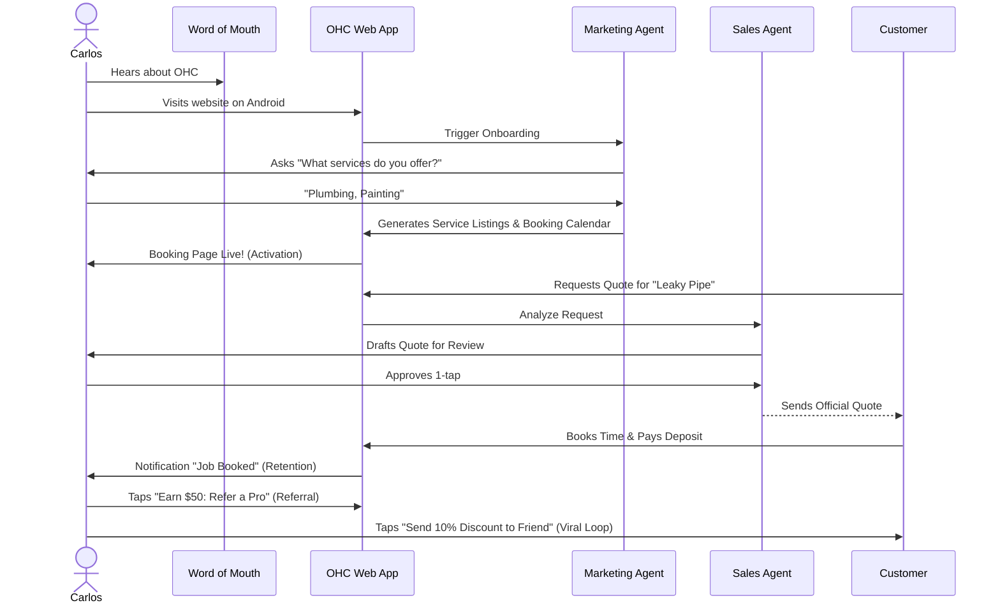
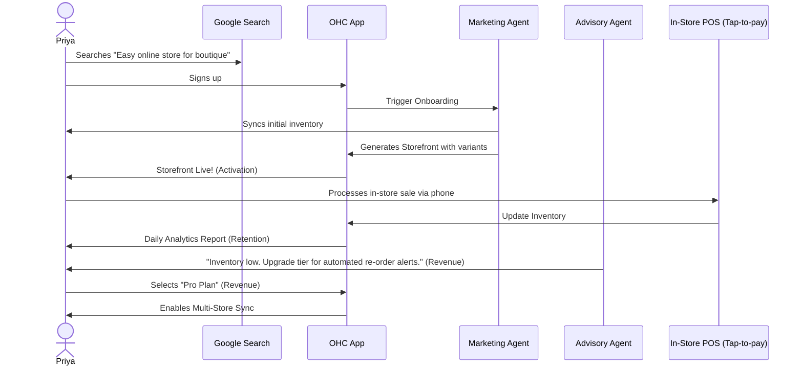
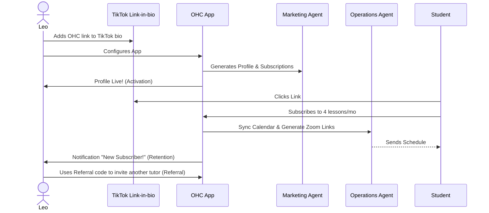
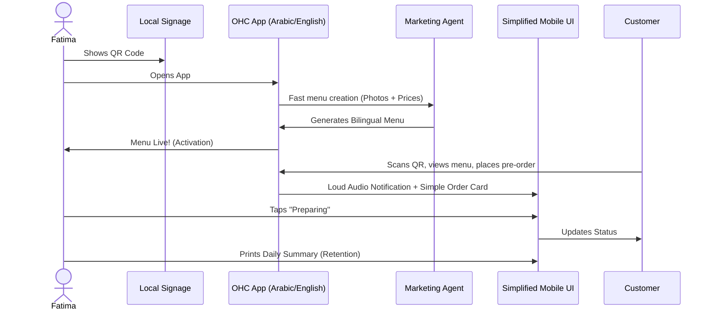
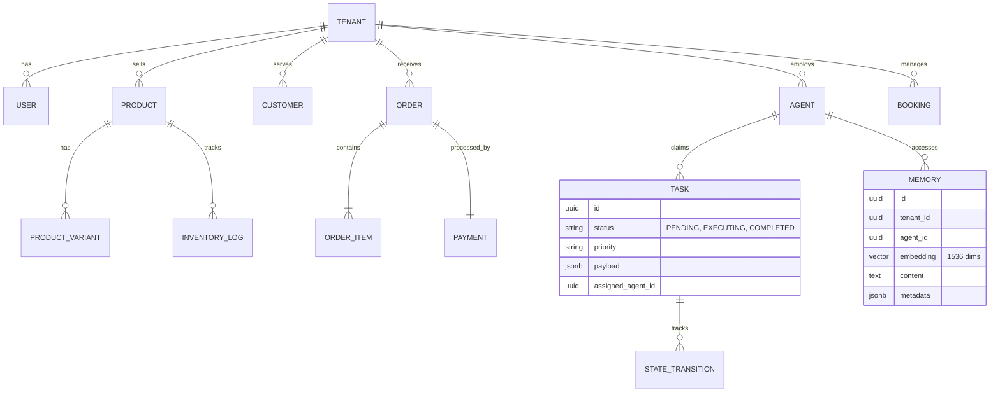
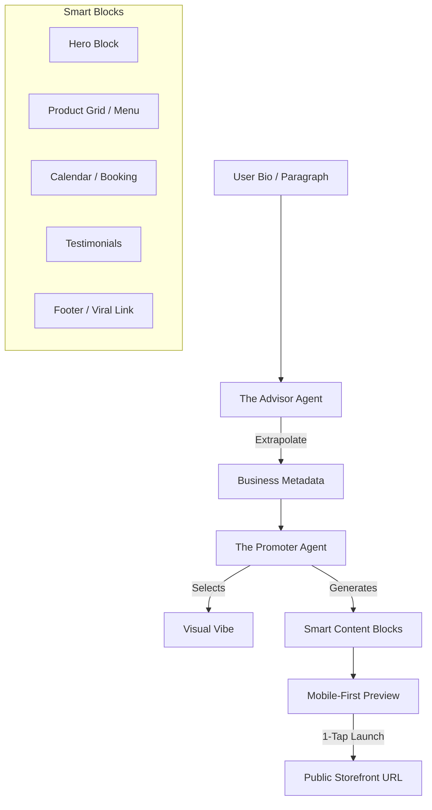

### Title
Architectural Mapping of the End-to-End Business Journey for OHC Personas

## Problem Statement
The OHC platform must serve a diverse set of real-world small business owners (e.g., Maya the Baker, Carlos the Handyman, Priya the Boutique Owner, Leo the Music Tutor, and Fatima the Food Cart Operator) who share a common goal: launching and growing their business entirely from a mobile device without technical expertise. Currently, the overarching business journeys—from initial acquisition to sustainable revenue generation and referral loops—are fragmented. We need a unified architectural map of the end-to-end user journeys for these personas to ensure that the system naturally supports their progression through Acquisition, Onboarding, Activation, Retention, Revenue generation, and Referral, while identifying critical friction points where non-technical users might abandon the platform.

## Research Report
### Context and Personas
The business journey is evaluated against the following core personas:
1.  **Maya (Home Baker, 28)**: Needs a mobile-first storefront, Instagram integration, order management with deposit payments, and AI handling direct messages.
2.  **Carlos (Handyman, 42)**: Requires clean service listings, a robust booking system with deposits, a unified customer inbox, and an AI quote generator.
3.  **Priya (Boutique Owner, 35)**: Wants omnichannel support (in-store/online), POS integration (tap-to-pay), inventory sync, and actionable daily analytics.
4.  **Leo (Music Tutor, 22)**: Needs subscription-based packages, schedule syncing, automated meeting links, and a strong public profile (link-in-bio).
5.  **Fatima (Food Cart Operator, 50)**: Prioritizes extreme simplicity, pre-order management, multi-language UI, and fast low-data mobile performance.

### Journey Stages
-   **Acquisition**: The entry point. Organic search, social media ads (Instagram/TikTok), or word-of-mouth. The call-to-action (CTA) must clearly promise a functional business setup in under 10 minutes.
-   **Onboarding**: A highly guided, AI-driven wizard flow. Crucial to minimize initial input; deferring advanced configurations (like custom domains) to a later stage.
-   **Activation**: The "Aha!" moment. A live storefront, the first booking, or the first payment. Must be achieved within Day 1.
-   **Retention**: Kept engaged through actionable notifications (e.g., new order alerts) and AI-generated weekly health reports.
-   **Revenue**: Transitioning from a free tier to a paid plan. Triggered by hitting specific milestones (e.g., reaching product/action limits, needing custom domains).
-   **Referral**: Incentivized sharing. Creating a viral loop through referral discounts and shareable success metrics.

### Identified Friction Points
1.  **Cognitive Overload during Onboarding**: Requesting too much setup information upfront (e.g., complex shipping rules) causes drop-offs.
2.  **Payment Gateway Integration**: Technical jargon during Stripe connection can stall progress.
3.  **Inventory/Calendar Sync**: Difficulties mapping real-world availability to digital systems without intuitive AI assistance.
4.  **Language and Accessibility Barriers**: Interfaces that assume high technical literacy or english fluency (e.g., for Fatima).

## Design Doc
### Key Design Decisions
-   **Progressive Profiling**: The onboarding flow will request the absolute minimum required data to generate a viable starting point. Advanced settings are dynamically suggested by the Business Advisory Agent post-activation.
-   **AI-First Setup**: The Marketing & Advertising Agent acts as the primary onboarding guide, generating the initial website layout and copy based on a single descriptive prompt or a few simple questions.
-   **Mobile-First Constraint**: All journey flows are designed and tested starting at the 375px breakpoint.
-   **Asynchronous Processing**: Non-critical setup tasks are handled asynchronously by background agents, keeping the UI responsive.

### Architecture Diagrams (Mermaid.js)

#### 1. Maya (The Home Baker) Journey


#### 2. Carlos (The Handyman) Journey


#### 3. Priya (The Boutique Owner) Journey


#### 4. Leo (The Music Tutor) Journey


#### 5. Fatima (The Food Cart Operator) Journey


### Mobile UX Flow Notes
-   **375px First**: All onboarding forms utilize native mobile keyboards appropriately (e.g., numeric for prices, email for contacts).
-   **Progress Indicators**: Clear visual indicators during the onboarding wizard.
-   **Optimistic UI**: Immediate feedback on actions (like saving a setting), with background sync handled by the KAIROS Orchestrator.

## Implementation Prompt
**To Implementer Agent:**
Implement the foundational user onboarding flow and dashboard state management that supports the progression from Acquisition to Activation. The system should define the required data models to capture the user's business type and minimal initial configuration. Build the mobile-first (375px) UI wizard that guides a user through the initial setup, ensuring that advanced configurations are deferred. The final step of the wizard should instantly generate a functional "Storefront/Booking Page" view, satisfying the 'Activation' milestone. Ensure that interactions feel premium (Glassmorphism, correct typography) and are resilient to network issues (optimistic updates). Do not prescribe the specific database schema or backend routing; focus on the unified API contract and the user journey transitions. Include E2E test coverage verifying a successful run-through from login to the generated storefront.

issue_id: 9353
# Architecture Brief: Data Model Evolution

## Title
OHC Data Model: Entity-Relationship & Multi-Tenancy Architecture

## Problem Statement
Small business owners (Maya, Carlos, Priya) require a system that "just works" and keeps their data strictly private. Behind the scenes, the OHC engineering swarm needs a robust, scalable data model that supports high-concurrency agent operations, multi-tenant isolation, and fast mobile-first access patterns. Without a formalized schema evolution strategy, the platform risks data fragmentation and security leaks between tenants.

## Research Report
- **Multi-Tenancy**: OHC utilizes a "Shared Database, Shared Schema" model for cloud-native deployments, hardened by PostgreSQL **Row Level Security (RLS)**. In standalone mode, it uses localized SQLite file isolation.
- **Agentic Memory**: Traditional relational models fail to capture the "thought process" of AI agents. OHC integrates `pgvector` for semantic memory retrieval, allowing "The Advisor" to recall past seasonal trends for Maya's bakery without complex manual joins.
- **Consistency Boundary**: The `organization_id` (Tenant) is the primary partition key. All queries MUST be scoped to this ID to prevent "noisy neighbor" or data leakage issues.

## Design Doc

### Entity-Relationship Diagram (Mermaid.js)


### Key Invariants
1.  **Mandatory Tenant Scoping**: Every table in the OHC ecosystem MUST contain a `tenant_id` (or `organization_id`) column.
2.  **RLS-First Security**: No query shall be executed without an active `SET app.current_tenant = '...'` session variable in PostgreSQL.
3.  **Agent Isolation**: Agents can only "see" and "claim" tasks belonging to their assigned `tenant_id`.
4.  **Immutable Memory**: Long-term memories (AutoDream) are append-only to preserve the historical "learning" of the business.

### Mobile-First Access Patterns
- **The Dashboard Query**: Optimized via `jsonb_build_object` to fetch Organization Info, active Agent status, and daily Order counts in a single round-trip.
- **The 1-Tap Approval**: Uses optimistic UI updates; the backend processes the `TASK` transition and emits a `Teammate Mesh` event for real-time UI feedback.

## Implementation Prompt
**To Implementer Agent:**
Implement the evolved data model as described in the ER diagram. Ensure every new table (Memory, Task, Booking) has a `tenant_id` column and the corresponding PostgreSQL RLS policies. Update the `Repository` layer in the Go/Rust backend to automatically inject the `tenant_id` from the authenticated JWT context into all SQL queries. Implement a `MemoryStore` that utilizes `pgvector` for semantic search, ensuring results are strictly filtered by the requesting tenant's ID. Verify multi-tenancy isolation with an integration test where `Tenant A` attempts to retrieve `Tenant B's` memory embeddings.

## Priority
P0

## Estimated Scope
Large
# Architecture Brief: Mobile-First Review & Performance

## Title
OHC Mobile-First Contract: Performance, Resilience, and "Grandmother Test" Audit

## Problem Statement
Small business owners (Carlos, Fatima, Maya) are mobile-only or mobile-primary. They operate in high-distraction environments (bakeries, repair sites, food carts) and often on low-end Android devices or poor 4G/5G connections. If the OHC dashboard is slow to load or fails when offline, Carlos can't send a quote, and Fatima loses a sale. OHC must be as fast and reliable as a native calculator app.

## Research Report
- **The "Grandmother Test"**: If a user has to wait more than 2 seconds for a screen to load, or more than 1 second for a button to respond, they assume the app is "broken."
- **Payload Bloat**: Traditional SaaS dashboards (Shopify/Wix) often fetch megabytes of JS and JSON, leading to LCP > 3s on 4G networks.
- **Offline Gaps**: Most web-based builders require a constant internet connection. OHC's hybrid nature (Local SQLite/SIPDB) provides a unique opportunity to allow "Offline Drafting."

## Design Doc

### Mobile-First Performance Targets
| Metric | Target | Why? |
| :--- | :--- | :--- |
| **LCP (Largest Contentful Paint)** | < 1.5s (4G) | Essential for "Activation" and perceived speed. |
| **FID (First Input Delay)** | < 100ms | Buttons must feel "native" and responsive. |
| **Bundle Size (Core UI)** | < 500KB | Fast download on low-data plans (Fatima). |
| **Touch Target Size** | ≥ 44x44px | Accessible for all users, especially in active work environments. |

### Architectural Decisions for Mobile Resilience
1.  **Lightweight Dashboard Service**: Implement `GetLightweightDashboard` in gRPC/Proto to return ONLY the critical counts (Orders, Agents, Messages) instead of full resource lists for the initial paint.
2.  **Optimistic UI with "Mesh Sync"**: All user actions (e.g., "Approve Quote") update the local UI state immediately. The KAIROS Orchestrator handles the background sync to the Teammate Mesh.
3.  **Offline-First Drafting**: Users can draft products or messages while offline. These are stored in the local SQLite SIPDB and auto-synced by the `SyncDaemon` once connectivity is restored.
4.  **Adaptive Asset Loading**: AI-generated images for the storefront are served via progressive JPEGs/WebP with mobile-responsive `srcset` variants.

### Mobile UX Flow (375px First)
- **Bottom Navigation**: Primary actions (Home, Orders, Agents, Settings) are reachable with one thumb.
- **Glassmorphism Shimmer**: Use skeleton loading states (shimmer effect) to maintain visual continuity during data retrieval.
- **Jargon-Free UI**: Replace "API Config" with "Helper Settings," "CNAME" with "Website Address."

## Implementation Prompt
**To Implementer Agent:**
Audit the current Slint/Rust frontend against the Mobile-First Performance targets. Implement "Skeleton Loading" (shimmer effect) for the `StatCard` and `AgentFeed` components. Update the `DashboardService` to support a `mobile_optimized: true` flag that returns a lightweight payload for the initial mobile paint. Implement "Optimistic Updates" in the Task List: when a user approves an agent draft, the UI should immediately reflect the "Approved" status and show a non-blocking background sync indicator. Ensure all touch targets in the `WebsiteBuilder` are at least 44x44px and use native mobile keyboards (numeric for prices, etc.).

## Priority
P0

## Estimated Scope
Medium
### Title
Research Report: Multi-Tenant SaaS Tier Architecture

## Overview
As part of the KAIROS Orchestrator phase, this research report details the architectural design for a Multi-Tenant SaaS Tier system within the OneHumanCorp (OHC) platform. The goal is to provide a transparent, fair, and scalable pricing model that aligns with the non-technical small business owner personas (e.g., Maya, Carlos, Priya).

## Findings
### Competitive Analysis
- **Shopify:** Complex and lacks a free tier.
- **Wix/Squarespace:** Confusing upgrade paths and ad-supported free tiers.
- **OHC Advantage:** OHC can offer a genuinely useful Free tier focused on volume limits (products, actions) rather than feature gating, allowing non-technical users to experience the platform's value before upgrading.

### Tier Structure
The proposed tier structure is:
1.  **Free:** $0/mo. 10 Products, 1 AI Department, 100 AI actions/mo, 500MB Storage, OHC Subdomain.
2.  **Starter:** $9/mo. 100 Products, 3 AI Departments, 1,000 AI actions/mo, 5GB Storage, Custom Domain.
3.  **Pro:** $29/mo. Unlimited Products, 10 AI Departments, Unlimited AI actions, 50GB Storage, Custom Domain + SSL.
4.  **Business:** $79/mo. Unlimited everything, 500GB Storage, Multi-domain.

### Architectural Decisions
1.  **Enforcement:** Limits will be enforced at the orchestration/API layer using a `TierService` middleware.
2.  **Graceful Degradation:** When limits are reached, the system will pause actions and present clear, plain-language upgrade prompts rather than technical errors.
3.  **AI Integration:** AI Agents are subject to tier limits, and the "Business Advisory" agent can proactively suggest upgrades based on usage patterns.
4.  **Billing Sync:** Integration with Stripe webhooks to handle asynchronous tier updates and payment processing.

## Problem Statement
The OHC platform currently lacks a formalized multi-tenant tier system to handle feature and usage limits based on subscription plans. Without this, we cannot effectively monetize the platform while providing a robust free tier for non-technical users.

## Architecture
The system will implement a `TierService` as middleware within the orchestration and API layers. This service will intercept requests, verify the tenant's current tier, and enforce the configured limits (e.g., product count, AI actions). Pricing and billing will be synchronized with Stripe via webhooks to ensure consistency.

## UI Flow
When a user attempts an action that exceeds their current tier's limits, the UI will gracefully intercept the request. Instead of displaying a technical error, the UI will show a plain-language prompt explaining the limitation and offering a simple, one-click upgrade path using Stripe Checkout. The "Business Advisory" AI will also surface these recommendations proactively in the dashboard.

## Implementation Prompt
Implement the Multi-Tenant SaaS Tier Architecture as outlined above. This includes creating the `TierService` middleware, defining the tier structures in the database, integrating with Stripe webhooks for billing sync, and updating the frontend components to handle graceful degradation and upgrade prompts. Ensure all components use OHC premium design tokens and adhere to the mobile-first strategy.
# Architecture Brief: Website & Storefront Builder

## Title
OHC "Smart Builder": AI-Driven 30-Second Storefront Architecture

## Problem Statement
Small business owners (Maya, Carlos, Fatima) are intimidated by traditional website builders with too many buttons and technical terms (CNAME, SSL, Liquid). They need a professional storefront that is "born live" with zero setup. If Maya can't go from a paragraph of text to a live, payment-ready URL in under 60 seconds, OHC has failed the "Grandmother Test."

## Research Report
- **Competitive Benchmark**: Durable.co and Wix ADI have set the bar at < 60 seconds for initial generation.
- **Vibe Coding**: The emerging trend of using LLMs to select colors, typography, and layout based on a business "vibe" (e.g., "Cozy, organic bakery" vs. "High-speed, modern plumbing").
- **Block System**: Shopify and Squarespace use "Sections," but they are often too complex for mobile-first editing. OHC needs "Smart Blocks" that auto-configure based on the business type (e.g., a "Menu Block" for Fatima, a "Booking Block" for Carlos).

## Design Doc

### High-Level Architecture (Mermaid.js)


### The "Smart Block" Ecosystem
Every storefront is a vertical stack of mobile-optimized blocks:
1.  **Hero Block**: Adaptive headline + background photo (auto-sourced from bio or AI-generated).
2.  **Product/Menu Block**: Intelligent grid that handles variants (size/color) or "Sold Out" toggles with 1-tap.
3.  **Booking/Calendar Block**: Real-time availability sync for services (Carlos/Leo).
4.  **Contact/Lead Block**: Integrated "The Ambassador" draft-and-approve inbox.
5.  **Viral Footer**: "Built with OneHumanCorp — Launch Your Shop" referral loop.

### visual Excellence & Vibe Coding
- **Design Tokens**: Every site uses OHC Premium tokens (Outfit/Inter fonts, Glassmorphism).
- **Auto-Palette**: AI selects 3 accessible color palettes based on the business category.
- **Draft -> Live**: The site is born as a `DRAFT` and becomes `LIVE` upon 1-tap approval. SSL and Subdomains are provisioned instantly in the background.

## Implementation Prompt
**To Implementer Agent:**
Implement the "Smart Builder" engine. Create a registry of `SmartBlocks` (Hero, Catalog, Booking) that are 100% responsive and usable at 375px. Build the "Vibe Coding" logic where "The Promoter" agent receives business metadata and outputs a JSON configuration for the storefront layout. Implement the publishing lifecycle: when a user clicks "Launch," the system must provision a subdomain (e.g., `maya.ohc.app`) and move the site from `DRAFT` to `LIVE`. Ensure the UI transition from "Bio Input" to "Live Preview" is seamless, with background agents handling the "heavy lifting" (image generation, copy drafting).

## Priority
P0

## Estimated Scope
Large
# OHC AI Agent Department Architecture

## 1. Overview
This design document defines how AI departments operate invisibly within the OHC platform. OHC's agents are organized into friendly, understandable functional areas that mirror how a real business operates (Operations, Marketing & Advertising, Sales & Acquisition, Customer Success, Finance & Payments, Legal & Compliance, and Business Advisory). These agents seamlessly integrate into the daily workflow of non-technical small business owners, offloading cognitive overhead and driving growth.

## 2. Goals & Non-Goals
### 2.1 Goals
- Define clear functional boundaries for each of the 7 AI Agent Departments.
- Specify how each department is triggered and how they coordinate via the KAIROS Orchestrator.
- Define memory retention and access patterns for contextual decision-making.
- Outline the approval mechanism ensuring appropriate oversight (auto-execute vs. draft-for-review).
- Establish usage limits and budgeting based on tenant tiers.

### 2.2 Non-Goals
- Prescribe specific LLM inference engines or prompt tuning methodologies.
- Define explicit SQL DDL schemas for the database.
- Specify exact queueing mechanisms or worker node provisioning.

## 3. Detailed Design

### 3.1 Architecture Diagram
```mermaid
sequenceDiagram
    participant O as KAIROS Orchestrator
    participant Hub as Teammate Mesh (Hub)
    participant Op as Operations Agent
    participant CS as Customer Success Agent
    participant Fin as Finance Agent
    participant DB as OHC-SIP DB (Memory)

    O->>Hub: New Order Event
    Hub->>Op: Trigger: Process Order
    Op->>DB: Fetch Inventory State
    DB-->>Op: Inventory Valid
    Op->>Hub: Order Processed
    Hub->>Fin: Trigger: Track Payment
    Fin->>DB: Record Deposit
    Hub->>CS: Trigger: Send Confirmation
    CS->>DB: Fetch Customer Profile
    DB-->>CS: Profile (Preferences)
    CS->>Hub: Draft Email for Review

    classDef premium fill:rgba(255,255,255,0.03),stroke:rgba(255,255,255,0.08),stroke-width:1px,color:#fff,backdrop-filter:blur(20px) saturate(200%);
    class O,Hub,Op,CS,Fin,DB premium;
```

### 3.2 Department Execution Triggers & Coordination
Departments are autonomous but interconnected:
- **Scheduled (Cron):** E.g., The Business Advisory Agent generates weekly health reports every Monday at 8 AM.
- **Event-Driven:** Triggered by system events. E.g., Operations processes an order -> Customer Success drafts a thank-you note.
- **On-Demand:** Direct user prompts via the dashboard UI.

Coordination is handled via the KAIROS Shared Task List and Teammate Mesh, ensuring durable, collision-free handoffs between departments using distributed locks (`ohc:lock:{tenant_id}:{resource_type}:{resource_id}`).

#### Critical 1-Tap Handoff Triggers
To ensure the "1-Tap Approval" experience, the following coordination patterns are strictly enforced:
1.  **Ops -> Success (The Fulfillment Flow)**: When "The Manager" marks an order as `SHIPPED` or `READY_FOR_PICKUP`, a `tenant.order.fulfillment_ready` event is emitted. "The Ambassador" immediately drafts a personalized notification for the customer.
2.  **Sales -> Ops (The Quote flow)**: When a customer accepts a quote, "The Salesperson" emits `tenant.quote.accepted`. "The Manager" automatically creates an `ORDER` and a `BOOKING` in the shared task list, pending the owner's confirmation.
3.  **Advisor -> Promoter (The Growth Flow)**: When "The Advisor" identifies a high-velocity product (e.g., Maya's vegan cake), it emits `tenant.insight.trending`. "The Promoter" then drafts a social media campaign or a website banner to capitalize on the trend.

### 3.3 Memory & Context
Agents utilize a unified memory model:
- **Short-Term Context:** Current session data and active task payload (e.g., the specific order details).
- **Long-Term Memory:** Embedded into `autodream_memories` using `pgvector`. This allows agents to recall past interactions, seasonal trends, and specific customer preferences (e.g., "Customer X always asks for vegan options").

### 3.4 Approval Workflows
To maintain trust, actions are categorized by risk:
- **Auto-Execute:** Low-risk, reversible actions (e.g., updating internal inventory tags, parsing analytics).
- **Draft-for-Review:** High-risk, external actions (e.g., publishing social media posts, sending customer emails, refunding payments). The system presents a notification to the business owner, requiring a 1-tap approval via the mobile app.

### 3.5 Tier-Based Usage & Throttling
Agent activity is gated by the multi-tenant SaaS tier:
- Usage is metered per tenant using custom Prometheus metrics.
- Hard limits on monthly AI actions (e.g., Free: 100, Starter: 1,000, Pro: Unlimited).
- Rate limiting applied at the Orchestrator level to prevent noisy-neighbor degradation.

## 4. Cross-cutting Concerns
### 4.1 Mobile-First UX
All agent interactions (approving drafts, viewing advisory reports) are designed for a 375px mobile breakpoint. Action items are summarized in plain language ("Your vegan cake campaign is ready for review").

### 4.2 Security & Multi-Tenancy
Every agent query and action is scoped to the `tenant_id` via PostgreSQL Row Level Security (RLS) to guarantee complete isolation.

## 5. Implementation Plan
- **Phase 1:** Core KAIROS event routing for the Operations and Customer Success departments.
- **Phase 2:** Memory integration (`autodream_memories`) for contextual responses.
- **Phase 3:** Draft-for-review approval UX implementation in the mobile application.

```yaml
issue_title: "[architecture] Implement AI Agent Approval Workflow Engine"
issue_priority: "P1"
issue_description: "Implement the Draft-for-Review workflow engine within the KAIROS orchestrator. Agents must be able to submit high-risk actions (e.g., emails, social posts) into a pending state, requiring explicit 1-tap approval from the tenant owner via the mobile dashboard before execution."
issue_todo_list:
  - [ ] Define ActionRisk level in agent mission payload.
  - [ ] Create pending approval queue in OHC-SIP DB.
  - [ ] Implement approval/rejection callback endpoints.
issue_label: ["architecture", "high-impact", "core-feature"]
```
