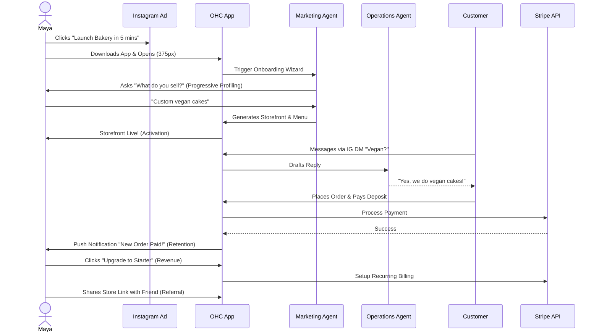
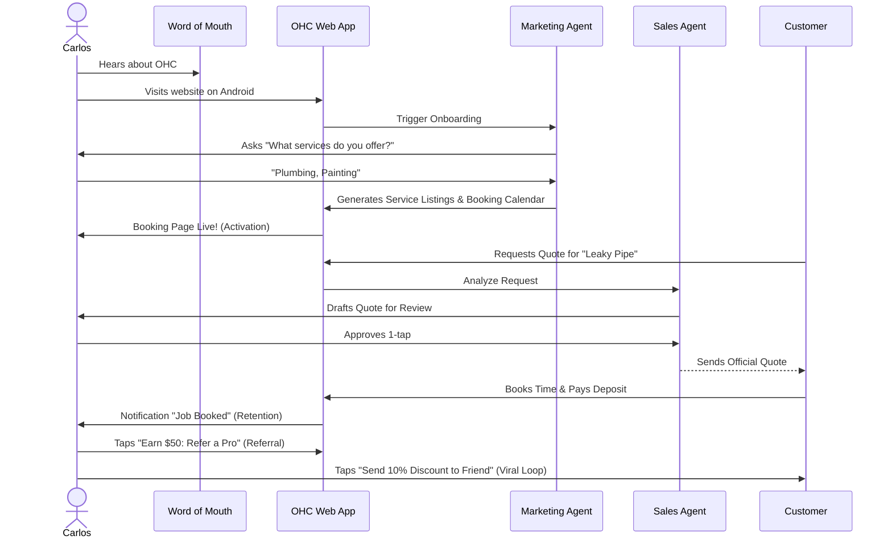
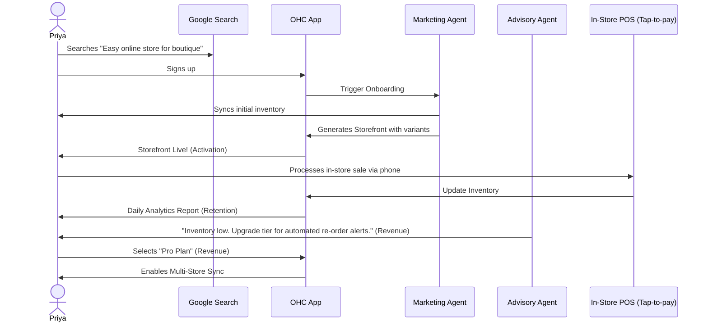
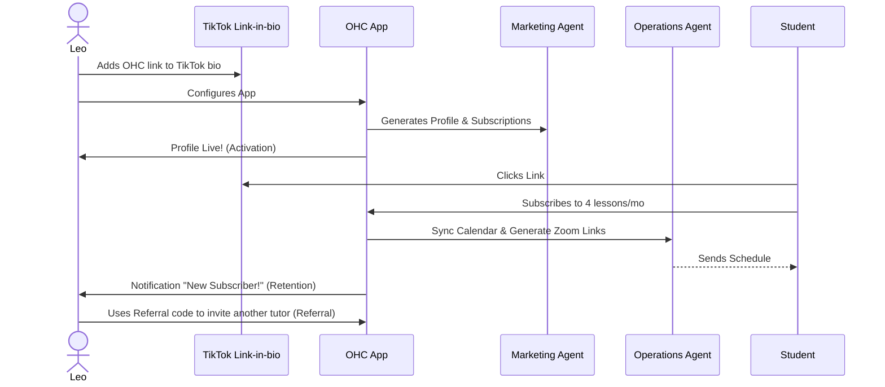
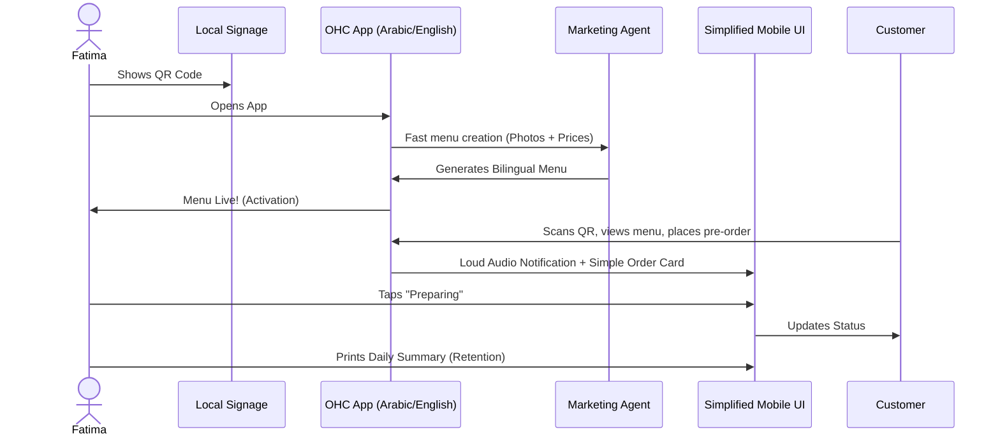

# OHC KAIROS Architecture Research Report: End-to-End Business Journey

## Problem Statement
Small business owners (Maya, Carlos, Priya, Leo, Fatima) need a unified, frictionless path from initial acquisition to sustainable revenue generation without needing technical expertise. OHC must provide a platform where anyone can launch and run a real business from their phone in under 10 minutes.

## Phase 1 & 4: Business Journey Mapping & Mobile UX Flows

The following sequence diagrams map the end-to-end journey for each core persona, designed and tested starting at the 375px breakpoint (Mobile-First constraint). All onboarding uses progressive profiling to minimize input.

### 1. Maya (The Home Baker)
**Acquisition to Revenue Sequence**

**Mobile UX Flow (375px):**
*   **Onboarding:** Clean form utilizing native mobile keyboards.
*   **Dashboard:** Skeleton loading (shimmer effect) for metrics. "Agent Activity Feed" displays AI_Ops drafts (e.g., reply to IG DM) for 1-tap approval.

### 2. Carlos (The Handyman)
**Acquisition to Referral Sequence**

**Mobile UX Flow (375px):**
*   **Calendar Sync:** Intuitive AI assistance maps real-world availability to digital systems, avoiding complex calendar settings.
*   **Task Approval:** AI_Sales quote drafted and presented in the Home Dashboard feed as a clear card for "1-Tap Approval" with an "Edit" option.

### 3. Priya (The Boutique Owner)
**Omnichannel Omnipresence Sequence**

**Mobile UX Flow (375px):**
*   **In-Store Context:** Fast action buttons (≥ 44x44px) for POS integration and inventory reduction.
*   **Reporting:** Visual, plain-language insights on the dashboard rather than complex data tables.

### 4. Leo (The Music Tutor)
**Subscription Engine Sequence**

**Mobile UX Flow (375px):**
*   **Link-in-bio Focus:** Streamlined setup for the public portfolio page, omitting deep eCommerce configurations.

### 5. Fatima (The Food Cart Operator)
**High-Speed Ordering Sequence**

**Mobile UX Flow (375px):**
*   **Accessibility:** Support for low-end Androids, multi-language UI, lightweight payloads, and offline-first drafting for areas with poor connectivity. Optimistic UI is critical here.

---

## Phase 2: Data Model Architecture

The data model must support high-concurrency agent operations, multi-tenant isolation, and fast mobile-first access patterns.

### Key Invariants & Design Features
1.  **Mandatory Tenant Scoping:** Every table must include a `tenant_id` (organization_id) column.
2.  **RLS-First Security:** All PostgreSQL queries must be executed within the `app.current_tenant` context.
3.  **Agent Isolation:** Agents only process and view tasks for their assigned tenant.
4.  **Semantic Memory:** `pgvector` empowers "AutoDream" append-only memories to provide AI agents with business context.

### Entity-Relationship Diagram

### Migration Strategy
*   **Zero-Downtime Rollout:** Implement `tenant_id` across all tables. Apply RLS policies progressively in "audit" mode before strictly enforcing.
*   **Agent Data Backfill:** Initialize `MEMORY` entities for existing businesses by summarizing their historical order and product logs using backend jobs to populate `pgvector` embeddings.

---

## Phase 3: AI Integration & Department Architecture

AI departments run invisibly, interacting with the system via KAIROS.

### The 7 Departments
1.  **Operations ("The Manager")**
2.  **Marketing & Advertising ("The Promoter")**
3.  **Sales & Acquisition ("The Salesperson")**
4.  **Customer Success ("The Ambassador")**
5.  **Finance & Payments ("The Accountant")**
6.  **Legal & Compliance ("The Protector")**
7.  **Business Advisory ("The Advisor")**

### Integration Points & Handoffs
*   **Triggers:** Cron jobs, event-driven (Teammate Mesh), or on-demand user commands.
*   **1-Tap Handoff Example:** Operations marks order `SHIPPED` -> Customer Success automatically drafts thank-you email for review.
*   **Approval Levels:**
    *   *Auto-Execute:* Low-risk, reversible actions (e.g., tagging inventory).
    *   *Draft-for-Review:* High-risk, external actions requiring 1-Tap approval on the Mobile UI (e.g., publishing social posts, quotes).

### AI Resource Limits
Agents are throttled based on SaaS Tiers (e.g., Free = 100 actions/mo; Pro = Unlimited). When a user approaches limits, "The Advisor" will present plain-language, graceful upgrade suggestions via the mobile dashboard.

---
