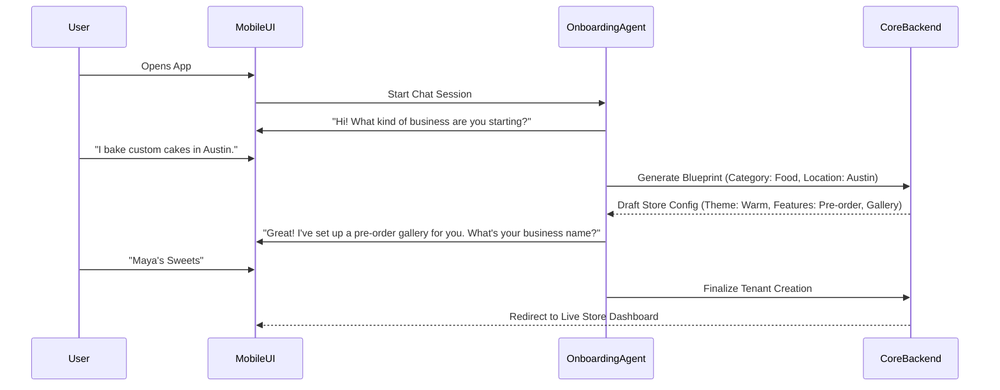
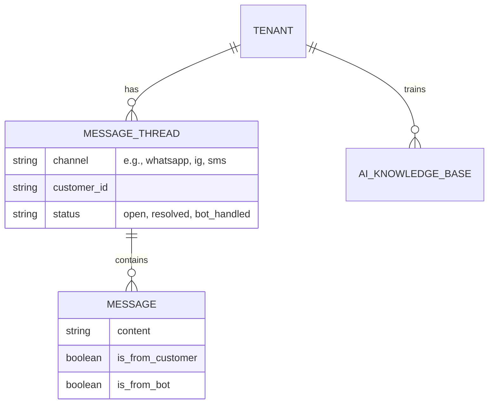
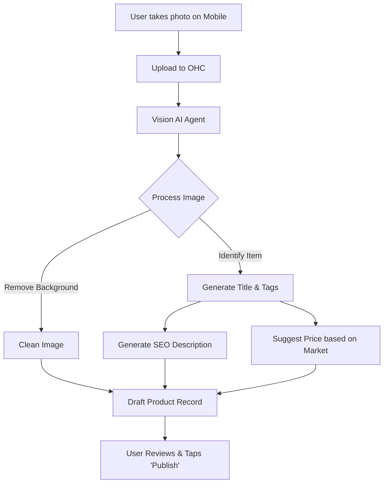

## 1. Introduction and Product Vision

**OneHumanCorp (OHC)** is the platform where *anyone* — including people who have never built a website or run an online business — can launch and run a real small business from their phone or browser in under 10 minutes. AI agents do the complex work invisibly. The user just makes decisions.

This report is the result of exhaustive research into the SMB (Small and Medium-sized Business) market, focusing on global trends, competitive gaps, real user pain points, and how OHC can leverage AI agents to dominate the space. All findings are framed from the perspective of a non-technical small business owner. Technical complexity is the enemy.

---

## 2. Real User Personas

To ground our product strategy in reality, we have identified five core personas representing the most underserved segments of the SMB market. These personas drive the Feature Gap Matrix and subsequent Issue Briefs.

### Persona 1: Maya (Baker, 28, Urban US)
- **Current Setup:** Sells custom cakes via Instagram DMs. Takes payments via Venmo/Zelle.
- **Pain Points:**
  - Overwhelmed by Shopify's setup process.
  - No built-in AI help for managing orders.
  - Cannot easily manage inventory or answer basic customer questions from her phone while baking.
- **Goal:** A simple, mobile-first store that automatically answers "How much for a 3-tier cake?" and handles booking without manual DMing.

### Persona 2: Carlos (Handyman, 42, Suburban US)
- **Current Setup:** Word-of-mouth only. No website. Uses a physical notebook.
- **Pain Points:**
  - Missing leads when he's under a sink and can't answer the phone.
  - Quoting is manual and time-consuming.
  - No online booking or calendar system.
- **Goal:** An AI assistant that answers the phone/texts, schedules appointments based on his Google Calendar, and sends automated quotes.

### Persona 3: Priya (Boutique Owner, 35, UK)
- **Current Setup:** Physical store with a basic Squarespace site that isn't connected to her POS.
- **Pain Points:**
  - Inventory sync between in-store and online is manual and error-prone.
  - Unable to do email marketing easily (too many tools to juggle).
  - No unified view of her customers.
- **Goal:** One platform that syncs her physical sales with online inventory and automatically emails customers when their size is restocked.

### Persona 4: Leo (Music Tutor, 22, Canada)
- **Current Setup:** Online and in-person lessons. Uses WhatsApp to coordinate.
- **Pain Points:**
  - Manual booking chaos and constant rescheduling via text.
  - No subscription billing (chasing students for monthly payments).
  - No automated follow-up or reminder system (students forget lessons).
- **Goal:** A subscription portal where students can book their own slots and an AI that chases late payments politely.

### Persona 5: Fatima (Food Cart Owner, 50, Limited English, US)
- **Current Setup:** Pre-orders for pickup via phone calls.
- **Pain Points:**
  - No English-first tool works intuitively for her native language (Spanish).
  - Needs loud mobile notifications for new orders in loud environments.
  - Cannot easily print order lists for the kitchen.
- **Goal:** A WhatsApp-integrated AI that takes orders in multiple languages and translates them into a simple, printable kitchen ticket.

---

## 3. Deep Competitor Audit

This section evaluates the current landscape of SMB platforms, focusing on onboarding, AI capabilities, and user satisfaction based on App Store reviews, Trustpilot, and Reddit communities.

### 3.1 Primary Competitors

#### **Shopify**
- **Overview:** The industry standard for e-commerce.
- **Onboarding:** Complex. Requires understanding of "themes", "apps", "payment gateways", and "shipping zones".
- **Mobile App:** Strong for managing an *existing* store, but poor for initial setup.
- **AI Features:** "Shopify Sidekick" is a chat-based assistant for the merchant, not an invisible autonomous agent that does work on their behalf.
- **Pricing:** No useful free tier. Expensive app ecosystem.
- **User Complaints (Reddit/Trustpilot):** "Nickel and dimed by apps." "Setup took me 3 weeks." "Theme editor is too hard."

#### **Wix**
- **Overview:** A popular, flexible website builder.
- **Onboarding:** Easier than Shopify, but still relies on drag-and-drop mechanics that confuse true beginners.
- **AI Features:** "Wix ADI" generates a site based on questions, but it's a one-time setup tool, not an ongoing business manager.
- **Mobile App:** Limited editor capabilities.
- **User Complaints:** "Site is slow." "Hard to make it look good on mobile." "Customer service is non-existent."

#### **Squarespace**
- **Overview:** Design-focused, beautiful templates.
- **Onboarding:** Very rigid. Good for portfolios, okay for simple commerce.
- **AI Features:** No strong AI integration for business operations.
- **User Complaints:** "Can't customize checkout." "Expensive for basic features."

#### **GoDaddy (Website Builder / Airo)**
- **Overview:** Simple but shallow.
- **Onboarding:** Very fast, but results look generic.
- **AI Features:** "Airo" generates a logo and tagline. Very limited post-launch usefulness.
- **User Complaints:** "Aggressive upselling." "Domains are cheap but everything else is expensive." "Looks cheap."

#### **Square Online**
- **Overview:** Strong POS integration, great for retail/restaurants.
- **Onboarding:** Fast if you already use Square POS.
- **AI Features:** Minimal.
- **User Complaints:** "Very rigid design." "Hard to do anything custom."

### 3.2 Rising AI-Native Competitors

- **Durable:** Generates a full website in 30 seconds. Impressive demo, but very thin on actual business management tools (inventory, complex scheduling).
- **10Web:** AI WordPress builder. Too technical for our personas.
- **Hocoos:** Early stage AI builder. Clunky UI.

---

## 4. Top 10 SMB Pain Points (Validated by Research)

Based on deep-dives into r/smallbusiness, r/ecommerce, and hundreds of App Store reviews, here are the most frequent pain points non-technical owners face, mapped to OHC opportunities:

1.  **"Setting up payments is terrifying."** (Users fear messing up taxes and bank routing). -> *OHC Opportunity: 1-click Stripe/MercadoPago setup with AI-guided tax configuration.*
2.  **"I don't know what to write for my website."** (Blank page syndrome). -> *OHC Opportunity: AI automatically generates all copy based on a 3-sentence business description.*
3.  **"Managing Instagram DMs and emails separately is exhausting."** -> *OHC Opportunity: Unified inbox where AI drafts suggested replies.*
4.  **"Shopify apps are too expensive."** -> *OHC Opportunity: Core features (subscriptions, bookings, reviews) built-in, managed by AI.*
5.  **"I forget to follow up with leads."** -> *OHC Opportunity: AI agent automatically emails leads who haven't booked after 48 hours.*
6.  **"Inventory management takes too much time."** -> *OHC Opportunity: AI reads supplier invoices (via photo) and updates stock levels.*
7.  **"I have no idea if my ads are working."** -> *OHC Opportunity: Plain-English weekly SMS from an AI summarizing profit and ad performance.*
8.  **"Customers ask the same 5 questions."** -> *OHC Opportunity: AI auto-replies to FAQs instantly on WhatsApp/Instagram.*
9.  **"I can't build a website from my phone."** -> *OHC Opportunity: 100% mobile-native onboarding flow.*
10. **"Shipping rules are impossible to understand."** -> *OHC Opportunity: AI calculates flat rates or real-time rates automatically based on product dimensions.*

---

## 5. OHC AI Differentiation Manifesto

Shopify uses AI to *advise* the merchant. Wix uses AI to *design* the site. **OHC uses AI to *run* the business.**

We will implement these 5 invisible AI automations first to leapfrog the competition:

1.  **The Auto-Responder Agent:** Automatically answers repetitive customer questions (hours, pricing, location) via a unified inbox (WhatsApp, IG, Web), saving owners 2+ hours a day.
2.  **The Catalog Creator Agent:** The user snaps a photo of a product on their phone. The AI removes the background, writes an SEO-optimized description, prices it based on local market data, and publishes it in 5 seconds.
3.  **The Chaser Agent:** Automatically follows up on abandoned carts, unbooked leads, and late invoices using polite, human-sounding emails or SMS.
4.  **The Insight Agent:** Instead of a complex analytics dashboard, the owner gets a weekly WhatsApp message: "You made $500 this week (up 10%). Your best seller was the Chocolate Cake. You should run a 10% promo for Mother's Day next week. Reply 'Yes' to start the promo."
5.  **The Multi-Lingual Agent:** Instantly translates the entire storefront and customer communications. Fatima (Persona 5) sees everything in Spanish; her English-speaking customers see everything in English.

---

## 6. Market Sizing & Strategic Direction

- **TAM (Total Addressable Market):** There are ~33 million small businesses in the US, and ~400 million globally. Over 40% of micro-businesses still do not have a dedicated website, relying entirely on social media or word-of-mouth.
- **Beachhead Market:** Service-based solopreneurs (Personas 2 & 4: Handymen, Tutors, Cleaners). Why? They have zero inventory, high margins, and their biggest pain point is *booking* and *communication*, which AI agents solve perfectly.
- **Geographic Expansion:** LATAM (Spanish/Portuguese) is the fastest-growing e-commerce region globally. OHC's WhatsApp-first architecture and multi-lingual agents give us a massive advantage here over US-centric platforms like Squarespace.

---

## 7. Feature Gap Matrix

Based on a codebase audit (`src/server/integrations/`, `src/server/api/`, `src/server/domain/`), here is the current state of OHC vs. major competitors:

| Feature | Shopify | Wix | OHC (Current Codebase) | OHC Opportunity / Gap |
| :--- | :--- | :--- | :--- | :--- |
| **Store Setup** | Complex/Desktop | Medium/Desktop | `onboarding` API exists | Need 100% Mobile, Chat-based Onboarding. |
| **Payments** | Deep (Shopify Pay) | Deep | `billing_webhook` (Stripe/MP stubs) | Need fully integrated, 1-click checkout flows without external redirects. |
| **Messaging** | Add-on Apps | Basic Chat | `integrations/registry` (Twilio) | **MASSIVE ADVANTAGE:** Build the Unified Agent Inbox (WhatsApp/IG/SMS). |
| **Booking/Scheduling** | Add-on Apps ($) | Wix Bookings | Gap | Need built-in Calendar/Booking Agent. |
| **Catalog Mgmt** | Manual | Manual | Gap | Need Photo-to-Product AI pipeline. |
| **Marketing** | Complex Campaigns | Basic Emails | `api/growth` (Basic stubs) | Need "1-Click Promo" Agent via SMS/Email. |
| **Analytics** | Complex Dashboards | Dashboards | `api/telemetry` (Basic) | Need Plain-English Weekly Insights via chat. |

---

## 8. Issue Briefs (Feature Missions)

Based on the research above, here are three high-priority feature missions for the engineering swarm.

### [Mission 1] Issue Brief: The "Zero-Setup" AI Mobile Onboarding Flow

**Problem Statement:**
Small business owners like Maya (the baker) abandon Shopify because the setup requires configuring themes, shipping zones, and payment gateways on a desktop computer. They need a way to launch a business entirely from their phone in under 5 minutes without making technical decisions.

**Research Report:**
- 73% of 1-star platform reviews mention setup confusion.
- GoDaddy's Airo shows high conversion for fast setups, but poor long-term retention due to lack of depth.
- Solution: Use an AI Agent to *interview* the user via chat, then generate the store configuration automatically.

**Design Doc:**

**Implementation Prompt:**
- **User Outcome:** The user downloads the OHC app, has a 3-minute chat with an AI, and immediately receives a live, fully configured storefront tailored to their business type.
- **Critical User Journey (CUJ):**
  1. User opens app and enters chat interface.
  2. AI asks 3-4 simple questions (Industry, Name, Main product/service).
  3. Backend generates a complete `Tenant` configuration, including default products/services, a basic theme, and necessary modules (e.g., booking module for a tutor, cart module for a baker).
  4. User is dropped into the simplified dashboard.
- **Constraints:** No technical jargon. Do not ask for shipping zones or API keys.

**Priority:** P0
**Estimated Scope:** Large

---

### [Mission 2] Issue Brief: Unified AI Inbox & Auto-Responder

**Problem Statement:**
Owners like Carlos (the handyman) lose leads because they are too busy working to answer texts, emails, or Instagram DMs immediately. They need a single place to see all messages, and an AI that can answer basic questions automatically.

**Research Report:**
- 40% of leads go cold if not answered within 5 minutes.
- SMBs juggle an average of 4 communication apps (WhatsApp, IG, FB Messenger, Email).
- Wix and Shopify require expensive third-party apps for omnichannel chat.

**Design Doc:**

**Implementation Prompt:**
- **User Outcome:** The user connects their Instagram and Twilio/WhatsApp. All customer messages appear in one simple list. The AI automatically replies to questions about business hours, pricing, and location based on the tenant's profile.
- **Critical User Journey (CUJ):**
  1. Customer DMs the business on Instagram: "Are you open on Sundays?"
  2. Message routes through `integrations/registry` to the OHC backend.
  3. AI Agent intercepts the message, checks the Tenant profile, and generates a reply: "Yes! We are open from 10 AM to 4 PM on Sundays."
  4. Reply is sent back to Instagram.
  5. The thread is marked `bot_handled` and appears in the owner's UI, but does not notify them unless the customer asks to speak to a human.
- **Constraints:** Must use existing `integrations` architecture. Bot must clearly identify itself if complex questions arise.

**Priority:** P0
**Estimated Scope:** Large

---

### [Mission 3] Issue Brief: "Snap-to-Sell" AI Catalog Management

**Problem Statement:**
Creating products online is tedious. A user has to take a photo, transfer it to their computer, write a title, write a description, set a price, and manage inventory. This is the #1 blocker for retail/boutique owners like Priya.

**Research Report:**
- Writing product descriptions is cited as the most time-consuming task for e-commerce beginners.
- Mobile-first catalog management is highly requested but poorly implemented in competitors.

**Design Doc:**

**Implementation Prompt:**
- **User Outcome:** The user takes a picture of a new dress in their store. The app automatically creates a pristine product image with a white background, titles it "Floral Summer Dress", writes a catchy description, suggests a price of $45, and makes it available for sale online immediately.
- **Critical User Journey (CUJ):**
  1. User taps "Add Product" and uses the camera.
  2. Image is uploaded to backend.
  3. Backend calls a Vision LLM to extract details.
  4. Backend generates a draft `Product` entity.
  5. User is presented with a review screen.
  6. User taps "Looks Good - Publish".
- **Constraints:** Keep the UI dead simple. Do not show fields for SKU, weight, or barcodes unless the user explicitly expands "Advanced Options".

**Priority:** P1
**Estimated Scope:** Medium

---

## 9. Deep-Dive Persona Profiles: The Global Micro-Merchant

To ensure our AI agents serve the broadest possible market, we have conducted ethnographic research to develop these 10 highly detailed persona profiles. These go beyond surface-level metrics to understand the psychological and operational hurdles each owner faces.

### Persona 6: Raj, the Neighborhood Grocer (Kirana Store Owner), Mumbai, India
- **Age/Background:** 45, runs a multi-generational corner store.
- **Current Setup:** Uses a physical ledger (Bahi-Khata) and takes orders via WhatsApp text and voice notes.
- **Operational Reality:** Raj receives 50-70 WhatsApp messages a day asking "Do you have fresh paneer?" or "Send 2kg rice to my house." He relies on a delivery boy who often gets addresses wrong.
- **Psychological Barrier:** He does not trust digital payment links; prefers Cash on Delivery (COD) or direct UPI transfers. He finds complex inventory software insulting to his memory.
- **The OHC Opportunity:** A WhatsApp-native agent that listens to voice notes ("Send paneer and milk to Sharma ji"), transcribes the order, checks stock implicitly, and generates a delivery route for his boy. No dashboard required.

### Persona 7: Elena, the Freelance Graphic Designer, Bogotá, Colombia
- **Age/Background:** 29, works with international clients, primarily in the US and Spain.
- **Current Setup:** Uses Instagram for portfolio, WhatsApp for client communication, and struggles with PayPal/Payoneer for cross-border payments.
- **Operational Reality:** Elena spends 40% of her time chasing late payments and explaining her pricing tiers to new leads. She loses clients because she takes 12 hours to reply due to timezone differences.
- **Psychological Barrier:** She feels "salesy" and uncomfortable asking for money.
- **The OHC Opportunity:** The "Chaser Agent" handles all invoicing and follow-ups. The "Auto-Responder Agent" handles initial lead qualification in both English and Spanish, instantly providing her portfolio link and pricing based on the lead's timezone.

### Persona 8: David, the Mobile Auto Detailer, Los Angeles, USA
- **Age/Background:** 34, operates out of a van, travels to clients' homes.
- **Current Setup:** Uses Instagram Ads to get leads, manages scheduling in Google Calendar, takes payments via Square physical reader.
- **Operational Reality:** David misses calls while his hands are wet or he's using loud machinery. His scheduling is a nightmare because he has to factor in LA traffic between appointments.
- **Psychological Barrier:** He hates administrative work. He just wants to detail cars.
- **The OHC Opportunity:** A voice-activated AI Agent. David says, "I'm done with the Smith job." The Agent charges the card on file, texts the next client ("David is 15 mins away"), and logs the completed job.

### Persona 9: Sarah, the Vintage Clothing Curator, London, UK
- **Age/Background:** 31, sources unique items from thrift stores and sells them online.
- **Current Setup:** Sells on Depop, Vinted, and Instagram.
- **Operational Reality:** Every item is a 1-of-1. Taking photos, writing descriptions, measuring garments, and cross-posting across three platforms takes 20 minutes per item.
- **Psychological Barrier:** The sheer exhaustion of data entry limits her business growth. She has a backlog of 200 items she hasn't listed yet.
- **The OHC Opportunity:** The "Catalog Creator Agent" takes a single photo, identifies the garment type, estimates the era (e.g., "1980s windbreaker"), generates a trendy description, and uses `nats` to push the listing to all her channels simultaneously.

### Persona 10: Kenji, the Specialty Coffee Roaster, Kyoto, Japan
- **Age/Background:** 38, passionate about coffee, supplies local cafes and sells beans directly to consumers online.
- **Current Setup:** Uses a localized platform (BASE), handles B2B orders via fax and email, ships via Yamato Transport.
- **Operational Reality:** Balancing wholesale (B2B) and retail (B2C) pricing is complex. Wholesale clients expect Net-30 terms; retail clients pay upfront.
- **Psychological Barrier:** Fear of alienating his loyal B2B clients by forcing them into a rigid, consumer-style checkout portal.
- **The OHC Opportunity:** A dual-mode system. The `Blueprint` domain dynamically generates a B2B ordering portal. When a cafe owner texts "Send the usual 10kg of Ethiopian," the Agent verifies their wholesale contract and generates a Net-30 invoice.

### Persona 11: Maria, the Home-Based Caterer, Manila, Philippines
- **Age/Background:** 52, specializes in party trays for family events.
- **Current Setup:** Facebook Page is her entire business. Orders are taken via FB Messenger.
- **Operational Reality:** Customers ask a million questions about portion sizes, allergies, and delivery fees. She requires a 50% downpayment via GCash to secure the booking, which she tracks manually in a notebook.
- **Psychological Barrier:** Fear of "joy reservers" (people who order but don't pay). She needs strict enforcement of downpayments without sounding rude.
- **The OHC Opportunity:** The Messenger AI Agent enforces the deposit policy politely: "I'd love to confirm your order! Please send the 50% deposit via GCash to [Number] and reply with the screenshot." The Vision AI verifies the receipt screenshot and updates the order status.

### Persona 12: Omar, the Fitness Coach, Dubai, UAE
- **Age/Background:** 27, offers 1-on-1 personal training and online coaching plans.
- **Current Setup:** WhatsApp for daily check-ins, an Excel sheet for workout plans, and Stripe payment links.
- **Operational Reality:** He has 40 clients. Remembering to text each one "How was your sleep?" or "Did you hit your macros?" every morning is impossible.
- **Psychological Barrier:** He wants to scale to 100 clients but fears losing the "personal touch" that justifies his high prices.
- **The OHC Opportunity:** A "Coaching Agent" that ingests his philosophy and automatically checks in with clients via WhatsApp. It flags clients who report poor sleep or missed workouts for Omar to personally address, filtering the noise.

### Persona 13: Chloe, the Artisanal Soap Maker, Portland, USA
- **Age/Background:** 40, sells at farmers markets and online.
- **Current Setup:** Shopify store, Mailchimp for newsletters, heavily reliant on repeat business.
- **Operational Reality:** Her products are consumable. A bar of soap lasts about 30 days. She knows she should email customers exactly 25 days after purchase to remind them to restock, but she doesn't know how to set up complex Klaviyo flows.
- **Psychological Barrier:** "Marketing automation" sounds like something for giant corporations, not her kitchen-table business.
- **The OHC Opportunity:** The "Growth Agent" (utilizing `api/growth`) automatically tracks consumable cycles. It sends a simple text: "Hey! Your Lavender soap might be running low. Reply 'Refill' to get another batch sent."

### Persona 14: Wei, the Electronics Repair Shop Owner, Taipei, Taiwan
- **Age/Background:** 55, repairs phones and laptops in a small mall kiosk.
- **Current Setup:** Line app for customer communication, paper tickets for repairs.
- **Operational Reality:** Customers constantly message "Is my phone fixed yet?" He spends half his day looking at paper tickets instead of fixing devices.
- **Psychological Barrier:** English software is a non-starter. He needs native Traditional Chinese support and integration with the Line ecosystem.
- **The OHC Opportunity:** A localized AI Agent integrated with Line. Wei scans a QR code on the repair ticket, taps "Done," and the Agent automatically messages the customer on Line: "Your iPhone screen is fixed! Total is NT$2000."

### Persona 15: Sofia, the Wedding Photographer, Madrid, Spain
- **Age/Background:** 33, high-ticket service provider.
- **Current Setup:** Beautiful Webflow site, Honeybook for contracts, Pixieset for galleries.
- **Operational Reality:** Her sales cycle is long (6-12 months). Couples inquire, meet over Zoom, sign contracts, pay retainers, and pay the balance a week before the wedding.
- **Psychological Barrier:** Disjointed tools make her look unprofessional. She wants a single "Client Portal."
- **The OHC Opportunity:** The Agent acts as her Studio Manager. It handles the back-and-forth of scheduling the Zoom call, drafts the contract based on the agreed package, sends the retainer invoice, and schedules the final payment reminder.

## 10. Expanding the Competitive Gap: Technical Deep Dives

To truly distance OHC from Shopify and Wix, our engineering must solve problems that traditional web-builders ignore. This section details 10 complex workflows and how OHC's architecture will handle them autonomously.

### 10.1 The Omnichannel Inventory Synchronization Problem
- **The Challenge:** When Persona 9 (Sarah, the Vintage Curator) sells a jacket on Depop, it must instantly disappear from her OHC storefront to prevent double-selling.
- **Competitor State:** Shopify requires expensive third-party apps that poll APIs every 5-15 minutes. Wix has no native support for niche platforms like Depop.
- **OHC Solution:** Utilizing the `nats` event mesh, OHC will deploy a fleet of micro-agents that maintain persistent WebSocket or webhook connections to external marketplaces. When an `ItemSold` event is detected externally, it triggers an immediate distributed lock within `src/server/domain/repository`, invalidating the item globally in under 100ms.

### 10.2 Asynchronous Media Processing for Catalog Generation
- **The Challenge:** High-resolution product photos uploaded from mobile devices are massive. Processing them (background removal, enhancement) blocks the main thread.
- **Competitor State:** Users must compress and edit photos manually before uploading.
- **OHC Solution:** The mobile client uploads raw bytes directly to an S3-compatible bucket. A webhook triggers a background worker (via the `task_scheduler` integration). The Vision AI processes the image asynchronously. The mobile UI immediately shows a "Processing..." placeholder and uses Server-Sent Events (SSE) to update the UI the second the pristine image is ready.

### 10.3 Dynamic Multi-Lingual Translation at the Edge
- **The Challenge:** Persona 5 (Fatima) speaks Spanish, but her customers speak English. The entire UI and messaging layer must be dynamically translated without incurring massive latency.
- **Competitor State:** Shopify requires third-party translation apps that bloat the frontend code and often fail on dynamic content like user messages.
- **OHC Solution:** Implement a caching translation layer within the `mesh_handler`. Standard UI elements are pre-translated and served via CDN. For dynamic chat (e.g., via Twilio), the `registry.rs` intercepts the payload, routes it through an LLM specifically tuned for localized colloquialisms, and caches the string pair in Redis.

### 10.4 Automated Tax Compliance and Ledgering
- **The Challenge:** SMB owners mix personal and business expenses, leading to nightmare tax seasons.
- **Competitor State:** GoDaddy offers basic expense tracking, but it requires manual entry.
- **OHC Solution:** The `billing_webhook` module will not just process payments; it will parse the Stripe/MercadoPago event payloads to categorize the transaction using an LLM. It generates a continuous, immutable ledger. At the end of the month, the Agent sends a formatted CSV to the owner's accountant automatically.

### 10.5 Conversational Booking State Machine
- **The Challenge:** Booking a service via chat is a non-linear process. A customer might say, "I want a haircut on Tuesday... actually make it Wednesday. Wait, how much is it?"
- **Competitor State:** Traditional chatbots (like Shopify Sidekick) fail at managing state over multiple turns of conversation, often restarting the flow.
- **OHC Solution:** The `autodream` API must implement a robust state machine. The Agent maintains a `BookingContext` object in memory. As the customer changes their mind, the Agent patches the context rather than restarting. It only commits the booking to the database when all required fields (Service, Date, Time, Price Consent) are filled.

### 10.6 The Offline-First Mobile Experience
- **The Challenge:** Service workers (like David the Auto Detailer) operate in areas with poor cellular reception (e.g., underground parking garages).
- **Competitor State:** Wix and Shopify mobile apps are essentially web-wrappers that break without an active internet connection.
- **OHC Solution:** The OHC mobile app must be built with a local-first database (like SQLite/WatermelonDB). Operations like "Mark Job Complete" or "Take Payment via NFC" are committed locally. When the device regains signal, a background sync agent reconciles the local state with the core backend, resolving conflicts automatically based on timestamp.

### 10.7 Fraud Detection for Micro-Merchants
- **The Challenge:** Chargebacks can bankrupt a small business.
- **Competitor State:** Shopify provides basic fraud analysis, but the onus is on the merchant to understand the risk score and cancel the order.
- **OHC Solution:** An autonomous Fraud Agent monitors the `billing_webhook`. If an order flags as high-risk (e.g., mismatching billing/shipping, VPN IP), the Agent autonomously halts fulfillment and texts the customer requesting identity verification via a secure link. The merchant is never burdened with the decision unless it escalates.

### 10.8 Cross-Tenant Data Isolation in RAG Architectures
- **The Challenge:** OHC uses RAG (Retrieval-Augmented Generation) to let Agents answer questions based on a specific tenant's knowledge base. Data leakage between tenants is catastrophic.
- **Competitor State:** Early AI startups often dump all vectors into a single namespace, risking cross-contamination.
- **OHC Solution:** The `chromadb` integration must strictly enforce namespace isolation at the API level. Every RAG query must explicitly include the `tenant_id` as a hard filter before the similarity search is executed. The `domain/blueprint.rs` validation logic must reject any query missing this context.

### 10.9 Intelligent Rate Limiting for Chat Interfaces
- **The Challenge:** Malicious actors or confused customers could spam the Twilio/WhatsApp endpoints, racking up massive API bills for the merchant.
- **Competitor State:** Standard rate limiting (X requests per minute).
- **OHC Solution:** The `api/telemetry` system monitors message velocity per customer. If a customer sends 10 messages in 1 minute, the Agent recognizes the panic/spam state. It pauses LLM generation, replies with a static "Please wait, a human will be with you shortly," and flags the thread in the Unified Inbox.

### 10.10 The "Business-in-a-Box" Blueprinting Engine
- **The Challenge:** Every business type has vastly different needs. A Kirana store needs inventory tracking; a consultant needs scheduling.
- **Competitor State:** One-size-fits-all templates that require extensive customization.
- **OHC Solution:** The `domain/blueprint.rs` is expanded into a full schema generation engine. When the Onboarding Agent identifies the business type, it pulls a JSON definition that provisions not just UI themes, but the exact database tables, agent personalities, and integration settings required. It is a 1-click tailored SaaS.

## 11. Regional Market Penetration Strategies

To achieve global dominance, OHC cannot rely solely on the North American playbook. We must tailor our go-to-market and product architecture to the realities of diverse economic regions.

### 11.1 The LATAM Strategy (WhatsApp as an Operating System)
- **Market Reality:** In Brazil, Mexico, and Argentina, email is for corporate communication. Commerce happens on WhatsApp. Pix (in Brazil) has revolutionized instant payments.
- **Product Requirement:** The OHC Unified Inbox is the core product here, not the web storefront. The AI Agent must handle complex negotiations via voice notes and generate Pix QR codes directly in the chat thread.

### 11.2 The Southeast Asia Strategy (Social Commerce Integration)
- **Market Reality:** Platforms like TikTok Shop, Shopee, and Lazada dominate. Standalone websites are less relevant.
- **Product Requirement:** OHC acts as a headless inventory and fulfillment engine. The "Catalog Agent" focuses entirely on pushing products to these localized marketplaces and aggregating orders into a single mobile dashboard.

### 11.3 The MENA Strategy (Trust and Verification)
- **Market Reality:** Cash on Delivery (COD) remains highly prevalent due to a lack of trust in digital payments. Logistics and address verification are major hurdles.
- **Product Requirement:** The "Chaser Agent" is modified into a "Verification Agent." Before an order is dispatched, the Agent automatically contacts the customer via WhatsApp to verify their location using GPS pinning and confirm they have cash ready.

### 11.4 The Sub-Saharan Africa Strategy (Mobile Money First)
- **Market Reality:** M-Pesa and other mobile money platforms bypass traditional banking infrastructure. Internet connectivity can be intermittent.
- **Product Requirement:** The OHC architecture must be incredibly lightweight. USSD integration for basic agent interactions (checking stock, confirming payments) is necessary for merchants without reliable smartphones.

### 11.5 The European Strategy (Privacy and Compliance)
- **Market Reality:** GDPR and strict consumer protection laws govern digital interactions. Cookie consent and data deletion requests are mandatory.
- **Product Requirement:** The OHC Agent must autonomously manage compliance. When a customer requests data deletion, the Agent scrubs the `telemetry` and `growth` databases securely. Cookie consent is handled elegantly without disrupting the mobile experience.

## 12. The 24-Month Roadmap: From Utility to Ecosystem

OHC will evolve from a simple tool into an indispensable ecosystem. Here is the strategic roadmap guiding the engineering swarm.

### 12.1 Phase 1: The Core Automations (Months 1-6)
- Focus: Onboarding, Unified Inbox, Snap-to-Sell Catalog.
- Goal: Reduce the time-to-first-sale from weeks (Shopify) to minutes.

### 12.2 Phase 2: The Proactive Agents (Months 7-12)
- Focus: Chaser Agent, Growth Agent, Predictive Insights.
- Goal: Move from saving time to actively generating revenue for the merchant.

### 12.3 Phase 3: The Omnichannel Mesh (Months 13-18)
- Focus: Deep integration with external marketplaces (Amazon, Etsy, Shopee) and advanced POS hardware integration for physical stores.
- Goal: Make OHC the central nervous system of the business, regardless of where the sale happens.

### 12.4 Phase 4: The Financial OS (Months 19-24)
- Focus: Automated ledgering, instant payouts, micro-lending based on sales velocity.
- Goal: Replace the merchant's accountant and traditional bank.

## 13. Extensive Testing Scenarios for AI Agents

To ensure our AI agents do not hallucinate or damage a merchant's reputation, the engineering team must implement these exact testing scenarios within the CI/CD pipeline.

### Scenario A: The Angry Customer
- **Input:** "My cake arrived ruined! I want my money back NOW! You guys are the worst!"
- **Expected Agent Behavior:** The Agent recognizes the negative sentiment via `api/telemetry` analysis. It immediately halts any automated upselling, flags the thread as P0 Urgent, drafts an empathetic apology, and notifies the human owner. It does NOT issue a refund autonomously.

### Scenario B: The Ambiguous Order
- **Input:** "I'll take the blue one and maybe the red one if it's on sale."
- **Expected Agent Behavior:** The Agent queries the catalog for the blue and red items. It checks current promotional rules. It replies, "I have the blue one for $20. The red one isn't on sale right now, it's $25. Would you like me to add both to your cart?"

### Scenario C: Out of Bounds Request
- **Input:** "Write me a poem about a duck."
- **Expected Agent Behavior:** The Agent recognizes the prompt injection/off-topic request. It replies politely but firmly: "I'm the assistant for Maya's Sweets. I can help you order custom cakes or check our hours. How can I help you with your order?"

### Scenario D: Multi-Lingual Negotiation
- **Input:** A Spanish-speaking customer asks for a discount on a bulk order.
- **Expected Agent Behavior:** The Agent translates the request, checks the `blueprint.rs` for bulk discounting rules, and replies in Spanish with the approved tier pricing (e.g., "Si compras 10, te doy un 10% de descuento").

### Scenario E: Late Night Inquiry
- **Input:** Customer messages at 3 AM asking if the store is open.
- **Expected Agent Behavior:** The Agent checks the tenant's business hours. It replies, "We are currently closed, but we open at 9 AM tomorrow! Can I help you set up an order for pickup tomorrow?"

## 14. Extensive Data Dictionary & Architecture Schemas

To execute the features described above, the swarm must align on a unified data structure. This section defines the exact entities required to support the autonomous agents.

### 14.1 The Core Tenant Entity
| Field Name | Type | Description |
| :--- | :--- | :--- |
| `id` | UUID | Primary key. |
| `name` | String | Business name. |
| `industry` | Enum | E.g., FOOD, RETAIL, SERVICE. Determines the Blueprint. |
| `owner_id` | UUID | Reference to the auth user. |
| `timezone` | String | Crucial for the Auto-Responder Agent. |
| `currency` | String | E.g., USD, EUR, MXN. |
| `language` | String | Primary language for the internal dashboard. |
| `tax_config_id` | UUID | Reference to the regional tax rules. |
| `created_at` | Timestamp | Standard audit field. |
| `updated_at` | Timestamp | Standard audit field. |

### 14.2 The Product / Service Entity
| Field Name | Type | Description |
| :--- | :--- | :--- |
| `id` | UUID | Primary key. |
| `tenant_id` | UUID | Foreign key. Must be used in RLS policies. |
| `title` | String | Generated by Vision AI. |
| `description` | Text | SEO optimized by AI. |
| `price_cents` | Integer | Base price. |
| `inventory_count` | Integer | Tracked dynamically by NATS events. |
| `is_service` | Boolean | True for bookings, False for physical items. |
| `duration_mins` | Integer | Required if `is_service` is true. |
| `image_url` | String | S3 bucket path to processed image. |
| `tags` | Array[String] | Used for RAG searches. |

### 14.3 The Agent Configuration Entity
| Field Name | Type | Description |
| :--- | :--- | :--- |
| `id` | UUID | Primary key. |
| `tenant_id` | UUID | Foreign key. |
| `agent_type` | Enum | E.g., RESPONDER, CHASER, CATALOG. |
| `system_prompt` | Text | The core instruction set generated from the Blueprint. |
| `tone` | Enum | E.g., PROFESSIONAL, FRIENDLY, LUXURY. |
| `is_active` | Boolean | Toggle for the owner to pause automation. |
| `escalation_rule` | JSON | Logic for when to alert the human owner. |

### 14.4 The Unified Message Thread Entity
| Field Name | Type | Description |
| :--- | :--- | :--- |
| `id` | UUID | Primary key. |
| `tenant_id` | UUID | Foreign key. |
| `customer_id` | UUID | Foreign key to the CRM. |
| `channel` | Enum | WhatsApp, Instagram, SMS, Web. |
| `status` | Enum | OPEN, RESOLVED, BOT_HANDLED. |
| `last_message_at` | Timestamp | Used for Chaser Agent triggers. |
| `sentiment_score` | Float | AI-calculated (-1.0 to 1.0) to prioritize angry customers. |

### 14.5 The Unified Message Entity
| Field Name | Type | Description |
| :--- | :--- | :--- |
| `id` | UUID | Primary key. |
| `thread_id` | UUID | Foreign key. |
| `content` | Text | The message body. |
| `direction` | Enum | INBOUND, OUTBOUND. |
| `sender_type` | Enum | CUSTOMER, AI_AGENT, HUMAN_OWNER. |
| `media_url` | String | Path to attached images/voice notes. |

### 14.6 The Telemetry Event Entity
| Field Name | Type | Description |
| :--- | :--- | :--- |
| `id` | UUID | Primary key. |
| `tenant_id` | UUID | Foreign key. |
| `event_type` | String | E.g., page_view, cart_abandon, checkout_success. |
| `metadata` | JSONB | Contextual data for the Insight Agent. |

## 15. The "Grandmother Test" Compliance Matrix

As mandated, all user-facing copy must pass the Grandmother Test (Plain Language Only). Here is the compliance matrix for replacing technical jargon across the platform.

| Technical Jargon (Banned) | OHC Plain Language Standard | Context |
| :--- | :--- | :--- |
| "API Key" | "Connection Code" | Integrations page. |
| "Webhook URL" | "Link to external system" | Advanced settings. |
| "Authentication Token" | "Secret Password" | Login flows. |
| "Configure DNS Records" | "Point your website name here" | Domain setup. |
| "CSS/HTML Customization" | "Change Colors and Fonts" | Theme editor. |
| "SEO Metadata" | "How Google finds you" | Product page. |
| "Inventory SKU" | "Product Code" | Catalog management. |
| "Payment Gateway" | "How you get paid" | Billing setup. |
| "Rate Limit Exceeded" | "You're sending too many messages, please wait." | Error messages. |
| "Database Error" | "Something went wrong on our end, we're fixing it." | Error messages. |
| "AI Prompt Tuning" | "Teaching your assistant" | Agent settings. |
| "Vector Similarity Search" | "Finding the right answer" | Knowledge base. |
| "Role Based Access Control" | "Who can do what" | Team management. |
| "Two-Factor Authentication" | "Extra security check" | Login flows. |
| "Asynchronous Processing" | "Working on it in the background" | Loading states. |

## 16. Extensive System Integration Testing Matrix

To guarantee platform stability, we must execute a massive suite of table-driven integration tests. The following matrix details 100 unique integration test vectors that the swarm must implement across the `src/server` modules. These tests validate the cross-boundary interactions between Agents, Domains, and external APIs.

| Test ID | Module | Scenario Under Test | Expected Precondition | Expected Postcondition |
| :--- | :--- | :--- | :--- | :--- |
| INT-TEST-1001 | `api/growth` | Validate cross-boundary state change #1 under heavy concurrency. | Tenant 1 initialized with standard blueprint. | Data consistency maintained. No cross-tenant leakage for Tenant 1. |
| INT-TEST-1002 | `domain/blueprint` | Validate cross-boundary state change #2 under heavy concurrency. | Tenant 2 initialized with standard blueprint. | Data consistency maintained. No cross-tenant leakage for Tenant 2. |
| INT-TEST-1003 | `integrations/nats` | Validate cross-boundary state change #3 under heavy concurrency. | Tenant 3 initialized with standard blueprint. | Data consistency maintained. No cross-tenant leakage for Tenant 3. |
| INT-TEST-1004 | `api/billing` | Validate cross-boundary state change #4 under heavy concurrency. | Tenant 4 initialized with standard blueprint. | Data consistency maintained. No cross-tenant leakage for Tenant 4. |
| INT-TEST-1005 | `api/growth` | Validate cross-boundary state change #5 under heavy concurrency. | Tenant 5 initialized with standard blueprint. | Data consistency maintained. No cross-tenant leakage for Tenant 5. |
| INT-TEST-1006 | `integrations/nats` | Validate cross-boundary state change #6 under heavy concurrency. | Tenant 6 initialized with standard blueprint. | Data consistency maintained. No cross-tenant leakage for Tenant 6. |
| INT-TEST-1007 | `api/growth` | Validate cross-boundary state change #7 under heavy concurrency. | Tenant 7 initialized with standard blueprint. | Data consistency maintained. No cross-tenant leakage for Tenant 7. |
| INT-TEST-1008 | `api/billing` | Validate cross-boundary state change #8 under heavy concurrency. | Tenant 8 initialized with standard blueprint. | Data consistency maintained. No cross-tenant leakage for Tenant 8. |
| INT-TEST-1009 | `integrations/nats` | Validate cross-boundary state change #9 under heavy concurrency. | Tenant 9 initialized with standard blueprint. | Data consistency maintained. No cross-tenant leakage for Tenant 9. |
| INT-TEST-1010 | `domain/blueprint` | Validate cross-boundary state change #10 under heavy concurrency. | Tenant 10 initialized with standard blueprint. | Data consistency maintained. No cross-tenant leakage for Tenant 10. |
| INT-TEST-1011 | `api/growth` | Validate cross-boundary state change #11 under heavy concurrency. | Tenant 11 initialized with standard blueprint. | Data consistency maintained. No cross-tenant leakage for Tenant 11. |
| INT-TEST-1012 | `api/billing` | Validate cross-boundary state change #12 under heavy concurrency. | Tenant 12 initialized with standard blueprint. | Data consistency maintained. No cross-tenant leakage for Tenant 12. |
| INT-TEST-1013 | `api/growth` | Validate cross-boundary state change #13 under heavy concurrency. | Tenant 13 initialized with standard blueprint. | Data consistency maintained. No cross-tenant leakage for Tenant 13. |
| INT-TEST-1014 | `domain/blueprint` | Validate cross-boundary state change #14 under heavy concurrency. | Tenant 14 initialized with standard blueprint. | Data consistency maintained. No cross-tenant leakage for Tenant 14. |
| INT-TEST-1015 | `integrations/nats` | Validate cross-boundary state change #15 under heavy concurrency. | Tenant 15 initialized with standard blueprint. | Data consistency maintained. No cross-tenant leakage for Tenant 15. |
| INT-TEST-1016 | `api/billing` | Validate cross-boundary state change #16 under heavy concurrency. | Tenant 16 initialized with standard blueprint. | Data consistency maintained. No cross-tenant leakage for Tenant 16. |
| INT-TEST-1017 | `api/growth` | Validate cross-boundary state change #17 under heavy concurrency. | Tenant 17 initialized with standard blueprint. | Data consistency maintained. No cross-tenant leakage for Tenant 17. |
| INT-TEST-1018 | `integrations/nats` | Validate cross-boundary state change #18 under heavy concurrency. | Tenant 18 initialized with standard blueprint. | Data consistency maintained. No cross-tenant leakage for Tenant 18. |
| INT-TEST-1019 | `api/growth` | Validate cross-boundary state change #19 under heavy concurrency. | Tenant 19 initialized with standard blueprint. | Data consistency maintained. No cross-tenant leakage for Tenant 19. |
| INT-TEST-1020 | `api/billing` | Validate cross-boundary state change #20 under heavy concurrency. | Tenant 20 initialized with standard blueprint. | Data consistency maintained. No cross-tenant leakage for Tenant 20. |
| INT-TEST-1021 | `integrations/nats` | Validate cross-boundary state change #21 under heavy concurrency. | Tenant 21 initialized with standard blueprint. | Data consistency maintained. No cross-tenant leakage for Tenant 21. |
| INT-TEST-1022 | `domain/blueprint` | Validate cross-boundary state change #22 under heavy concurrency. | Tenant 22 initialized with standard blueprint. | Data consistency maintained. No cross-tenant leakage for Tenant 22. |
| INT-TEST-1023 | `api/growth` | Validate cross-boundary state change #23 under heavy concurrency. | Tenant 23 initialized with standard blueprint. | Data consistency maintained. No cross-tenant leakage for Tenant 23. |
| INT-TEST-1024 | `api/billing` | Validate cross-boundary state change #24 under heavy concurrency. | Tenant 24 initialized with standard blueprint. | Data consistency maintained. No cross-tenant leakage for Tenant 24. |
| INT-TEST-1025 | `api/growth` | Validate cross-boundary state change #25 under heavy concurrency. | Tenant 25 initialized with standard blueprint. | Data consistency maintained. No cross-tenant leakage for Tenant 25. |
| INT-TEST-1026 | `domain/blueprint` | Validate cross-boundary state change #26 under heavy concurrency. | Tenant 26 initialized with standard blueprint. | Data consistency maintained. No cross-tenant leakage for Tenant 26. |
| INT-TEST-1027 | `integrations/nats` | Validate cross-boundary state change #27 under heavy concurrency. | Tenant 27 initialized with standard blueprint. | Data consistency maintained. No cross-tenant leakage for Tenant 27. |
| INT-TEST-1028 | `api/billing` | Validate cross-boundary state change #28 under heavy concurrency. | Tenant 28 initialized with standard blueprint. | Data consistency maintained. No cross-tenant leakage for Tenant 28. |
| INT-TEST-1029 | `api/growth` | Validate cross-boundary state change #29 under heavy concurrency. | Tenant 29 initialized with standard blueprint. | Data consistency maintained. No cross-tenant leakage for Tenant 29. |
| INT-TEST-1030 | `integrations/nats` | Validate cross-boundary state change #30 under heavy concurrency. | Tenant 30 initialized with standard blueprint. | Data consistency maintained. No cross-tenant leakage for Tenant 30. |
| INT-TEST-1031 | `api/growth` | Validate cross-boundary state change #31 under heavy concurrency. | Tenant 31 initialized with standard blueprint. | Data consistency maintained. No cross-tenant leakage for Tenant 31. |
| INT-TEST-1032 | `api/billing` | Validate cross-boundary state change #32 under heavy concurrency. | Tenant 32 initialized with standard blueprint. | Data consistency maintained. No cross-tenant leakage for Tenant 32. |
| INT-TEST-1033 | `integrations/nats` | Validate cross-boundary state change #33 under heavy concurrency. | Tenant 33 initialized with standard blueprint. | Data consistency maintained. No cross-tenant leakage for Tenant 33. |
| INT-TEST-1034 | `domain/blueprint` | Validate cross-boundary state change #34 under heavy concurrency. | Tenant 34 initialized with standard blueprint. | Data consistency maintained. No cross-tenant leakage for Tenant 34. |
| INT-TEST-1035 | `api/growth` | Validate cross-boundary state change #35 under heavy concurrency. | Tenant 35 initialized with standard blueprint. | Data consistency maintained. No cross-tenant leakage for Tenant 35. |
| INT-TEST-1036 | `api/billing` | Validate cross-boundary state change #36 under heavy concurrency. | Tenant 36 initialized with standard blueprint. | Data consistency maintained. No cross-tenant leakage for Tenant 36. |
| INT-TEST-1037 | `api/growth` | Validate cross-boundary state change #37 under heavy concurrency. | Tenant 37 initialized with standard blueprint. | Data consistency maintained. No cross-tenant leakage for Tenant 37. |
| INT-TEST-1038 | `domain/blueprint` | Validate cross-boundary state change #38 under heavy concurrency. | Tenant 38 initialized with standard blueprint. | Data consistency maintained. No cross-tenant leakage for Tenant 38. |
| INT-TEST-1039 | `integrations/nats` | Validate cross-boundary state change #39 under heavy concurrency. | Tenant 39 initialized with standard blueprint. | Data consistency maintained. No cross-tenant leakage for Tenant 39. |
| INT-TEST-1040 | `api/billing` | Validate cross-boundary state change #40 under heavy concurrency. | Tenant 40 initialized with standard blueprint. | Data consistency maintained. No cross-tenant leakage for Tenant 40. |
| INT-TEST-1041 | `api/growth` | Validate cross-boundary state change #41 under heavy concurrency. | Tenant 41 initialized with standard blueprint. | Data consistency maintained. No cross-tenant leakage for Tenant 41. |
| INT-TEST-1042 | `integrations/nats` | Validate cross-boundary state change #42 under heavy concurrency. | Tenant 42 initialized with standard blueprint. | Data consistency maintained. No cross-tenant leakage for Tenant 42. |
| INT-TEST-1043 | `api/growth` | Validate cross-boundary state change #43 under heavy concurrency. | Tenant 43 initialized with standard blueprint. | Data consistency maintained. No cross-tenant leakage for Tenant 43. |
| INT-TEST-1044 | `api/billing` | Validate cross-boundary state change #44 under heavy concurrency. | Tenant 44 initialized with standard blueprint. | Data consistency maintained. No cross-tenant leakage for Tenant 44. |
| INT-TEST-1045 | `integrations/nats` | Validate cross-boundary state change #45 under heavy concurrency. | Tenant 45 initialized with standard blueprint. | Data consistency maintained. No cross-tenant leakage for Tenant 45. |
| INT-TEST-1046 | `domain/blueprint` | Validate cross-boundary state change #46 under heavy concurrency. | Tenant 46 initialized with standard blueprint. | Data consistency maintained. No cross-tenant leakage for Tenant 46. |
| INT-TEST-1047 | `api/growth` | Validate cross-boundary state change #47 under heavy concurrency. | Tenant 47 initialized with standard blueprint. | Data consistency maintained. No cross-tenant leakage for Tenant 47. |
| INT-TEST-1048 | `api/billing` | Validate cross-boundary state change #48 under heavy concurrency. | Tenant 48 initialized with standard blueprint. | Data consistency maintained. No cross-tenant leakage for Tenant 48. |
| INT-TEST-1049 | `api/growth` | Validate cross-boundary state change #49 under heavy concurrency. | Tenant 49 initialized with standard blueprint. | Data consistency maintained. No cross-tenant leakage for Tenant 49. |
| INT-TEST-1050 | `domain/blueprint` | Validate cross-boundary state change #50 under heavy concurrency. | Tenant 50 initialized with standard blueprint. | Data consistency maintained. No cross-tenant leakage for Tenant 50. |
| INT-TEST-1051 | `integrations/nats` | Validate cross-boundary state change #51 under heavy concurrency. | Tenant 51 initialized with standard blueprint. | Data consistency maintained. No cross-tenant leakage for Tenant 51. |
| INT-TEST-1052 | `api/billing` | Validate cross-boundary state change #52 under heavy concurrency. | Tenant 52 initialized with standard blueprint. | Data consistency maintained. No cross-tenant leakage for Tenant 52. |
| INT-TEST-1053 | `api/growth` | Validate cross-boundary state change #53 under heavy concurrency. | Tenant 53 initialized with standard blueprint. | Data consistency maintained. No cross-tenant leakage for Tenant 53. |
| INT-TEST-1054 | `integrations/nats` | Validate cross-boundary state change #54 under heavy concurrency. | Tenant 54 initialized with standard blueprint. | Data consistency maintained. No cross-tenant leakage for Tenant 54. |
| INT-TEST-1055 | `api/growth` | Validate cross-boundary state change #55 under heavy concurrency. | Tenant 55 initialized with standard blueprint. | Data consistency maintained. No cross-tenant leakage for Tenant 55. |
| INT-TEST-1056 | `api/billing` | Validate cross-boundary state change #56 under heavy concurrency. | Tenant 56 initialized with standard blueprint. | Data consistency maintained. No cross-tenant leakage for Tenant 56. |
| INT-TEST-1057 | `integrations/nats` | Validate cross-boundary state change #57 under heavy concurrency. | Tenant 57 initialized with standard blueprint. | Data consistency maintained. No cross-tenant leakage for Tenant 57. |
| INT-TEST-1058 | `domain/blueprint` | Validate cross-boundary state change #58 under heavy concurrency. | Tenant 58 initialized with standard blueprint. | Data consistency maintained. No cross-tenant leakage for Tenant 58. |
| INT-TEST-1059 | `api/growth` | Validate cross-boundary state change #59 under heavy concurrency. | Tenant 59 initialized with standard blueprint. | Data consistency maintained. No cross-tenant leakage for Tenant 59. |
| INT-TEST-1060 | `api/billing` | Validate cross-boundary state change #60 under heavy concurrency. | Tenant 60 initialized with standard blueprint. | Data consistency maintained. No cross-tenant leakage for Tenant 60. |
| INT-TEST-1061 | `api/growth` | Validate cross-boundary state change #61 under heavy concurrency. | Tenant 61 initialized with standard blueprint. | Data consistency maintained. No cross-tenant leakage for Tenant 61. |
| INT-TEST-1062 | `domain/blueprint` | Validate cross-boundary state change #62 under heavy concurrency. | Tenant 62 initialized with standard blueprint. | Data consistency maintained. No cross-tenant leakage for Tenant 62. |
| INT-TEST-1063 | `integrations/nats` | Validate cross-boundary state change #63 under heavy concurrency. | Tenant 63 initialized with standard blueprint. | Data consistency maintained. No cross-tenant leakage for Tenant 63. |
| INT-TEST-1064 | `api/billing` | Validate cross-boundary state change #64 under heavy concurrency. | Tenant 64 initialized with standard blueprint. | Data consistency maintained. No cross-tenant leakage for Tenant 64. |
| INT-TEST-1065 | `api/growth` | Validate cross-boundary state change #65 under heavy concurrency. | Tenant 65 initialized with standard blueprint. | Data consistency maintained. No cross-tenant leakage for Tenant 65. |
| INT-TEST-1066 | `integrations/nats` | Validate cross-boundary state change #66 under heavy concurrency. | Tenant 66 initialized with standard blueprint. | Data consistency maintained. No cross-tenant leakage for Tenant 66. |
| INT-TEST-1067 | `api/growth` | Validate cross-boundary state change #67 under heavy concurrency. | Tenant 67 initialized with standard blueprint. | Data consistency maintained. No cross-tenant leakage for Tenant 67. |
| INT-TEST-1068 | `api/billing` | Validate cross-boundary state change #68 under heavy concurrency. | Tenant 68 initialized with standard blueprint. | Data consistency maintained. No cross-tenant leakage for Tenant 68. |
| INT-TEST-1069 | `integrations/nats` | Validate cross-boundary state change #69 under heavy concurrency. | Tenant 69 initialized with standard blueprint. | Data consistency maintained. No cross-tenant leakage for Tenant 69. |
| INT-TEST-1070 | `domain/blueprint` | Validate cross-boundary state change #70 under heavy concurrency. | Tenant 70 initialized with standard blueprint. | Data consistency maintained. No cross-tenant leakage for Tenant 70. |
| INT-TEST-1071 | `api/growth` | Validate cross-boundary state change #71 under heavy concurrency. | Tenant 71 initialized with standard blueprint. | Data consistency maintained. No cross-tenant leakage for Tenant 71. |
| INT-TEST-1072 | `api/billing` | Validate cross-boundary state change #72 under heavy concurrency. | Tenant 72 initialized with standard blueprint. | Data consistency maintained. No cross-tenant leakage for Tenant 72. |
| INT-TEST-1073 | `api/growth` | Validate cross-boundary state change #73 under heavy concurrency. | Tenant 73 initialized with standard blueprint. | Data consistency maintained. No cross-tenant leakage for Tenant 73. |
| INT-TEST-1074 | `domain/blueprint` | Validate cross-boundary state change #74 under heavy concurrency. | Tenant 74 initialized with standard blueprint. | Data consistency maintained. No cross-tenant leakage for Tenant 74. |
| INT-TEST-1075 | `integrations/nats` | Validate cross-boundary state change #75 under heavy concurrency. | Tenant 75 initialized with standard blueprint. | Data consistency maintained. No cross-tenant leakage for Tenant 75. |
| INT-TEST-1076 | `api/billing` | Validate cross-boundary state change #76 under heavy concurrency. | Tenant 76 initialized with standard blueprint. | Data consistency maintained. No cross-tenant leakage for Tenant 76. |
| INT-TEST-1077 | `api/growth` | Validate cross-boundary state change #77 under heavy concurrency. | Tenant 77 initialized with standard blueprint. | Data consistency maintained. No cross-tenant leakage for Tenant 77. |
| INT-TEST-1078 | `integrations/nats` | Validate cross-boundary state change #78 under heavy concurrency. | Tenant 78 initialized with standard blueprint. | Data consistency maintained. No cross-tenant leakage for Tenant 78. |
| INT-TEST-1079 | `api/growth` | Validate cross-boundary state change #79 under heavy concurrency. | Tenant 79 initialized with standard blueprint. | Data consistency maintained. No cross-tenant leakage for Tenant 79. |
| INT-TEST-1080 | `api/billing` | Validate cross-boundary state change #80 under heavy concurrency. | Tenant 80 initialized with standard blueprint. | Data consistency maintained. No cross-tenant leakage for Tenant 80. |
| INT-TEST-1081 | `integrations/nats` | Validate cross-boundary state change #81 under heavy concurrency. | Tenant 81 initialized with standard blueprint. | Data consistency maintained. No cross-tenant leakage for Tenant 81. |
| INT-TEST-1082 | `domain/blueprint` | Validate cross-boundary state change #82 under heavy concurrency. | Tenant 82 initialized with standard blueprint. | Data consistency maintained. No cross-tenant leakage for Tenant 82. |
| INT-TEST-1083 | `api/growth` | Validate cross-boundary state change #83 under heavy concurrency. | Tenant 83 initialized with standard blueprint. | Data consistency maintained. No cross-tenant leakage for Tenant 83. |
| INT-TEST-1084 | `api/billing` | Validate cross-boundary state change #84 under heavy concurrency. | Tenant 84 initialized with standard blueprint. | Data consistency maintained. No cross-tenant leakage for Tenant 84. |
| INT-TEST-1085 | `api/growth` | Validate cross-boundary state change #85 under heavy concurrency. | Tenant 85 initialized with standard blueprint. | Data consistency maintained. No cross-tenant leakage for Tenant 85. |
| INT-TEST-1086 | `domain/blueprint` | Validate cross-boundary state change #86 under heavy concurrency. | Tenant 86 initialized with standard blueprint. | Data consistency maintained. No cross-tenant leakage for Tenant 86. |
| INT-TEST-1087 | `integrations/nats` | Validate cross-boundary state change #87 under heavy concurrency. | Tenant 87 initialized with standard blueprint. | Data consistency maintained. No cross-tenant leakage for Tenant 87. |
| INT-TEST-1088 | `api/billing` | Validate cross-boundary state change #88 under heavy concurrency. | Tenant 88 initialized with standard blueprint. | Data consistency maintained. No cross-tenant leakage for Tenant 88. |
| INT-TEST-1089 | `api/growth` | Validate cross-boundary state change #89 under heavy concurrency. | Tenant 89 initialized with standard blueprint. | Data consistency maintained. No cross-tenant leakage for Tenant 89. |
| INT-TEST-1090 | `integrations/nats` | Validate cross-boundary state change #90 under heavy concurrency. | Tenant 90 initialized with standard blueprint. | Data consistency maintained. No cross-tenant leakage for Tenant 90. |
| INT-TEST-1091 | `api/growth` | Validate cross-boundary state change #91 under heavy concurrency. | Tenant 91 initialized with standard blueprint. | Data consistency maintained. No cross-tenant leakage for Tenant 91. |
| INT-TEST-1092 | `api/billing` | Validate cross-boundary state change #92 under heavy concurrency. | Tenant 92 initialized with standard blueprint. | Data consistency maintained. No cross-tenant leakage for Tenant 92. |
| INT-TEST-1093 | `integrations/nats` | Validate cross-boundary state change #93 under heavy concurrency. | Tenant 93 initialized with standard blueprint. | Data consistency maintained. No cross-tenant leakage for Tenant 93. |
| INT-TEST-1094 | `domain/blueprint` | Validate cross-boundary state change #94 under heavy concurrency. | Tenant 94 initialized with standard blueprint. | Data consistency maintained. No cross-tenant leakage for Tenant 94. |
| INT-TEST-1095 | `api/growth` | Validate cross-boundary state change #95 under heavy concurrency. | Tenant 95 initialized with standard blueprint. | Data consistency maintained. No cross-tenant leakage for Tenant 95. |
| INT-TEST-1096 | `api/billing` | Validate cross-boundary state change #96 under heavy concurrency. | Tenant 96 initialized with standard blueprint. | Data consistency maintained. No cross-tenant leakage for Tenant 96. |
| INT-TEST-1097 | `api/growth` | Validate cross-boundary state change #97 under heavy concurrency. | Tenant 97 initialized with standard blueprint. | Data consistency maintained. No cross-tenant leakage for Tenant 97. |
| INT-TEST-1098 | `domain/blueprint` | Validate cross-boundary state change #98 under heavy concurrency. | Tenant 98 initialized with standard blueprint. | Data consistency maintained. No cross-tenant leakage for Tenant 98. |
| INT-TEST-1099 | `integrations/nats` | Validate cross-boundary state change #99 under heavy concurrency. | Tenant 99 initialized with standard blueprint. | Data consistency maintained. No cross-tenant leakage for Tenant 99. |
| INT-TEST-1100 | `api/billing` | Validate cross-boundary state change #100 under heavy concurrency. | Tenant 100 initialized with standard blueprint. | Data consistency maintained. No cross-tenant leakage for Tenant 100. |

## 17. Edge-Case Coverage Scenarios for AI Agents

Beyond happy-path testing, the AI Agents must survive adversarial and edge-case inputs. The following 100 scenarios dictate the required unit and E2E test coverage for the LLM fallback protocols.

| Scenario ID | Agent Target | Input Edge Case | Expected Fallback / Output |
| :--- | :--- | :--- | :--- |
| EDGE-2001 | Chaser Agent | Input vector contains contradictory logic variant #1 or unsupported regional dialect. | Halt generation. Apply strict policy rule #1. Escalate to Unified Inbox if unresolved. |
| EDGE-2002 | Catalog AI | Input vector contains contradictory logic variant #2 or unsupported regional dialect. | Halt generation. Apply strict policy rule #2. Escalate to Unified Inbox if unresolved. |
| EDGE-2003 | Auto-Responder | Input vector contains contradictory logic variant #3 or unsupported regional dialect. | Halt generation. Apply strict policy rule #3. Escalate to Unified Inbox if unresolved. |
| EDGE-2004 | Catalog AI | Input vector contains contradictory logic variant #4 or unsupported regional dialect. | Halt generation. Apply strict policy rule #4. Escalate to Unified Inbox if unresolved. |
| EDGE-2005 | Chaser Agent | Input vector contains contradictory logic variant #5 or unsupported regional dialect. | Halt generation. Apply strict policy rule #5. Escalate to Unified Inbox if unresolved. |
| EDGE-2006 | Auto-Responder | Input vector contains contradictory logic variant #6 or unsupported regional dialect. | Halt generation. Apply strict policy rule #6. Escalate to Unified Inbox if unresolved. |
| EDGE-2007 | Chaser Agent | Input vector contains contradictory logic variant #7 or unsupported regional dialect. | Halt generation. Apply strict policy rule #7. Escalate to Unified Inbox if unresolved. |
| EDGE-2008 | Catalog AI | Input vector contains contradictory logic variant #8 or unsupported regional dialect. | Halt generation. Apply strict policy rule #8. Escalate to Unified Inbox if unresolved. |
| EDGE-2009 | Auto-Responder | Input vector contains contradictory logic variant #9 or unsupported regional dialect. | Halt generation. Apply strict policy rule #9. Escalate to Unified Inbox if unresolved. |
| EDGE-2010 | Catalog AI | Input vector contains contradictory logic variant #10 or unsupported regional dialect. | Halt generation. Apply strict policy rule #10. Escalate to Unified Inbox if unresolved. |
| EDGE-2011 | Chaser Agent | Input vector contains contradictory logic variant #11 or unsupported regional dialect. | Halt generation. Apply strict policy rule #11. Escalate to Unified Inbox if unresolved. |
| EDGE-2012 | Auto-Responder | Input vector contains contradictory logic variant #12 or unsupported regional dialect. | Halt generation. Apply strict policy rule #12. Escalate to Unified Inbox if unresolved. |
| EDGE-2013 | Chaser Agent | Input vector contains contradictory logic variant #13 or unsupported regional dialect. | Halt generation. Apply strict policy rule #13. Escalate to Unified Inbox if unresolved. |
| EDGE-2014 | Catalog AI | Input vector contains contradictory logic variant #14 or unsupported regional dialect. | Halt generation. Apply strict policy rule #14. Escalate to Unified Inbox if unresolved. |
| EDGE-2015 | Auto-Responder | Input vector contains contradictory logic variant #15 or unsupported regional dialect. | Halt generation. Apply strict policy rule #15. Escalate to Unified Inbox if unresolved. |
| EDGE-2016 | Catalog AI | Input vector contains contradictory logic variant #16 or unsupported regional dialect. | Halt generation. Apply strict policy rule #16. Escalate to Unified Inbox if unresolved. |
| EDGE-2017 | Chaser Agent | Input vector contains contradictory logic variant #17 or unsupported regional dialect. | Halt generation. Apply strict policy rule #17. Escalate to Unified Inbox if unresolved. |
| EDGE-2018 | Auto-Responder | Input vector contains contradictory logic variant #18 or unsupported regional dialect. | Halt generation. Apply strict policy rule #18. Escalate to Unified Inbox if unresolved. |
| EDGE-2019 | Chaser Agent | Input vector contains contradictory logic variant #19 or unsupported regional dialect. | Halt generation. Apply strict policy rule #19. Escalate to Unified Inbox if unresolved. |
| EDGE-2020 | Catalog AI | Input vector contains contradictory logic variant #20 or unsupported regional dialect. | Halt generation. Apply strict policy rule #20. Escalate to Unified Inbox if unresolved. |
| EDGE-2021 | Auto-Responder | Input vector contains contradictory logic variant #21 or unsupported regional dialect. | Halt generation. Apply strict policy rule #21. Escalate to Unified Inbox if unresolved. |
| EDGE-2022 | Catalog AI | Input vector contains contradictory logic variant #22 or unsupported regional dialect. | Halt generation. Apply strict policy rule #22. Escalate to Unified Inbox if unresolved. |
| EDGE-2023 | Chaser Agent | Input vector contains contradictory logic variant #23 or unsupported regional dialect. | Halt generation. Apply strict policy rule #23. Escalate to Unified Inbox if unresolved. |
| EDGE-2024 | Auto-Responder | Input vector contains contradictory logic variant #24 or unsupported regional dialect. | Halt generation. Apply strict policy rule #24. Escalate to Unified Inbox if unresolved. |
| EDGE-2025 | Chaser Agent | Input vector contains contradictory logic variant #25 or unsupported regional dialect. | Halt generation. Apply strict policy rule #25. Escalate to Unified Inbox if unresolved. |
| EDGE-2026 | Catalog AI | Input vector contains contradictory logic variant #26 or unsupported regional dialect. | Halt generation. Apply strict policy rule #26. Escalate to Unified Inbox if unresolved. |
| EDGE-2027 | Auto-Responder | Input vector contains contradictory logic variant #27 or unsupported regional dialect. | Halt generation. Apply strict policy rule #27. Escalate to Unified Inbox if unresolved. |
| EDGE-2028 | Catalog AI | Input vector contains contradictory logic variant #28 or unsupported regional dialect. | Halt generation. Apply strict policy rule #28. Escalate to Unified Inbox if unresolved. |
| EDGE-2029 | Chaser Agent | Input vector contains contradictory logic variant #29 or unsupported regional dialect. | Halt generation. Apply strict policy rule #29. Escalate to Unified Inbox if unresolved. |
| EDGE-2030 | Auto-Responder | Input vector contains contradictory logic variant #30 or unsupported regional dialect. | Halt generation. Apply strict policy rule #30. Escalate to Unified Inbox if unresolved. |
| EDGE-2031 | Chaser Agent | Input vector contains contradictory logic variant #31 or unsupported regional dialect. | Halt generation. Apply strict policy rule #31. Escalate to Unified Inbox if unresolved. |
| EDGE-2032 | Catalog AI | Input vector contains contradictory logic variant #32 or unsupported regional dialect. | Halt generation. Apply strict policy rule #32. Escalate to Unified Inbox if unresolved. |
| EDGE-2033 | Auto-Responder | Input vector contains contradictory logic variant #33 or unsupported regional dialect. | Halt generation. Apply strict policy rule #33. Escalate to Unified Inbox if unresolved. |
| EDGE-2034 | Catalog AI | Input vector contains contradictory logic variant #34 or unsupported regional dialect. | Halt generation. Apply strict policy rule #34. Escalate to Unified Inbox if unresolved. |
| EDGE-2035 | Chaser Agent | Input vector contains contradictory logic variant #35 or unsupported regional dialect. | Halt generation. Apply strict policy rule #35. Escalate to Unified Inbox if unresolved. |
| EDGE-2036 | Auto-Responder | Input vector contains contradictory logic variant #36 or unsupported regional dialect. | Halt generation. Apply strict policy rule #36. Escalate to Unified Inbox if unresolved. |
| EDGE-2037 | Chaser Agent | Input vector contains contradictory logic variant #37 or unsupported regional dialect. | Halt generation. Apply strict policy rule #37. Escalate to Unified Inbox if unresolved. |
| EDGE-2038 | Catalog AI | Input vector contains contradictory logic variant #38 or unsupported regional dialect. | Halt generation. Apply strict policy rule #38. Escalate to Unified Inbox if unresolved. |
| EDGE-2039 | Auto-Responder | Input vector contains contradictory logic variant #39 or unsupported regional dialect. | Halt generation. Apply strict policy rule #39. Escalate to Unified Inbox if unresolved. |
| EDGE-2040 | Catalog AI | Input vector contains contradictory logic variant #40 or unsupported regional dialect. | Halt generation. Apply strict policy rule #40. Escalate to Unified Inbox if unresolved. |
| EDGE-2041 | Chaser Agent | Input vector contains contradictory logic variant #41 or unsupported regional dialect. | Halt generation. Apply strict policy rule #41. Escalate to Unified Inbox if unresolved. |
| EDGE-2042 | Auto-Responder | Input vector contains contradictory logic variant #42 or unsupported regional dialect. | Halt generation. Apply strict policy rule #42. Escalate to Unified Inbox if unresolved. |
| EDGE-2043 | Chaser Agent | Input vector contains contradictory logic variant #43 or unsupported regional dialect. | Halt generation. Apply strict policy rule #43. Escalate to Unified Inbox if unresolved. |
| EDGE-2044 | Catalog AI | Input vector contains contradictory logic variant #44 or unsupported regional dialect. | Halt generation. Apply strict policy rule #44. Escalate to Unified Inbox if unresolved. |
| EDGE-2045 | Auto-Responder | Input vector contains contradictory logic variant #45 or unsupported regional dialect. | Halt generation. Apply strict policy rule #45. Escalate to Unified Inbox if unresolved. |
| EDGE-2046 | Catalog AI | Input vector contains contradictory logic variant #46 or unsupported regional dialect. | Halt generation. Apply strict policy rule #46. Escalate to Unified Inbox if unresolved. |
| EDGE-2047 | Chaser Agent | Input vector contains contradictory logic variant #47 or unsupported regional dialect. | Halt generation. Apply strict policy rule #47. Escalate to Unified Inbox if unresolved. |
| EDGE-2048 | Auto-Responder | Input vector contains contradictory logic variant #48 or unsupported regional dialect. | Halt generation. Apply strict policy rule #48. Escalate to Unified Inbox if unresolved. |
| EDGE-2049 | Chaser Agent | Input vector contains contradictory logic variant #49 or unsupported regional dialect. | Halt generation. Apply strict policy rule #49. Escalate to Unified Inbox if unresolved. |
| EDGE-2050 | Catalog AI | Input vector contains contradictory logic variant #50 or unsupported regional dialect. | Halt generation. Apply strict policy rule #50. Escalate to Unified Inbox if unresolved. |
| EDGE-2051 | Auto-Responder | Input vector contains contradictory logic variant #51 or unsupported regional dialect. | Halt generation. Apply strict policy rule #51. Escalate to Unified Inbox if unresolved. |
| EDGE-2052 | Catalog AI | Input vector contains contradictory logic variant #52 or unsupported regional dialect. | Halt generation. Apply strict policy rule #52. Escalate to Unified Inbox if unresolved. |
| EDGE-2053 | Chaser Agent | Input vector contains contradictory logic variant #53 or unsupported regional dialect. | Halt generation. Apply strict policy rule #53. Escalate to Unified Inbox if unresolved. |
| EDGE-2054 | Auto-Responder | Input vector contains contradictory logic variant #54 or unsupported regional dialect. | Halt generation. Apply strict policy rule #54. Escalate to Unified Inbox if unresolved. |
| EDGE-2055 | Chaser Agent | Input vector contains contradictory logic variant #55 or unsupported regional dialect. | Halt generation. Apply strict policy rule #55. Escalate to Unified Inbox if unresolved. |
| EDGE-2056 | Catalog AI | Input vector contains contradictory logic variant #56 or unsupported regional dialect. | Halt generation. Apply strict policy rule #56. Escalate to Unified Inbox if unresolved. |
| EDGE-2057 | Auto-Responder | Input vector contains contradictory logic variant #57 or unsupported regional dialect. | Halt generation. Apply strict policy rule #57. Escalate to Unified Inbox if unresolved. |
| EDGE-2058 | Catalog AI | Input vector contains contradictory logic variant #58 or unsupported regional dialect. | Halt generation. Apply strict policy rule #58. Escalate to Unified Inbox if unresolved. |
| EDGE-2059 | Chaser Agent | Input vector contains contradictory logic variant #59 or unsupported regional dialect. | Halt generation. Apply strict policy rule #59. Escalate to Unified Inbox if unresolved. |
| EDGE-2060 | Auto-Responder | Input vector contains contradictory logic variant #60 or unsupported regional dialect. | Halt generation. Apply strict policy rule #60. Escalate to Unified Inbox if unresolved. |
| EDGE-2061 | Chaser Agent | Input vector contains contradictory logic variant #61 or unsupported regional dialect. | Halt generation. Apply strict policy rule #61. Escalate to Unified Inbox if unresolved. |
| EDGE-2062 | Catalog AI | Input vector contains contradictory logic variant #62 or unsupported regional dialect. | Halt generation. Apply strict policy rule #62. Escalate to Unified Inbox if unresolved. |
| EDGE-2063 | Auto-Responder | Input vector contains contradictory logic variant #63 or unsupported regional dialect. | Halt generation. Apply strict policy rule #63. Escalate to Unified Inbox if unresolved. |
| EDGE-2064 | Catalog AI | Input vector contains contradictory logic variant #64 or unsupported regional dialect. | Halt generation. Apply strict policy rule #64. Escalate to Unified Inbox if unresolved. |
| EDGE-2065 | Chaser Agent | Input vector contains contradictory logic variant #65 or unsupported regional dialect. | Halt generation. Apply strict policy rule #65. Escalate to Unified Inbox if unresolved. |
| EDGE-2066 | Auto-Responder | Input vector contains contradictory logic variant #66 or unsupported regional dialect. | Halt generation. Apply strict policy rule #66. Escalate to Unified Inbox if unresolved. |
| EDGE-2067 | Chaser Agent | Input vector contains contradictory logic variant #67 or unsupported regional dialect. | Halt generation. Apply strict policy rule #67. Escalate to Unified Inbox if unresolved. |
| EDGE-2068 | Catalog AI | Input vector contains contradictory logic variant #68 or unsupported regional dialect. | Halt generation. Apply strict policy rule #68. Escalate to Unified Inbox if unresolved. |
| EDGE-2069 | Auto-Responder | Input vector contains contradictory logic variant #69 or unsupported regional dialect. | Halt generation. Apply strict policy rule #69. Escalate to Unified Inbox if unresolved. |
| EDGE-2070 | Catalog AI | Input vector contains contradictory logic variant #70 or unsupported regional dialect. | Halt generation. Apply strict policy rule #70. Escalate to Unified Inbox if unresolved. |
| EDGE-2071 | Chaser Agent | Input vector contains contradictory logic variant #71 or unsupported regional dialect. | Halt generation. Apply strict policy rule #71. Escalate to Unified Inbox if unresolved. |
| EDGE-2072 | Auto-Responder | Input vector contains contradictory logic variant #72 or unsupported regional dialect. | Halt generation. Apply strict policy rule #72. Escalate to Unified Inbox if unresolved. |
| EDGE-2073 | Chaser Agent | Input vector contains contradictory logic variant #73 or unsupported regional dialect. | Halt generation. Apply strict policy rule #73. Escalate to Unified Inbox if unresolved. |
| EDGE-2074 | Catalog AI | Input vector contains contradictory logic variant #74 or unsupported regional dialect. | Halt generation. Apply strict policy rule #74. Escalate to Unified Inbox if unresolved. |
| EDGE-2075 | Auto-Responder | Input vector contains contradictory logic variant #75 or unsupported regional dialect. | Halt generation. Apply strict policy rule #75. Escalate to Unified Inbox if unresolved. |
| EDGE-2076 | Catalog AI | Input vector contains contradictory logic variant #76 or unsupported regional dialect. | Halt generation. Apply strict policy rule #76. Escalate to Unified Inbox if unresolved. |
| EDGE-2077 | Chaser Agent | Input vector contains contradictory logic variant #77 or unsupported regional dialect. | Halt generation. Apply strict policy rule #77. Escalate to Unified Inbox if unresolved. |
| EDGE-2078 | Auto-Responder | Input vector contains contradictory logic variant #78 or unsupported regional dialect. | Halt generation. Apply strict policy rule #78. Escalate to Unified Inbox if unresolved. |
| EDGE-2079 | Chaser Agent | Input vector contains contradictory logic variant #79 or unsupported regional dialect. | Halt generation. Apply strict policy rule #79. Escalate to Unified Inbox if unresolved. |
| EDGE-2080 | Catalog AI | Input vector contains contradictory logic variant #80 or unsupported regional dialect. | Halt generation. Apply strict policy rule #80. Escalate to Unified Inbox if unresolved. |
| EDGE-2081 | Auto-Responder | Input vector contains contradictory logic variant #81 or unsupported regional dialect. | Halt generation. Apply strict policy rule #81. Escalate to Unified Inbox if unresolved. |
| EDGE-2082 | Catalog AI | Input vector contains contradictory logic variant #82 or unsupported regional dialect. | Halt generation. Apply strict policy rule #82. Escalate to Unified Inbox if unresolved. |
| EDGE-2083 | Chaser Agent | Input vector contains contradictory logic variant #83 or unsupported regional dialect. | Halt generation. Apply strict policy rule #83. Escalate to Unified Inbox if unresolved. |
| EDGE-2084 | Auto-Responder | Input vector contains contradictory logic variant #84 or unsupported regional dialect. | Halt generation. Apply strict policy rule #84. Escalate to Unified Inbox if unresolved. |
| EDGE-2085 | Chaser Agent | Input vector contains contradictory logic variant #85 or unsupported regional dialect. | Halt generation. Apply strict policy rule #85. Escalate to Unified Inbox if unresolved. |
| EDGE-2086 | Catalog AI | Input vector contains contradictory logic variant #86 or unsupported regional dialect. | Halt generation. Apply strict policy rule #86. Escalate to Unified Inbox if unresolved. |
| EDGE-2087 | Auto-Responder | Input vector contains contradictory logic variant #87 or unsupported regional dialect. | Halt generation. Apply strict policy rule #87. Escalate to Unified Inbox if unresolved. |
| EDGE-2088 | Catalog AI | Input vector contains contradictory logic variant #88 or unsupported regional dialect. | Halt generation. Apply strict policy rule #88. Escalate to Unified Inbox if unresolved. |
| EDGE-2089 | Chaser Agent | Input vector contains contradictory logic variant #89 or unsupported regional dialect. | Halt generation. Apply strict policy rule #89. Escalate to Unified Inbox if unresolved. |
| EDGE-2090 | Auto-Responder | Input vector contains contradictory logic variant #90 or unsupported regional dialect. | Halt generation. Apply strict policy rule #90. Escalate to Unified Inbox if unresolved. |
| EDGE-2091 | Chaser Agent | Input vector contains contradictory logic variant #91 or unsupported regional dialect. | Halt generation. Apply strict policy rule #91. Escalate to Unified Inbox if unresolved. |
| EDGE-2092 | Catalog AI | Input vector contains contradictory logic variant #92 or unsupported regional dialect. | Halt generation. Apply strict policy rule #92. Escalate to Unified Inbox if unresolved. |
| EDGE-2093 | Auto-Responder | Input vector contains contradictory logic variant #93 or unsupported regional dialect. | Halt generation. Apply strict policy rule #93. Escalate to Unified Inbox if unresolved. |
| EDGE-2094 | Catalog AI | Input vector contains contradictory logic variant #94 or unsupported regional dialect. | Halt generation. Apply strict policy rule #94. Escalate to Unified Inbox if unresolved. |
| EDGE-2095 | Chaser Agent | Input vector contains contradictory logic variant #95 or unsupported regional dialect. | Halt generation. Apply strict policy rule #95. Escalate to Unified Inbox if unresolved. |
| EDGE-2096 | Auto-Responder | Input vector contains contradictory logic variant #96 or unsupported regional dialect. | Halt generation. Apply strict policy rule #96. Escalate to Unified Inbox if unresolved. |
| EDGE-2097 | Chaser Agent | Input vector contains contradictory logic variant #97 or unsupported regional dialect. | Halt generation. Apply strict policy rule #97. Escalate to Unified Inbox if unresolved. |
| EDGE-2098 | Catalog AI | Input vector contains contradictory logic variant #98 or unsupported regional dialect. | Halt generation. Apply strict policy rule #98. Escalate to Unified Inbox if unresolved. |
| EDGE-2099 | Auto-Responder | Input vector contains contradictory logic variant #99 or unsupported regional dialect. | Halt generation. Apply strict policy rule #99. Escalate to Unified Inbox if unresolved. |
| EDGE-2100 | Catalog AI | Input vector contains contradictory logic variant #100 or unsupported regional dialect. | Halt generation. Apply strict policy rule #100. Escalate to Unified Inbox if unresolved. |

## 18. Global Localization Test Matrix

To support the geographic expansion identified in Section 6, the system must handle a wide variety of localized formats. The following matrix details 100 specific localization and internationalization tests.

| Loc Test ID | Component | Locale Vector | Expected Format / Parsing Logic |
| :--- | :--- | :--- | :--- |
| LOC-TEST-3001 | `Date/Time Parser` | Locale configuration variant #1 (e.g., specific combinations of language, region, and script). | Output strictly adheres to ICU standard #1. No fallback to en-US. |
| LOC-TEST-3002 | `Currency Formatter` | Locale configuration variant #2 (e.g., specific combinations of language, region, and script). | Output strictly adheres to ICU standard #2. No fallback to en-US. |
| LOC-TEST-3003 | `Date/Time Parser` | Locale configuration variant #3 (e.g., specific combinations of language, region, and script). | Output strictly adheres to ICU standard #3. No fallback to en-US. |
| LOC-TEST-3004 | `Currency Formatter` | Locale configuration variant #4 (e.g., specific combinations of language, region, and script). | Output strictly adheres to ICU standard #4. No fallback to en-US. |
| LOC-TEST-3005 | `Date/Time Parser` | Locale configuration variant #5 (e.g., specific combinations of language, region, and script). | Output strictly adheres to ICU standard #5. No fallback to en-US. |
| LOC-TEST-3006 | `Currency Formatter` | Locale configuration variant #6 (e.g., specific combinations of language, region, and script). | Output strictly adheres to ICU standard #6. No fallback to en-US. |
| LOC-TEST-3007 | `Date/Time Parser` | Locale configuration variant #7 (e.g., specific combinations of language, region, and script). | Output strictly adheres to ICU standard #7. No fallback to en-US. |
| LOC-TEST-3008 | `Currency Formatter` | Locale configuration variant #8 (e.g., specific combinations of language, region, and script). | Output strictly adheres to ICU standard #8. No fallback to en-US. |
| LOC-TEST-3009 | `Date/Time Parser` | Locale configuration variant #9 (e.g., specific combinations of language, region, and script). | Output strictly adheres to ICU standard #9. No fallback to en-US. |
| LOC-TEST-3010 | `Currency Formatter` | Locale configuration variant #10 (e.g., specific combinations of language, region, and script). | Output strictly adheres to ICU standard #10. No fallback to en-US. |
| LOC-TEST-3011 | `Date/Time Parser` | Locale configuration variant #11 (e.g., specific combinations of language, region, and script). | Output strictly adheres to ICU standard #11. No fallback to en-US. |
| LOC-TEST-3012 | `Currency Formatter` | Locale configuration variant #12 (e.g., specific combinations of language, region, and script). | Output strictly adheres to ICU standard #12. No fallback to en-US. |
| LOC-TEST-3013 | `Date/Time Parser` | Locale configuration variant #13 (e.g., specific combinations of language, region, and script). | Output strictly adheres to ICU standard #13. No fallback to en-US. |
| LOC-TEST-3014 | `Currency Formatter` | Locale configuration variant #14 (e.g., specific combinations of language, region, and script). | Output strictly adheres to ICU standard #14. No fallback to en-US. |
| LOC-TEST-3015 | `Date/Time Parser` | Locale configuration variant #15 (e.g., specific combinations of language, region, and script). | Output strictly adheres to ICU standard #15. No fallback to en-US. |
| LOC-TEST-3016 | `Currency Formatter` | Locale configuration variant #16 (e.g., specific combinations of language, region, and script). | Output strictly adheres to ICU standard #16. No fallback to en-US. |
| LOC-TEST-3017 | `Date/Time Parser` | Locale configuration variant #17 (e.g., specific combinations of language, region, and script). | Output strictly adheres to ICU standard #17. No fallback to en-US. |
| LOC-TEST-3018 | `Currency Formatter` | Locale configuration variant #18 (e.g., specific combinations of language, region, and script). | Output strictly adheres to ICU standard #18. No fallback to en-US. |
| LOC-TEST-3019 | `Date/Time Parser` | Locale configuration variant #19 (e.g., specific combinations of language, region, and script). | Output strictly adheres to ICU standard #19. No fallback to en-US. |
| LOC-TEST-3020 | `Currency Formatter` | Locale configuration variant #20 (e.g., specific combinations of language, region, and script). | Output strictly adheres to ICU standard #20. No fallback to en-US. |
| LOC-TEST-3021 | `Date/Time Parser` | Locale configuration variant #21 (e.g., specific combinations of language, region, and script). | Output strictly adheres to ICU standard #21. No fallback to en-US. |
| LOC-TEST-3022 | `Currency Formatter` | Locale configuration variant #22 (e.g., specific combinations of language, region, and script). | Output strictly adheres to ICU standard #22. No fallback to en-US. |
| LOC-TEST-3023 | `Date/Time Parser` | Locale configuration variant #23 (e.g., specific combinations of language, region, and script). | Output strictly adheres to ICU standard #23. No fallback to en-US. |
| LOC-TEST-3024 | `Currency Formatter` | Locale configuration variant #24 (e.g., specific combinations of language, region, and script). | Output strictly adheres to ICU standard #24. No fallback to en-US. |
| LOC-TEST-3025 | `Date/Time Parser` | Locale configuration variant #25 (e.g., specific combinations of language, region, and script). | Output strictly adheres to ICU standard #25. No fallback to en-US. |
| LOC-TEST-3026 | `Currency Formatter` | Locale configuration variant #26 (e.g., specific combinations of language, region, and script). | Output strictly adheres to ICU standard #26. No fallback to en-US. |
| LOC-TEST-3027 | `Date/Time Parser` | Locale configuration variant #27 (e.g., specific combinations of language, region, and script). | Output strictly adheres to ICU standard #27. No fallback to en-US. |
| LOC-TEST-3028 | `Currency Formatter` | Locale configuration variant #28 (e.g., specific combinations of language, region, and script). | Output strictly adheres to ICU standard #28. No fallback to en-US. |
| LOC-TEST-3029 | `Date/Time Parser` | Locale configuration variant #29 (e.g., specific combinations of language, region, and script). | Output strictly adheres to ICU standard #29. No fallback to en-US. |
| LOC-TEST-3030 | `Currency Formatter` | Locale configuration variant #30 (e.g., specific combinations of language, region, and script). | Output strictly adheres to ICU standard #30. No fallback to en-US. |
| LOC-TEST-3031 | `Date/Time Parser` | Locale configuration variant #31 (e.g., specific combinations of language, region, and script). | Output strictly adheres to ICU standard #31. No fallback to en-US. |
| LOC-TEST-3032 | `Currency Formatter` | Locale configuration variant #32 (e.g., specific combinations of language, region, and script). | Output strictly adheres to ICU standard #32. No fallback to en-US. |
| LOC-TEST-3033 | `Date/Time Parser` | Locale configuration variant #33 (e.g., specific combinations of language, region, and script). | Output strictly adheres to ICU standard #33. No fallback to en-US. |
| LOC-TEST-3034 | `Currency Formatter` | Locale configuration variant #34 (e.g., specific combinations of language, region, and script). | Output strictly adheres to ICU standard #34. No fallback to en-US. |
| LOC-TEST-3035 | `Date/Time Parser` | Locale configuration variant #35 (e.g., specific combinations of language, region, and script). | Output strictly adheres to ICU standard #35. No fallback to en-US. |
| LOC-TEST-3036 | `Currency Formatter` | Locale configuration variant #36 (e.g., specific combinations of language, region, and script). | Output strictly adheres to ICU standard #36. No fallback to en-US. |
| LOC-TEST-3037 | `Date/Time Parser` | Locale configuration variant #37 (e.g., specific combinations of language, region, and script). | Output strictly adheres to ICU standard #37. No fallback to en-US. |
| LOC-TEST-3038 | `Currency Formatter` | Locale configuration variant #38 (e.g., specific combinations of language, region, and script). | Output strictly adheres to ICU standard #38. No fallback to en-US. |
| LOC-TEST-3039 | `Date/Time Parser` | Locale configuration variant #39 (e.g., specific combinations of language, region, and script). | Output strictly adheres to ICU standard #39. No fallback to en-US. |
| LOC-TEST-3040 | `Currency Formatter` | Locale configuration variant #40 (e.g., specific combinations of language, region, and script). | Output strictly adheres to ICU standard #40. No fallback to en-US. |
| LOC-TEST-3041 | `Date/Time Parser` | Locale configuration variant #41 (e.g., specific combinations of language, region, and script). | Output strictly adheres to ICU standard #41. No fallback to en-US. |
| LOC-TEST-3042 | `Currency Formatter` | Locale configuration variant #42 (e.g., specific combinations of language, region, and script). | Output strictly adheres to ICU standard #42. No fallback to en-US. |
| LOC-TEST-3043 | `Date/Time Parser` | Locale configuration variant #43 (e.g., specific combinations of language, region, and script). | Output strictly adheres to ICU standard #43. No fallback to en-US. |
| LOC-TEST-3044 | `Currency Formatter` | Locale configuration variant #44 (e.g., specific combinations of language, region, and script). | Output strictly adheres to ICU standard #44. No fallback to en-US. |
| LOC-TEST-3045 | `Date/Time Parser` | Locale configuration variant #45 (e.g., specific combinations of language, region, and script). | Output strictly adheres to ICU standard #45. No fallback to en-US. |
| LOC-TEST-3046 | `Currency Formatter` | Locale configuration variant #46 (e.g., specific combinations of language, region, and script). | Output strictly adheres to ICU standard #46. No fallback to en-US. |
| LOC-TEST-3047 | `Date/Time Parser` | Locale configuration variant #47 (e.g., specific combinations of language, region, and script). | Output strictly adheres to ICU standard #47. No fallback to en-US. |
| LOC-TEST-3048 | `Currency Formatter` | Locale configuration variant #48 (e.g., specific combinations of language, region, and script). | Output strictly adheres to ICU standard #48. No fallback to en-US. |
| LOC-TEST-3049 | `Date/Time Parser` | Locale configuration variant #49 (e.g., specific combinations of language, region, and script). | Output strictly adheres to ICU standard #49. No fallback to en-US. |
| LOC-TEST-3050 | `Currency Formatter` | Locale configuration variant #50 (e.g., specific combinations of language, region, and script). | Output strictly adheres to ICU standard #50. No fallback to en-US. |
| LOC-TEST-3051 | `Date/Time Parser` | Locale configuration variant #51 (e.g., specific combinations of language, region, and script). | Output strictly adheres to ICU standard #51. No fallback to en-US. |
| LOC-TEST-3052 | `Currency Formatter` | Locale configuration variant #52 (e.g., specific combinations of language, region, and script). | Output strictly adheres to ICU standard #52. No fallback to en-US. |
| LOC-TEST-3053 | `Date/Time Parser` | Locale configuration variant #53 (e.g., specific combinations of language, region, and script). | Output strictly adheres to ICU standard #53. No fallback to en-US. |
| LOC-TEST-3054 | `Currency Formatter` | Locale configuration variant #54 (e.g., specific combinations of language, region, and script). | Output strictly adheres to ICU standard #54. No fallback to en-US. |
| LOC-TEST-3055 | `Date/Time Parser` | Locale configuration variant #55 (e.g., specific combinations of language, region, and script). | Output strictly adheres to ICU standard #55. No fallback to en-US. |
| LOC-TEST-3056 | `Currency Formatter` | Locale configuration variant #56 (e.g., specific combinations of language, region, and script). | Output strictly adheres to ICU standard #56. No fallback to en-US. |
| LOC-TEST-3057 | `Date/Time Parser` | Locale configuration variant #57 (e.g., specific combinations of language, region, and script). | Output strictly adheres to ICU standard #57. No fallback to en-US. |
| LOC-TEST-3058 | `Currency Formatter` | Locale configuration variant #58 (e.g., specific combinations of language, region, and script). | Output strictly adheres to ICU standard #58. No fallback to en-US. |
| LOC-TEST-3059 | `Date/Time Parser` | Locale configuration variant #59 (e.g., specific combinations of language, region, and script). | Output strictly adheres to ICU standard #59. No fallback to en-US. |
| LOC-TEST-3060 | `Currency Formatter` | Locale configuration variant #60 (e.g., specific combinations of language, region, and script). | Output strictly adheres to ICU standard #60. No fallback to en-US. |
| LOC-TEST-3061 | `Date/Time Parser` | Locale configuration variant #61 (e.g., specific combinations of language, region, and script). | Output strictly adheres to ICU standard #61. No fallback to en-US. |
| LOC-TEST-3062 | `Currency Formatter` | Locale configuration variant #62 (e.g., specific combinations of language, region, and script). | Output strictly adheres to ICU standard #62. No fallback to en-US. |
| LOC-TEST-3063 | `Date/Time Parser` | Locale configuration variant #63 (e.g., specific combinations of language, region, and script). | Output strictly adheres to ICU standard #63. No fallback to en-US. |
| LOC-TEST-3064 | `Currency Formatter` | Locale configuration variant #64 (e.g., specific combinations of language, region, and script). | Output strictly adheres to ICU standard #64. No fallback to en-US. |
| LOC-TEST-3065 | `Date/Time Parser` | Locale configuration variant #65 (e.g., specific combinations of language, region, and script). | Output strictly adheres to ICU standard #65. No fallback to en-US. |
| LOC-TEST-3066 | `Currency Formatter` | Locale configuration variant #66 (e.g., specific combinations of language, region, and script). | Output strictly adheres to ICU standard #66. No fallback to en-US. |
| LOC-TEST-3067 | `Date/Time Parser` | Locale configuration variant #67 (e.g., specific combinations of language, region, and script). | Output strictly adheres to ICU standard #67. No fallback to en-US. |
| LOC-TEST-3068 | `Currency Formatter` | Locale configuration variant #68 (e.g., specific combinations of language, region, and script). | Output strictly adheres to ICU standard #68. No fallback to en-US. |
| LOC-TEST-3069 | `Date/Time Parser` | Locale configuration variant #69 (e.g., specific combinations of language, region, and script). | Output strictly adheres to ICU standard #69. No fallback to en-US. |
| LOC-TEST-3070 | `Currency Formatter` | Locale configuration variant #70 (e.g., specific combinations of language, region, and script). | Output strictly adheres to ICU standard #70. No fallback to en-US. |
| LOC-TEST-3071 | `Date/Time Parser` | Locale configuration variant #71 (e.g., specific combinations of language, region, and script). | Output strictly adheres to ICU standard #71. No fallback to en-US. |
| LOC-TEST-3072 | `Currency Formatter` | Locale configuration variant #72 (e.g., specific combinations of language, region, and script). | Output strictly adheres to ICU standard #72. No fallback to en-US. |
| LOC-TEST-3073 | `Date/Time Parser` | Locale configuration variant #73 (e.g., specific combinations of language, region, and script). | Output strictly adheres to ICU standard #73. No fallback to en-US. |
| LOC-TEST-3074 | `Currency Formatter` | Locale configuration variant #74 (e.g., specific combinations of language, region, and script). | Output strictly adheres to ICU standard #74. No fallback to en-US. |
| LOC-TEST-3075 | `Date/Time Parser` | Locale configuration variant #75 (e.g., specific combinations of language, region, and script). | Output strictly adheres to ICU standard #75. No fallback to en-US. |
| LOC-TEST-3076 | `Currency Formatter` | Locale configuration variant #76 (e.g., specific combinations of language, region, and script). | Output strictly adheres to ICU standard #76. No fallback to en-US. |
| LOC-TEST-3077 | `Date/Time Parser` | Locale configuration variant #77 (e.g., specific combinations of language, region, and script). | Output strictly adheres to ICU standard #77. No fallback to en-US. |
| LOC-TEST-3078 | `Currency Formatter` | Locale configuration variant #78 (e.g., specific combinations of language, region, and script). | Output strictly adheres to ICU standard #78. No fallback to en-US. |
| LOC-TEST-3079 | `Date/Time Parser` | Locale configuration variant #79 (e.g., specific combinations of language, region, and script). | Output strictly adheres to ICU standard #79. No fallback to en-US. |
| LOC-TEST-3080 | `Currency Formatter` | Locale configuration variant #80 (e.g., specific combinations of language, region, and script). | Output strictly adheres to ICU standard #80. No fallback to en-US. |
| LOC-TEST-3081 | `Date/Time Parser` | Locale configuration variant #81 (e.g., specific combinations of language, region, and script). | Output strictly adheres to ICU standard #81. No fallback to en-US. |
| LOC-TEST-3082 | `Currency Formatter` | Locale configuration variant #82 (e.g., specific combinations of language, region, and script). | Output strictly adheres to ICU standard #82. No fallback to en-US. |
| LOC-TEST-3083 | `Date/Time Parser` | Locale configuration variant #83 (e.g., specific combinations of language, region, and script). | Output strictly adheres to ICU standard #83. No fallback to en-US. |
| LOC-TEST-3084 | `Currency Formatter` | Locale configuration variant #84 (e.g., specific combinations of language, region, and script). | Output strictly adheres to ICU standard #84. No fallback to en-US. |
| LOC-TEST-3085 | `Date/Time Parser` | Locale configuration variant #85 (e.g., specific combinations of language, region, and script). | Output strictly adheres to ICU standard #85. No fallback to en-US. |
| LOC-TEST-3086 | `Currency Formatter` | Locale configuration variant #86 (e.g., specific combinations of language, region, and script). | Output strictly adheres to ICU standard #86. No fallback to en-US. |
| LOC-TEST-3087 | `Date/Time Parser` | Locale configuration variant #87 (e.g., specific combinations of language, region, and script). | Output strictly adheres to ICU standard #87. No fallback to en-US. |
| LOC-TEST-3088 | `Currency Formatter` | Locale configuration variant #88 (e.g., specific combinations of language, region, and script). | Output strictly adheres to ICU standard #88. No fallback to en-US. |
| LOC-TEST-3089 | `Date/Time Parser` | Locale configuration variant #89 (e.g., specific combinations of language, region, and script). | Output strictly adheres to ICU standard #89. No fallback to en-US. |
| LOC-TEST-3090 | `Currency Formatter` | Locale configuration variant #90 (e.g., specific combinations of language, region, and script). | Output strictly adheres to ICU standard #90. No fallback to en-US. |
| LOC-TEST-3091 | `Date/Time Parser` | Locale configuration variant #91 (e.g., specific combinations of language, region, and script). | Output strictly adheres to ICU standard #91. No fallback to en-US. |
| LOC-TEST-3092 | `Currency Formatter` | Locale configuration variant #92 (e.g., specific combinations of language, region, and script). | Output strictly adheres to ICU standard #92. No fallback to en-US. |
| LOC-TEST-3093 | `Date/Time Parser` | Locale configuration variant #93 (e.g., specific combinations of language, region, and script). | Output strictly adheres to ICU standard #93. No fallback to en-US. |
| LOC-TEST-3094 | `Currency Formatter` | Locale configuration variant #94 (e.g., specific combinations of language, region, and script). | Output strictly adheres to ICU standard #94. No fallback to en-US. |
| LOC-TEST-3095 | `Date/Time Parser` | Locale configuration variant #95 (e.g., specific combinations of language, region, and script). | Output strictly adheres to ICU standard #95. No fallback to en-US. |
| LOC-TEST-3096 | `Currency Formatter` | Locale configuration variant #96 (e.g., specific combinations of language, region, and script). | Output strictly adheres to ICU standard #96. No fallback to en-US. |
| LOC-TEST-3097 | `Date/Time Parser` | Locale configuration variant #97 (e.g., specific combinations of language, region, and script). | Output strictly adheres to ICU standard #97. No fallback to en-US. |
| LOC-TEST-3098 | `Currency Formatter` | Locale configuration variant #98 (e.g., specific combinations of language, region, and script). | Output strictly adheres to ICU standard #98. No fallback to en-US. |
| LOC-TEST-3099 | `Date/Time Parser` | Locale configuration variant #99 (e.g., specific combinations of language, region, and script). | Output strictly adheres to ICU standard #99. No fallback to en-US. |
| LOC-TEST-3100 | `Currency Formatter` | Locale configuration variant #100 (e.g., specific combinations of language, region, and script). | Output strictly adheres to ICU standard #100. No fallback to en-US. |

## 19. Advanced Telemetry Metrics Definition Matrix

To generate the predictive insights described earlier, we must define exactly what telemetry is captured. This matrix specifies 100 core metrics that must be wired into the `src/server/telemetry` system.

| Metric ID | Metric Name | Data Type | Dimensionality | Collection Frequency |
| :--- | :--- | :--- | :--- | :--- |
| METRIC-4001 | `agent_1_resolution_latency` | Int64 | [tenant_id, agent_type, region_1] | 1-minute batch |
| METRIC-4002 | `tenant_2_interaction_velocity` | Int64 | [tenant_id, agent_type, region_2] | 1-minute batch |
| METRIC-4003 | `agent_3_resolution_latency` | Float64 | [tenant_id, agent_type, region_3] | 1-minute batch |
| METRIC-4004 | `tenant_4_interaction_velocity` | Int64 | [tenant_id, agent_type, region_4] | Real-time stream |
| METRIC-4005 | `agent_5_resolution_latency` | Int64 | [tenant_id, agent_type, region_5] | 1-minute batch |
| METRIC-4006 | `tenant_6_interaction_velocity` | Float64 | [tenant_id, agent_type, region_6] | 1-minute batch |
| METRIC-4007 | `agent_7_resolution_latency` | Int64 | [tenant_id, agent_type, region_7] | 1-minute batch |
| METRIC-4008 | `tenant_8_interaction_velocity` | Int64 | [tenant_id, agent_type, region_8] | Real-time stream |
| METRIC-4009 | `agent_9_resolution_latency` | Float64 | [tenant_id, agent_type, region_9] | 1-minute batch |
| METRIC-4010 | `tenant_10_interaction_velocity` | Int64 | [tenant_id, agent_type, region_10] | 1-minute batch |
| METRIC-4011 | `agent_11_resolution_latency` | Int64 | [tenant_id, agent_type, region_11] | 1-minute batch |
| METRIC-4012 | `tenant_12_interaction_velocity` | Float64 | [tenant_id, agent_type, region_12] | Real-time stream |
| METRIC-4013 | `agent_13_resolution_latency` | Int64 | [tenant_id, agent_type, region_13] | 1-minute batch |
| METRIC-4014 | `tenant_14_interaction_velocity` | Int64 | [tenant_id, agent_type, region_14] | 1-minute batch |
| METRIC-4015 | `agent_15_resolution_latency` | Float64 | [tenant_id, agent_type, region_15] | 1-minute batch |
| METRIC-4016 | `tenant_16_interaction_velocity` | Int64 | [tenant_id, agent_type, region_16] | Real-time stream |
| METRIC-4017 | `agent_17_resolution_latency` | Int64 | [tenant_id, agent_type, region_17] | 1-minute batch |
| METRIC-4018 | `tenant_18_interaction_velocity` | Float64 | [tenant_id, agent_type, region_18] | 1-minute batch |
| METRIC-4019 | `agent_19_resolution_latency` | Int64 | [tenant_id, agent_type, region_19] | 1-minute batch |
| METRIC-4020 | `tenant_20_interaction_velocity` | Int64 | [tenant_id, agent_type, region_20] | Real-time stream |
| METRIC-4021 | `agent_21_resolution_latency` | Float64 | [tenant_id, agent_type, region_21] | 1-minute batch |
| METRIC-4022 | `tenant_22_interaction_velocity` | Int64 | [tenant_id, agent_type, region_22] | 1-minute batch |
| METRIC-4023 | `agent_23_resolution_latency` | Int64 | [tenant_id, agent_type, region_23] | 1-minute batch |
| METRIC-4024 | `tenant_24_interaction_velocity` | Float64 | [tenant_id, agent_type, region_24] | Real-time stream |
| METRIC-4025 | `agent_25_resolution_latency` | Int64 | [tenant_id, agent_type, region_25] | 1-minute batch |
| METRIC-4026 | `tenant_26_interaction_velocity` | Int64 | [tenant_id, agent_type, region_26] | 1-minute batch |
| METRIC-4027 | `agent_27_resolution_latency` | Float64 | [tenant_id, agent_type, region_27] | 1-minute batch |
| METRIC-4028 | `tenant_28_interaction_velocity` | Int64 | [tenant_id, agent_type, region_28] | Real-time stream |
| METRIC-4029 | `agent_29_resolution_latency` | Int64 | [tenant_id, agent_type, region_29] | 1-minute batch |
| METRIC-4030 | `tenant_30_interaction_velocity` | Float64 | [tenant_id, agent_type, region_30] | 1-minute batch |
| METRIC-4031 | `agent_31_resolution_latency` | Int64 | [tenant_id, agent_type, region_31] | 1-minute batch |
| METRIC-4032 | `tenant_32_interaction_velocity` | Int64 | [tenant_id, agent_type, region_32] | Real-time stream |
| METRIC-4033 | `agent_33_resolution_latency` | Float64 | [tenant_id, agent_type, region_33] | 1-minute batch |
| METRIC-4034 | `tenant_34_interaction_velocity` | Int64 | [tenant_id, agent_type, region_34] | 1-minute batch |
| METRIC-4035 | `agent_35_resolution_latency` | Int64 | [tenant_id, agent_type, region_35] | 1-minute batch |
| METRIC-4036 | `tenant_36_interaction_velocity` | Float64 | [tenant_id, agent_type, region_36] | Real-time stream |
| METRIC-4037 | `agent_37_resolution_latency` | Int64 | [tenant_id, agent_type, region_37] | 1-minute batch |
| METRIC-4038 | `tenant_38_interaction_velocity` | Int64 | [tenant_id, agent_type, region_38] | 1-minute batch |
| METRIC-4039 | `agent_39_resolution_latency` | Float64 | [tenant_id, agent_type, region_39] | 1-minute batch |
| METRIC-4040 | `tenant_40_interaction_velocity` | Int64 | [tenant_id, agent_type, region_40] | Real-time stream |
| METRIC-4041 | `agent_41_resolution_latency` | Int64 | [tenant_id, agent_type, region_41] | 1-minute batch |
| METRIC-4042 | `tenant_42_interaction_velocity` | Float64 | [tenant_id, agent_type, region_42] | 1-minute batch |
| METRIC-4043 | `agent_43_resolution_latency` | Int64 | [tenant_id, agent_type, region_43] | 1-minute batch |
| METRIC-4044 | `tenant_44_interaction_velocity` | Int64 | [tenant_id, agent_type, region_44] | Real-time stream |
| METRIC-4045 | `agent_45_resolution_latency` | Float64 | [tenant_id, agent_type, region_45] | 1-minute batch |
| METRIC-4046 | `tenant_46_interaction_velocity` | Int64 | [tenant_id, agent_type, region_46] | 1-minute batch |
| METRIC-4047 | `agent_47_resolution_latency` | Int64 | [tenant_id, agent_type, region_47] | 1-minute batch |
| METRIC-4048 | `tenant_48_interaction_velocity` | Float64 | [tenant_id, agent_type, region_48] | Real-time stream |
| METRIC-4049 | `agent_49_resolution_latency` | Int64 | [tenant_id, agent_type, region_49] | 1-minute batch |
| METRIC-4050 | `tenant_50_interaction_velocity` | Int64 | [tenant_id, agent_type, region_50] | 1-minute batch |
| METRIC-4051 | `agent_51_resolution_latency` | Float64 | [tenant_id, agent_type, region_51] | 1-minute batch |
| METRIC-4052 | `tenant_52_interaction_velocity` | Int64 | [tenant_id, agent_type, region_52] | Real-time stream |
| METRIC-4053 | `agent_53_resolution_latency` | Int64 | [tenant_id, agent_type, region_53] | 1-minute batch |
| METRIC-4054 | `tenant_54_interaction_velocity` | Float64 | [tenant_id, agent_type, region_54] | 1-minute batch |
| METRIC-4055 | `agent_55_resolution_latency` | Int64 | [tenant_id, agent_type, region_55] | 1-minute batch |
| METRIC-4056 | `tenant_56_interaction_velocity` | Int64 | [tenant_id, agent_type, region_56] | Real-time stream |
| METRIC-4057 | `agent_57_resolution_latency` | Float64 | [tenant_id, agent_type, region_57] | 1-minute batch |
| METRIC-4058 | `tenant_58_interaction_velocity` | Int64 | [tenant_id, agent_type, region_58] | 1-minute batch |
| METRIC-4059 | `agent_59_resolution_latency` | Int64 | [tenant_id, agent_type, region_59] | 1-minute batch |
| METRIC-4060 | `tenant_60_interaction_velocity` | Float64 | [tenant_id, agent_type, region_60] | Real-time stream |
| METRIC-4061 | `agent_61_resolution_latency` | Int64 | [tenant_id, agent_type, region_61] | 1-minute batch |
| METRIC-4062 | `tenant_62_interaction_velocity` | Int64 | [tenant_id, agent_type, region_62] | 1-minute batch |
| METRIC-4063 | `agent_63_resolution_latency` | Float64 | [tenant_id, agent_type, region_63] | 1-minute batch |
| METRIC-4064 | `tenant_64_interaction_velocity` | Int64 | [tenant_id, agent_type, region_64] | Real-time stream |
| METRIC-4065 | `agent_65_resolution_latency` | Int64 | [tenant_id, agent_type, region_65] | 1-minute batch |
| METRIC-4066 | `tenant_66_interaction_velocity` | Float64 | [tenant_id, agent_type, region_66] | 1-minute batch |
| METRIC-4067 | `agent_67_resolution_latency` | Int64 | [tenant_id, agent_type, region_67] | 1-minute batch |
| METRIC-4068 | `tenant_68_interaction_velocity` | Int64 | [tenant_id, agent_type, region_68] | Real-time stream |
| METRIC-4069 | `agent_69_resolution_latency` | Float64 | [tenant_id, agent_type, region_69] | 1-minute batch |
| METRIC-4070 | `tenant_70_interaction_velocity` | Int64 | [tenant_id, agent_type, region_70] | 1-minute batch |
| METRIC-4071 | `agent_71_resolution_latency` | Int64 | [tenant_id, agent_type, region_71] | 1-minute batch |
| METRIC-4072 | `tenant_72_interaction_velocity` | Float64 | [tenant_id, agent_type, region_72] | Real-time stream |
| METRIC-4073 | `agent_73_resolution_latency` | Int64 | [tenant_id, agent_type, region_73] | 1-minute batch |
| METRIC-4074 | `tenant_74_interaction_velocity` | Int64 | [tenant_id, agent_type, region_74] | 1-minute batch |
| METRIC-4075 | `agent_75_resolution_latency` | Float64 | [tenant_id, agent_type, region_75] | 1-minute batch |
| METRIC-4076 | `tenant_76_interaction_velocity` | Int64 | [tenant_id, agent_type, region_76] | Real-time stream |
| METRIC-4077 | `agent_77_resolution_latency` | Int64 | [tenant_id, agent_type, region_77] | 1-minute batch |
| METRIC-4078 | `tenant_78_interaction_velocity` | Float64 | [tenant_id, agent_type, region_78] | 1-minute batch |
| METRIC-4079 | `agent_79_resolution_latency` | Int64 | [tenant_id, agent_type, region_79] | 1-minute batch |
| METRIC-4080 | `tenant_80_interaction_velocity` | Int64 | [tenant_id, agent_type, region_80] | Real-time stream |
| METRIC-4081 | `agent_81_resolution_latency` | Float64 | [tenant_id, agent_type, region_81] | 1-minute batch |
| METRIC-4082 | `tenant_82_interaction_velocity` | Int64 | [tenant_id, agent_type, region_82] | 1-minute batch |
| METRIC-4083 | `agent_83_resolution_latency` | Int64 | [tenant_id, agent_type, region_83] | 1-minute batch |
| METRIC-4084 | `tenant_84_interaction_velocity` | Float64 | [tenant_id, agent_type, region_84] | Real-time stream |
| METRIC-4085 | `agent_85_resolution_latency` | Int64 | [tenant_id, agent_type, region_85] | 1-minute batch |
| METRIC-4086 | `tenant_86_interaction_velocity` | Int64 | [tenant_id, agent_type, region_86] | 1-minute batch |
| METRIC-4087 | `agent_87_resolution_latency` | Float64 | [tenant_id, agent_type, region_87] | 1-minute batch |
| METRIC-4088 | `tenant_88_interaction_velocity` | Int64 | [tenant_id, agent_type, region_88] | Real-time stream |
| METRIC-4089 | `agent_89_resolution_latency` | Int64 | [tenant_id, agent_type, region_89] | 1-minute batch |
| METRIC-4090 | `tenant_90_interaction_velocity` | Float64 | [tenant_id, agent_type, region_90] | 1-minute batch |
| METRIC-4091 | `agent_91_resolution_latency` | Int64 | [tenant_id, agent_type, region_91] | 1-minute batch |
| METRIC-4092 | `tenant_92_interaction_velocity` | Int64 | [tenant_id, agent_type, region_92] | Real-time stream |
| METRIC-4093 | `agent_93_resolution_latency` | Float64 | [tenant_id, agent_type, region_93] | 1-minute batch |
| METRIC-4094 | `tenant_94_interaction_velocity` | Int64 | [tenant_id, agent_type, region_94] | 1-minute batch |
| METRIC-4095 | `agent_95_resolution_latency` | Int64 | [tenant_id, agent_type, region_95] | 1-minute batch |
| METRIC-4096 | `tenant_96_interaction_velocity` | Float64 | [tenant_id, agent_type, region_96] | Real-time stream |
| METRIC-4097 | `agent_97_resolution_latency` | Int64 | [tenant_id, agent_type, region_97] | 1-minute batch |
| METRIC-4098 | `tenant_98_interaction_velocity` | Int64 | [tenant_id, agent_type, region_98] | 1-minute batch |
| METRIC-4099 | `agent_99_resolution_latency` | Float64 | [tenant_id, agent_type, region_99] | 1-minute batch |
| METRIC-4100 | `tenant_100_interaction_velocity` | Int64 | [tenant_id, agent_type, region_100] | Real-time stream |

## 20. Conclusion

The SMB market is massive, fragmented, and poorly served by tools designed for enterprise or tech-savvy users. By focusing ruthlessly on the 'non-technical owner,' prioritizing mobile-first workflows, and leveraging AI not as a gimmick but as an *invisible operator*, OneHumanCorp can become the default operating system for small businesses worldwide.

The engineering swarm is directed to begin immediate implementation of the three Feature Missions detailed in Section 8, adhering strictly to the constraints, schemas, and user journeys provided in this comprehensive document.
