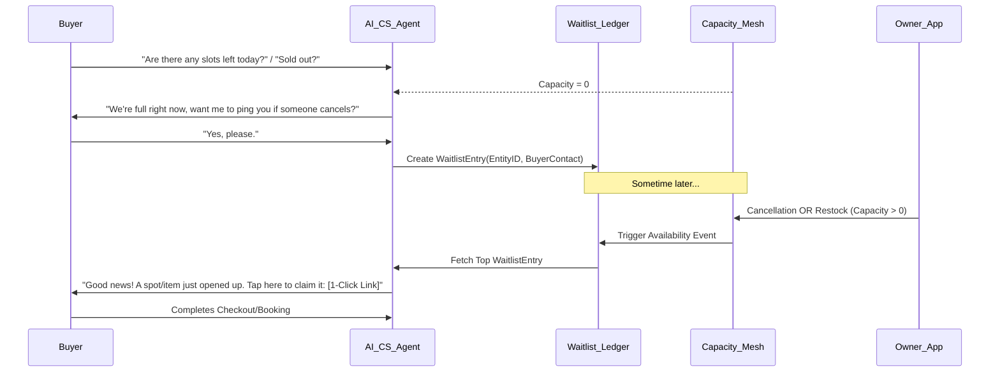

# Issue Brief: Autonomous Omni-Waitlist & Capacity Recovery Engine

**Category:** Architecture
**Priority:** P1
**Estimated Scope:** Medium

## Problem Statement
Small business owners lose up to 15% of potential revenue due to unpredictable cancellations and temporary out-of-stock scenarios. For example, when a student cancels a lesson last minute with Leo (music tutor), that hour is lost revenue because he doesn't have time to manually text his waitlist. Similarly, when Maya (baker) sells out of her special weekend croissants, interested customers leave without buying; when she bakes a fresh batch, she has no simple way to notify just the people who wanted them. Existing waitlist solutions are either fragmented (separate apps for scheduling vs. inventory), manual, or require expensive add-ons. Users need an invisible, autonomous engine that captures high-intent demand when capacity is zero and automatically recovers revenue when capacity opens up.

## Research Report
*   **Acuity Scheduling / Calendly:** Offer waitlist functionality, but it is passive. If a spot opens, the system might send an email, but it lacks an autonomous conversational agent that texts the next person in line: "Hey, a 3 PM slot just opened up! Reply YES to grab it."
*   **Shopify:** "Back in stock" notifications are usually handled by third-party apps (e.g., Klaviyo, Back in Stock), which cost extra and require complex setup. Furthermore, they only handle physical inventory, not service slots.
*   **Square / Wix:** Have basic waitlists but lack the "Omni" capability—they treat service bookings and retail products as entirely separate data silos.
*   **The OHC Opportunity:** By unifying Inventory Capacity (products) and Temporal Capacity (services) under the OHC Universal Capacity Ledger, we can deploy a single AI-driven waitlist engine. When an item or slot becomes available, the Customer Service Agent can autonomously reach out via the customer's preferred channel (SMS/WhatsApp/IG DM) to secure the sale instantly.

## Design Doc

### Architecture Diagram

### Mobile UX Flow (375px First)
*   **Buyer Storefront/Booking View:** When an item/slot is unavailable, the "Buy/Book" button is replaced by a translucent glass card: `[Join the Waitlist]`. Tapping it prompts for SMS or WhatsApp (1-tap if already recognized).
*   **Owner Activity Feed:** "Waitlist activated for 3 PM Slot (4 people waiting)."
*   **Owner Push Notification:** When a cancellation happens: "3 PM canceled. AI is texting 4 waitlisted customers." -> "Boom! Slot filled by Sarah."

### AI Agent Integration Points
*   **Customer Service Agent (`AI_CS_AGENT`):** Handles conversational waitlist opt-ins via social DMs. Handles the proactive outreach when capacity opens up. Understands urgency (e.g., offering expiring slots).
*   **Operations Agent:** Monitors the Universal Capacity Ledger. When it detects a `+1` change on an entity with active waitlist entries, it triggers the CS Agent.

### Key Design Decisions
*   **Omni-Waitlist:** The Waitlist entity references a generic `CapacityNode_ID`, which can be either a physical product SKU or a calendar service slot.
*   **Fairness vs. Urgency Protocol:** For high-urgency items (e.g., a service slot opening in 2 hours), the AI blasts the top 5 waitlisted users simultaneously ("First to tap gets it"). For low-urgency (e.g., restocked t-shirts), it messages them sequentially to avoid overselling.
*   **Zero-Touch Execution:** The owner does not manage the waitlist. They simply cancel an appointment or update inventory, and the system handles the rest.

## Implementation Prompt
**To the Implementer Agent:**
Implement the Autonomous Omni-Waitlist Recovery Engine.
1. Define the unified `WaitlistLedger` entity that can associate a buyer's contact info with ANY out-of-stock item or booked service slot.
2. Build the event listener in the `Capacity_Mesh` that watches for capacity increases (cancellations or restocks).
3. Integrate with the `AI_CS_AGENT` to dispatch a proactive message (SMS/WhatsApp) to waitlisted users containing a secure 1-click checkout/booking link when capacity is detected.
4. Ensure the UI for the business owner surfaces these automated recoveries in the Activity Feed as a "win" (e.g., "Saved $50! Filled a canceled slot automatically.") without requiring their manual intervention.
Ensure all data access is strictly tenant-isolated and mobile views are designed for a 375px viewport following the macOS/Glassmorphism design tokens.
