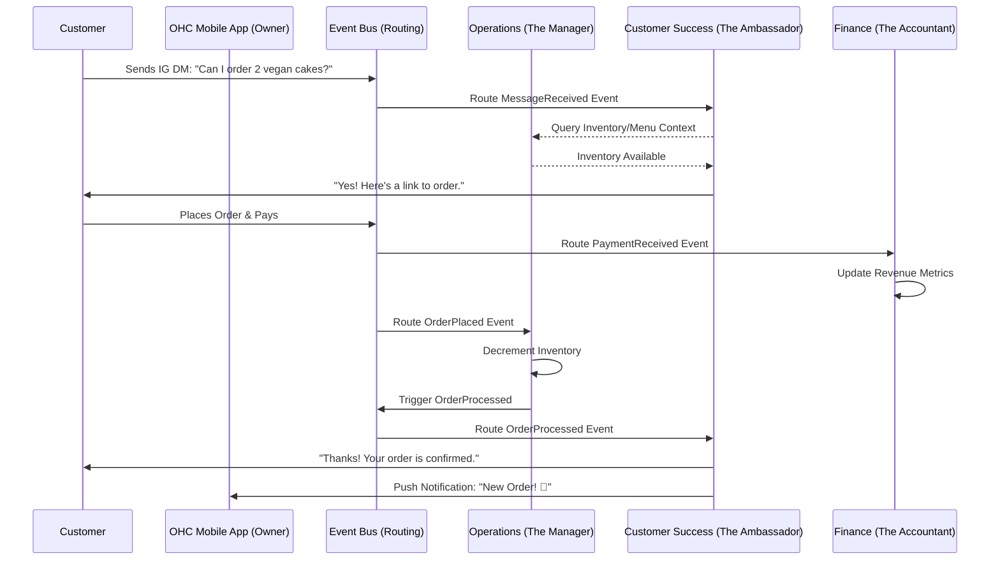

# [AI Agent Department] OneHumanCorp AI Department Architecture

## Title
AI Agent Department Architecture for OneHumanCorp

## Problem Statement
Small business owners—whether running a food cart, a tutoring service, or an Instagram bakery—are overwhelmed by the operational complexity of managing their businesses. They have to juggle customer inquiries, order fulfillment, marketing, financial tracking, and legal compliance simultaneously. They do not want to configure generic AI chatbots or learn complex automation workflows. They want invisible, reliable support that operates like a real-world team (e.g., a "Manager," a "Promoter," an "Accountant") to handle tasks automatically or draft them for simple 1-tap approval, seamlessly integrated into their mobile experience.

## Research Report
**Findings & Data:**
- Small business owners spend up to 40% of their time on non-revenue-generating administrative tasks.
- Existing platforms like Shopify and Wix offer generic "AI assistants" that require significant prompting and configuration.
- Users prefer "done-for-you" over "do-it-yourself." Context-aware agents that proactively suggest actions based on business data significantly improve retention.

**Competitive Analysis:**
- **Shopify:** Provides Shopify Magic (text generation, product descriptions, sidekick). It acts as a copilot but still requires the user to explicitly invoke it and provide context. It lacks autonomous cross-department coordination.
- **Wix:** Offers AI website generation and some email marketing generation. Limited autonomous background operation for operations and finance.
- **Squarespace / GoDaddy:** Primarily focused on site generation and simple SEO tasks. No concept of a holistic, multi-department AI workforce running invisibly in the background.

**OHC Differentiator:**
Instead of a single chat interface, OHC provides structured "Departments" that mirror real business functions. These agents coordinate with each other (e.g., Operations processes an order -> triggers Customer Success to send a personalized confirmation).

## Design Doc

### High-Level Architectural Design

**Departments & Roles:**
1. **Operations ("The Manager"):** Tracks inventory, processes orders/bookings, handles fulfillment logic.
2. **Marketing & Advertising ("The Promoter"):** Drafts social media posts, optimizes SEO, generates QR codes.
3. **Sales & Acquisition ("The Salesperson"):** Generates quotes, follows up on leads, tracks referrals.
4. **Customer Success ("The Ambassador"):** Replies to customer messages (e.g., Instagram DMs, web chat), requests reviews.
5. **Finance & Payments ("The Accountant"):** Processes payments, generates tax summaries, tracks revenue.
6. **Legal & Compliance ("The Protector"):** Manages terms/policies, GDPR compliance, disclaimers.
7. **Business Advisory ("The Advisor"):** Provides weekly health reports, trend analysis, pricing recommendations.

**Key Design Decisions:**
- **Event-Driven Coordination:** Agents do not run in a monolithic loop. They are triggered by domain events (e.g., `OrderPlaced`, `MessageReceived`) or schedules (e.g., `WeeklyFridayReport`).
- **Memory & Context:** Each agent has access to a secure, tenant-isolated contextual memory containing business history, customer preferences, and past interactions.
- **Approval Workflows (Auto vs. Draft):** High-risk actions (e.g., issuing refunds, posting to social media) default to "Draft for Review." Low-risk actions (e.g., answering "What are your hours?") default to "Auto-execute." Users can toggle these thresholds.
- **Budgeting & Throttling:** AI actions are budgeted per tenant based on their SaaS tier to control LLM costs and prevent abuse.

### Architecture Diagram

### Mobile UX Flow
1. **Dashboard:** The owner opens the app. The "Advisor" presents a single daily brief card: "You have 3 new orders, and I drafted a reply to Sarah."
2. **Reviewing Actions:** Tapping the card opens the "Approval Inbox." The owner sees drafted responses or actions from various departments.
3. **Approval:** A single tap "Approve" executes the action. Swiping left dismisses or modifies it.
4. **Department Settings:** In the "My Team" tab, the owner can view each department's activity log and toggle their autonomy level (e.g., setting the Ambassador to "Auto-reply to common questions").
5. **Offline Support:** The Approval Inbox caches drafted actions for review while offline, syncing approvals once reconnected.

## Implementation Prompt
**To the Implementer Agent:**
Implement the foundational event-driven architecture for the AI Agent Departments. Focus on the core Customer User Journey (CUJ) where an incoming customer message (e.g., asking about availability) triggers the "Customer Success" agent to draft a reply and notify the business owner.

**Acceptance Criteria:**
- Create the domain event models that agents will listen to.
- Implement the "Customer Success" agent logic that can consume a message event, access tenant context, and draft a response.
- Provide the "Approval Inbox" mechanism that queues drafted actions for the business owner.
- Implement the "My Team" settings interface for toggling agent autonomy levels (Auto-execute vs. Draft).
- Ensure all AI usage is correctly tracked against the tenant's tier limits.
- The UI must adhere to OHC Premium Design Standards (Glassmorphism, mobile-first, 375px usability) and pass the "grandmother test."

**Note:** Do NOT prescribe specific database schemas or API endpoints. Design the system based on the behavior and CUJ described above.

## Priority
P0 (Critical)

## Estimated Scope
Large
