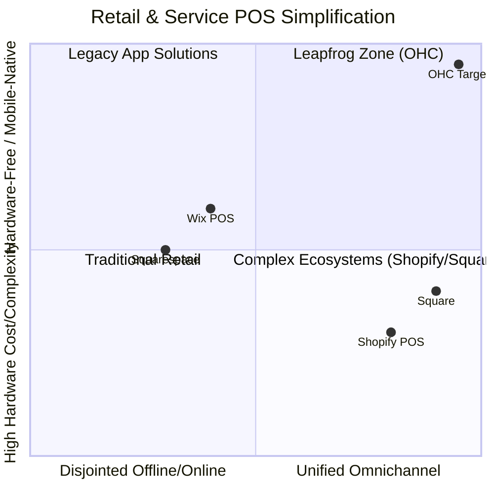
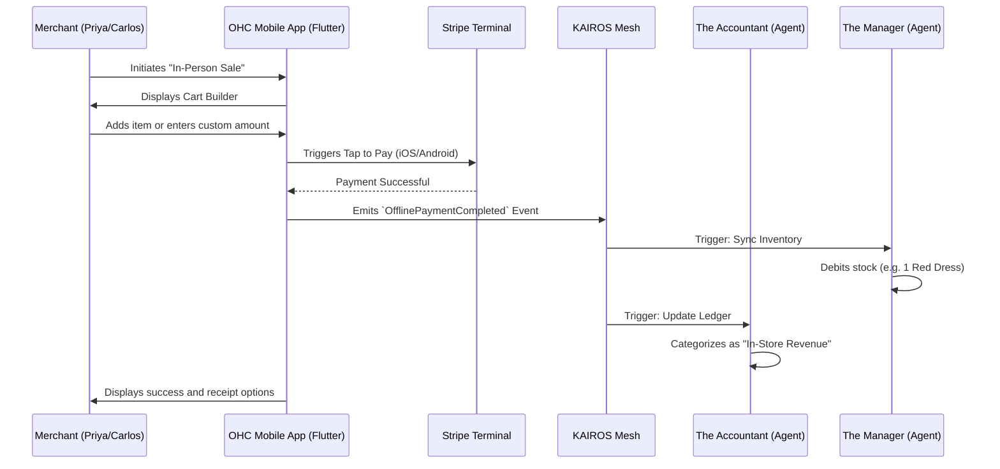

# Issue Brief: In-Person POS Integration via Stripe Terminal

## Problem Statement
Many small businesses—like Priya's boutique or Carlos's handyman service—operate seamlessly across online and offline boundaries. While OHC excels at setting up an online storefront in minutes, users struggle to collect in-person payments without logging into a separate system (like Square). For a true "business in a box" experience, users need to tap-to-pay or use card readers directly from their OHC mobile app, syncing inventory and revenue instantly.

## Persona Pain Points Synthesis
| Persona | Pain Point | Current Behavior | OHC Target Behavior |
|---|---|---|---|
| **Priya (Boutique Owner)** | Managing in-store point of sale and online store is disjointed, leading to inventory desync and revenue fragmentation. | Uses a Square card reader for in-store sales and manually reconciles inventory with Shopify at the end of the week. | Accepts payments in-store using her iPhone (Tap to Pay) directly in the OHC app, automatically decrementing online inventory and appearing in her daily rollup. |
| **Carlos (Handyman)** | Completes a job at a customer's house, needs to take a credit card payment immediately without asking for a check or sending an invoice. | Asks customers for cash or Venmo, appearing less professional, or sends a Square invoice later and chases payments. | Types $150 into the OHC app, taps the customer's card to his Android phone, and instantly emails the receipt from his business domain. |

## Research Report
- **Market Gap**: Shopify and Square provide powerful but complex point-of-sale (POS) hardware integrations. Wix and Squarespace offer rudimentary mobile POS but have disjointed offline/online inventory syncing.
- **User Pain Point**: Semi-technical users require absolute simplicity—using their existing iPhone or Android as a tap-to-pay terminal without purchasing expensive external hardware.
- **Stripe Terminal Advantage**: Stripe provides "Tap to Pay on iPhone" and "Tap to Pay on Android" SDKs. Integrating these into the OHC Flutter app means users can accept in-person payments on day one, seamlessly managed by "The Accountant" (Finance & Payments agent).
- **Opportunity**: OHC can provide an out-of-the-box, zero-hardware POS by enabling tap-to-pay within the 375px mobile UI, solidifying its position as the ultimate omnichannel platform for non-technical founders.

### Competitive Landscape: Omnichannel Capabilities

### Competitor Feature Matrix
| Feature | OHC (Target) | Shopify | Square | Wix | Squarespace |
|---|---|---|---|---|---|
| Hardware-Free Tap-to-Pay (Mobile Native) | ✅ (Native iOS/Android) | Partial (Requires specific regions) | Partial | ❌ (Often requires hardware) | ❌ |
| Unified Online/Offline Inventory Sync | ✅ (Instant via KAIROS) | ✅ | ✅ | ⚠️ (Laggy/Manual) | ⚠️ (Disjointed) |
| Plain-Language Financial Rollups | ✅ (The Accountant Agent) | ❌ (Complex Dashboards) | ❌ | ❌ | ❌ |
| Setup Complexity | 🚀 (< 1 Min) | 🐢 (Moderate) | 🐢 (Moderate) | 🐢 (Moderate) | 🐢 (Moderate) |

## Design Doc
### High-Level Architecture
- **Mobile POS Mode**: A dedicated "In-Person Sale" tab in the Flutter application.
- **Payment Gateway**: Stripe Terminal SDK integration (Tap to Pay on iOS/Android).
- **Inventory Sync**: The "Operations Manager" agent intercepts successful offline payment events via webhook/event mesh to instantly debit stock levels.
- **Financial Reporting**: The "Finance & Payments" agent categorizes these transactions distinctly as "In-Store/In-Person" vs. "Online", rolling up into daily plain-language reports.

### User Journey: In-Person Sale

### Mobile UX Flow (375px First)
- **Home Dashboard**: Tap a large, floating "+" button to initiate an "In-Person Sale".
- **Cart Building**: Quick-tap interface to add items to a digital cart or manually enter a custom amount (e.g., Carlos typing $150 for a repair).
- **Checkout**: A "Tap to Pay" modal prompts the merchant to present their phone to the customer.
- **Confirmation**: Post-payment, an option to SMS or email the receipt to the customer is displayed.

## Implementation Prompt
Integrate Stripe Terminal SDK into the Flutter mobile application to support "Tap to Pay" functionality. Create a new "In-Person Sale" user flow starting from the 375px dashboard that allows merchants to build a cart and process physical payments. Connect this flow to the KAIROS event mesh so that "The Manager" updates inventory and "The Accountant" reconciles the ledger immediately upon a successful transaction. Ensure the process is hardware-free and uses native device capabilities.

## Priority
P1

## Estimated Scope
Large
