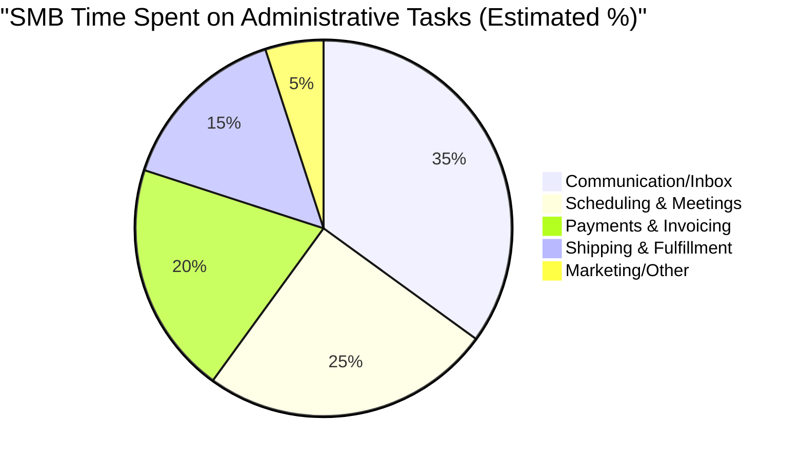

# OHC Integration Ecosystem: Q4 Research Report

## Executive Summary
This report outlines the evaluation of seven crucial integration categories intended to empower small business owners using OneHumanCorp (OHC). The primary goal is to close the platform gap between enterprise functionality and SMB accessibility. By focusing on non-technical users, these integrations aim to automate daily operations, from unified customer communication to streamlined payments and logistics, working seamlessly across both Cloud and Standalone environments.

---

## Persona-Specific Pain Points

| Persona | Primary Challenge | Impact on Business | Proposed Solution |
| :--- | :--- | :--- | :--- |
| **Fatima (Tutor)** | Missed messages across WhatsApp and Facebook, leading to lost students. | Revenue loss, high stress. | **Unified Social Media Inbox** |
| **Carlos (Consultant)** | Email back-and-forth for scheduling and manual Zoom link generation. | Time wasted, double bookings. | **Automated Calendar & Video Links** |
| **Aisha (Retailer)** | Calculating shipping costs manually and tracking packages. | Margin erosion, customer support load. | **Automated Shipping & Tracking** |
| **Raj (Local Services)** | Customers demanding local payment methods not supported by Stripe. | Cart abandonment. | **Global Alternative Payments** |
| **Maria (Baker)** | Relying solely on social algorithms to reach past customers. | Unpredictable repeat business. | **Integrated Email Marketing** |

---

## Competitive Landscape & Feature Gap Matrix

### Integration Category Evaluation

1. **Unified Social Media Inbox (P1)**
   - *Current State*: Disjointed apps (Meta, WhatsApp, TikTok).
   - *OHC Vision*: A single unified thread per customer regardless of origin platform.
   - *Key Insight*: Critical for retention. Small businesses cannot afford a dedicated support team.

2. **Calendar & Scheduling (P1)**
   - *Current State*: Manual email negotiation.
   - *OHC Vision*: Shareable booking link synced natively with Google/Outlook.
   - *Key Insight*: Cal.com's open-source nature aligns perfectly with OHC's Standalone mode requirements.

3. **Email Marketing (P2)**
   - *Current State*: Exporting CSVs to Mailchimp.
   - *OHC Vision*: Select audience in OHC, draft, and send natively.
   - *Key Insight*: High complexity to build robust templates; integration via Resend/MailerLite APIs is optimal.

4. **Payment Processing (P1)**
   - *Current State*: Stripe only.
   - *OHC Vision*: Dynamic localized payment options at checkout (Pix, Mercado Pago, etc.).
   - *Key Insight*: Essential for global expansion and reducing cart abandonment in LATAM/Asia.

5. **Shipping & Logistics (P1)**
   - *Current State*: Manual rate calculation and post office visits.
   - *OHC Vision*: Live rates at checkout, 1-click label generation via Shippo/EasyPost.
   - *Key Insight*: Automating this saves the most measurable physical time for product-based businesses.

6. **SMS & Notifications (P0)**
   - *Current State*: Ad-hoc manual texting.
   - *OHC Vision*: Automated lifecycle alerts (appointments, shipping) via Twilio.
   - *Key Insight*: Highest priority due to global reliance on SMS over email for immediate updates.

7. **Video Conferencing (P2)**
   - *Current State*: Manual link creation and pasting.
   - *OHC Vision*: Zero-touch Zoom/Meet link generation attached to calendar invites.
   - *Key Insight*: Quickest win; low implementation effort for high perceived value.

---

## Evidence-Based Recommendations & Next Steps

1. **Immediate Execution (P0)**: Begin implementation of **SMS & Notifications**. It is a fundamental infrastructure requirement that enhances several other modules (like Shipping and Scheduling).
2. **Phase 2 Execution (P1)**: Prioritize the **Unified Social Media Inbox** and **Shipping & Logistics** as they directly address the largest time-sinks for our core personas.
3. **Architecture Mandate**: All implementations must adhere strictly to the **Cloud/Standalone parity**. We must utilize webhook ingestion for Cloud and local polling/IPC for Standalone where necessary.

---

## Issue Briefs

### [Social_Media_Integration] Unified Social Media Inbox Integration

#### Problem Statement
Small business owners receive customer messages across Instagram, Facebook, WhatsApp, and TikTok. Constantly switching between apps leads to missed messages, slow response times, and lost sales. Managing conversations across platforms is overwhelming for a small team or single owner.

#### Research Report
- **Tool Evaluated**: Chatwoot / ManyChat
- **Ease of Use**: Excellent. These platforms offer a single interface for all messages. Non-technical users can easily connect accounts via standard OAuth flows.
- **Pricing**: Freemium models available. Pro features typically start around $15-30/month, making it highly affordable for small businesses.
- **Reputation**: High. Known for reliable webhooks and parsing.
- **Cloud vs Standalone**: Works natively in Cloud environments. For Standalone, self-hosted alternatives like Chatwoot are fully supported, ensuring data privacy.

#### Design Doc
- **Integration Point**: A new "Inbox" module in the OHC dashboard.
- **Triggers**: Webhooks from Meta/TikTok APIs push new messages to the OHC backend.
- **Actions**: OHC normalizes the messages and displays them in a unified thread. Replies from OHC are dispatched via the respective platform's API.
- **User Experience**: The user connects their social accounts via a simple settings page. They then manage all conversations from a single screen within OHC, without needing to know which platform the message originated from unless they check the icon.

#### Implementation Prompt
Implement a unified inbox feature that allows users to connect their Instagram and Facebook accounts (via OAuth) and view/reply to messages from a single interface within OHC. The setup must be a one-click connection process. The inbox should show the customer's name, message, and origin platform.

#### Priority
P1

#### Estimated Scope
Medium

### [Calendar_and_Scheduling] Automated Calendar Synchronization & Booking

#### Problem Statement
Small business owners spend significant time going back and forth via email/text to schedule appointments or consultations. Double bookings and timezone confusion are common issues that frustrate customers and lose business.

#### Research Report
- **Tool Evaluated**: Calendly / Cal.com
- **Ease of Use**: High. Cal.com offers embeddable booking pages that require zero coding from the business owner.
- **Pricing**: Free tier covers basic 1:1 scheduling. Paid tiers around $12/month.
- **Reputation**: Cal.com is open-source and highly respected for scheduling infrastructure.
- **Cloud vs Standalone**: Cal.com is open-source, allowing for standalone hosting if necessary, or API integration for cloud.

#### Design Doc
- **Integration Point**: "Booking" tab in the OHC dashboard.
- **Triggers**: Customer selects a time slot on the public booking page.
- **Actions**: Syncs with the owner's Google/Outlook calendar. Automatically generates a Zoom/Google Meet link and sends calendar invites to both parties.
- **User Experience**: The business owner connects their Google Calendar and sets their working hours. OHC generates a personal booking link they can share on social media. Customers click the link, pick a time, and both receive an invite with a video link.

#### Implementation Prompt
Integrate a scheduling system where business owners can connect their Google Calendar, define availability, and get a shareable public booking link. When a customer books a slot, it must automatically create a calendar event with a video meeting link and send confirmation emails to both parties.

#### Priority
P1

#### Estimated Scope
Medium

### [Email_Marketing] Integrated Email Campaign Management

#### Problem Statement
Small business owners struggle to keep their customer lists organized and don't have the time to learn complex email marketing software. They want a simple way to send newsletters or promotions to their existing customer base without managing separate contact lists.

#### Research Report
- **Tool Evaluated**: MailerLite / Resend (for transactional/simple campaigns)
- **Ease of Use**: MailerLite has a very user-friendly drag-and-drop editor. Resend provides excellent developer APIs for seamless native integration.
- **Pricing**: Free for up to 1,000 subscribers. Very cost-effective.
- **Reputation**: High deliverability rates and strict spam compliance.
- **Cloud vs Standalone**: Cloud APIs (Resend) are ideal for multi-tenant. Standalone might require SMTP configuration.

#### Design Doc
- **Integration Point**: "Marketing" section in OHC.
- **Triggers**: User creates a new campaign and selects an audience segment.
- **Actions**: OHC syncs the customer list with the email provider and dispatches the campaign. Retrieves open/click stats asynchronously.
- **User Experience**: Business owners can write an email right inside OHC, pick a template, and click "Send to all past customers". They see basic stats (opens, clicks) directly on their dashboard.

#### Implementation Prompt
Build an email marketing interface allowing users to draft emails, select from basic templates, and send them to their synced customer list. The feature must include bounce handling and simple analytics (open rates) displayed within the OHC dashboard.

#### Priority
P2

#### Estimated Scope
Large

### [Payment_Processing] Global Alternative Payment Processing

#### Problem Statement
While Stripe is standard, many small businesses operate in regions where local payment methods are dominant (e.g., Mercado Pago in LATAM, Pix in Brazil, Alipay). Lack of local payment support leads to high cart abandonment.

#### Research Report
- **Tool Evaluated**: dLocal / Rapyd / Mercado Pago
- **Ease of Use**: Integrating multiple providers is complex, but the end-user (business owner) only needs to toggle "Enable Pix" or "Enable Mercado Pago" in settings.
- **Pricing**: Transaction fees vary by region, usually 2-5%.
- **Reputation**: Essential for emerging markets.
- **Cloud vs Standalone**: API integrations work seamlessly across both, though webhook processing requires internet access for Standalone.

#### Design Doc
- **Integration Point**: "Payments" settings module.
- **Triggers**: Checkout process initiation.
- **Actions**: OHC dynamically displays available payment methods based on the customer's region. Routes the transaction to the appropriate gateway.
- **User Experience**: The business owner goes to settings, sees a list of regional payment gateways, and clicks "Connect" to authorize via OAuth or API key. Customers then see local payment options at checkout.

#### Implementation Prompt
Implement support for local alternative payment methods (e.g., Mercado Pago, Pix). The business owner must be able to toggle these options on/off in a unified payment settings screen. The checkout flow must dynamically adapt to show these options based on the integration status.

#### Priority
P1

#### Estimated Scope
Large

### [Shipping_and_Logistics] Automated Shipping Rates and Label Generation

#### Problem Statement
Calculating shipping costs manually and buying labels at the post office wastes hours for product-based small businesses. Incorrect shipping estimates eat into their margins.

#### Research Report
- **Tool Evaluated**: Shippo / EasyPost
- **Ease of Use**: Excellent API abstractions. Business owners simply input package dimensions and weight.
- **Pricing**: Pay-as-you-go per label (cents) plus postage cost.
- **Reputation**: Reliable carrier connections (USPS, FedEx, UPS, DHL).
- **Cloud vs Standalone**: Webhook and API driven, works well in both environments.

#### Design Doc
- **Integration Point**: "Orders" module.
- **Triggers**: Order placement (rate calculation) and Order fulfillment (label generation).
- **Actions**: Fetch live rates at checkout. Generate printable PDF labels and tracking numbers upon fulfillment.
- **User Experience**: At checkout, customers see exact shipping costs. When fulfilling an order, the business owner clicks "Print Label", a PDF downloads, and the tracking number is automatically emailed to the customer.

#### Implementation Prompt
Integrate a shipping API (like EasyPost or Shippo) to provide live shipping rates at checkout. Add a "Generate Label" button to the order fulfillment screen that purchases postage, downloads a PDF label, and auto-notifies the customer with a tracking link.

#### Priority
P1

#### Estimated Scope
Medium

### [SMS_and_Notifications] Global SMS Notification System

#### Problem Statement
Many customers, especially in regions with lower email adoption or for users like Fatima who prefer direct communication, rely on SMS for critical updates (order confirmations, appointment reminders).

#### Research Report
- **Tool Evaluated**: Twilio / MessageBird
- **Ease of Use**: Transparent to the business owner. They just enable SMS notifications.
- **Pricing**: Varies globally, typically $0.01 - $0.05 per message.
- **Reputation**: High deliverability, though strict compliance (A2P 10DLC in the US) is required.
- **Cloud vs Standalone**: APIs work universally.

#### Design Doc
- **Integration Point**: "Notifications" settings.
- **Triggers**: System events (appointment booked, order shipped).
- **Actions**: Dispatches localized SMS messages based on customer phone numbers.
- **User Experience**: The business owner toggles "Send SMS Reminders" in settings. Customers receive automatic text messages 24 hours before an appointment or when a package ships.

#### Implementation Prompt
Implement automated SMS notifications for key lifecycle events (appointments, shipping). The feature must support international numbers, handle opt-outs gracefully (STOP commands), and allow the business owner to toggle SMS alerts on or off.

#### Priority
P0

#### Estimated Scope
Medium

### [Video_Conferencing] Zero-Touch Video Meeting Generation

#### Problem Statement
Consultants, tutors, and service providers manually create Zoom links and email them to clients, which is error-prone and time-consuming.

#### Research Report
- **Tool Evaluated**: Zoom API / Google Meet API
- **Ease of Use**: Seamless once connected.
- **Pricing**: Included in standard Zoom/Google Workspace plans.
- **Reputation**: Industry standards.
- **Cloud vs Standalone**: Requires API connectivity, functions perfectly in both.

#### Design Doc
- **Integration Point**: Associated with the Calendar/Booking module.
- **Triggers**: New appointment creation.
- **Actions**: API call to Zoom/Meet to create a meeting. Attaches the link to the calendar event.
- **User Experience**: The business owner connects their Zoom account once. Every booked consultation automatically includes a unique Zoom link in the confirmation email, requiring zero manual work.

#### Implementation Prompt
Integrate automatic Zoom or Google Meet link generation for all online appointments. The system must authenticate the owner's account and append a unique meeting link to both the business owner's and customer's calendar invites instantly upon booking.

#### Priority
P2

#### Estimated Scope
Small
