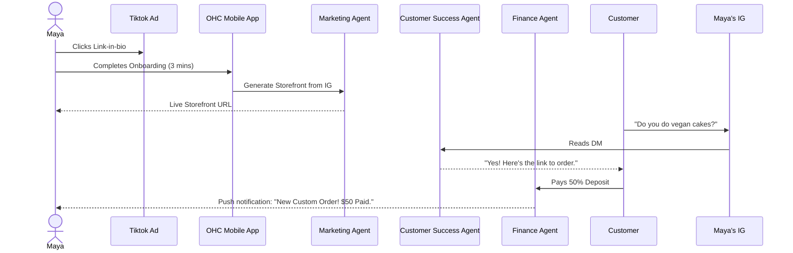
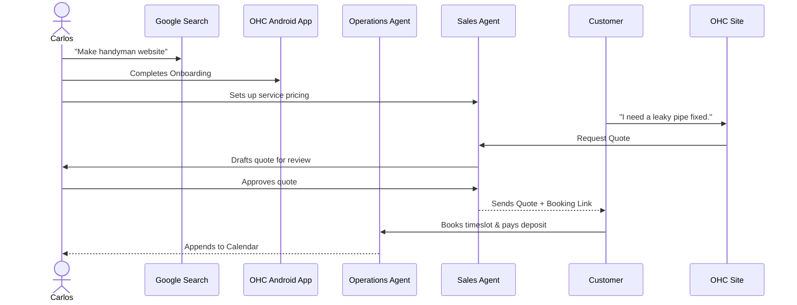
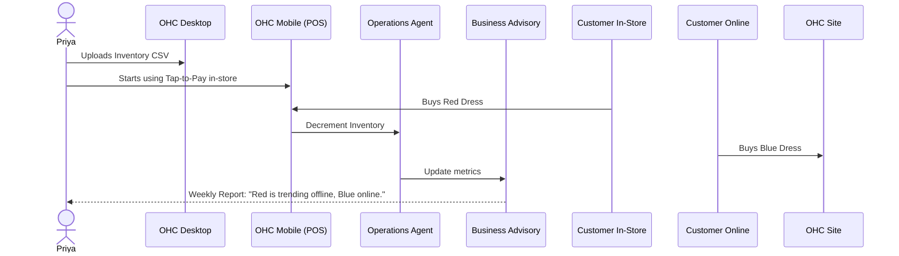
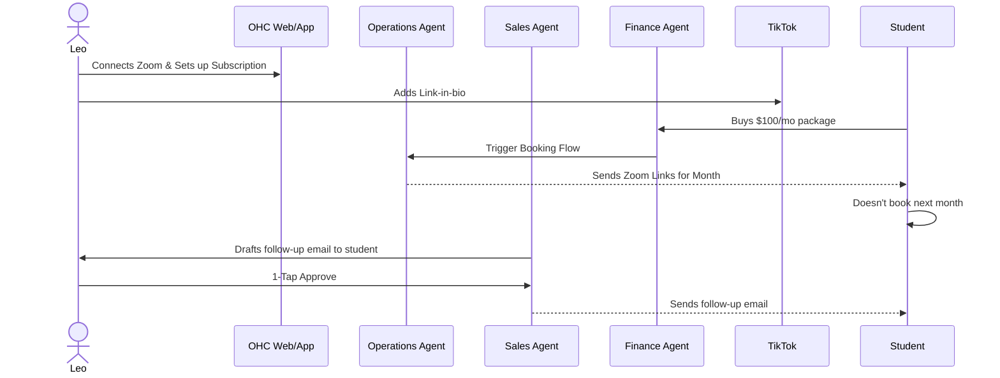
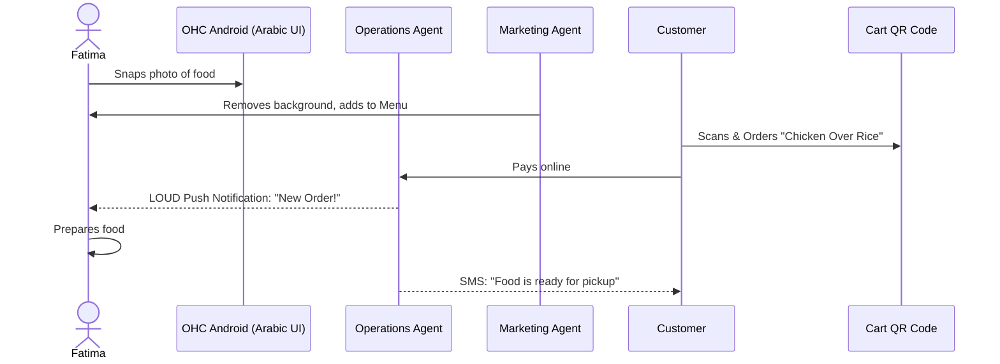

# Research Report: Business Journey Architecture

## Overview
This document outlines the complete end-to-end user journey for the key personas of OneHumanCorp (OHC): Maya (Baker), Carlos (Handyman), Priya (Boutique Owner), Leo (Music Tutor), and Fatima (Food Cart Operator). OHC enables non-technical small business owners to launch, run, and grow their businesses without touching code. The focus here is on Acquisition, Onboarding, Activation, Retention, Revenue, and Referral.

## 1. Maya — The Home Baker (Physical Products / Custom Orders)

**Needs:** Storefront for custom cakes, deposits, Instagram DM auto-reply, order calendar, mobile-only management.

### The Journey
- **Acquisition:** Maya sees a TikTok of another baker who grew her business "overnight without coding" using OHC. She clicks the link-in-bio, which leads to the OHC mobile landing page. The CTA says: "Launch your custom cake shop in 3 minutes."
- **Onboarding:** Wizard flow on her iPhone:
  1. *What do you sell?* -> "Cakes & Baked Goods"
  2. *Connect Instagram?* -> Authorizes OHC to read/reply to DMs.
  3. *Set your deposit rule?* -> "Require 50% upfront for custom orders."
- **Activation:** The Marketing & Advertising agent generates a storefront with Maya's Instagram photos. Maya adds her first cake variant. She receives her first custom order inquiry via DM, and the Customer Success agent successfully auto-replies, sending a payment link for the deposit. The deposit hits her Stripe account.
- **Retention:** Maya relies on the daily morning summary push notification: "You have 3 orders due this week, and 1 new inquiry."
- **Revenue:** Maya hits the 100-order limit of the Starter tier. A prompt asks if she wants to upgrade to Pro for "Unlimited orders and advanced analytics" ($29/mo).
- **Referral:** Maya posts an Instagram story: "I don't know how I lived without my OHC agent," using her built-in referral link.

### Sequence Diagram

---

## 2. Carlos — The Freelance Handyman (Services & Bookings)

**Needs:** Service listings with prices, booking calendar with deposits, customer inbox, AI quote generator, Android app.

### The Journey
- **Acquisition:** Carlos searches Google for "how to make a website for handyman business" on his Android phone. OHC's search ad reads: "Get booked in 10 minutes. No tech skills needed."
- **Onboarding:** Wizard flow:
  1. *What services do you provide?* -> "Handyman & Repairs"
  2. *What is your availability?* -> Connects Google Calendar or sets manual hours.
  3. *How do you charge?* -> "Fixed prices and custom quotes."
- **Activation:** Carlos publishes his "Plumbing Fixes" service. A customer books a slot and pays a $20 deposit.
- **Retention:** Carlos opens the app to check his "Customer Inbox" every morning to see if any new leads requested a quote.
- **Revenue:** Carlos needs a custom domain to look more professional on his business cards. He upgrades from the Free tier to Starter ($9/mo).
- **Referral:** Carlos tells another contractor at Home Depot, "Just use OHC, it does the scheduling for you," and texts his referral link.

### Sequence Diagram

---

## 3. Priya — The Boutique Owner (Retail / Omnichannel)

**Needs:** Storefront + inventory sync, variants, POS tap-to-pay, email newsletter, mobile/desktop management.

### The Journey
- **Acquisition:** Priya needs an online store but hates Shopify's complexity. She sees an Instagram ad for OHC highlighting "Sync in-store and online automatically."
- **Onboarding:** Cross-device flow (starts on laptop, finishes on iPhone):
  1. *Upload inventory spreadsheet or add manually?* -> Bulk uploads CSV.
  2. *Connect bank?* -> Connects for payouts.
- **Activation:** Priya sets up her physical store with OHC's Tap-to-Pay on her iPhone. Her first online sale successfully decrements the shared inventory.
- **Retention:** Priya checks the "Business Advisory" dashboard daily for top-selling variants (e.g., "Red Dress, Size M is trending").
- **Revenue:** She needs the POS terminal and advanced email campaigns. She upgrades to Pro ($29/mo).
- **Referral:** She shows a neighboring shop owner her daily analytics on her phone.

### Sequence Diagram

---

## 4. Leo — The Music Tutor (Subscriptions / Digital Portfolios)

**Needs:** Lesson booking (Calendar + Zoom), subscription packages, AI follow-up, TikTok link-in-bio.

### The Journey
- **Acquisition:** A fellow musician recommends OHC. "It handles my Zoom links automatically."
- **Onboarding:** Wizard flow:
  1. *Service type?* -> "Tutoring & Lessons"
  2. *Integration?* -> Connects Zoom and Google Calendar.
  3. *Pricing model?* -> Sets up "4 Lessons/Month for $100" subscription.
- **Activation:** Leo generates his link-in-bio page and adds it to TikTok. A student buys the monthly package and automatically receives Zoom links for the month.
- **Retention:** The Sales Agent auto-drafts emails to students who haven't booked in 2 weeks ("Hey, want to schedule your next lesson?"). Leo approves them with one tap.
- **Revenue:** Leo needs multiple calendar syncs (personal + gig calendar) and upgrades to Starter.
- **Referral:** Leo includes a "Powered by OHC" badge on his link-in-bio.

### Sequence Diagram

---

## 5. Fatima — The Food Cart Operator (Food & Beverage)

**Needs:** Photo menu, pre-orders, pickup notifications, Arabic/English UI, low-end Android support.

### The Journey
- **Acquisition:** A local business outreach program helps Fatima set up OHC.
- **Onboarding:** Assisted flow (simplified UI, Arabic language selected):
  1. *Business type?* -> "Food & Beverage"
  2. *Menu entry?* -> Takes photos of her food with her phone; AI removes background and suggests names.
- **Activation:** A customer scans the QR code on her cart, places a pre-order, and pays online. Fatima gets a loud notification on her phone: "New Order! Chicken Over Rice."
- **Retention:** The end-of-day printable summary. Fatima prints her daily order list directly from her phone to a small Bluetooth printer.
- **Revenue:** Fatima uses the Free tier but pays standard payment processing fees, generating revenue for OHC indirectly.
- **Referral:** Other cart operators see her QR code system and ask how she did it.

### Sequence Diagram

---

## Identified Friction Points (Non-Technical Owner Perspective)

1. **Domain Configuration:** DNS setup is notoriously difficult. If users have an existing domain, they will likely abandon the flow if asked to manually configure A/CNAME records. **Mitigation:** Provide an "OHC sets it up for you" flow where users log into their registrar (e.g., GoDaddy) via an OAuth-like integration.
2. **Payment Gateway Verification:** Stripe KYC (Know Your Customer) requires legal documents. If asked for this immediately during onboarding, drop-off will be high. **Mitigation:** Defer KYC until the user receives their first payment (progressive onboarding).
3. **AI Agent Trust:** Maya might not trust an AI to reply to her Instagram DMs correctly. **Mitigation:** Start the Customer Success agent in "Draft Mode" where it suggests replies that Maya must approve with one tap. Once she trusts it, she can switch to "Auto-Pilot."
4. **App Size & Data Usage:** Fatima's low-end Android has limited storage and a slow data connection. **Mitigation:** Ensure the Flutter app has a minimal footprint (`flutter build apk --split-per-abi`) and caches the dashboard offline.
5. **Inventory Initial Upload:** Priya will not type 500 products manually on her phone. **Mitigation:** Desktop CSV upload is critical, but the mobile app must also support taking a picture of an existing physical price list and letting AI digitize it.

## Conclusion
The OHC business journey succeeds by deferring complexity and leading with immediate value (the "Aha!" moment of a live site or first payment within 10 minutes). The AI agents are the primary drivers of this seamless experience, working invisibly to replace the need for technical configuration.
