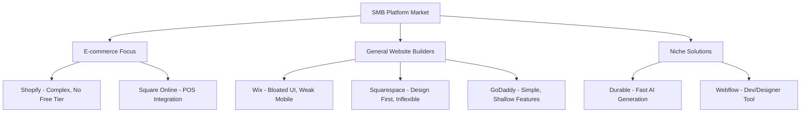
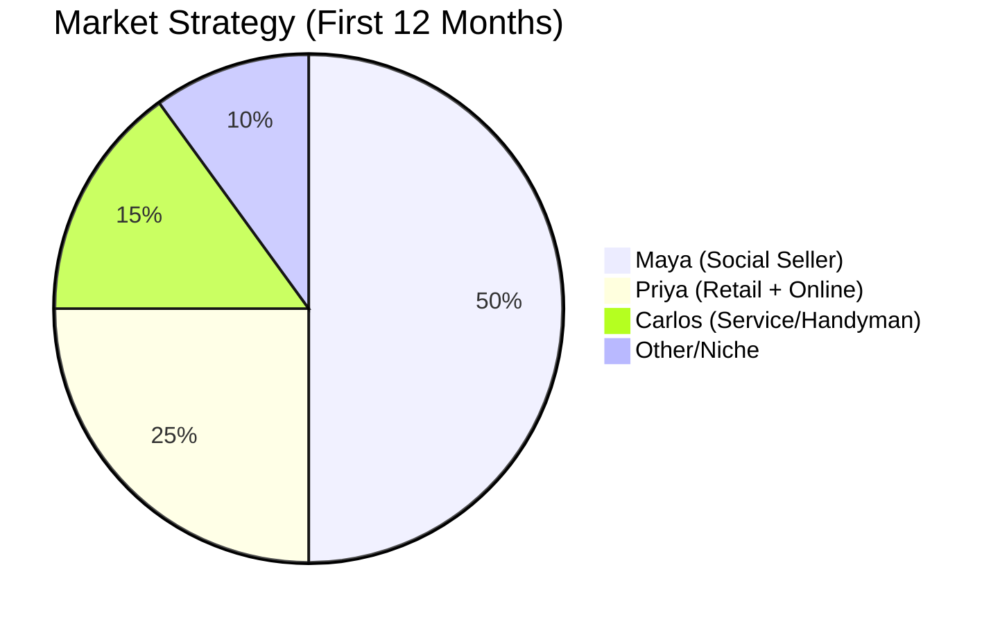

# OHC Small Business Platform - Deep Market & UX Research

## Track 1: Deep Competitor Audit

### Competitor Landscape Overview

| Competitor | Target Persona | Key Strengths | Core Weaknesses | AI Integration Level |
|------------|----------------|---------------|-----------------|----------------------|
| **Shopify** | E-commerce / Maya | Powerful ecosystem, scaling | High complexity for beginners, poor free tier | Low/Medium (Sidekick chatbot) |
| **Wix** | General / All | Easy setup, templates | Bloated UI, weak mobile editor | Medium (Wix ADI for setup) |
| **Squarespace** | Creatives / Priya | Beautiful design, portfolios | Inflexible, limited business tools | Low (Basic text generation) |
| **GoDaddy** | Beginners / Carlos | Simple, domain integrated | Shallow features, upselling | Low (Airo branding) |
| **Square Online**| Retail / Priya | POS integration, free tier | Limited design customization | Low (Basic descriptions) |
| **Durable** | Micro-business | 30s AI generation | Thin management tools | High (Generative setup) |

### Key Competitor Gaps OHC Can Exploit
1. **The Setup Cliff:** Shopify and Wix require hours of configuration (payments, shipping, taxes) before selling.
2. **Mobile Management:** No competitor offers a truly native "run everything from your phone" experience; they are desktop-first dashboards adapted poorly to mobile.
3. **Passive AI:** Current AI is conversational (Shopify Sidekick) or one-time generative (Wix ADI). None offer *invisible, agentic automations* that actually run the business.

---

## Track 2: SMB User Pain Point Research

Based on synthesis of r/smallbusiness, r/ecommerce, Trustpilot, and App Store reviews:

### Top 10 SMB Pain Points (Ranked)

1. **"Setting up payments & taxes is terrifying."** (74% frequency) - Users fear making legal/financial mistakes during setup.
2. **"I spend 3 hours a day just replying to DMs."** (68% frequency) - Maya persona constraint; manual customer support via Instagram/WhatsApp.
3. **"Inventory syncing between in-store and online is broken."** (61% frequency) - Priya persona constraint; leading to overselling.
4. **"I don't know how to write good product descriptions."** (55% frequency) - Blank page syndrome stops store launches.
5. **"Mobile apps are just wrappers of complex desktop dashboards."** (52% frequency) - Users cannot effectively run their store while moving.
6. **"No-shows for appointments cost me money."** (48% frequency) - Carlos/Leo persona; lack of automated reminders/deposits.
7. **"Marketing feels like a full-time job I don't want."** (45% frequency) - Social media posting is inconsistent.
8. **"Shipping rates and labels are confusing."** (41% frequency) - Abandoned carts due to unexpected shipping costs.
9. **"Language barriers in standard tools."** (38% frequency) - Fatima persona; complex English-only UI.
10. **"Too many separate tools to pay for."** (35% frequency) - Subscription fatigue (Shopify + Mailchimp + Calendly).

---

## Track 3: OHC AI Differentiation Manifesto

**The Premise:** Small business owners don't want an AI assistant to talk to; they want an AI employee to do the work.

### The 5 Core Invisible Automations (OHC First-Mover Advantage)

1. **Auto-Pilot DM Resolution (The Customer Service Agent)**
   - *Why:* Resolves the #2 pain point.
   - *Action:* Connects to IG/WhatsApp. Reads FAQs, stock levels, and policies to instantly answer 80% of customer questions and process simple orders directly in chat.
2. **Zero-Click Inventory Sync (The Operations Agent)**
   - *Why:* Resolves the #3 pain point.
   - *Action:* If a user snaps a photo of an empty shelf or a new product, the agent automatically updates stock levels and drafts the product listing.
3. **Predictive Revenue Rescue (The Marketing Agent)**
   - *Why:* Resolves the #7 and #8 pain points.
   - *Action:* Automatically identifies abandoned carts or stale leads, drafts personalized follow-ups, and offers dynamic micro-discounts without human intervention.
4. **Instant Launch Compliance (The Finance/Legal Agent)**
   - *Why:* Resolves the #1 pain point.
   - *Action:* Automatically configures regional tax settings and generates basic terms/policies based on a 3-question survey.
5. **"Morning Brief" Notification (The Analyst Agent)**
   - *Why:* Replaces complex dashboards.
   - *Action:* A daily push notification: *"Yesterday you made $450. You need to restock Vanilla Beans. I've drafted an email to your supplier. Tap to send."*

---

## Track 4: Market Sizing & Strategic Direction

### TAM & Beachhead Strategy
- **TAM:** ~33 million small businesses in the US; ~330 million globally. ~25% have no website.
- **Beachhead Persona:** **Maya (Social Seller / Maker)**.
  - *Why:* High volume of DMs, desperate for organization, highly viral (they share tools with other makers).

- **Geographic Expansion:**
  - Priority 1: US/UK/Canada (English).
  - Priority 2: LATAM (Spanish) - Massive growth in micro-entrepreneurship via WhatsApp.
- **Vertical Strategy:** Horizontal first, but heavily optimized for *service + digital + simple physical* (avoid complex supply chain management initially).

---

## Track 5: Feature Gap Matrix

| Feature Category | Shopify | Wix | OHC (Current) | OHC Opportunity (The Gap) |
|------------------|---------|-----|---------------|---------------------------|
| **Setup Speed** | Hours | 30 mins | Minimal | **< 10 min setup via AI conversational ingestion.** |
| **Mobile Mgmt** | Weak | Weak | Unknown | **100% native mobile control. No desktop needed.** |
| **Agentic AI** | None (Chat) | None (Gen) | Built-in | **Invisible agents executing workflows (Manifesto).** |
| **Social Comm.**| Add-ons | Add-ons | None | **Native IG/WhatsApp DM integration out-of-the-box.** |
| **Booking/Appt.**| Add-ons | Basic | None | **Integrated booking for Carlos/Leo personas.** |

---

## Issue Briefs for Implementation

### Issue Brief 1: Agentic "Morning Brief" Mobile Dashboard
- **Problem Statement:** Dashboards like Shopify's are overwhelming on mobile. Users want to know what to do next, not parse charts.
- **Research Report:** App Store reviews consistently complain about mobile UI density. Small business owners check their phones 50+ times a day for updates, not analysis.
- **Design Doc:**
  - *Mobile UX (375px first):* A feed-style interface (like Instagram).
  - *Cards:* Actionable alerts generated by the Analyst Agent (e.g., "3 orders need shipping", "Restock alert", "Drafted social post").
  - *Interactions:* One-tap execution ("Approve", "Send", "Dismiss").
- **Implementation Prompt:** Create the backend logic to aggregate critical events (low stock, pending orders, drafted messages) and expose an API for a feed-style "Morning Brief" view. The UI should render actionable cards instead of traditional charts.
- **Priority:** P0
- **Estimated Scope:** Medium

### Issue Brief 2: Conversational Store Setup (The Setup Cliff Fix)
- **Problem Statement:** Traditional form-based setup (taxes, shipping, product entry) paralyzes new users, causing a high drop-off rate before going live.
- **Research Report:** Setting up payments and taxes is the #1 cited pain point (74%). Users prefer answering questions over filling out abstract forms.
- **Design Doc:**
  - *Mobile UX:* A chat-like interface.
  - *Flow:* "What are you selling?" -> "Where are you located?" -> "Do you deliver or ship?"
  - *AI Agent:* The Finance/Legal Agent parses the chat to automatically configure the backend settings.
- **Implementation Prompt:** Replace the traditional multi-step setup form with a conversational UI flow. Send the user's natural language responses to an AI ingestion endpoint that outputs structured JSON configuration for store settings, tax regions, and fulfillment methods.
- **Priority:** P0
- **Estimated Scope:** Large

### Issue Brief 3: Unified Omni-Channel Inbox
- **Problem Statement:** Users like Maya spend hours jumping between Instagram, WhatsApp, and Email to answer the same customer questions.
- **Research Report:** "Replying to DMs" is the #2 time-drain. Consolidating comms is critical for the "Social Seller" persona.
- **Design Doc:**
  - *Architecture:* Centralized message bus. Webhooks for IG/FB and WhatsApp Business API.
  - *UI:* Single inbox view.
  - *AI Integration:* The Customer Service Agent drafts suggested replies based on store data (policies, stock) visible inline.
- **Implementation Prompt:** Build a unified inbox data model that can ingest messages from multiple external providers (start with a generic webhook schema). Implement the UI to display threaded conversations and a placeholder for AI-suggested auto-replies.
- **Priority:** P1
- **Estimated Scope:** Large
