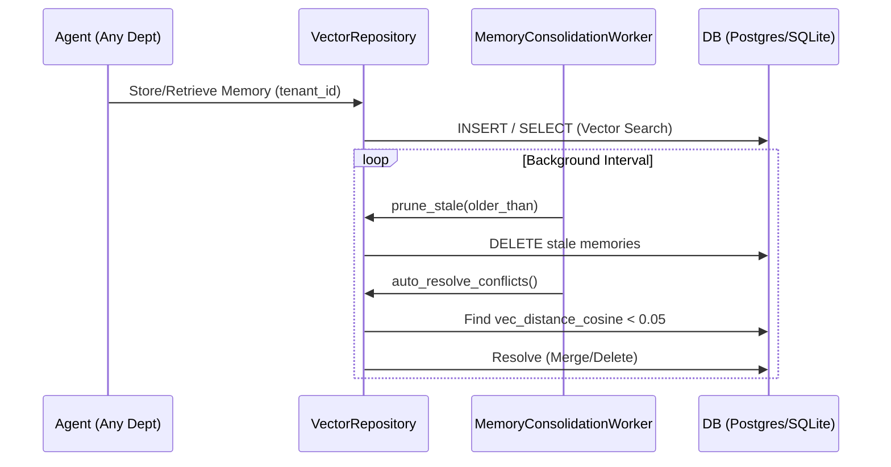

# OHC Agent Memory & Context Consolidation System

## Overview

The OHC long-term memory system enables AI agents to retain cross-session knowledge, share context seamlessly across different departments (e.g., Customer Success, Operations, Business Advisory), resolve semantic conflicts automatically, and prune stale context to maintain high relevance and performance.

The memory core operates within both Cloud (`PostgreSQL` with `pgvector`) and Standalone (`SQLite` with a vector extension fallback) environments. It leverages tenant-scoped vector indexing to enforce strict data isolation while providing powerful semantic search capabilities.

  
<strong>Note:</strong> Memory operations happen asynchronously via the <code>MemoryConsolidationWorker</code> and do not block the critical request path for AI agent execution.

## Architecture

The system consists of the following core components:

1. **VectorRepository (`src/agents/builtin/memory_store.rs`)**:
   - Provides a unified abstraction over `PostgreSQL` and `SQLite` memory storage.
   - Handles the lifecycle of `EmbeddingRecord` objects.
   - Enforces `tenant_id` isolation on every query.
   - Executes semantic similarity checks (Cosine Distance) to retrieve context and detect conflicts.

2. **MemoryConsolidationWorker (`src/server/workers/memory.rs`)**:
   - Runs continuously in the background using `tokio::spawn`.
   - Polls the `VectorRepository` on an interval (e.g., hourly) to automatically prune stale memories and resolve conflicting facts.

3. **AutoDreamWorker (`src/agents/builtin/autodream.rs`)**:
   - Captures real-time session outputs and filesystem events, converting them into embedded memories stored in the `consolidated_memory` table.

## Core Features

### Cross-Department Context Sharing

Every memory is associated with an `EmbeddingRecord`, which includes:
- `tenant_id`: The business owner's isolated scope.
- `agent_id`: The system or agent that generated the memory.
- `source_type`: The origin (e.g., `TASK_SUMMARY`, `SESSION_DATA`).

Because all agent departments store and retrieve context from the centralized `VectorRepository` using the same `tenant_id`, knowledge generated by one department (e.g., Customer Success noting an unhappy customer) is inherently available to all other departments (e.g., Business Advisory building health reports).

During vector retrieval (`semantic_search`), the search is scoped strictly to the `tenant_id`, ensuring secure access across the business's entire context history, regardless of which agent created the memory.

### Conflict Resolution Strategy

When multiple facts map to the exact same concept or very similar semantic space (detected via `vec_distance_cosine < 0.05`), the system automatically identifies them as conflicting pairs (`get_conflicting_pairs`).

The conflict resolution logic (`auto_resolve_conflicts`) determines the "winner" based on the following strict priority cascade:

1. **Owner Override (`owner_override`)**: A memory explicitly verified or corrected by the business owner always wins.
2. **Reliability Score (`reliability_score`)**: If neither (or both) are owner overrides, the memory with the higher reliability score (confidence) wins.
3. **Recency (`last_referenced_at`)**: If scores tie, the memory referenced most recently wins.

When a conflict is resolved:
- The loser is deleted from the system.
- The winner's `reference_count` is incremented by the loser's count `+ 1`.
- The winner's `last_referenced_at` is updated to the current time, reinforcing its importance.

### Stale Context Pruning

To prevent context window bloat and ensure high relevance, the `MemoryConsolidationWorker` periodically calls `prune_stale`.

Pruning is conservative. A memory is only deleted if ALL the following conditions are met:
- The memory's `last_referenced_at` is older than 180 days.
- The memory is NOT an explicit `owner_override`.
- The memory has a low `reference_count` (`< 5`).
- The `source_type` is considered ephemeral (`TASK_SUMMARY`).

This ensures that valuable, frequently used, or explicitly verified business history is never lost.

## Implementation Details & Maintenance

Recent architectural improvements delegated conflict resolution logic entirely down to the `VectorRepository` layer. This allows the `MemoryConsolidationWorker` to remain highly cohesive, simply orchestrating the domain actions without coupling to the priority algorithms or SQL execution.

The storage layer gracefully falls back to exact text retrieval or in-memory vector calculations when the `sqlite-vec` extension is unavailable during local standalone testing, ensuring 100% test coverage and parity across environments.
