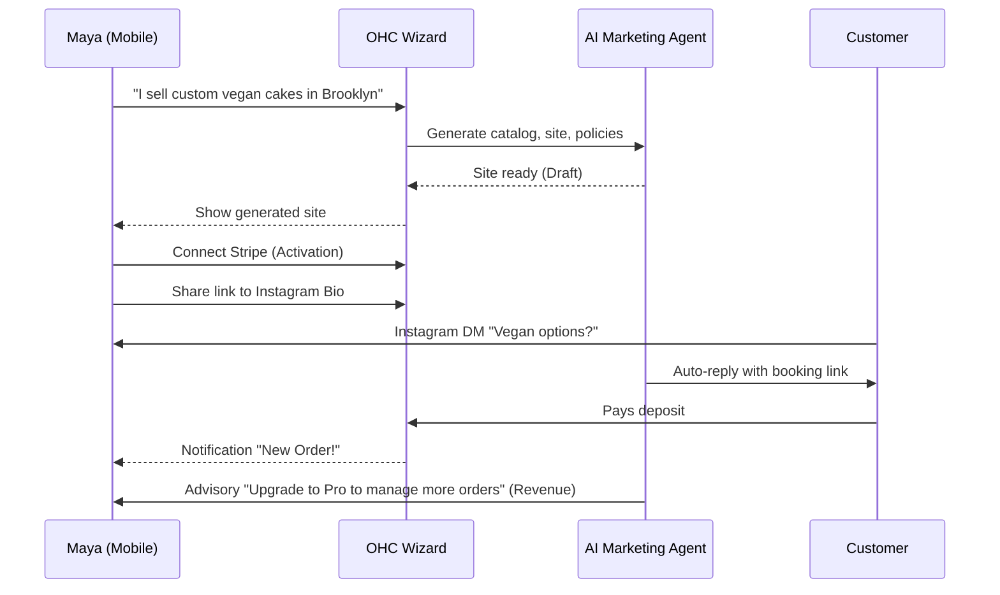
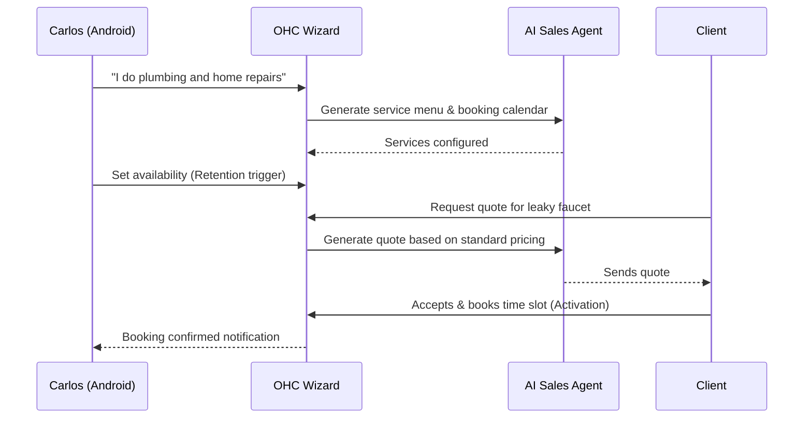
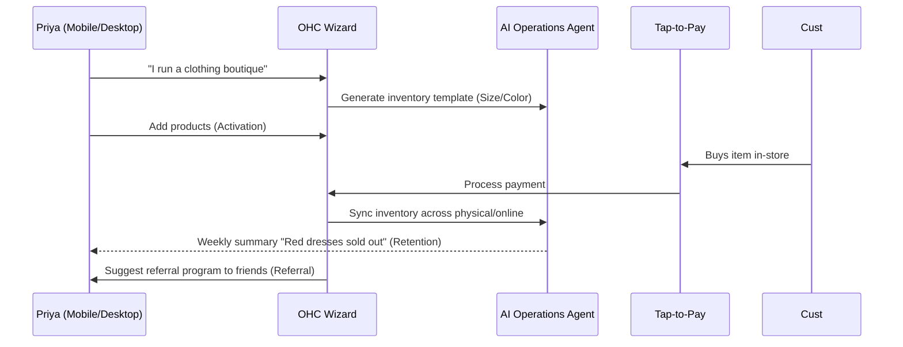
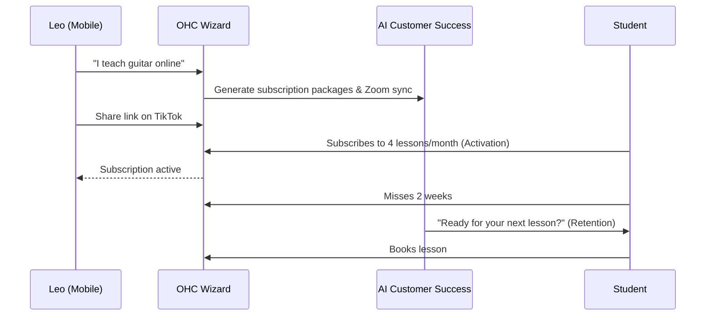
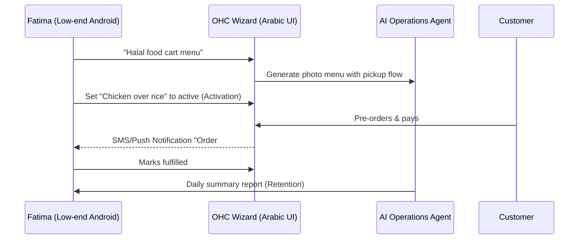

# [architecture] End-to-End Business Journey Design

## Title: Define and Implement Frictionless End-to-End Business Journeys

## Problem Statement
Small business owners (like Maya the Baker, Carlos the Handyman, and Fatima the Food Cart Operator) experience severe friction when attempting to digitize their operations. Existing platforms (Shopify, Wix, Squarespace) assume a baseline level of technical competence, desktop access, and patience for multi-step configuration (branding, payment gateways, complex catalogs). This results in high abandonment rates during onboarding. OneHumanCorp (OHC) must provide a 10-minute, mobile-first, zero-configuration journey where AI handles the heavy lifting, allowing users to go from "idea" to "live business" seamlessly. We need a unified architecture for acquisition, onboarding, activation, retention, revenue, and referral that accommodates all core personas.

## Research Report
**Findings & Competitive Analysis:**
- **Shopify:** Takes 30-60 minutes for initial setup. High friction during theme selection, shipping zone configuration, and payment gateway setup. Mobile management is clunky for initial creation.
- **Wix & Squarespace:** 20-40 minutes setup. Heavily optimized for desktop website building. "Mobile-first" is merely responsive web design, not native mobile management. Poor support for simple booking/service workflows out of the box.
- **GoDaddy:** Fast (20-40 minutes) but produces rigid, generic sites. AI is limited to basic copywriting.
- **Friction Points Identified:**
  1. *The "Blank Page" Problem:* Users freeze when asked to upload a logo or write an "About Us" page.
  2. *Complex Pricing & Inventory:* Setting up variants and tracking logic overwhelms service/food vendors.
  3. *Payment Configuration:* Dropping off when asked for complex routing numbers or API keys before they've even made a sale.
- **Opportunity:** OHC differentiates by deferring complex configuration. AI infers the business model from a single sentence ("I fix plumbing in Austin"), instantly generating the site, default services/products, and policies.

## Design Doc

### 1. AI Agent Integration Points
- **Marketing & Advertising:** Generates initial storefront and SEO metadata during the Onboarding phase.
- **Legal & Compliance:** Auto-generates Terms of Service and Privacy Policies before the first sale.
- **Business Advisory:** Drives Retention by delivering plain-language weekly insights and Revenue upgrades by identifying scaling opportunities.
- **Operations:** Streamlines Activation by seamlessly handling the first order or booking without manual inventory setup.

### 2. Architecture Diagrams (Mermaid.js)

#### Persona 1: Maya (The Home Baker)

#### Persona 2: Carlos (The Freelance Handyman)

#### Persona 3: Priya (The Boutique Owner)

#### Persona 4: Leo (The Music Tutor)

#### Persona 5: Fatima (The Food Cart Operator)

### 3. Key Friction Points Identified (And Mitigated)
1. **Mandatory Configuration:** Users will abandon if asked to configure shipping or taxes on Day 1. *Mitigation:* AI defaults to local pickup/flat-rate and standard tax profiles based on location.
2. **Analysis Paralysis on Design:** Color and font choices paralyze non-designers. *Mitigation:* Single-tap "Premium Themes" built with Glassmorphism and predefined palettes. No granular hex-code tweaking during onboarding.
3. **Empty State Syndrome:** A blank dashboard is demotivating. *Mitigation:* The dashboard immediately populates with the AI-generated site and a single clear next step (e.g., "Share your link").

### 4. UI Wireframes / Screen Flow Description (375px Base)
- **Screen 1 (Acquisition CTA):** A single large text input taking up 50% of the screen. "What do you do?" Keyboard auto-focused.
- **Screen 2 (Onboarding Loading):** "AI is building your business..." skeleton screens showing a premium blur effect (Glassmorphism) as elements pop in.
- **Screen 3 (Activation/Home):** The main dashboard. A large card at the top displaying the generated storefront preview. One primary button: "Connect Bank to Accept Payments."
- **Screen 4 (Retention/Advisory):** "Your Week at a Glance" generated by the Advisory Agent. Simple charts, plain text insights.
- **Screen 5 (Revenue Paywall):** Contextual modal (e.g., when trying to add the 11th product on the Free tier): "Your business is growing! Unlock unlimited products for $9/mo."

### 5. Mobile UX Flow Constraints
- **Touch Targets:** All primary actions (Publish, Share, Pay) are ≥ 44x44px floating action buttons or full-width bottom-anchored buttons.
- **Keyboard Optimization:** Number pads for pricing, standard layout for descriptions.
- **Low-Data Mode:** Skeleton loaders and WebP image compression for users like Fatima on slower networks.

### 6. Key Design Decisions & Why
- **Deferred Setup:** We do not ask for a logo, refund policy, or complex shipping details during onboarding. *Why:* To preserve the "under 10 minutes" promise.
- **Contextual Upgrades:** Upgrades are triggered by positive actions (adding more inventory) rather than negative gates. *Why:* Aligns OHC's revenue with the user's success.
- **Invisible AI:** We do not expose prompt engineering to the user. *Why:* Our personas (non-technical) do not understand prompts; they understand "The Manager" and "The Promoter".

## Implementation Prompt
**Prompt for Implementer Agent:**
"Implement the OHC Mobile-First Onboarding and Dashboard Flow. Create a Flutter-based setup wizard that captures a single text input ('business description') and triggers the backend `CreateTenant` gRPC endpoint. The backend should mock the AI generation process to create a default Storefront, 3 mock Products/Services, and basic Policies. Ensure the mobile UI is optimized for 375px width, uses the Premium Glassmorphism design tokens, and lands the user on a populated dashboard with a clear 'Share Link' CTA. Add at least 5 Playwright/Slint E2E tests covering the complete flow from the 'What do you do?' screen to the final dashboard. Do not prescribe specific database schemas; focus on the state management and frontend-backend interaction. Ensure all tests run green via `bazel test //...`."

## Priority
P0

## Estimated Scope
Large
