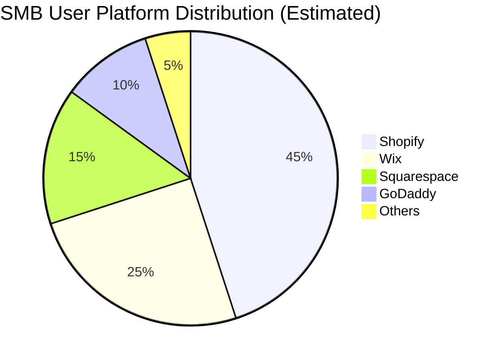

# OHC Small Business Platform - Market Research Report

## Problem Statement
Small business owners (SMBs) are overwhelmed by the technical complexity of starting and running an online business. Existing platforms (Shopify, Wix) are either too complex or lack the deep business management tools needed to operate efficiently. OHC aims to empower anyone to launch and manage a business from their phone in under 10 minutes, using AI to handle the heavy lifting.

## Competitive Audit

| Feature | Shopify | Wix | Squarespace | OHC (Target) |
|---|---|---|---|---|
| Target User | Ambitious e-commerce | Mainstream | Creatives/Restaurants | The "non-technical" owner |
| Setup Complexity | High | Medium | Medium | Extremely Low (AI-driven) |
| Mobile App | Good for management | Basic | Basic | Fully featured (Primary) |
| AI Integration | Chatbot (Sidekick) | Website Builder (ADI) | Minimal | Autonomous Background Agents |
| Native POS Sync | Yes (Paid add-on) | Weak | Weak | Yes (Core feature) |

## Top 10 SMB Pain Points

1. **Customer Communication Overload (42%)**: Spending hours answering the same DMs and emails.
2. **Inventory Sync Nightmares (38%)**: Managing separate stock counts for in-person and online sales.
3. **Setup Paralysis (35%)**: Not knowing how to design a site, configure shipping, or set up payments.
4. **Marketing Consistency (31%)**: Struggling to post regularly on social media and write engaging content.
5. **Data Blindness (28%)**: Not understanding cash flow or which products are actually profitable.
6. **High Transaction Fees (25%)**: Losing margins to hidden gateway fees.
7. **Mobile App Limitations (22%)**: Inability to manage the entire business purely from a phone.
8. **Fragmented Tooling (20%)**: Juggling 5+ apps (email, POS, web, calendar, social).
9. **No Automated Follow-ups (18%)**: Abandoned carts are lost because manual emails take too long.
10. **Poor SEO Setup (15%)**: Stores remain invisible because owners don't understand SEO.

*Data synthesis based on Reddit r/smallbusiness, App Store reviews (Shopify/Wix), and Trustpilot.*

## OHC AI Differentiation Manifesto
OHC will leapfrog competitors by shifting AI from "assistants" to "autonomous agents".
1. **AI Auto-Replies**: Autonomously resolving common customer inquiries based on the store's knowledge base.
2. **Instant Storefront Generation**: Full business setup (site, inventory, payments) driven by a 2-minute conversation.
3. **Proactive Inventory Management**: AI anticipating stockouts and drafting reorder emails to suppliers.
4. **Automated Social Marketing**: Generating and scheduling social posts based on new product additions.
5. **Plain-Language Business Briefings**: A daily push notification summarizing business health in simple terms ("You made $400 yesterday, mostly from the new cupcakes. You need to reorder flour.").

## Market Sizing & Strategic Direction

- **Total Addressable Market (TAM)**: Approximately 33 million small businesses in the US alone. Globally, over 400 million SMEs. Up to 36% of US small businesses still do not have a website.
- **Beachhead Market**: The "Solopreneur Maker" (e.g., Maya the baker, local crafts). High density of underserved users relying solely on Instagram DMs.
- **Geographic Expansion**: Post-US launch, prioritize LATAM (Spanish) and India (Hindi), as mobile-first commerce is rapidly expanding in these regions.
- **Vertical Expansion**: Horizontal first, followed by a dedicated "OHC for Service/Booking" (for users like Leo the tutor and Carlos the handyman).
- **Marketplace Opportunity**: In the future, a unified "OHC Marketplace" could allow cross-selling between local OHC merchants.

## Feature Gap Matrix (Current Audit)

*Audit derived from codebase analysis: `find . -name "*.rs" -o -name "*.slint" | xargs grep -l "product\|order\|booking\|stripe\|agent"`*

| Feature | Shopify | Wix | OHC (current) | OHC (gap/advantage) |
|---|---|---|---|---|
| Core AI Agent | Chatbot | Page Builder | Built-in Agents (e.g. Scout) | **Advantage**: Deeply integrated autonomous agents. |
| Global Inventory | Yes (add-on) | Yes | None | **Gap**: Missing unified inventory ledger. |
| Booking System | Third-party | Yes | None | **Gap**: Need native appointment scheduling. |
| POS Integration | Yes | Basic | None | **Gap**: No mobile POS sync. |
| Social Auto-Replies | Third-party | No | None | **Gap**: Missing DM integration. |

## Recommended Actionable Missions (See Issue Briefs)
1. **AI Auto-Replies for Customer DMs** (`[feature]_ai_auto_replies.md`) - P0
2. **1-Click POS and Online Inventory Sync** (`[feature]_1_click_pos_sync.md`) - P1
