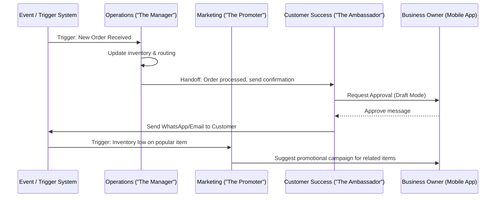

# Title: AI Agent Department Architecture

## Problem Statement
Small business owners—whether a baker, handyman, or tutor—are overwhelmed by the complexity of running a business. They don't have time to configure job queues, write email follow-ups, sync calendars, or build websites. They just want to sell their products and services. Existing software forces them to string together multiple disconnected tools or read manuals to automate their workflows. We need a system where AI agents work invisibly in the background, organized into intuitive "departments" (like "Operations" or "Customer Success") that mirror a real-world business, handling all complexity automatically without requiring technical knowledge.

## Research Report
**Market Analysis:**
- Traditional tools like Shopify, Wix, and Squarespace require users to manually install apps, configure webhooks, or set up Zapier integrations for cross-functional automation.
- Replit Agent and Claude Code target developers, not business owners.
- Small business owners understand roles ("I need someone to handle marketing" or "I need an accountant"). They do not understand "event-driven architecture" or "LLM chains."

**Findings:**
1. **Mental Models:** Framing AI agents as "Departments" or "Employees" (e.g., "The Manager", "The Promoter") lowers the cognitive barrier.
2. **Trust & Control:** Users hesitate to give AI full autonomy over money or customer communications immediately. A tiered approval system (draft-for-review vs. auto-execute) is critical.
3. **Coordination:** Real businesses have departments that communicate (e.g., Operations tells Customer Success when an order is delayed). Agents must pass context seamlessly.

## Design Doc

### Architecture Diagram

### Mobile UX Flow
1. **Department Dashboard (375px first):**
   - The user opens the app and sees "Department Status" cards.
   - Example: "Customer Success: 3 drafted replies waiting for your approval."
   - Example: "Operations: 5 orders fulfilled today."
2. **Approval Center:**
   - Swipe right to approve an AI action (e.g., "Send quote to Carlos for $150").
   - Swipe left to discard or tap to edit the draft.
   - Toggle switch on the department settings: "Auto-execute future quotes under $500."
3. **Context Visibility:**
   - When tapping into an agent's decision, the user sees a simple log: "Why did The Advisor suggest this? -> 'Sales dropped 10% this week compared to last month.'"

### Agent Integration Points
- **Operations ("The Manager"):** Triggered by order/booking events. Handles fulfillment status and inventory updates.
- **Marketing & Advertising ("The Promoter"):** Triggered by inventory events or on schedule (weekly). Proposes social posts or UI updates to the storefront.
- **Sales & Acquisition ("The Salesperson"):** Triggered by new lead forms or DMs. Generates quotes and follows up.
- **Customer Success ("The Ambassador"):** Triggered by order completion or incoming messages. Drafts replies based on memory.
- **Finance & Payments ("The Accountant"):** Triggered by payments or schedules (end of month). Generates reports.
- **Legal & Compliance ("The Protector"):** Triggered on demand or when new services are added.
- **Business Advisory ("The Advisor"):** Triggered weekly. Analyzes overall health across all departments.

### Key Design Decisions
1. **Trigger Mechanisms:** Agents are activated via three methods: Schedule (cron-like, e.g., weekly summaries), Event (e.g., webhook from payment gateway), and On-Demand (user manually asks for help).
2. **Coordination Strategy:** Agents do not call each other directly; they emit domain events to an orchestration layer that routes the context to the next relevant department, decoupling their logic.
3. **Memory Storage & Retrieval:** Each tenant has an isolated episodic memory layer. When an agent is triggered, it retrieves context relevant only to the specific customer or product involved, ensuring efficient context windows and strict data privacy.
4. **Approval Workflows:** Agents default to "Draft for Review" for any outbound customer communication or financial transaction. Users can explicitly grant "Auto-Execute" permissions per department or action type.
5. **Usage Budgeting:** AI compute is mapped to "Action Points" per tenant. High-tier plans have unlimited points, while free tiers throttle execution after a limit, gracefully falling back to manual prompts for the user.

## Implementation Prompt
**To Implementer Agent:**
Implement the core coordination and routing system for the AI Agent Departments. Create the necessary event routing mechanism that allows "The Manager" (Operations) to complete a task and emit a semantic event that "The Ambassador" (Customer Success) can listen to for follow-up actions. Ensure that actions requiring user approval (like sending a message) are placed into a "Draft Review" state accessible via the mobile UI, and that agents can retrieve multi-tenant isolated context. Provide unit tests covering the cross-department event routing, memory retrieval, and approval toggle logic. Make sure it operates reliably offline with eventual sync.

## Priority
P0

## Estimated Scope
Large
