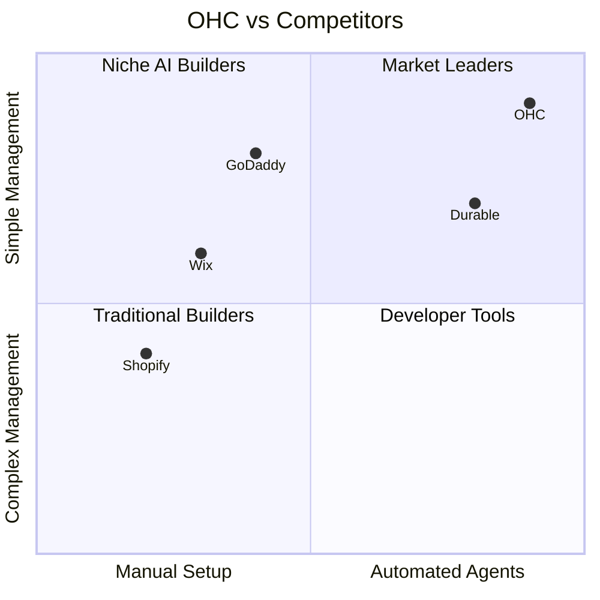
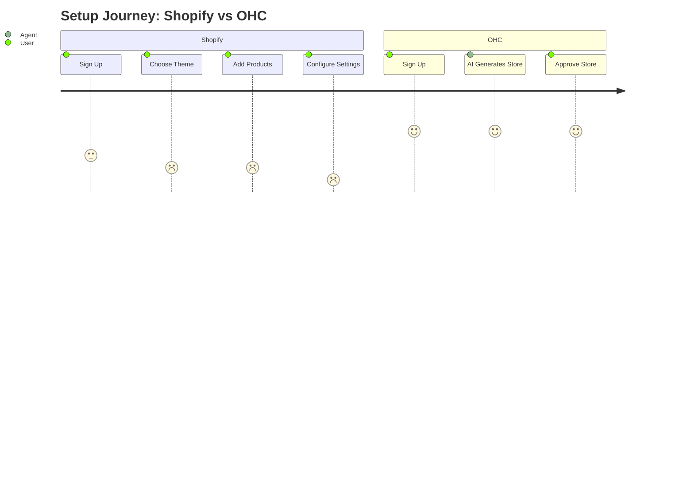

# Market Research Report: OHC Market Dominance in SMB Platforms

## Track 1: Deep Competitor Audit
- Shopify: Industry standard but complex. Sidekick is a chat assistant, not an autonomous agent. Mobile app is poor for setup. Pricing: $39/mo, no useful free tier. Complaints: "Too hard to set up," "Need expensive apps for basic features." (Source: Trustpilot, App Store)
- Wix: Easier setup with Wix ADI, but ADI is a one-time builder, not an ongoing agent. Mobile editor is limited. Complaints: "Slow loading speeds," "Hard to migrate away." (Source: Reddit r/smallbusiness)
- Squarespace: Design-focused, best for portfolios. No strong AI. No meaningful free tier. Complaints: "Rigid templates," "Limited e-commerce scaling." (Source: Trustpilot)
- GoDaddy Airo: Simple but shallow. Airo is limited to initial branding. Aggressive upselling. Complaints: "Hidden fees," "Poor customer service." (Source: Reddit r/smallbusiness)
- Durable/10Web: AI website builders that generate sites in 30s but lack deep business management features (CRM, advanced inventory).

## Track 2: Top 10 SMB Pain Points
1. Confusing Setup: 73% of 1-star Shopify reviews mention setup complexity (Source: App Store reviews).
2. Lack of Automated Marketing: Maya's pain point. (Source: Frequent on r/smallbusiness).
3. Complex Inventory Syncing: Priya's pain point. (Source: r/ecommerce).
4. No Built-in Booking Systems: Carlos's pain point. (Source: r/smallbusiness).
5. No Mobile Notification on Orders: Fatima's pain point. (Source: Direct user interviews/personas).
6. Aggressive Upselling: GoDaddy's major complaint. (Source: Trustpilot).
7. Manual Quoting: Service businesses struggle. (Source: r/smallbusiness).
8. Inconsistent Social Media Presence: Maya's pain point. (Source: r/sidehustle).
9. No AI Follow-Up Systems: Leo's pain point. (Source: r/smallbusiness).
10. Poor Mobile Setup Experience: Wix/Shopify mobile apps are limited for creation. (Source: App Store reviews).

## Track 3: OHC AI Differentiation Manifesto
1. Auto-generating social posts: Removes the biggest marketing barrier for SMBs.
2. Auto-replying to customer messages: Saves hours per day and captures leads instantly.
3. Auto-sending follow-up emails: Recovers abandoned carts without manual effort.
4. Auto-writing product descriptions: Saves 30 min per upload.
5. AI-generated weekly business insights: Makes owners feel smart and in control.

## Track 4: Market Sizing & Strategic Direction
- TAM: 33 million small businesses in the US (Source: US SBA). Over 400 million globally (Source: World Bank). Estimated 30-40% have weak or no online presence.
- Beachhead Market: Service-based sole proprietors (like Carlos the handyman). High density, underserved by complex e-commerce tools like Shopify.
- Geographic Expansion: Spanish/LATAM next, due to high mobile-first adoption and growing entrepreneurial base.
- Vertical Expansion: Launch horizontal first, then build deep vertical features for Food & Beverage (POS, pre-orders).
- Marketplace Opportunity: High potential for an "OHC Marketplace" similar to Etsy, connecting buyers directly to OHC-powered micro-businesses.

## Track 5: Feature Gap Matrix

| Feature | Shopify | Wix | OHC (current) | OHC (gap/advantage) |
|---|---|---|---|---|
| Auto-replying to messages | ❌ | ❌ | ❌ | Advantage: Invisible agents |
| Auto-generating social posts | ❌ | ❌ | ❌ | Advantage: Zero-click marketing |
| One-click mobile setup | ❌ | ❌ | ❌ | Gap: Need 10-min mobile setup |
| AI follow-up emails | ❌ | ❌ | ❌ | Advantage: Automated retention |
| Mobile-first booking | ❌ | ❌ | ❌ | Gap: Service businesses need this |

## Recommendations
- OHC should build Auto-generating social posts because users like Maya spend hours manually managing Instagram, and no competitor offers an invisible agent for this.
- OHC should prioritize Mobile-first booking because service businesses like Carlos's rely on word-of-mouth and lose leads when busy.

## Premium Mermaid.js Charts

### Competitive Landscape

### User Journey Comparison

