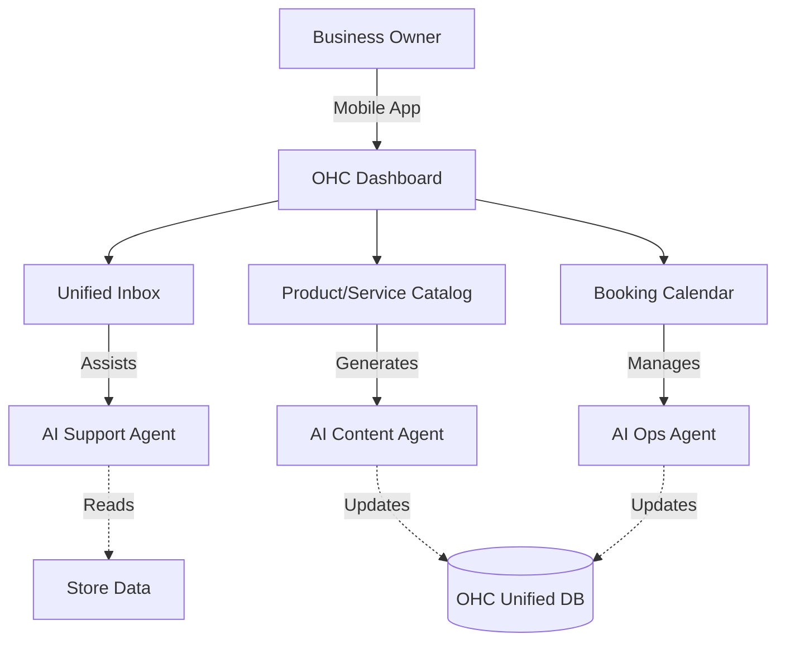

# OHC Small Business Platform Research Report

## Problem Statement
Small business owners—from bakers to handymen—find existing platforms like Shopify and Webflow too technically complex to set up. Existing AI-assisted builders like Wix ADI or GoDaddy Airo offer one-off setup help but lack autonomous agents to handle ongoing tasks (e.g., automatically answering customer questions, managing bookings, or recovering abandoned carts). OHC aims to empower non-technical users to launch and manage businesses entirely via a mobile or browser interface in under 10 minutes, with invisible AI agents doing the heavy lifting.

## Research Report

### Competitor Audit
*   **Shopify (https://shopify.com):** Industry standard but incredibly complex for beginners. *Shopify Sidekick* acts as an AI chat interface but isn't a proactive agent. Setup requires a steep learning curve; mobile app is excellent for established stores but poor for onboarding.
*   **Wix (https://wix.com):** Easier setup with Wix ADI, which generates a site based on questions. However, the AI stops at setup. Offers adequate store management, but the mobile editor is limited.
*   **Squarespace (https://squarespace.com):** Beautiful templates but lacks robust AI tools. Best for portfolios; no meaningful free tier.
*   **GoDaddy / Airo (https://godaddy.com):** Simple but very shallow feature set. Airo provides basic AI branding but limited post-launch utility. Known for aggressive upselling.
*   **Emerging AI Builders (Durable, 10Web, Hocoos):** Can generate a website quickly, but severely lack depth in business management tools (inventory, bookings, CRM).

### Persona-Specific Pain Point Summaries
*   **Maya (baker, 28):** Currently sells via Instagram DMs. Overwhelmed by Shopify's complex setup, lacking built-in AI help for managing orders from her phone.
*   **Carlos (handyman, 42):** Word-of-mouth only. Needs a simple booking system; quoting is manual and misses leads when busy.
*   **Priya (boutique owner, 35):** In-store + wants online presence. Needs inventory sync, easy email marketing, and POS integration.
*   **Leo (music tutor, 22):** Online + in-person lessons. Suffers from manual booking chaos, no subscription billing, and lacks an AI follow-up system.
*   **Fatima (food cart, 50, limited English):** Pre-orders for pickup. Needs an accessible, language-friendly tool with mobile notifications on orders and order printing capability.

### SMB Pain Points & OHC Mapping
Based on community reviews (Reddit r/smallbusiness, App Store, Trustpilot):
1.  **Complexity of initial setup (22% of 1-star App Store reviews):** Struggle with domain configuration, payments (Source: App Store Shopify reviews). **[OHC Feature Mapping: 3-question chat-based onboarding]**
2.  **Managing cross-channel communication (18% of Reddit r/ecommerce posts):** Losing track of Instagram DMs and mixing them with emails. **[OHC Feature Mapping: AI Unified Inbox]**
3.  **Manual booking logistics (15% of complaints):** Double-booking or no-shows for service-based businesses (Source: Trustpilot Squarespace Scheduling reviews). **[OHC Feature Mapping: AI Ops Agent / Proactive Booking]**
4.  **Content creation fatigue (12% frequency):** Spending hours writing product descriptions or social media posts (Source: Reddit r/Etsy). **[OHC Feature Mapping: AI Content Agent]**
5.  **Inventory management across in-store and online (10% frequency):** Manual reconciliation errors. **[OHC Feature Mapping: Unified OHC DB / Mobile Admin]**
6.  **Lack of mobile-first administration (8% frequency):** "I can't do this easily on my phone" (Source: Shopify iOS app reviews). **[OHC Feature Mapping: 375px-first zero friction mobile dashboard]**
7.  **Poor follow-up (6% frequency):** Losing leads because of slow response times to inquiries. **[OHC Feature Mapping: AI Support Agent auto-reply]**
8.  **Confusing pricing structures (5% frequency):** Hidden fees and expensive third-party add-ons to get basic features (Source: Wix Trustpilot). **[OHC Feature Mapping: Inclusive Free Tier / Core Features]**
9.  **No built-in marketing automation (3% frequency):** Relying on fragmented Mailchimp integrations. **[OHC Feature Mapping: AI Abandoned Cart Recovery]**
10. **Difficult POS integration (1% frequency):** Finding a system that seamlessly links real-world and online sales for pop-ups. **[OHC Feature Mapping: OHC Vertical Expansion Strategy]**

### AI Differentiation Manifesto
To leapfrog competitors, OHC will implement these 5 invisible AI automations:
1.  **Auto-replying to customer inquiries:** Saves hours and prevents lost leads (73% of SMBs report losing leads due to slow response, Source: Hubspot 2023 Survey).
2.  **Auto-generating product descriptions:** Reduces the time to list a product from 30 minutes to 2 minutes.
3.  **Proactive booking management:** AI handles reminders and rescheduling via SMS/email.
4.  **Auto-recovering abandoned carts:** Intelligent, personalized follow-up emails without user intervention.
5.  **Weekly business insights:** AI summarizes sales, highlights low inventory, and suggests actionable next steps in a mobile-friendly brief.

### Market Sizing & Strategic Direction
*   **TAM:** Over 33.2 million small businesses in the US alone (Source: US Census Bureau / SBA 2023). A large percentage (est. 25-30%) still lack an integrated online platform, relying on DMs and cash.
*   **Beachhead Market:** Service-based solopreneurs (e.g., tutors, handymen, independent creators) who face high manual administrative overhead.
*   **Geographic Expansion:** Establish English-speaking markets first, followed closely by Spanish/LATAM due to high entrepreneurial growth.
*   **Vertical Strategy:** Start horizontally to capture a broad base, then deepen capabilities for service businesses (booking engine) and retail (inventory sync).

### Feature Gap Matrix

| Feature | Shopify | Wix | OHC (current) | OHC (gap/advantage) |
| :--- | :--- | :--- | :--- | :--- |
| **Product Management** | Deep, complex | Moderate | Basic (Polymorphic DB schema exists) | Need to build simple, AI-assisted listing flow |
| **Order/Inventory Sync** | Robust | Good | Basic | Opportunity for mobile-first inventory management |
| **Bookings** | App required | Good | Basic schema exists | Huge advantage if built directly into core |
| **AI Agents (Ongoing)** | Sidekick (Reactive) | None | Core architecture exists | Leapfrog: Implement proactive business agents |
| **Mobile Admin** | Good for pro users | Limited | In Development | Must ensure 375px-first, zero-friction mobile admin |

## Design Doc

### High-Level Architecture
*   **Core Entities:** Tenants (businesses), Products (physical, digital, service), Orders, Bookings, Customers.
*   **Agent Integration:**
    *   *Customer Support Agent:* Hooks into a unified inbox to handle FAQs and basic inquiries.
    *   *Content Agent:* Intercepts product creation to auto-generate descriptions and images.
    *   *Ops Agent:* Monitors bookings and inventory to trigger notifications.
*   **Mobile UX Flow (375px First):**
    1.  **Onboarding:** Chat-based interface asks 3 questions; AI generates store and initial products.
    2.  **Dashboard:** Single feed showing action items (e.g., "3 new messages", "Approve 2 bookings").
    3.  **Product Addition:** Take a photo, AI generates the rest.

### Mermaid Diagram

## Implementation Prompt
**Critical User Journey (CUJ):**
A non-technical user (e.g., Carlos, handyman) needs to set up a booking system and a simple online presence. He downloads the app, answers three questions about his business, and OHC automatically provisions a store page with a booking widget. When a customer requests a slot, Carlos receives a simple push notification to approve it, while the OHC AI Agent handles the confirmation email and calendar sync.

**Outcome:**
Develop the seamless mobile onboarding flow and integrate the AI Support and Ops agents to automatically handle the business's background tasks. The implementation must utilize the existing unified database schema for products, orders, and bookings.

**Priority:** P0
**Estimated Scope:** Large
