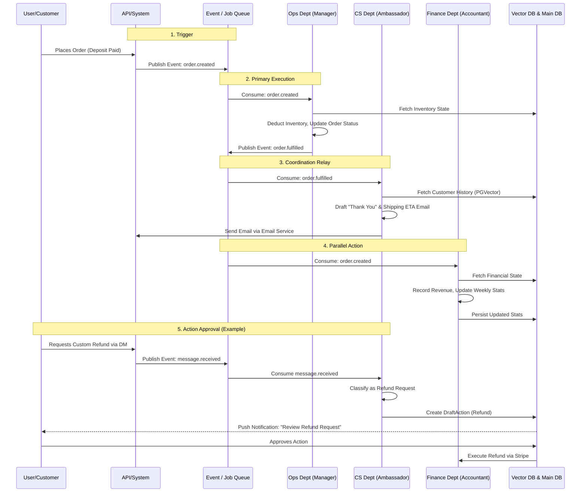

# [architecture] AI Agent Department Architecture

## Title
AI Agent Department Architecture and Coordination Strategy

## Problem Statement
Small business owners (our core users like Maya the baker, Carlos the handyman) lack the time, expertise, and resources to handle every functional aspect of their business—marketing, operations, sales, customer support, finance, and compliance. The current fragmented toolsets (Shopify, Wix, various CRMs) fail them because they require significant configuration, technical jargon, and manual coordination between apps. Our users need a "done for you" invisible workforce. We must architect the AI Agent system as a set of logical business departments that seamlessly talk to each other to accomplish multi-step processes without overwhelming the user. The primary challenge is designing the operational logic of these agents: how they are invoked, how they share context without data leaking across tenants, how they coordinate workflows autonomously, and how we protect the user and the platform from runaway agent actions (budgeting and action approval).

## Research Report
### User Needs
- **Zero Configuration:** Users want to declare goals ("I want to sell more cakes") or handle events ("I got a booking") without managing pipelines.
- **Explainability:** When an agent takes an action (e.g., sends an email or adjusts an inventory count), the business owner needs a plain-language summary of what happened and why.
- **Control & Trust:** Users need to feel in control of critical decisions (e.g., financial transactions, legal terms) but trust the AI to handle rote tasks (e.g., FAQ replies).

### Competitive Analysis
- **Shopify:** Offers Sidekick (a chatbot assistant), but it is a reactive chat UI, not an invisible autonomous background worker handling full business operations.
- **Wix:** AI is used primarily for initial site generation, lacking ongoing functional department capabilities.
- **Replit Agent/Claude Code:** Developer-focused, highly technical, and explicitly visible tools rather than invisible infrastructure serving a non-technical end user.
- **OHC Distinction:** OHC's approach shifts from "Agent as Chatbot" to "Agent as Infrastructure." Our AI Departments act like a real-world staff, coordinating via shared context and distributed locks.

### Core Architecture Capabilities Required
1. **Event-Driven Invocation:** Agents must wake up based on system events (e.g., webhook from Stripe, new order in DB, time-based schedule).
2. **Context Sharing (Memory):** Agents need to recall past interactions with specific customers and the general state of the business securely, using PGVector without cross-tenant pollution.
3. **Coordination (The Handoff):** An event often requires multiple departments. (e.g., New Order -> Operations processes fulfillment -> Finance records transaction -> Customer Success sends thank you).
4. **Approval Flow (Human-in-the-Loop):** A unified mechanism to draft critical actions for user review before execution.
5. **Usage & Rate Limiting:** Prevent infinite loops and manage AI costs via tenant-level budgets.

## Design Doc

### Core Concepts

#### 1. The Departments
The system is divided into functional departments:
- **Operations ("The Manager"):** Order and booking fulfillment, inventory tracking.
- **Marketing & Advertising ("The Promoter"):** Website design, SEO, social media, promos.
- **Sales & Acquisition ("The Salesperson"):** Quotes, lead follow-up.
- **Customer Success ("The Ambassador"):** Messaging, review requests, post-sale engagement.
- **Finance & Payments ("The Accountant"):** Payments processing, financial reporting.
- **Legal & Compliance ("The Protector"):** Contracts, TOS, compliance tracking.
- **Business Advisory ("The Advisor"):** Analytics, health reports, recommendations.

#### 2. Trigger Mechanisms
Agents are invoked via three primary triggers:
- **Event Triggers:** Woken up by the distributed Job Queue when a specific domain event occurs (e.g., `order.created`, `message.received`).
- **Schedule Triggers:** Cron-like jobs that trigger periodic reviews (e.g., daily inventory check, weekly advisory report generation).
- **On-Demand Triggers:** Synchronous invocation via user action in the mobile/web app (e.g., "Draft an email to Priya").

#### 3. Agent Coordination (The Relay)
To avoid agents stepping on each other's toes, we utilize an event-driven relay architecture.
- When an agent completes a significant milestone, it emits a domain event to the unified Job Queue.
- Subscribing departments consume these events.
- Distributed Locks (Redis Redlock) ensure that if two agents try to modify the same resource (e.g., the same order record), they queue gracefully.

#### 4. Memory & Context Retrieval
Each tenant maintains a partitioned Vector Database (PGVector).
- When an agent is triggered, it performs a similarity search in the Vector DB scoped strictly to its `tenant_id` to retrieve relevant past interactions, business context, and customer history.
- The retrieved context, combined with the event payload and the department's system prompt, forms the LLM context window.

#### 5. Action Approval (Draft vs. Auto-Execute)
Agents generate `Actions`. Actions are classified into two tiers:
- **Auto-Execute:** Safe actions (e.g., marking low stock, drafting an internal report) execute immediately.
- **Draft-for-Review:** Critical actions (e.g., sending an invoice, refunding a customer, changing legal terms) generate a `DraftAction` record. The user receives a push notification on their mobile device to "Approve", "Edit", or "Reject".

#### 6. Usage & Budgeting
- Every LLM invocation and token usage is metered and attached to the `tenant_id`.
- The system enforces a daily/monthly budget limit based on the user's SaaS tier.
- If a tenant approaches their limit, the system gracefully degrades by delaying non-critical background tasks (e.g., SEO re-indexing) and prioritizing critical ones (e.g., Customer Success replies).

### Architecture Diagram

## Implementation Prompt

**Role:** Implementer Agent (Backend / AI Infrastructure)

**Task:** Implement the core infrastructure for the AI Agent Department Architecture.

**User Journey & Outcomes:**
1. The system must provide an event listener interface that allows different AI "Departments" to subscribe to domain events (e.g., `order.created`, `customer.messaged`).
2. Implement a mechanism for agents to retrieve historical context safely. The retrieval process must strictly isolate data by `tenant_id` to prevent cross-tenant leakage.
3. Build the "Action Approval" pipeline. When an agent determines an action requires human review, it should not execute the action immediately. Instead, it must create a pending action state that can be surfaced to the frontend for user approval.
4. Implement a token tracking and budgeting interceptor that records usage per `tenant_id` and can halt agent execution if limits are exceeded.

**Acceptance Criteria:**
- The event relay mechanism handles asynchronous agent triggers reliably, utilizing distributed locks to prevent race conditions on shared resources.
- Context retrieval is verified to be tenant-isolated.
- The action approval flow correctly stalls execution until an explicit "approve" signal is received.
- Token usage is metered per tenant.
- E2E tests are provided demonstrating a multi-department handoff (e.g., an event triggers the Ops agent, which in turn triggers the CS agent) using mocked LLM responses.

*Note: Do not define specific database schemas, exact API endpoints, or function signatures. Focus on building the architectural components that fulfill these behavioral requirements.*

## Priority
P0 (Critical)

## Estimated Scope
Large