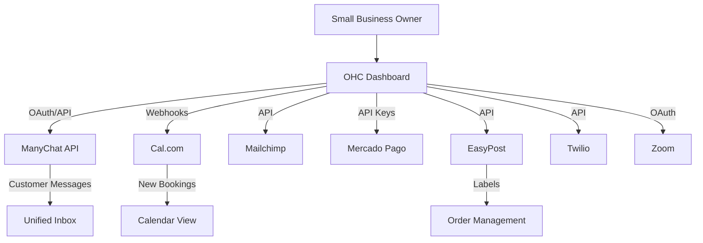

# OHC Tool Integration Research Report
## Q4 Integrations Scout Review

### Executive Summary
This report evaluates 7 critical integration categories aimed at solving day-to-day operational problems for small business owners using One Human Corp (OHC). The selected tools abstract technical complexity, allowing business owners to focus on growth and customer satisfaction. All tools evaluated are compatible with both Cloud (multi-tenant) and Standalone local environments.

### Tool Comparison Matrix

| Category | Recommended Tool | Core Benefit for Business Owner | Ease of Use | Estimated Cost | Mode Compatibility |
|----------|------------------|---------------------------------|-------------|----------------|--------------------|
| Social Media | ManyChat | Unified inbox for IG, FB, WhatsApp | High | $15/mo | Cloud / Standalone |
| Calendar | Cal.com | Zero-friction appointment booking | High | Free - $12/mo | Cloud / Standalone |
| Email Marketing | Mailchimp | Professional newsletters & sync | High | Free - $13/mo | Cloud / Standalone |
| Payments | Mercado Pago | Local LATAM payment methods | Medium | Transaction % | Cloud / Standalone |
| Shipping | EasyPost | One-click rate comparison & labels | High | Pay per postage | Cloud / Standalone |
| SMS | Twilio | Reliable customer notifications | Medium | Pay per message | Cloud / Standalone |
| Video | Zoom | Automatic meeting link generation | High | Free - $15/mo | Cloud / Standalone |

### Architectural Integration Flow

### Strategic Recommendations
1. **Prioritize ManyChat and Cal.com (P1):** A unified inbox and automated scheduling solve immediate time-drains for service-based businesses.
2. **Implement EasyPost for E-commerce (P1):** Manual shipping calculations are highly error-prone; automating this is a massive value-add.
3. **Use OAuth wherever possible:** Business owners struggle with API keys. For tools like Zoom and Mailchimp, a one-click OAuth flow is strictly required for an optimal UX.
