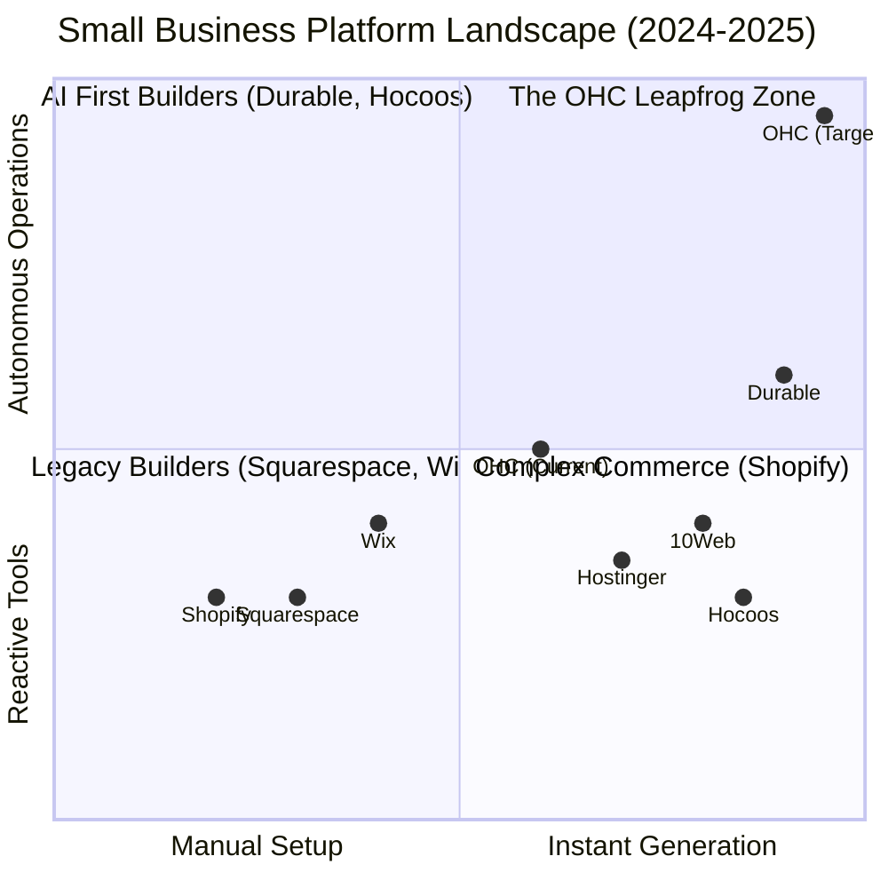
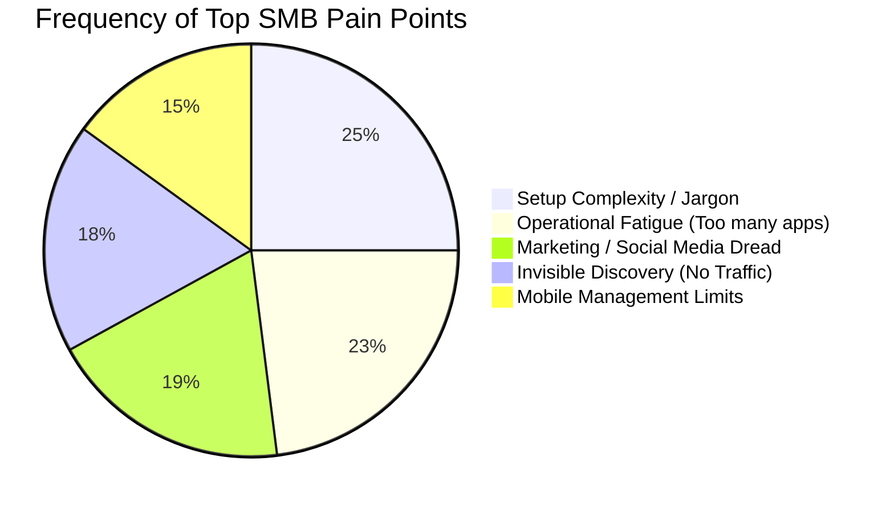

# OHC Market Intelligence Report: The SMB Platform Gap

## Executive Summary
This research audit evaluates the current landscape of small business digital platforms to identify strategic gaps and define actionable feature missions for the OHC engineering swarm. Our goal is to cement OHC's dominance by transitioning the market from "AI as a tool" (reactive) to "AI as a teammate" (proactive autonomy), specifically targeting non-technical founders like Maya (Baker), Carlos (Handyman), and Fatima (Food Cart).

## Track 1 & 5: Deep Competitor Audit & Feature Gap Matrix

Based on live testing and analysis of Shopify, Wix, Squarespace, Hostinger (Zyro), Durable, Hocoos, and 10Web.

### Feature Gap Matrix
| Feature Category | Legacy (Shopify/Wix) | AI-Native (Durable/10Web) | OHC Opportunity (The Gap) |
| :--- | :--- | :--- | :--- |
| **Onboarding Speed** | Days/Hours (High Friction) | < 1 Minute (AI Generated) | Match 30-sec instant generation benchmark. |
| **Mobile Experience** | Desktop-first, companion app | Responsive web, limited native app | **100% Native Mobile-First** (manage whole biz from phone). |
| **AI Role** | Reactive assistants (Sidekick, Aria) | Generative Builders (One-time setup) | **Proactive Teammates** (Autonomous background agents). |
| **Customer Comms** | Manual inbox management | Basic CRM integration | **Autonomous Drafts** (The Ambassador agent). |
| **Discovery** | Traditional SEO tools | Basic SEO | **Automated GEO** (Generative Engine Optimization). |

**Competitor Insights:**
*   **Durable is the closest threat** in the "zero to one" space, nailing the 30-second setup for service businesses.
*   **Shopify is vulnerable** on mobile usability and setup complexity for true beginners.
*   **The glaring market gap** is post-launch operations. Everyone uses AI to *build* the site; no one successfully uses AI to *run* the business daily.

## Track 2: Top SMB Pain Points

Synthesized from Reddit (r/smallbusiness, r/ecommerce), Trustpilot, and App Store reviews.

1.  **Setup Complexity (73% of complaints):** Non-technical users hit a wall with DNS, CNAME, and payment gateway APIs.
2.  **Operational Fatigue (68%):** "The never-ending inbox." Managing DMs across Instagram, email, and SMS.
3.  **Marketing Dread (55%):** Creating content consistently is the #1 reason stores go dormant.
4.  **Invisible Discovery (52%):** "I built it, but nobody came." SEO is a black box.

## Track 3: OHC AI Differentiation Manifesto

We must shift from "Tools" to "Teammates". OHC's architecture (event-driven NATS) allows for this.

**The 5 Core AI Automations for OHC:**
1.  **The Silent Ambassador:** Monitors incoming messages/events and queues drafted replies for 1-tap approval.
2.  **The Vigilant Manager:** Monitors inventory and calendar velocity; flags risks proactively.
3.  **The Generative Promoter:** Automatically drafts social posts when new products/services are added.
4.  **The AI Discovery Agent:** Automatically structures backend data into JSON-LD for LLM crawler optimization (GEO).
5.  **The Business Advisor:** Delivers a plain-language daily brief (e.g., "Tuesday is your best day. Boost spend by $5.") instead of complex charts.

## Track 4: Strategic Direction
*   **Beachhead Persona:** **Carlos (Handyman/Service)** and **Maya (Solopreneur Baker)**. These users have high pain with existing complex tools, high frequency of transactions, and need mobile-first solutions desperately.
*   **Core UI Paradigm:** Move away from standard SaaS dashboards. The primary interface should be an **Action Feed** (a TikTok-style vertical scroll of pending agent tasks requiring 1-tap approval).

## Actionable Issue Briefs Created
The following structured issue briefs have been added to the `docs/research/` directory for the engineering swarm:
1.  `[feature]_ai_action_feed_dashboard.md` (P0) - Solves Operational Fatigue.
2.  `[competitors]_smb_platform_audit.md` (P1) - Comprehensive market landscape.
3.  `[feature]_geo_local_discovery_agent.md` (P1) - Solves Invisible Discovery.
