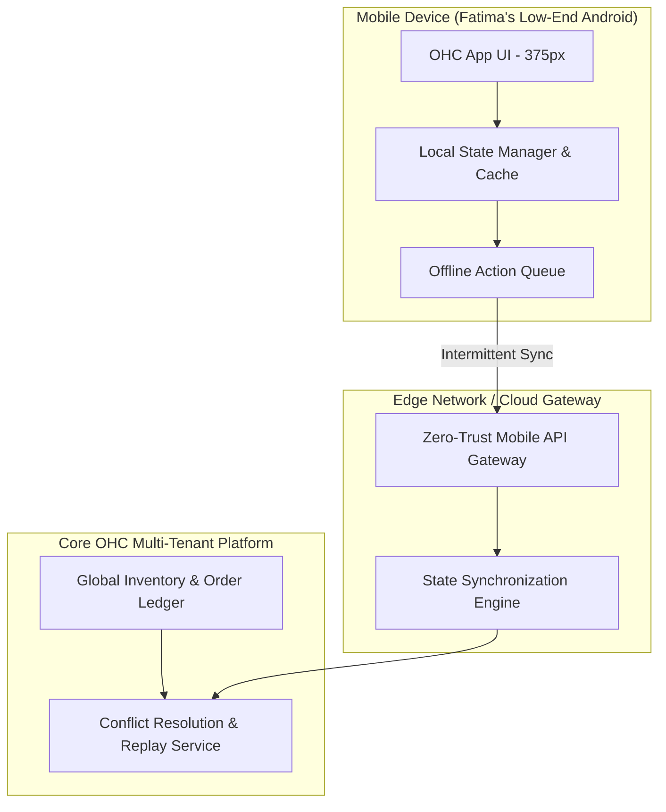

# [Feature] Offline-First Edge-Synchronized State Engine

## Title
Offline-First Edge-Synchronized State Engine

## Problem Statement
Fatima (Food cart, 50, limited English) operates her food cart in areas with patchy cellular service. When she receives a pre-order, the notification must reach her phone immediately, and any updates she makes (e.g., marking an item as sold out) must be captured instantly, regardless of her current signal strength. Currently, the lack of robust offline support means she might miss orders or double-sell items when her connection drops. The system needs an "Offline-First Edge-Synchronized State Engine" that allows Fatima to operate continuously, capturing all state changes locally and reconciling them seamlessly with the global multi-tenant ledger once network connectivity is restored. This applies universally across OneHumanCorp to ensure that all business personas (Maya, Carlos, Priya, Leo) never experience operational failure due to network issues.

## Research Report
- **The Status Quo:** E-commerce platforms like Shopify and Wix are heavily reliant on continuous internet connectivity. Their POS systems offer limited offline capabilities, often restricted to simple cash transactions without real-time inventory synchronization.
- **The OHC Differentiator:** OHC's commitment to "zero-config, invisible management" demands that network state should be invisible to the user. Fatima should just tap "sold out" on her 375px screen, and the system handles the complexities of offline queuing and eventual consistency.
- **Architectural Gap Discovered:** There is currently a deficiency in OHC's state management for ensuring offline-first capabilities. The local device state and the global multi-tenant database lack a resilient, edge-synchronized queueing and reconciliation layer that functions seamlessly across intermittent network connections.
- **Competitor Analysis:** Square offers basic offline payments but struggles with complex, multi-location inventory syncing under offline constraints. OHC can outmaneuver by deeply embedding an offline-first event mesh (e.g., via NATS Leaf Nodes or robust local SQLite caching).

## Design Doc

### Architecture Diagram

### Mobile UX Flow
- **Offline Indicator:** A subtle, non-intrusive indicator (e.g., a small grey cloud icon) appears on the dashboard when offline.
- **Optimistic Updates:** When Fatima taps "Sold Out" for her Falafel platter, the UI updates instantly. The action is securely queued locally.
- **Background Sync:** Once the device regains a connection, the `Offline Action Queue` silently flushes the events to the `State Synchronization Engine`.
- **Conflict Handling:** If a conflict occurs (e.g., an online order was placed simultaneously), the AI Operations Agent automatically resolves it based on predefined business logic (e.g., prioritizing physical, in-person actions) and notifies Fatima only if absolutely necessary via a plain-language audio or text alert.

### Key Design Decisions
- **Offline-First Paradigm:** All user actions modify local state first, treating the cloud as an eventual consistency target.
- **CRDTs or Action Queues:** The synchronization engine will utilize deterministic conflict resolution (such as CRDTs or strict timestamp-based event replays) to ensure data integrity without user intervention.
- **Zero-Trust Security:** Local state and action queues must be encrypted at rest on the device, ensuring multi-tenant isolation even if the physical device is compromised.
- **Performance Targets:** Local UI updates must occur in < 50ms. Sync payload sizes must be minimized to support low-bandwidth connections.

## Implementation Prompt
**For the Implementer Agent:**
Implement the "Offline-First Edge-Synchronized State Engine". The goal is to ensure that mobile users like Fatima can continue to operate their business (manage orders, update inventory) when their device loses network connectivity.
1. Build the local action queue and state cache that optimistic updates the UI instantly.
2. Develop the background synchronization service that reliably flushes the local queue to the backend once connectivity is restored.
3. Implement the conflict resolution logic on the backend to handle discrepancies between local and global state (e.g., using Last-Writer-Wins or specific business rules).
Ensure all components adhere to strict Zero-Trust security and are fully functional on a 375px mobile viewport.

## Priority
P0

## Estimated Scope
Large
