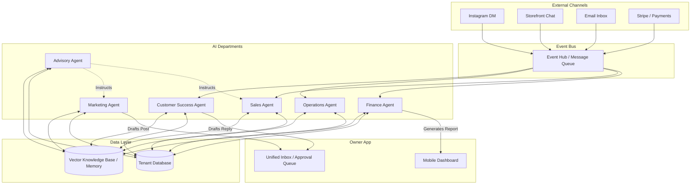

# AI Agent Department Architecture

## Problem Statement
Small business owners—from bakers to mechanics—are overwhelmed by the operational complexity of running their businesses. While building the storefront is often simplified by platforms like Shopify or Wix, the day-to-day operations—marketing, customer service, booking, follow-ups, and financial reporting—still require manual effort, technical savvy, or hiring external help. A typical owner needs to monitor Instagram DMs, update inventory, manually email past clients, and generate financial summaries, often doing this late at night. They need these operations handled invisibly and automatically by an accessible, understandable system.

## Research Report
### Competitor Analysis
- **Shopify**: Offers "Shopify Magic" (AI-generated product descriptions, suggested replies in inbox), but it requires the user to actively click and use the AI. It is a set of assistive tools rather than an autonomous employee.
- **Wix**: Provides an AI website builder and some AI text generation for SEO/blogs. It does not actively manage the business post-launch.
- **Squarespace**: Similar to Wix, heavily focused on design and content generation, but lacks autonomous business logic (e.g., automatically following up on abandoned carts via personalized AI).

### Gap in the Market
Existing platforms treat AI as a *tool* the owner must wield. OneHumanCorp (OHC) treats AI as an *invisible employee*. OHC's unique value proposition is shifting from "assisted management" to "autonomous execution." Small business owners understand roles ("The Accountant", "The Salesperson") much better than they understand tools ("Generative Text Module", "Automated Flow Builder").

### Key Findings
1. Users need AI categorized into distinct, understandable "Departments" (personas).
2. Users need to be able to "hire" or enable a department with a single tap.
3. AI actions must have distinct trust levels: Draft for Approval vs. Auto-Execute.
4. Departments need shared memory to ensure the "Customer Success" agent knows what the "Operations" agent did.

## Design Doc

### Department Roles and Triggers
The AI ecosystem is divided into departments that mirror a real business:

1. **Operations ("The Manager")**
   - *Triggers*: Order placed, booking requested, inventory low.
   - *Actions*: Updates inventory levels, approves standard bookings, flags low stock, processes standard refunds according to policy.
2. **Marketing & Advertising ("The Promoter")**
   - *Triggers*: Scheduled (weekly), new product added, seasonal events.
   - *Actions*: Drafts social media posts, creates promotional discount codes, designs link-in-bio updates.
3. **Sales & Acquisition ("The Salesperson")**
   - *Triggers*: New lead inquiry, cart abandoned, quote requested.
   - *Actions*: Generates price quotes based on pricing rules, sends follow-up messages to warm leads.
4. **Customer Success ("The Ambassador")**
   - *Triggers*: Message received (Instagram DM, email, chat), order delivered.
   - *Actions*: Replies to FAQs (e.g., "Do you do vegan cakes?"), sends review requests 3 days post-delivery.
5. **Finance & Payments ("The Accountant")**
   - *Triggers*: Scheduled (monthly), large payment received, tax season.
   - *Actions*: Generates monthly revenue summaries, categorizes expenses, highlights outstanding invoices.
6. **Legal & Compliance ("The Protector")**
   - *Triggers*: New regulation detected, custom order requires contract.
   - *Actions*: Drafts custom liability waivers for services, ensures GDPR cookie banner is active.
7. **Business Advisory ("The Advisor")**
   - *Triggers*: Scheduled (weekly health check).
   - *Actions*: Analyzes cross-department data to suggest actions (e.g., "Sales of vegan cakes are up 20%, let's have The Promoter run a campaign next week.").

### Architecture Diagram

### Shared Context & Memory
- All agents read from and write to a shared Vector Knowledge Base (VDB) partitioned strictly by `tenant_id`.
- The VDB contains business facts (e.g., "We use oat milk for vegan options"), past customer interactions, and brand voice guidelines.
- Before an agent acts, it queries the VDB to ensure consistency (e.g., The Ambassador checks if Operations already refunded an order before apologizing for a delay).

### Trust & Approval Flow
- Each agent action has a default trust level: `Auto-Execute` or `Draft-for-Review`.
- Example: "Customer Success replying to hours of operation" is `Auto-Execute`.
- Example: "Salesperson issuing a $500 custom quote" is `Draft-for-Review`.
- Drafts appear in a Unified Inbox on the mobile app, where the owner can swipe right to approve, or tap to edit.

### Tenant Isolation and Throttling
- Every event and query is injected with `tenant_id`.
- Actions are metered against the SaaS Tier (e.g., Free tier = 100 AI actions/mo).
- Once a threshold is reached (80%), The Advisor sends a push notification suggesting an upgrade to maintain autonomous operations.

## Implementation Prompt

**Task for Implementer:**
Implement the core "AI Department" orchestration framework for OneHumanCorp.

1. Create the base entity models/structs for an "Agent/Department" and an "Agent Action".
2. Implement an event-listening loop that routes incoming events (e.g., `MessageReceived`, `OrderPlaced`) to the subscribed AI Departments for a specific tenant.
3. Build the "Trust Flow" logic: when a department produces an action, if the action is marked as `Draft-for-Review`, it must be saved to an approval queue rather than executed immediately.
4. Ensure all database queries and event routing strictly enforce `tenant_id` isolation.
5. Provide a mock implementation of the "Customer Success" department handling a `MessageReceived` event, producing a draft reply for the owner's inbox.

**Acceptance Criteria:**
- The event router successfully routes a `MessageReceived` event to the "Customer Success" department.
- The department generates an action with status `Draft`.
- The action is saved to the database associated with the correct `tenant_id` and is not executed.
- All code must be strictly filtered by `tenant_id`.
- Mobile UX assumptions: The resulting drafts must be easily queryable via an API endpoint that a mobile frontend would use to display the approval inbox.

## Priority
P0

## Estimated Scope
Medium
