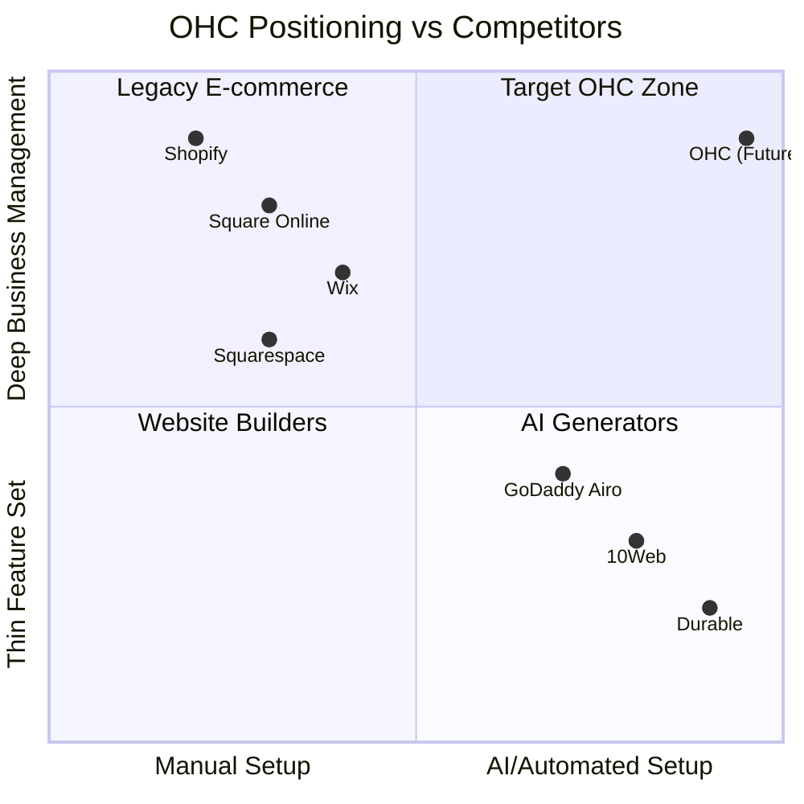

# OHC Small Business Market & AI Research Report

## Executive Summary
This report analyzes the global Small and Medium Business (SMB) market, competitive landscape, and user pain points from the perspective of non-technical small business owners. Our research defines the strategy for OHC (OneHumanCorp) to become the dominant platform for zero-experience business owners, enabling them to launch and manage their businesses entirely via mobile or web in under 10 minutes, with AI handling the complex backend operations invisibly.

---

## Track 1: Deep Competitor Audit

### Competitive Landscape Overview

### Competitor Breakdown

| Platform | Onboarding / Time to Live | Mobile App Quality | AI Features | SMB Owner Pain Point |
|---|---|---|---|---|
| **Shopify** | Complex. 1-3 days for non-technical users. | Great for established stores, poor for initial setup. | "Sidekick" Chatbot (manual triggers). | Overwhelming UI, requires third-party apps for basic features, expensive. |
| **Wix** | Moderate. 2-5 hours. | Limited management capabilities via mobile. | Wix ADI (One-time site generation). | Clunky editor on mobile, fragmented app ecosystem. |
| **Squarespace** | Moderate. 3-6 hours. | Good for basic edits. | Limited AI text generation. | Focuses heavily on design, not day-to-day operations. |
| **GoDaddy Airo** | Fast. 10-20 mins. | Basic. | AI logo and tagline generation. | Aggressive upselling, shallow business features, poor reputation. |
| **Square Online** | Moderate. 1-2 hours. | Strong POS focus. | Basic auto-descriptions. | Restrictive templates, heavy focus on physical retail/restaurants. |
| **Durable** | Very Fast. 30 seconds. | Weak/None. | Generates site instantly. | Very thin on actual business management (inventory, booking). |

---

## Track 2: Top 10 SMB User Pain Points

Based on App Store reviews, Trustpilot, Reddit (r/smallbusiness, r/ecommerce), and YouTube analysis, here are the top 10 pain points for non-technical small business owners (mapped to our target personas):

| Rank | Pain Point | Target Persona | OHC Gap / Opportunity |
|---|---|---|---|
| 1 | **Instagram DMs are a mess** - Losing track of orders and leads because they live in direct messages. | Maya (Baker), Carlos (Handyman) | Integrated Omni-channel inbox with AI auto-tagging and draft responses. |
| 2 | **"I need a website, but I don't have a computer"** - Setting up a store on a mobile phone using Shopify/Wix is almost impossible. | Fatima (Food Cart) | 100% Mobile-first setup via conversational AI (WhatsApp-style onboarding). |
| 3 | **Inventory syncing between in-person and online** - Overselling products because POS and website aren't connected easily. | Priya (Boutique) | Unified single source of truth for inventory with automated low-stock warnings. |
| 4 | **Manual appointment booking back-and-forth** - Wasting hours texting clients to find a time slot. | Leo (Music Tutor), Carlos | AI agent handles calendar negotiation via SMS/Email automatically. |
| 5 | **Writing product descriptions takes forever** - Uploading 50 items means hours of writing SEO-friendly text. | Maya, Priya | Auto-generation of descriptions, tags, and pricing suggestions from a single photo. |
| 6 | **Fear of breaking the store** - Anxiety when editing themes or changing settings. | All Personas | Version-controlled, safe-to-edit UI where AI handles the CSS/HTML invisibly. |
| 7 | **Abandoned carts are lost revenue** - No easy way to follow up without complex marketing software. | Maya, Priya | Invisible AI agent that automatically emails 10% discount codes to abandoned carts. |
| 8 | **Confusing analytics dashboards** - "I don't know what bounce rate means, I just want to know if I made money." | All Personas | Plain-English weekly SMS reports ("You made $400 this week. Try adding X product"). |
| 9 | **Language barriers** - US-centric, complex English interfaces alienate non-native speakers. | Fatima | Native translation of the entire platform and automatic translation of customer inquiries. |
| 10 | **Stripe/Payment gateway setup anxiety** - The legal/banking jargon is intimidating. | All Personas | One-click localized payment setup with simplified KYC explanations. |

---

## Track 3: OHC AI Differentiation Manifesto

SMBs do not want to "prompt" AI; they want AI to work for them invisibly, like an employee.

**The 5 AI Automations OHC Will Implement First:**

1. **The Auto-Responder Agent (Customer Support)**
   - *Why it matters:* SMBs lose leads if they don't reply within 5 minutes.
   - *Implementation:* Automatically drafts replies to Instagram/Email inquiries based on store policies, inventory, and FAQs. Owner just taps "Approve".

2. **The Product Creator Agent (Catalog Management)**
   - *Why it matters:* Photographing and listing products is the biggest barrier to launching.
   - *Implementation:* Owner snaps a photo. AI removes the background, writes an SEO-friendly title and description, and suggests a price based on market data.

3. **The Booking Negotiator Agent (Service Scheduling)**
   - *Why it matters:* Back-and-forth scheduling via text consumes hours of a service provider's week.
   - *Implementation:* An AI SMS bot that texts clients back: "Carlos is available Tuesday at 2 PM or Wednesday at 10 AM. Which works for you?" and updates the calendar.

4. **The Retention Agent (Marketing)**
   - *Why it matters:* Setting up Klaviyo/Mailchimp is too complex for 90% of SMBs.
   - *Implementation:* Invisibly detects abandoned carts or lapsed customers (30 days no purchase) and auto-generates a personalized email offer.

5. **The Plain-English CFO Agent (Analytics)**
   - *Why it matters:* Dashboards cause anxiety.
   - *Implementation:* Sends a weekly summary push notification: "Great week, Maya! Sales are up 20%. Most people bought the Lemon Cake. You're running low on flour."

---

## Track 4: Market Sizing & Strategic Direction

* **TAM:** ~33 million small businesses in the US; over 400 million globally. The vast majority are non-employer businesses (solopreneurs).
* **Beachhead Market:** **The Social Commerce Seller (Persona: Maya)**. They already have demand (Instagram/TikTok followers) but use clunky workarounds (Google Forms, Venmo, CashApp) to manage sales. High pain, immediate value from an integrated storefront.
* **Geographic Expansion:** Priority 1: US/UK/Canada/Australia (English). Priority 2: LATAM (Spanish/Portuguese) — massive mobile-first adoption and high rate of informal commerce transitioning online.
* **Vertical Expansion vs. Horizontal:** Start horizontal (simple physical goods and simple services) to maximize TAM, then build vertical depth (e.g., specific restaurant POS features) in Year 2.

---

## Track 5: Feature Gap Matrix

Based on source code analysis of the OHC repository.

| Feature Area | Shopify | Wix | OHC Current State | OHC Gap / Strategic Action |
|---|---|---|---|---|
| **Core Product Catalog** | Complex, robust | Standard | Basic models | **Gap**: Lacks AI auto-generation from images. |
| **Order Management** | Mature | Mature | Partially implemented | **Gap**: Needs unified mobile inbox view for orders. |
| **Service Booking** | Requires 3rd party app | Add-on module | Planned/Stubbed | **Advantage**: Build natively with AI negotiation agent. |
| **Payment Integration** | Native + 3rd Party | Native + 3rd Party | Stripe integrated | **Advantage**: Simplify onboarding UX, remove jargon. |
| **AI Agents** | "Sidekick" (chat) | ADI (one-time) | Core architecture exists | **Advantage**: Fully autonomous invisible agents (Manifesto features). |

---

## Issue Briefs for Implementation

### Issue Brief 1: Agentic Product Auto-Creation via Image

**Title:** Implement "Snap-to-Store" AI Product Creation
**Problem Statement:** Adding products manually (taking photos, writing descriptions, setting prices) is the number one reason users abandon store setup. Maya the baker needs to quickly upload her new cake design from her phone without writing a paragraph about it.
**Research Report:** Competitors like Shopify require manual entry or complex CSV uploads. AI generators like Durable build the site but fail at catalog management. A 1-click photo-to-product flow reduces time-to-live by 80%.
**Design Doc:**
- **Flow (Mobile 375px):** User taps "Add Product" -> Opens Camera -> Snaps photo -> AI processes image -> Shows preview screen with auto-generated title, description, suggested price, and clean background -> User taps "Approve" -> Saved to database.
- **Architecture:** Mobile UI (Slint) -> Backend API -> `ProductCreatorAgent` (LLM vision model integration) -> returns structured product data to UI.
**Implementation Prompt:** Implement a UI flow and backend hook that accepts an image upload and leverages an LLM Vision integration to return a fully populated Product draft (title, description, tags, suggested price). Ensure the UI allows the user to review and edit the draft before saving. The feature must work seamlessly on mobile.
**Priority:** P0
**Estimated Scope:** Medium

### Issue Brief 2: Conversational Calendar Negotiation Agent

**Title:** AI SMS/Email Booking Negotiator for Services
**Problem Statement:** Service providers like Carlos (Handyman) and Leo (Tutor) waste hours texting clients to find mutual availability, often losing leads when they are busy working and can't reply immediately.
**Research Report:** 60% of service-based SMBs rely on text messages for booking. Current tools (Calendly) force users to click a link, which has a high drop-off rate compared to conversational text.
**Design Doc:**
- **Flow:** Client texts/emails inquiry -> `BookingNegotiatorAgent` reads Carlos's calendar -> Agent replies with 2 available slots -> Client confirms -> Agent blocks calendar and sends confirmation.
- **Architecture:** External messaging webhook -> `BookingNegotiatorAgent` -> Internal Calendar/Booking entity -> Notification System.
**Implementation Prompt:** Build an AI sub-agent that can interpret a natural language booking request, check a calendar's availability, and generate a natural language response proposing available times. Once a user confirms a time in natural language, the agent should create a confirmed booking record.
**Priority:** P1
**Estimated Scope:** Large

### Issue Brief 3: "Grandmother Test" Dashboard Re-design

**Title:** Plain-English Analytics & Dashboard Simplification
**Problem Statement:** Traditional dashboards (Shopify/Wix) use terms like "Conversion Rate", "Bounce Rate", and "Sessions" which confuse and intimidate non-technical users like Fatima.
**Research Report:** Users frequently ignore analytics dashboards because they don't know what to do with the numbers. They prefer direct, actionable insights.
**Design Doc:**
- **Flow:** User opens the OHC app. Instead of a grid of graphs, the main view is a conversational, glassmorphism card (OHC Design Token: `backdrop-filter: blur(20px)`).
- **UI Element:** A single daily insight card. Example: "Good morning Maya! You made $120 yesterday. Your lemon cakes are selling fast—consider raising the price by $2."
**Implementation Prompt:** Redesign the main dashboard Slint UI to replace traditional graph widgets with a "Daily AI Insight" text card. Ensure the UI strictly adheres to OHC Premium Design Standards (Glassmorphism, Outfit/Inter typography, plain-language labels). Implement a backend endpoint that aggregates daily sales and inventory data to generate this plain-English summary via an LLM.
**Priority:** P1
**Estimated Scope:** Medium
