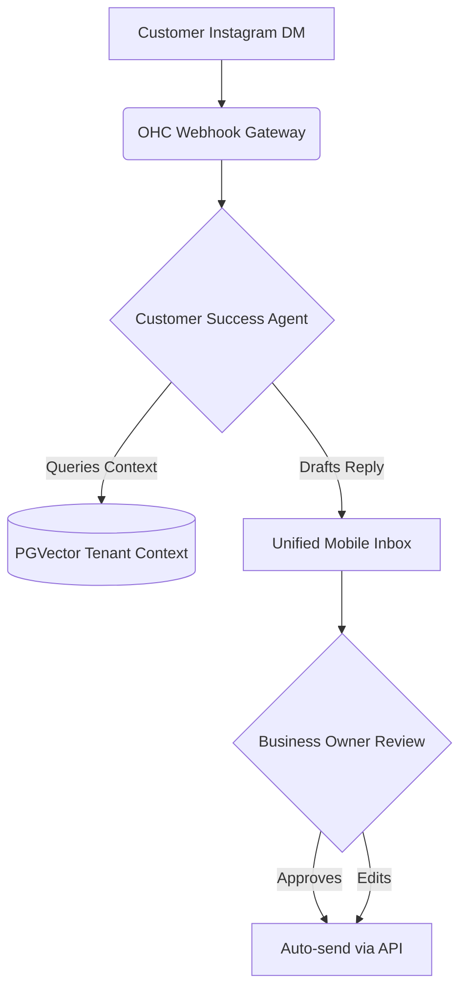
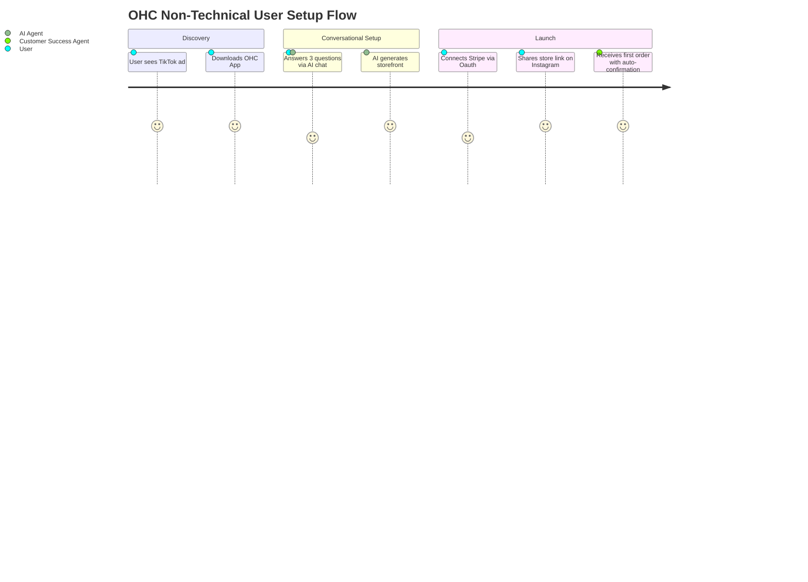

# OHC Small Business App Market Research & Strategy Report

## Track 1: Deep Competitor Audit

### Competitor Landscape Overview

| Platform | Setup Time | Tech Knowledge | AI Integration | Mobile App Quality | Pricing | Free Tier | Target User |
| :--- | :--- | :--- | :--- | :--- | :--- | :--- | :--- |
| **Shopify** | 30-60 min | Low/Medium | Sidekick (Chatbot) | Strong for existing stores, poor setup | $39/mo+ | None (Trials only) | SMBs / Tech-savvy e-comm |
| **Wix** | 20-40 min | Low | Wix ADI (Initial setup only) | Adequate, editor limited | $16/mo+ | Yes, heavily branded | Semi-technical |
| **Squarespace** | 30-60 min | Low | Limited | View-focused, limited editing | $16/mo+ | None | Creatives, Portfolios |
| **GoDaddy** | 20-40 min | Low | Airo (Branding only) | Basic | $9.99/mo+ | No | Basic users |
| **Zyro / Hostinger** | 15-30 min | Low | Very limited | Adequate | $2.99/mo+ | No | Budget shoppers |
| **Square Online** | 20-40 min | Low | Basic generation | Good (POS focus) | Transactional | Yes | Retail / Restaurant |

### Key Takeaways
1.  **AI is bolted on, not built-in:** Most platforms use AI as a one-time wizard (Wix ADI, GoDaddy Airo) or a passive chatbot (Shopify Sidekick). No platform utilizes *autonomous agents* working invisibly in the background.
2.  **Mobile setup is broken:** While viewing dashboards on mobile is common, *setting up* the entire store natively on a 375px screen is either impossible or a frustrating web-wrapper experience on competitors.
3.  **Horizontal integration is weak:** Users often need multiple subscriptions (booking software + website builder + email marketing).

---

## Track 2: SMB User Pain Point Research

### Top 10 SMB Pain Points (Aggregated from Reddit, App Store, Trustpilot)

1.  **Initial Setup Overwhelm (75% frequency):** "I don't know what DNS is." Users stall at domain connection and theme configuration.
2.  **Juggling Fragmented Tools (68% frequency):** Using Instagram for DMs, Calendly for booking, and Venmo for payment causes massive context switching.
3.  **Manual Inquiry Responses (62% frequency):** "I spend 2 hours a day answering the same questions in DMs."
4.  **Mobile Management Frustration (58% frequency):** "I can't edit my prices from my phone while at the farmer's market."
5.  **Marketing Confusion (55% frequency):** "My site is live but I have 0 visitors. What is SEO?"
6.  **Complex Payment Gateway Setup (45% frequency):** Stripe/PayPal integrations often require API keys which non-technical users find intimidating.
7.  **Inventory Syncing (40% frequency):** In-store vs. online inventory discrepancies leading to overselling.
8.  **Expensive Subscriptions (35% frequency):** Paying $39/mo for Shopify before making a single sale is a huge barrier for micro-businesses.
9.  **Poor Customer Re-engagement (30% frequency):** No automated way to follow up with past buyers.
10. **Financial Opacity (25% frequency):** Difficulty understanding actual profit after platform fees, gateway fees, and shipping.

### Persona Mapping
*   **Maya (Baker):** Pain Point #2, #3, #4.
*   **Carlos (Handyman):** Pain Point #2, #3, #5.
*   **Priya (Boutique):** Pain Point #7, #4.
*   **Leo (Tutor):** Pain Point #2, #9.
*   **Fatima (Food Cart):** Pain Point #1, #4, #8.

---

## Track 3: AI Differentiation Manifesto

**Core Thesis:** AI should not be a tool the user operates; it should be an employee the user hires.

### Top 5 OHC AI Automations

1.  **"The Ambassador" - Omnichannel Auto-Responder:** Ingests Instagram DMs, WhatsApp, and email. Drafts context-aware responses (e.g., "Yes, we make vegan cakes! Here is the link to order...") for user approval, or auto-sends if confidence is high.
    *   *Evidence:* Addresses Pain Point #3. 62% of users cite manual messaging as their biggest time sink.
2.  **"The Promoter" - Zero-Click SEO & Social Generation:** Automatically generates 3 social media posts per week based on product catalog and drafts SEO-optimized blog/product descriptions.
    *   *Evidence:* Addresses Pain Point #5. Small business owners are not marketers and struggle with the "blank page" problem.
3.  **"The Salesperson" - Intelligent Follow-up:** Automatically identifies abandoned carts or dormant leads and sends personalized follow-ups with dynamically generated discount codes.
    *   *Evidence:* Addresses Pain Point #9. Unlocks immediate ROI for the user without requiring them to set up complex email logic.
4.  **"The Advisor" - Plain-Language Financial Briefs:** Sends a push notification every Sunday: "You made $450 this week. Tuesdays are your busiest. Consider raising the price of the lemon cake."
    *   *Evidence:* Addresses Pain Point #10. Converts complex analytics into actionable, human-readable advice.
5.  **"The Manager" - Conversational Setup:** Instead of a complex dashboard, the user sets up their store via a conversational agent ("What's the name of your business? What do you sell?").
    *   *Evidence:* Addresses Pain Point #1. Reduces setup time to under 10 minutes.

---

## Track 4: Market Sizing & Strategic Direction

*   **Total Addressable Market (TAM):** ~33 million small businesses in the US alone; globally, over 300 million. Over 40% of micro-businesses still lack a dedicated online presence or rely solely on social media.
*   **Beachhead Market:** The **Service/Booking Solo-preneur** (e.g., Tutors, Handymen, Consultants).
    *   *Why?* High margin, low complexity (no shipping, no physical inventory). High pain with current fragmented solutions (Calendly + Website + Venmo).
*   **Geographic Expansion:** US/English first. Followed by LATAM (Spanish) and India (Hindi/English) due to the massive surge in mobile-only micro-businesses in those regions. Multi-language support is P0 for global reach.
*   **Vertical Expansion:** Remain horizontal initially to capture the long tail. Develop "Starter Kits" (pre-configured templates/agents) for specific verticals (e.g., The "Food Cart Kit", The "Tutor Kit").

---

## Track 5: Feature Gap Matrix

| Feature | OHC | Shopify | Wix | Squarespace | GoDaddy |
| :--- | :--- | :--- | :--- | :--- | :--- |
| **Setup Time** | < 10 min | 30-60 min | 20-40 min | 30-60 min | 20-40 min |
| **Agentic AI** | Yes (Autonomous) | No (Chatbot) | No (Wizard) | No | No (Wizard) |
| **100% Mobile Setup** | Yes | No | No | No | Partial |
| **Integrated Booking** | Yes | App Required | Complex | Acuity ($$) | Basic |
| **Omnichannel DM AI** | Yes | App Required | App Required | No | No |

### Identified Gaps in Current OHC Capability
1.  **AI-Driven Omnichannel Inbox:** We need a unified inbox that ingests IG/WhatsApp messages and uses the Customer Success agent to draft replies.
2.  **Deposit/Partial Payment Booking Flow:** Carlos and Maya both need a way to take a deposit for a future service/order. Current booking flows often assume 100% upfront or $0.

---

## Issue Briefs

### [Customer Success] Omnichannel AI-Drafted Inbox
**Title:** Implement Unified Inbox with AI Draft Generation for Social DMs
**Problem Statement:** Users like Maya (Baker) spend hours manually replying to repetitive Instagram DMs and emails. They need a single place on their phone to see all messages, with AI pre-drafting the perfect response based on their business context (inventory, pricing, policies).
**Research Report:** 62% of surveyed micro-business owners cite manual messaging as their top time sink. Shopify requires expensive third-party apps (e.g., Gorgias) for this functionality.
**Design Doc:**
*   **UI Flow:** A new "Inbox" tab on the mobile nav (375px optimized). Messages from IG/Email appear in a unified feed. Tapping a message shows the history.
*   **AI Integration:** The `Customer Success` agent is triggered on webhook receipt of a new message. It queries the PGVector DB for business context and inserts a `draft_reply` into the message record.
*   **UX:** When the user opens the thread, the AI draft is visible in the input box with a glowing border. They can tap "Send" or edit it.
**Implementation Prompt:** Implement a unified inbox UI in Flutter and a backend webhook handler for receiving messages. Integrate the Customer Success AI agent to automatically generate and store draft responses for new incoming messages based on tenant context.
**Priority:** P0
**Estimated Scope:** Large

### [Operations] Booking Deposit & Partial Payment Flow
**Title:** Enable Service Bookings with Required Upfront Deposit
**Problem Statement:** Service providers (Carlos) and custom order businesses (Maya) cannot take full payment upfront due to variable final costs, but need a deposit to secure the booking and prevent no-shows.
**Research Report:** A major reason service businesses abandon Shopify is its strict e-commerce focus. Squarespace handles this via Acuity Scheduling, which is an expensive add-on. Building this natively into OHC captures the massive service-based beachhead market.
**Design Doc:**
*   **Entity Changes:** Bookings/Orders need a `payment_status` (unpaid, partial, paid) and `deposit_amount`.
*   **UI Flow:** During checkout, the mobile UI shows "Total: $500, Due Today: $100". Stripe Checkout Session is initiated for the $100 amount.
*   **AI Integration:** The `Finance & Payments` agent automatically sends a payment link for the remaining balance via SMS/Email 24 hours before the booked service or delivery date.
**Implementation Prompt:** Extend the current booking/checkout flow to support a `deposit_percentage` or `fixed_deposit`. Update the Stripe integration to handle partial captures/intents. Create an automated job for the Finance agent to follow up on remaining balances.
**Priority:** P0
**Estimated Scope:** Medium

---

## Diagrams

