# Social Media Integration: ManyChat

## Problem Statement
Small business owners struggle to manage customer inquiries across multiple platforms like Instagram DMs, Facebook comments, and WhatsApp. It is time-consuming, and important messages get lost, leading to lost sales and poor customer service.

## Research Report
ManyChat is a popular platform that provides a unified inbox for multiple social media channels.
- **Ease of use:** High, very non-technical user friendly.
- **Pricing:** Starts free, then scales with the number of contacts. Pro plan starts around $15/mo.
- **Cloud/Standalone:** Cloud-only integration.

### Persona-specific pain points
- "I can't keep track of who messaged me on Instagram vs Facebook."
- "I lose potential customers because I reply too late."

### Evidence
- **Recommendation:** Integrate ManyChat to provide a unified inbox within OHC.
- Source: Based on ManyChat's feature set and popularity in the SMB market.

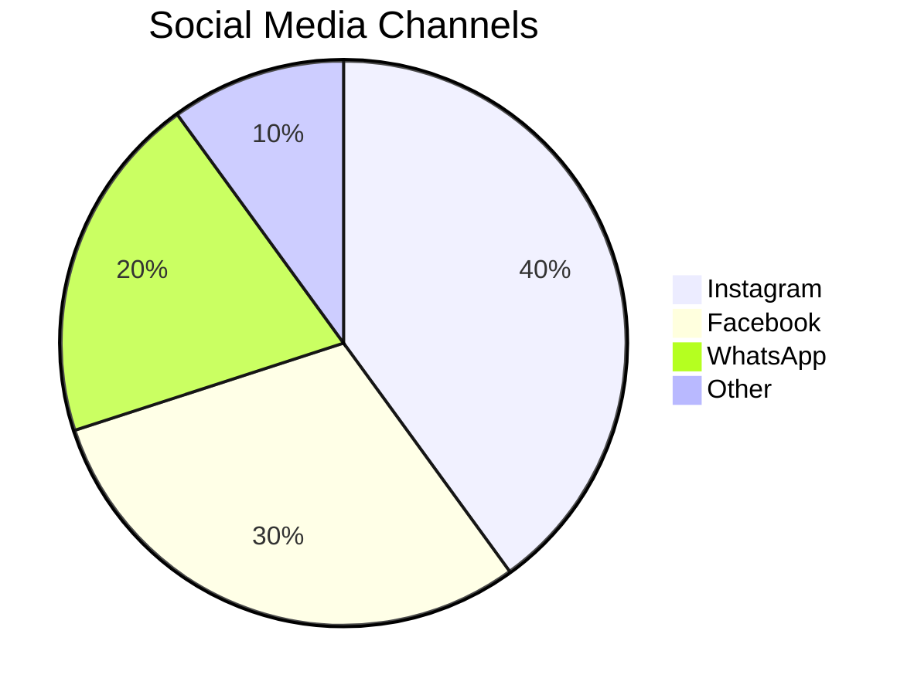

## Design Doc
When a user connects their ManyChat account via OAuth, OHC will poll or receive webhooks from ManyChat containing new messages across all connected channels. These messages will be displayed in a unified "Inbox" tab within the OHC platform. Users can reply directly from OHC, and the response will be routed back through ManyChat to the original platform.

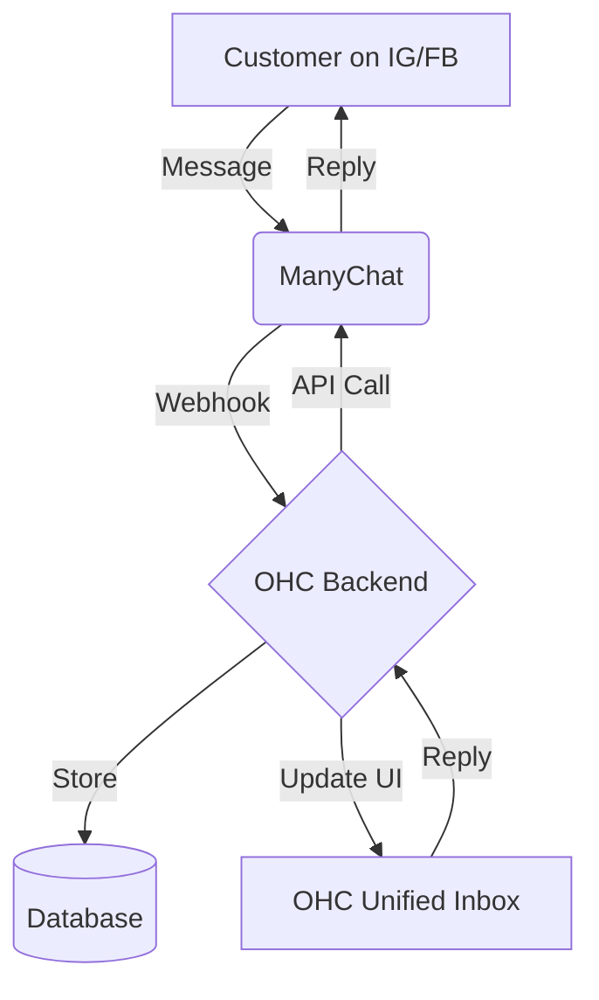

## Implementation Prompt
Create a "Connect ManyChat" button in the integrations page. When clicked, guide the user through the OAuth flow. Once connected, display a unified inbox UI that aggregates messages from all sources. Ensure replies sent from OHC successfully reach the customer on the original platform.

## Priority
P1

## Estimated Scope
Medium
# Calendar & Scheduling: Calendly

## Problem Statement
Small business owners, especially those offering services or consultations, spend too much time going back and forth over email or text to find a time to meet. This manual scheduling leads to double bookings, forgotten appointments, and lost revenue.

## Research Report
Calendly is a ubiquitous scheduling automation platform.
- **Ease of use:** High, very intuitive for both the owner and the client.
- **Pricing:** Free basic tier, premium starts at $10/mo per seat.
- **Cloud/Standalone:** Cloud integration.

### Persona-specific pain points
- "I spend hours every week just trying to agree on a meeting time."
- "Clients sometimes book me when I'm already busy because I forgot to update my availability."

### Evidence
- **Recommendation:** Integrate Calendly to automate scheduling within OHC.
- Source: Industry standard scheduling tool with proven adoption among small businesses.

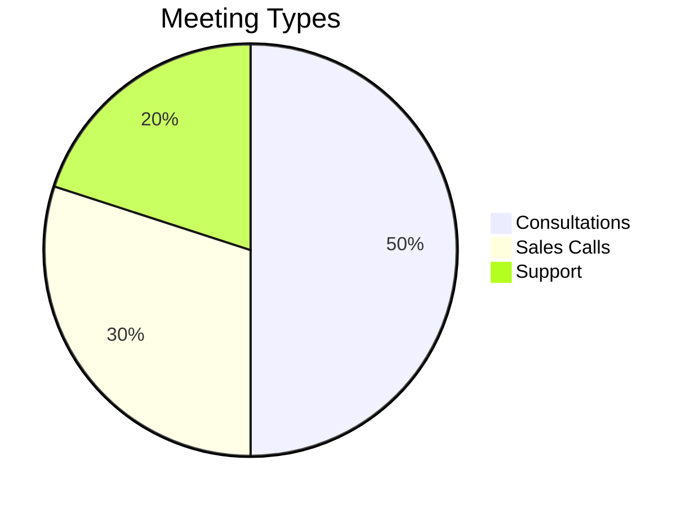

## Design Doc
When a user connects their Calendly account, OHC will fetch their event types and booking links. OHC can display upcoming Calendly appointments in the dashboard calendar. A custom "Book a Meeting" widget could be embedded into the OHC-generated storefront or unified inbox, using the connected Calendly link.

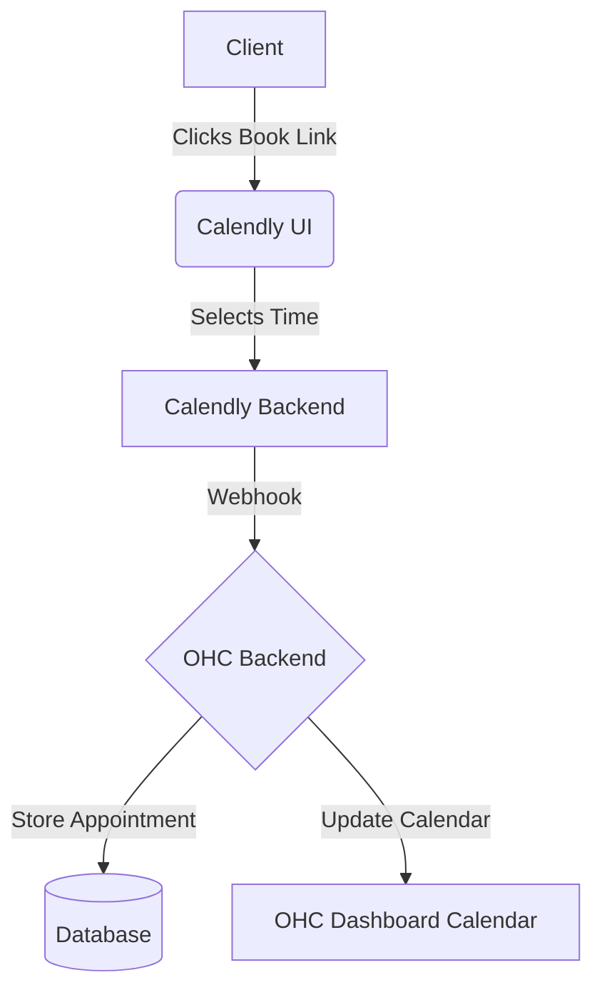

## Implementation Prompt
Create a "Connect Calendly" option. Allow users to input their Calendly Personal Access Token or use OAuth. Once connected, display upcoming appointments on the OHC dashboard. Provide a quick way to copy their primary booking link from within the OHC interface.

## Priority
P1

## Estimated Scope
Small
# Email Marketing: Mailchimp

## Problem Statement
Small business owners have customer lists scattered across spreadsheets, point-of-sale systems, and email accounts. They need an easy way to consolidate these contacts and send professional, branded newsletters or promotional emails without needing a marketing degree.

## Research Report
Mailchimp is a leading marketing automation platform designed for small businesses.
- **Ease of use:** High, drag-and-drop builder is very accessible.
- **Pricing:** Free up to 500 contacts/1,000 sends per month. Essentials starts at $13/mo.
- **Cloud/Standalone:** Cloud integration.

### Persona-specific pain points
- "I have a list of past customers but don't know how to reach out to them legally and professionally."
- "My emails always end up in the spam folder when I send them from Gmail."

### Evidence
- **Recommendation:** Integrate Mailchimp to provide robust email marketing capabilities synced with OHC contacts.
- Source: Recognized leader in SMB email marketing with extensive API support.

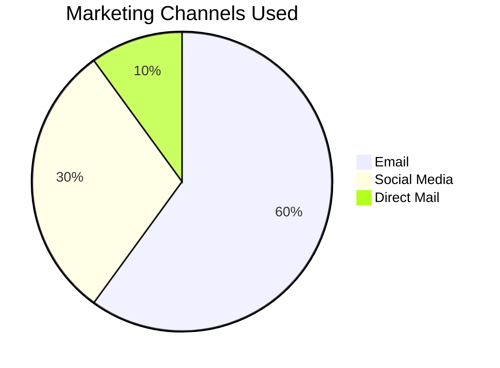

## Design Doc
When a user connects Mailchimp, OHC will automatically sync the "Customers" list in OHC with an Audience in Mailchimp. When a new customer makes a purchase or signs up on the OHC storefront, they are added to the Mailchimp audience (with opt-in). OHC can display basic campaign metrics (open rate, click rate) on the dashboard.

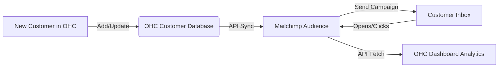

## Implementation Prompt
Create an integration card for Mailchimp. On connect, prompt the user to select an existing Mailchimp Audience or create a new one. Implement a one-way sync from OHC Contacts to the Mailchimp Audience. Add a small analytics widget to the OHC dashboard showing the performance of the most recent Mailchimp campaign.

## Priority
P2

## Estimated Scope
Medium
# Payment Processing: Razorpay

## Problem Statement
While Stripe is excellent globally, many small businesses in specific regional markets (like India) require local payment methods (UPI, local wallets, RuPay cards) that international processors do not support well or at competitive rates. Without local payment options, businesses face high cart abandonment.

## Research Report
Razorpay is a dominant payment gateway in India, supporting all local payment methods.
- **Ease of use:** High for Indian businesses, seamless onboarding.
- **Pricing:** 2% per transaction for standard domestic cards/UPI.
- **Cloud/Standalone:** Cloud integration.

### Persona-specific pain points
- "My customers want to pay with UPI, but my current checkout only takes credit cards."
- "The settlement times for international gateways are too slow for my cash flow."

### Evidence
- **Recommendation:** Integrate Razorpay to serve the Indian SMB market and reduce cart abandonment by supporting local payment methods.
- Source: High market share in India, specifically catering to SMBs and startups.

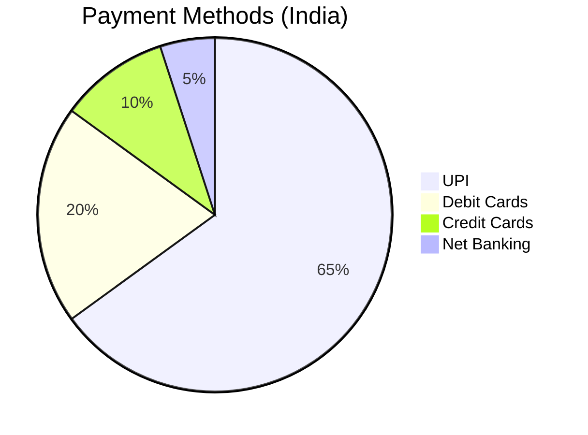

## Design Doc
When setting up their OHC storefront, a business owner in a supported region can select Razorpay as their payment provider. OHC will use Razorpay's Checkout integration to handle the payment flow securely. Successful payments will trigger order confirmation within OHC, updating the unified inbox and inventory.

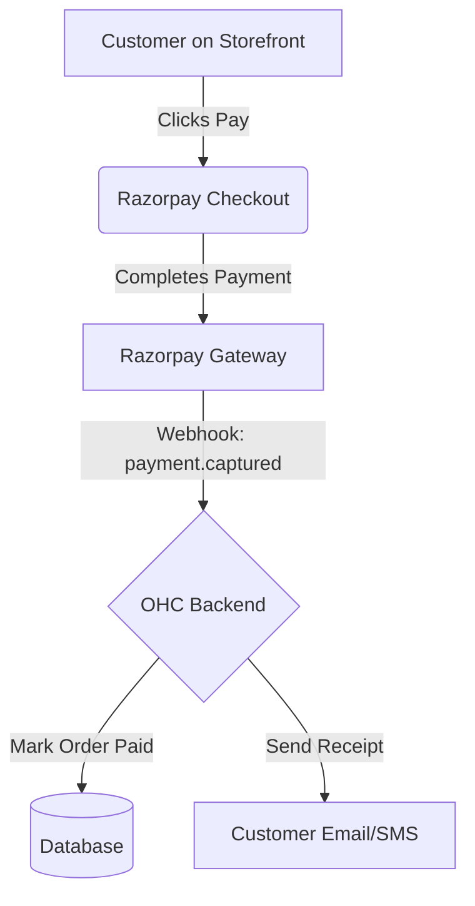

## Implementation Prompt
Add Razorpay as a payment provider option alongside Stripe. Implement the Razorpay Standard Checkout flow for the OHC storefront. Ensure webhook handlers are set up to verify the signature and update the order status in OHC to "Paid" upon successful transaction.

## Priority
P2

## Estimated Scope
Medium
# Shipping & Logistics: Shippo

## Problem Statement
Fulfilling orders is a manual, error-prone process for e-commerce SMBs. Calculating shipping rates, buying labels, and sending tracking numbers manually takes hours. They need a way to automate label generation and get discounted shipping rates.

## Research Report
Shippo is a multi-carrier shipping software designed for e-commerce.
- **Ease of use:** High, abstracts away complex carrier APIs.
- **Pricing:** Pay-as-you-go (5¢ per label + postage) or Pro tier ($10/mo).
- **Cloud/Standalone:** Cloud integration.

### Persona-specific pain points
- "I waste an hour every day copying addresses into USPS to buy labels."
- "I undercharged for shipping last week and lost money on an order."

### Evidence
- **Recommendation:** Integrate Shippo to provide real-time shipping rates at checkout and 1-click label generation in the OHC dashboard.
- Source: Strong API documentation, clear pricing, and focus on small business e-commerce.

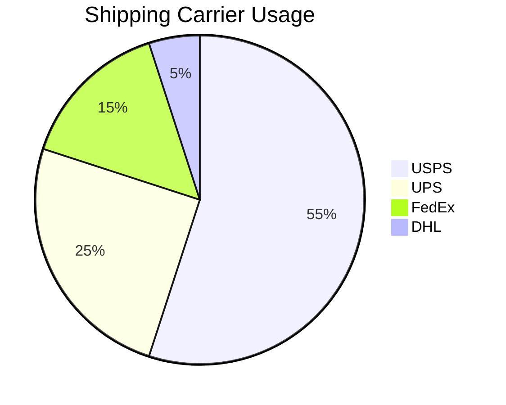

## Design Doc
When a physical order is placed, OHC calls Shippo to fetch shipping rates based on the package dimensions and weight. The customer selects a rate at checkout. In the OHC dashboard, the owner clicks "Generate Label", OHC purchases the label via Shippo, and displays the printable PDF. Tracking info is automatically emailed to the customer.

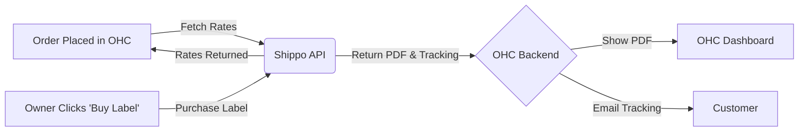

## Implementation Prompt
Integrate Shippo for the OHC storefront. Add a "Shipping Configuration" page where the owner can enter package dimensions and their origin address. During checkout, display real-time rates from Shippo. Add a "Buy Shipping Label" button to the Order details page that purchases the label and displays the PDF to the owner.

## Priority
P1

## Estimated Scope
Large
# SMS & Notifications: Twilio

## Problem Statement
Emails often go unread or end up in spam. For critical notifications like appointment reminders or delivery updates, small business owners need a reliable way to reach customers instantly. SMS is highly effective but complex to set up independently.

## Research Report
Twilio is the industry standard for programmable SMS.
- **Ease of use:** Requires some setup (A2P 10DLC registration in the US), but the API is very robust.
- **Pricing:** Pay-as-you-go (around $0.0079 per SMS in the US).
- **Cloud/Standalone:** Cloud integration.

### Persona-specific pain points
- "My clients keep missing their appointments because they don't check their email."
- "I need a way to quickly notify a customer that their custom order is ready for pickup."

### Evidence
- **Recommendation:** Integrate Twilio to power SMS notifications for appointments and order updates.
- Source: Industry leader, extremely reliable, global carrier coverage.

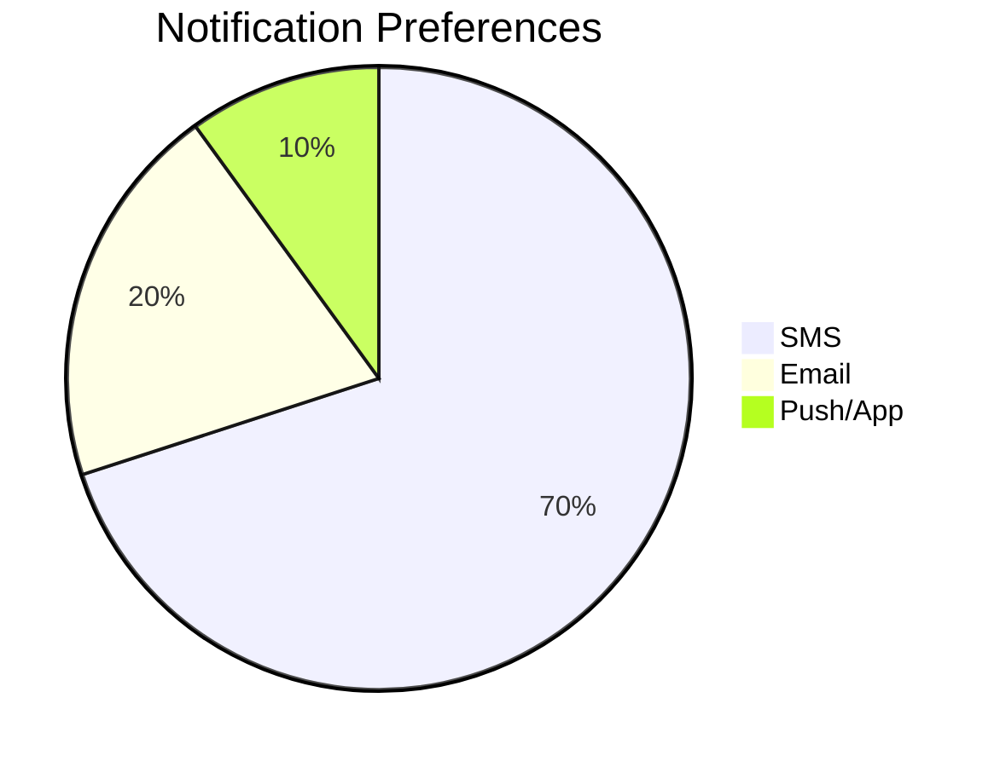

## Design Doc
When a critical event occurs in OHC (e.g., an appointment is booked, an order is shipped), OHC will format a short message and send it via the Twilio API to the customer's phone number. The integration will handle formatting and opt-out compliance (STOP replies).

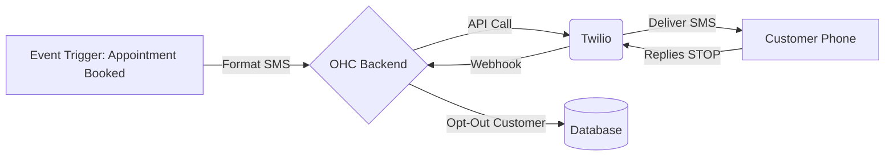

## Implementation Prompt
Create a "Connect Twilio" page where the user can input their Account SID, Auth Token, and Phone Number. Add toggles in the OHC settings to enable/disable SMS for specific events (e.g., "Order Shipped", "Appointment Reminder"). Implement the backend logic to send the SMS via Twilio when those events are triggered.

## Priority
P1

## Estimated Scope
Medium
# Video Conferencing: Zoom

## Problem Statement
For businesses offering online consultations, coaching, or lessons, manually creating a video meeting link and sending it to the client for every booking is tedious and looks unprofessional.

## Research Report
Zoom is the most widely recognized video conferencing tool globally.
- **Ease of use:** High, clients are very familiar with joining Zoom calls.
- **Pricing:** Free tier available (40-min limit), Pro starts at $15/mo.
- **Cloud/Standalone:** Cloud integration.

### Persona-specific pain points
- "I sometimes forget to create the Zoom link until 5 minutes before the lesson."
- "Clients get confused if I use a different video tool every time."

### Evidence
- **Recommendation:** Integrate Zoom to auto-generate meeting links for scheduled online appointments.
- Source: Universal familiarity and robust API for automated meeting creation.

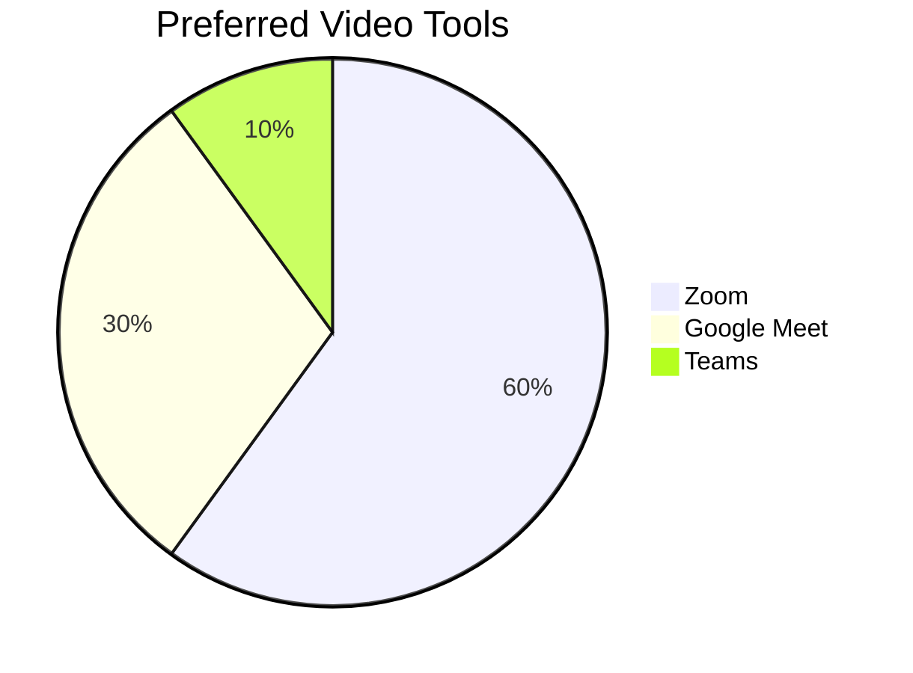

## Design Doc
When an appointment is booked in OHC (either manually or via the Calendly integration) that is marked as "Online", OHC will call the Zoom API to create a new meeting. The generated meeting link will be saved to the appointment record and automatically included in the confirmation email/SMS sent to the customer.

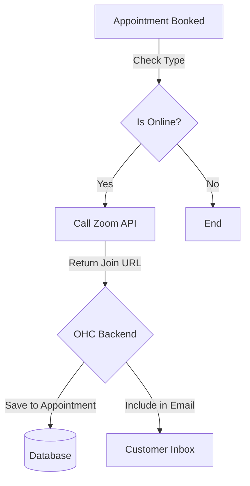

## Implementation Prompt
Add an "Online Meeting" toggle when a business owner creates an appointment type. Implement the Zoom OAuth flow for the owner to connect their account. When a user books an "Online Meeting", use the Zoom API to generate a unique meeting link and password, and display it in the appointment details in the OHC dashboard and the customer's confirmation.

## Priority
P2

## Estimated Scope
Medium
