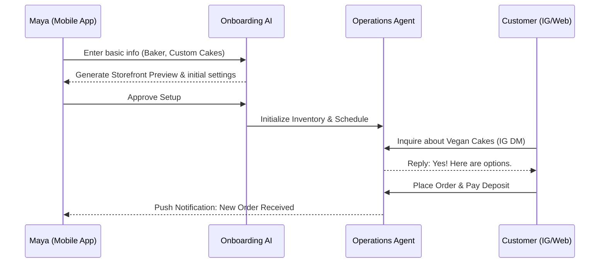
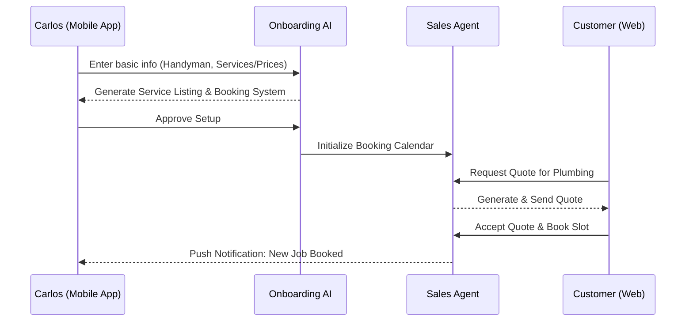

# [Architecture] Business Journey Architecture

## Problem Statement
Many potential small business owners have zero technical skills and find platforms like Shopify or Wix overwhelmingly complex. Our target personas (e.g., Maya the baker, Carlos the handyman) need a system that feels like a simple guided interview, taking them from a blank slate to a fully functional, live business with an AI agent managing operations, marketing, and sales within 10 minutes. The lack of a clear, mobile-first, AI-assisted onboarding and operational journey is a major adoption blocker.

## Research Report
### Competitive Analysis
- **Shopify**: Excellent feature set but requires 30-60 minutes for basic setup. High technical barrier. Not truly mobile-first for management.
- **Wix/Squarespace**: Template-driven, requires significant customization. Time-consuming. Mobile management is secondary.
- **GoDaddy**: Fast setup but very basic features. Limited flexibility for complex businesses.
- **OHC**: Aiming for <10 min setup, zero technical knowledge, mobile-first, with AI acting as a co-pilot.

### Business Needs vs AI Capabilities
- **Onboarding**: Users need simple questions; AI should generate the site, initial catalog, and settings.
- **Operations**: AI must handle scheduling, inventory management, and basic customer inquiries automatically.
- **Growth**: AI should proactively suggest marketing campaigns, SEO improvements, and financial optimizations.

## Design Doc

### Architecture Diagrams

#### 1. Maya (The Home Baker) Journey

#### 2. Carlos (The Freelance Handyman) Journey

### Mobile UX Screen Flows (375px Target)
1.  **Welcome Screen**: Simple branding, large "Start My Business" button.
2.  **AI Interview**: Chat-like interface asking 3-4 simple questions (Business type, name, style preference).
3.  **Generation Screen**: Loading animation showing AI building the site.
4.  **Preview & Publish**: A scrollable preview of the generated site with a primary "Go Live" button.
5.  **Dashboard**: Key metrics (Sales today, upcoming bookings), quick actions, and recent AI activity log.

### AI Agent Integration Points
-   **Onboarding**: `Marketing & Advertising` agent generates the site design and copy based on initial inputs.
-   **Operations**: `Operations` agent intercepts incoming requests (orders, bookings) and updates internal state.
-   **Communication**: `Customer Success` agent hooks into incoming messages (DMs, emails) to provide instant replies.

## Implementation Prompt
**Objective:** Implement the Mobile-First Onboarding AI Chat Flow.
**CUJ:** A new user opens the app, answers 3 simple questions via a chat interface, and is presented with a fully generated, ready-to-publish storefront preview.
**Acceptance Criteria:**
-   UI must be fully responsive and functional on a 375px width screen.
-   Chat interface must use standard OHC Glassmorphism design tokens.
-   Inputs must trigger the backend AI generation service and gracefully display a loading state.
-   Preview screen must render the generated JSON configuration correctly.
-   Must include 100% E2E test coverage starting from login to the final preview screen.
-   Do NOT hardcode specific AI models; use the abstracted provider interface.

## Priority & Scope
- **Priority**: P0
- **Estimated Scope**: Large
