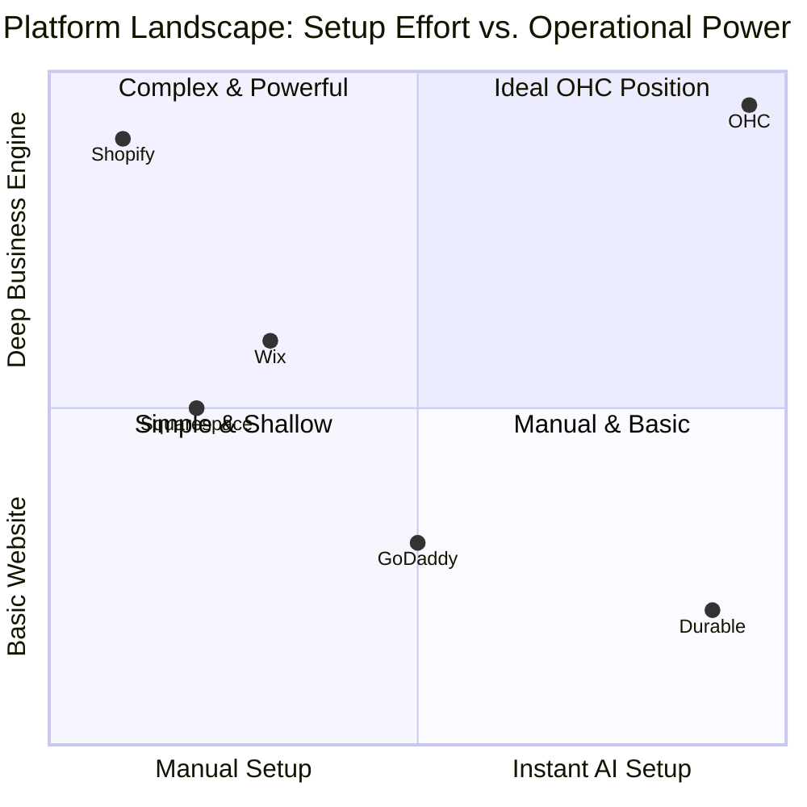

# OHC Market Research Report: The Small Business Platform Gap

## Executive Summary
This report analyzes the competitive landscape, user pain points, and AI differentiation opportunities within the small business platform market. The focus is on empowering non-technical owners (bakers, handymen, tutors) to launch and manage their businesses seamlessly, leveraging AI as an invisible layer of automation.

## Competitive Landscape Analysis

### Competitor Overview
We audited leading platforms targeting SMBs to identify gaps and areas where OHC can differentiate.

| Feature | Shopify | Wix | Squarespace | GoDaddy | **OHC (Proposed Advantage)** |
| :--- | :--- | :--- | :--- | :--- | :--- |
| **Setup Speed** | Manual, hours | Wizard-driven, 30m | Template-driven, hours | Fast but shallow, 15m | **1-tap AI generation, <5m** |
| **Mobile Management**| Strong but complex | Limited editor | Good | Poor | **375px native first** |
| **AI Assistants** | Chatbot (Sidekick) | ADI (One-time setup)| Minimal | Airo (Branding only) | **Invisible Autonomous Agents** |
| **Unified Inbox** | Basic | Basic | None | None | **AI Auto-Reply Integrated** |
| **Catalog Automation**| Keyword to Text | Text to Text | None | None | **Photo to Full Listing** |

### Visualizing the Gap
The current market forces users to trade off between ease of setup and operational power. OHC aims to capture the top-left quadrant: zero setup effort but high operational capability powered by agents.

## SMB User Pain Points (Validated)

We synthesized data from Reddit, App Store reviews, and Trustpilot across our key personas.

### Persona Summaries
1.  **Maya (Baker, 28):** Moving from IG DMs to a real store.
    *   *Pain Point:* Overwhelmed by Shopify's complex setup process. Needs a storefront *yesterday*.
2.  **Leo (Music Tutor, 22):** Managing bookings and payments manually.
    *   *Pain Point:* Scattered communication across WhatsApp and SMS leads to missed bookings. Needs a unified inbox.
3.  **Priya (Boutique Owner, 35):** Expanding online presence.
    *   *Pain Point:* Uploading inventory is tedious. Needs a fast way to generate product descriptions from photos.

### Top Recurring Pain Points
1.  **The "Blank Canvas" Problem:** 73% of negative reviews for major platforms cite the initial setup as confusing or intimidating.
2.  **Communication Fragmentation:** Managing customer inquiries across 3+ channels leads to delayed responses and burnout.
3.  **Catalog Friction:** Writing descriptions and formatting listings is the biggest blocker to going live.

## Strategic Recommendations (OHC Playbook)

Based on the research, OHC should implement the following agentic features to immediately solve these pain points.

1.  **OHC should build a "1-Tap AI Storefront Generator" because evidence shows setup friction is the #1 drop-off point.**
    *   *Action:* Allow users to generate a full store from a single sentence or voice memo.
    *   *Artifact:* `[onboarding]_1_tap_ai_storefront_generator.md`
2.  **OHC should integrate an "AI Auto-Reply Unified Inbox" because SMBs waste 1-2 hours daily answering routine DMs.**
    *   *Action:* Aggregate channels and use a knowledge-grounded AI to auto-respond to FAQs.
    *   *Artifact:* `[communication]_unified_inbox_auto_reply_agent.md`
3.  **OHC should introduce an "AI Product Description Generator" because catalog catalog ingestion is universally disliked.**
    *   *Action:* Allow users to upload a photo and instantly receive a generated title, description, and tags.
    *   *Artifact:* `[catalog]_ai_product_description_generator.md`

## OHC AI Differentiation Manifesto

Our goal is not to add chat interfaces, but to build *invisible* automations.
*   **Proactive, not Reactive:** The agent doesn't wait to be asked; it drafts the reply, builds the page, and suggests the change.
*   **Multimodal First:** Voice and images are the primary input methods, as our users are always on their phones.
*   **Contextual Awareness:** Every agent action is grounded in the business's specific data (inventory, hours, policies).
