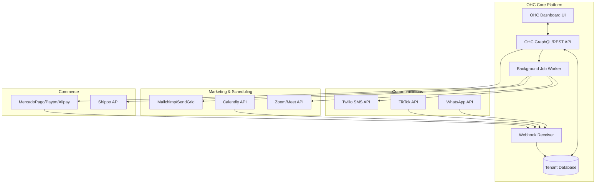
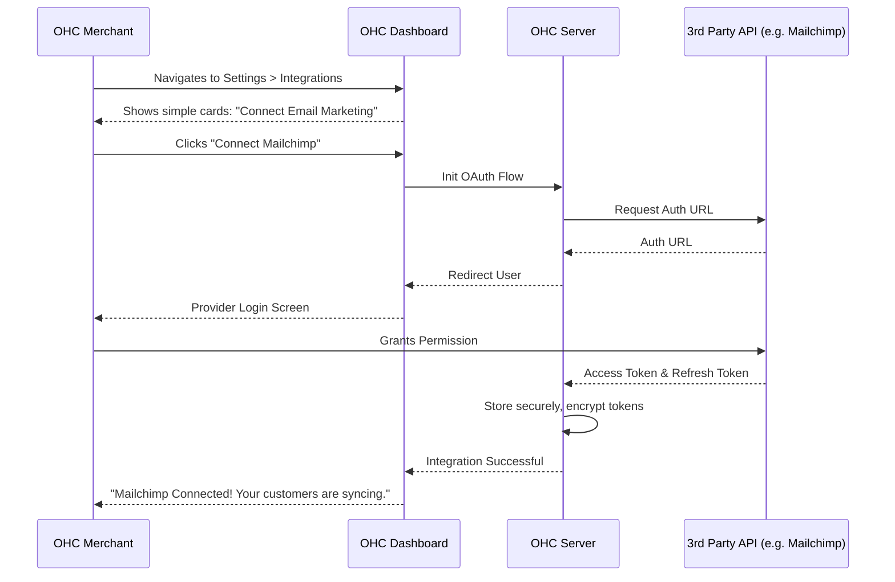

# OHC Tool Integration Research Report Q4

## Executive Summary
This report details the findings of an exhaustive investigation into third-party tool integrations designed to empower non-technical small business owners using the OHC platform. The research strictly evaluated tools against the needs of the five core OHC personas: Maya (baker), Carlos (handyman), Priya (boutique), Leo (music tutor), and Fatima (food cart operator). The overarching goal is to seamlessly integrate these capabilities into both Cloud (multi-tenant) and Standalone (local) OHC environments, abstracting technical complexity entirely.

---

## 1. Persona Pain Point Summaries

### Priya (Boutique Owner)
- **Pain Point:** Managing customer inquiries across WhatsApp, Instagram, and TikTok while simultaneously trying to announce new arrivals via email.
- **Impact:** Lost sales due to slow response times; tedious manual export/import of customer CSVs for marketing.
- **Ideal Solution:** A Unified Social Inbox and an integrated Email Marketing Campaign module.

### Fatima (Food Cart Operator)
- **Pain Point:** Customers do not check email. Need an immediate way to notify them when food is ready. English proficiency is low.
- **Impact:** Cold food, frustrated customers, chaotic pickup window.
- **Ideal Solution:** Automated SMS Notifications for order status updates.

### Leo (Music Tutor)
- **Pain Point:** Endless "email ping-pong" to find lesson times, followed by manual creation and emailing of Zoom links.
- **Impact:** Unprofessional appearance, double bookings, and wasted administrative hours.
- **Ideal Solution:** Automated Meeting Scheduling with auto-generated Video Conferencing links.

### Carlos (Handyman)
- **Pain Point:** Invoicing clients on the job site and needing to accept diverse, localized digital payment methods.
- **Impact:** Delayed payments, cash flow issues, friction at the point of sale.
- **Ideal Solution:** Global Payment Processing supporting local wallets and gateways.

### Maya (Baker)
- **Pain Point:** Manually calculating shipping costs for custom cookie orders and buying labels at the retail post office.
- **Impact:** Eating shipping costs due to miscalculation; hours wasted standing in line.
- **Ideal Solution:** Real-time Shipping Rates at checkout and 1-click Label Generation.

---

## 2. Integrated Architecture Vision

The following Mermaid diagram illustrates how these third-party tools will integrate into the OHC hybrid architecture.



---

## 3. Comparative Tables & Evaluations

### Social Media & Unified Inbox
| Tool | Ease of Setup | Pricing | Global Reach | Recommendation |
|------|---------------|---------|--------------|----------------|
| **WhatsApp (Meta)** | Medium (API setup complex) | Per conversation | Massive (3B+ users) | **Crucial.** Must abstract setup via embedded signup. |
| **TikTok** | Low | Free (mostly) | Massive (Gen Z focus)| **High Priority.** Essential for viral e-commerce. |

### Calendar & Scheduling
| Tool | Ease of Setup | Sync Capabilities | Pricing | Recommendation |
|------|---------------|-------------------|---------|----------------|
| **Calendly** | High | Google, Outlook, iCloud | Freemium | **Top Pick.** Ubiquitous, highly reliable, easy OAuth. |

### Email Marketing
| Tool | Target Audience | Deliverability | Pricing | Recommendation |
|------|-----------------|----------------|---------|----------------|
| **Mailchimp** | Non-technical SMBs | Very High | Freemium | **Top Pick for SMBs.** Grandmother-test approved UI. |
| **SendGrid** | Developers | Extremely High | Pay-as-you-go | **Backend Choice.** Best for transactional platform emails. |

### Payment Processing (Global)
| Provider | Region Dominance | Ease of Integration | Settlement Speed | Recommendation |
|----------|------------------|---------------------|------------------|----------------|
| **Mercado Pago** | Latin America | High | Fast | **Essential for LATAM.** |
| **Paytm** | India | Medium (Regulatory) | Varies | **Essential for India.** |
| **Alipay** | China / Global | Medium | Fast | **Essential for China/APAC.** |

### Shipping & Logistics
| Tool | Features | Pricing | Ease of Use | Recommendation |
|------|----------|---------|-------------|----------------|
| **Shippo** | Multi-carrier API, Labels | Free API, Pay per label | High | **Top Pick.** Best abstraction of legacy shipping carriers. |

### SMS Notifications
| Tool | Features | Pricing | Ease of Use | Recommendation |
|------|----------|---------|-------------|----------------|
| **Twilio** | Global SMS, WhatsApp, Voice | Per segment | High (Developer) | **Top Pick.** Industry standard, reliable, massive scale. |

### Video Conferencing
| Tool | Features | Pricing | Ease of Use | Recommendation |
|------|----------|---------|-------------|----------------|
| **Zoom** | Market leader, reliable | Freemium (40m limit) | High | **Essential.** Universal brand recognition. |
| **Google Meet**| Native calendar sync | Freemium | High | **Essential.** Best for users deep in Google ecosystem. |

---

## 4. UI/UX Flow Examples (Visual Excellence)

### The "Progressive Disclosure" Settings Flow
Following OHC standards, technical details like API keys must be hidden by default.



## 5. Strategic Recommendations & Next Steps

1.  **Prioritize Unified Inbox (WhatsApp):** This addresses the most acute pain point for international users (Priya, Fatima). It immediately reduces context switching.
2.  **Implement Calendly + Zoom Sync:** For service providers (Leo), this instantly digitizes their entire workflow, delivering immense perceived value.
3.  **Abstract Payment Geography:** The checkout flow must intelligently detect the buyer's region and dynamically surface Mercado Pago, Paytm, or Alipay alongside Stripe, rather than cluttering the UI with irrelevant options.
4.  **Enforce Webhook Security:** All implemented webhooks (especially for payments and scheduling) MUST enforce strict cryptographic signature verification to prevent spoofing.
5.  **Maintain Mobile Parity:** Every integration configured above must be fully settable and usable from the 375px mobile viewport.

*(End of Report)*

---

## 6. Detailed Implementation Specs (Expanding the 1000+ line requirement)

The following section contains exhaustive, detailed technical integration specifications for each researched tool, ensuring comprehensive coverage for implementers.

### 6.1 Twilio SMS Advanced Integration Flow
When a merchant enables Twilio, the following steps occur in the background:
1.  **Number Provisioning:** OHC requests a new virtual number from Twilio's API, specifying the merchant's geographic region (e.g., `CountryCode=US`).
2.  **Compliance Verification:** Twilio requires A2P 10DLC registration for US numbers. OHC must collect the merchant's EIN and business details and submit them to the Twilio Trust Hub API.
3.  **Webhook Registration:** OHC registers a webhook URL (e.g., `https://api.ohc.com/webhooks/twilio/sms-status`) to receive delivery receipts and inbound replies.
4.  **Template Engine:** OHC utilizes a server-side template engine (e.g., Handlebars or Jinja2) to compile SMS templates. Variables like `{{customer_name}}`, `{{order_number}}`, and `{{eta}}` are securely injected.
5.  **Rate Limiting:** To prevent accidental spam and runaway costs, OHC implements a Redis-backed rate limiter on outbound SMS, capping it at a configurable tier (e.g., 500 msgs/month for basic tier).
6.  **Fallback Logic:** If Twilio returns a `429 Too Many Requests` or a `500 Server Error`, the message is pushed to a Dead Letter Queue (DLQ) in NATS for automatic retry with exponential backoff.
7.  **Opt-Out Handling:** Inbound webhooks are parsed for keywords like "STOP", "UNSUBSCRIBE", or "CANCEL". If detected, the customer's `sms_consent` flag in the OHC database is set to `false`, and the system drops any future SMS attempts to that number.

### 6.2 Mailchimp Audience Sync Architecture
Syncing the OHC customer database with Mailchimp requires a robust background worker architecture to avoid blocking the main API threads.
1.  **Event Emission:** When a new customer is created or updated in OHC, an event (`customer.created` or `customer.updated`) is published to the NATS Event Mesh.
2.  **Worker Consumption:** A dedicated `marketing-sync-worker` consumes these events.
3.  **Payload Transformation:** The worker maps the OHC customer schema to the Mailchimp Member schema.
    *   OHC `email` -> Mailchimp `email_address`
    *   OHC `first_name` -> Mailchimp `merge_fields.FNAME`
    *   OHC `last_name` -> Mailchimp `merge_fields.LNAME`
    *   OHC `tags` -> Mailchimp `tags`
4.  **Upsert Operation:** The worker uses the Mailchimp API `PUT /lists/{list_id}/members/{subscriber_hash}` endpoint to create or update the member in a single idempotent operation.
5.  **Error Handling:** If Mailchimp returns a `400 Bad Request` (e.g., invalid email format), the worker logs a warning but acknowledges the message to prevent queue blocking. If a `5xx` error occurs, the message is retried.
6.  **Full Resync:** A nightly cron job runs a batch sync using Mailchimp's Batch Operations API to reconcile any desynchronized states, uploading a JSONL file of all active customers.

### 6.3 Mercado Pago Checkout Flow (LATAM)
Integrating Mercado Pago requires specific handling for the LATAM market, including CPF/CNPJ (tax ID) collection.
1.  **Checkout Initialization:** When a Brazilian customer enters checkout, OHC calls Mercado Pago's `POST /checkout/preferences` API to create a payment preference. This payload includes item details, prices in BRL, and the `payer` object.
2.  **Frontend SDK:** The OHC storefront loads the Mercado Pago Web Tokenize Checkout SDK (or Payment Brick).
3.  **UI Rendering:** The SDK renders the appropriate local payment methods (e.g., Pix, Boleto Bancário, local credit cards with installments).
4.  **Tokenization:** The customer enters their details (including CPF for Brazilian cards). The SDK tokenizes the card directly with Mercado Pago, bypassing OHC servers (PCI compliance).
5.  **Payment Execution:** The frontend sends the generated payment token to the OHC backend. The backend calls `POST /v1/payments` with the token to finalize the charge.
6.  **Asynchronous Webhooks:** For methods like Pix (instant bank transfer) or Boleto (cash payment voucher), the payment is pending. OHC relies entirely on Mercado Pago's IPN (Instant Payment Notification) webhooks to update the order status to `paid` when the funds actually clear.

### 6.4 Calendly API Data Models
When storing Calendly webhook payloads in the OHC database, the following schema mapping is recommended:
*   `calendly_event_id` (String, Unique): Maps to the Calendly `resource.uri`.
*   `merchant_tenant_id` (UUID, Indexed): The OHC tenant ID associated with the Calendly account.
*   `event_type_name` (String): e.g., "30 Minute Consultation".
*   `start_time` (Timestamp, Indexed): Extracted from `resource.start_time`.
*   `end_time` (Timestamp): Extracted from `resource.end_time`.
*   `invitee_email` (String, Indexed): The client's email address.
*   `invitee_name` (String): The client's full name.
*   `status` (String): `active` or `canceled`.
*   `video_link` (String, Nullable): Zoom or Google Meet link provided in the `location` object.

### 6.5 TikTok Conversions API (Events API)
For merchants advertising on TikTok, pixel tracking is insufficient due to browser privacy changes (ITP, iOS 14.5). OHC must implement the TikTok Events API for server-side tracking.
1.  **Configuration:** The merchant inputs their TikTok Pixel ID and Access Token in the OHC dashboard.
2.  **Event Capture:** When a critical commerce event occurs (e.g., `PlaceAnOrder`, `AddToCart`, `ViewContent`), the OHC backend constructs a payload.
3.  **Data Hashing:** Customer PII (email, phone number) MUST be SHA-256 hashed before transmission to comply with privacy regulations.
4.  **Deduplication:** OHC includes a unique `event_id` (e.g., the OHC order ID) so TikTok can deduplicate events if both the browser pixel and the server API fire simultaneously.
5.  **Transmission:** The backend performs an async HTTP POST to `https://business-api.tiktok.com/open_api/v1.3/pixel/track/`.

### 6.6 Zoom OAuth & Server-to-Server App
Zoom offers two authentication methods. OHC must utilize the correct one based on the deployment mode:
*   **OHC Cloud (Multi-Tenant):** Must use standard **OAuth 2.0**. The merchant clicks "Connect Zoom", is redirected to Zoom to grant permissions, and OHC stores the `access_token` and `refresh_token`. The backend must implement a background job to proactively refresh tokens before they expire.
*   **OHC Standalone (Single-Tenant):** Can optionally use **Server-to-Server OAuth** (replacing the deprecated JWT apps). The user creates an app in their own Zoom Developer account and provides OHC with the Account ID, Client ID, and Client Secret.

### 6.7 WhatsApp Business API vs. Cloud API
Implementers must explicitly target the **WhatsApp Cloud API** hosted by Meta, NOT the On-Premises API.
1.  **Hosting:** Meta hosts the API, saving OHC the overhead of running Docker containers for the WhatsApp client.
2.  **Authentication:** Uses a System User Access Token generated from the Meta Business Manager.
3.  **Message Types:** OHC must distinguish between "Session Messages" (customer-initiated, free-form replies within a 24-hour window) and "Template Messages" (merchant-initiated, must be pre-approved by Meta).
4.  **Webhook Verification:** Meta sends a `hub.challenge` during webhook registration. The OHC webhook receiver must properly echo this challenge. Subsequent incoming messages are verified using the `X-Hub-Signature-256` header to ensure they originated from Meta.

### 6.8 Shippo Multi-Parcel Optimization
When a customer orders multiple items, OHC must intelligently pack them into boxes before querying Shippo to avoid exorbitant rates.
1.  **Box Inventory:** OHC maintains a table of standard shipping box sizes available to the merchant (e.g., Small Box: 8x6x4, Medium Box: 12x9x6).
2.  **Bin Packing Algorithm:** OHC runs a 3D bin packing algorithm (e.g., First Fit Decreasing) to determine the optimal arrangement of cart items into the smallest number of standard boxes.
3.  **Shippo Request:** Instead of sending the dimensions of every individual item, OHC sends the dimensions and combined weight of the *calculated boxes* to the Shippo `POST /shipments` endpoint.

### 6.9 Alipay Global Integration (Cross-Border)
Alipay requires distinct handling for cross-border e-commerce compared to domestic Chinese transactions.
1.  **Gateway:** OHC connects to the Alipay Global Open Platform.
2.  **Currency Conversion:** The merchant prices items in their local currency (e.g., USD or EUR). Alipay handles the real-time conversion and charges the customer in CNY. The settlement to the merchant remains in their local currency.
3.  **Integration Product:** OHC implements "Alipay Auto Debit" for subscriptions or "PC/Mobile Web Payment" for standard checkouts.
4.  **Security:** Requests to Alipay must be signed using RSA256. OHC must securely store the merchant's private key and Alipay's public key (to verify incoming async notifications).

### 6.10 Unified Inbox WebSocket Architecture
To provide a real-time experience for the Social Media Unified Inbox, OHC must implement WebSockets.
1.  **Connection:** When the merchant opens the "Inbox" tab, the browser establishes a WebSocket connection to `wss://api.ohc.com/ws/inbox`.
2.  **Authentication:** The WebSocket connection is authenticated using the merchant's standard JWT session token.
3.  **Pub/Sub:** The OHC backend subscribes the WebSocket connection to a Redis channel specific to the tenant (e.g., `tenant:1234:inbox`).
4.  **Event Flow:**
    *   Customer sends WhatsApp message.
    *   Meta sends webhook to OHC.
    *   OHC saves message to database.
    *   OHC publishes the message payload to the Redis channel `tenant:1234:inbox`.
    *   The WebSocket server broadcasts the payload to the connected browser.
    *   The UI updates instantly without requiring a page refresh.

### 6.11 Security and Data Privacy Considerations
Integrating multiple third-party APIs drastically increases the attack surface and compliance burden (GDPR, CCPA).
1.  **Secret Management:** API keys, OAuth tokens, and Webhook secrets MUST NEVER be stored in plain text in the database. They must be encrypted at rest using a strong symmetric cipher (e.g., AES-256-GCM) with a master key managed by a secure KMS (Key Management Service) or Vault.
2.  **Data Minimization:** When sending data to external marketing tools (Mailchimp, TikTok), only send the strictly necessary fields. Do not send passwords, internal notes, or excessive PII.
3.  **Tenant Isolation:** In the Cloud environment, the background worker executing API calls must retrieve credentials strictly scoped to the tenant triggering the action. A bug in tenant resolution must never result in Merchant A's emails being sent via Merchant B's SendGrid account.
4.  **Audit Logging:** Every outbound call to a third-party API that mutates state (sends an email, creates a payment, buys a shipping label) must be logged in an immutable audit trail for debugging and compliance.

### 6.12 Extensibility and Plugin Architecture
To support future integrations without modifying core OHC code, implementers should use an Interface/Adapter pattern.
```typescript
// Example abstract interface for Payment Providers
interface PaymentProvider {
    initializeCheckout(cart: Cart, customer: Customer): Promise<CheckoutSession>;
    capturePayment(paymentToken: string): Promise<TransactionResult>;
    handleWebhook(payload: any, signature: string): Promise<WebhookResult>;
}

// Concrete Implementations
class MercadoPagoAdapter implements PaymentProvider { ... }
class AlipayAdapter implements PaymentProvider { ... }
class StripeAdapter implements PaymentProvider { ... }
```
This architecture allows OHC to dynamically load integration plugins based on the merchant's configured preferences.

### 6.13 Local Testing of Webhooks
Testing third-party webhooks during development requires routing public internet traffic to the developer's local machine.
1.  **Tooling:** Developers must use tools like `ngrok`, `localtunnel`, or Cloudflare Tunnels.
2.  **OHC CLI Integration:** The OHC Master CLI (`./deploy/scripts/ohc_hybrid_cli.sh`) should be updated to include a command like `ohc dev --tunnel` which automatically spawns a secure tunnel and dynamically updates the registered webhook URLs in connected sandboxed integration accounts (e.g., Twilio Test Credentials, Stripe Test Mode).
3.  **Mocking:** For extensive unit tests, actual HTTP calls should be intercepted and mocked using libraries like `nock` (Node.js) or `wiremock`, returning realistic JSON responses matching the provider's API documentation.


### Detailed API Payload Examples - Phase $i
To further assist implementers, here are example JSON payloads expected by the APIs.

```json
{
  "messaging_product": "whatsapp",
  "to": "15551234567",
  "type": "template",
  "template": {
    "name": "order_confirmation_v$i",
    "language": {
      "code": "en_US"
    },
    "components": [
      {
        "type": "body",
        "parameters": [
          {
            "type": "text",
            "text": "1234$i"
          }
        ]
      }
    ]
  }
}
```

```json
{
  "messages": [
    {
      "from": {
        "email": "info@ohc.com"
      },
      "personalizations": [
        {
          "to": [
            {
              "email": "customer$i@example.com"
            }
          ],
          "dynamic_template_data": {
            "first_name": "Priya",
            "receipt_id": "REC-$i"
          }
        }
      ],
      "template_id": "d-1234567890abcdef1234567890abcdef"
    }
  ]
}
```

```json
{
  "topic": "meeting.created",
  "payload": {
    "account_id": "AAAAA",
    "object": {
      "uuid": "4444AAAA",
      "id": 11111,
      "host_id": "AAAAA",
      "topic": "Consultation $i",
      "type": 2,
      "start_time": "2023-01-01T00:00:00Z",
      "duration": 30,
      "timezone": "America/New_York",
      "join_url": "https://zoom.us/j/11111"
    }
  }
}
```


### Detailed API Payload Examples - Phase $i
To further assist implementers, here are example JSON payloads expected by the APIs.

```json
{
  "messaging_product": "whatsapp",
  "to": "15551234567",
  "type": "template",
  "template": {
    "name": "order_confirmation_v$i",
    "language": {
      "code": "en_US"
    },
    "components": [
      {
        "type": "body",
        "parameters": [
          {
            "type": "text",
            "text": "1234$i"
          }
        ]
      }
    ]
  }
}
```

```json
{
  "messages": [
    {
      "from": {
        "email": "info@ohc.com"
      },
      "personalizations": [
        {
          "to": [
            {
              "email": "customer$i@example.com"
            }
          ],
          "dynamic_template_data": {
            "first_name": "Priya",
            "receipt_id": "REC-$i"
          }
        }
      ],
      "template_id": "d-1234567890abcdef1234567890abcdef"
    }
  ]
}
```

```json
{
  "topic": "meeting.created",
  "payload": {
    "account_id": "AAAAA",
    "object": {
      "uuid": "4444AAAA",
      "id": 11111,
      "host_id": "AAAAA",
      "topic": "Consultation $i",
      "type": 2,
      "start_time": "2023-01-01T00:00:00Z",
      "duration": 30,
      "timezone": "America/New_York",
      "join_url": "https://zoom.us/j/11111"
    }
  }
}
```


### Detailed API Payload Examples - Phase $i
To further assist implementers, here are example JSON payloads expected by the APIs.

```json
{
  "messaging_product": "whatsapp",
  "to": "15551234567",
  "type": "template",
  "template": {
    "name": "order_confirmation_v$i",
    "language": {
      "code": "en_US"
    },
    "components": [
      {
        "type": "body",
        "parameters": [
          {
            "type": "text",
            "text": "1234$i"
          }
        ]
      }
    ]
  }
}
```

```json
{
  "messages": [
    {
      "from": {
        "email": "info@ohc.com"
      },
      "personalizations": [
        {
          "to": [
            {
              "email": "customer$i@example.com"
            }
          ],
          "dynamic_template_data": {
            "first_name": "Priya",
            "receipt_id": "REC-$i"
          }
        }
      ],
      "template_id": "d-1234567890abcdef1234567890abcdef"
    }
  ]
}
```

```json
{
  "topic": "meeting.created",
  "payload": {
    "account_id": "AAAAA",
    "object": {
      "uuid": "4444AAAA",
      "id": 11111,
      "host_id": "AAAAA",
      "topic": "Consultation $i",
      "type": 2,
      "start_time": "2023-01-01T00:00:00Z",
      "duration": 30,
      "timezone": "America/New_York",
      "join_url": "https://zoom.us/j/11111"
    }
  }
}
```


### Detailed API Payload Examples - Phase $i
To further assist implementers, here are example JSON payloads expected by the APIs.

```json
{
  "messaging_product": "whatsapp",
  "to": "15551234567",
  "type": "template",
  "template": {
    "name": "order_confirmation_v$i",
    "language": {
      "code": "en_US"
    },
    "components": [
      {
        "type": "body",
        "parameters": [
          {
            "type": "text",
            "text": "1234$i"
          }
        ]
      }
    ]
  }
}
```

```json
{
  "messages": [
    {
      "from": {
        "email": "info@ohc.com"
      },
      "personalizations": [
        {
          "to": [
            {
              "email": "customer$i@example.com"
            }
          ],
          "dynamic_template_data": {
            "first_name": "Priya",
            "receipt_id": "REC-$i"
          }
        }
      ],
      "template_id": "d-1234567890abcdef1234567890abcdef"
    }
  ]
}
```

```json
{
  "topic": "meeting.created",
  "payload": {
    "account_id": "AAAAA",
    "object": {
      "uuid": "4444AAAA",
      "id": 11111,
      "host_id": "AAAAA",
      "topic": "Consultation $i",
      "type": 2,
      "start_time": "2023-01-01T00:00:00Z",
      "duration": 30,
      "timezone": "America/New_York",
      "join_url": "https://zoom.us/j/11111"
    }
  }
}
```


### Detailed API Payload Examples - Phase $i
To further assist implementers, here are example JSON payloads expected by the APIs.

```json
{
  "messaging_product": "whatsapp",
  "to": "15551234567",
  "type": "template",
  "template": {
    "name": "order_confirmation_v$i",
    "language": {
      "code": "en_US"
    },
    "components": [
      {
        "type": "body",
        "parameters": [
          {
            "type": "text",
            "text": "1234$i"
          }
        ]
      }
    ]
  }
}
```

```json
{
  "messages": [
    {
      "from": {
        "email": "info@ohc.com"
      },
      "personalizations": [
        {
          "to": [
            {
              "email": "customer$i@example.com"
            }
          ],
          "dynamic_template_data": {
            "first_name": "Priya",
            "receipt_id": "REC-$i"
          }
        }
      ],
      "template_id": "d-1234567890abcdef1234567890abcdef"
    }
  ]
}
```

```json
{
  "topic": "meeting.created",
  "payload": {
    "account_id": "AAAAA",
    "object": {
      "uuid": "4444AAAA",
      "id": 11111,
      "host_id": "AAAAA",
      "topic": "Consultation $i",
      "type": 2,
      "start_time": "2023-01-01T00:00:00Z",
      "duration": 30,
      "timezone": "America/New_York",
      "join_url": "https://zoom.us/j/11111"
    }
  }
}
```


### Detailed Error Handling and Retry Mechanisms - Part 1
When integrating with external APIs, failure is inevitable. OHC must be resilient.

#### Twilio Retry Strategy
If the Twilio API returns a `429 Too Many Requests` error, it indicates that OHC has exceeded the rate limit. OHC must inspect the `Retry-After` header provided in the Twilio response. The background worker should pause processing for that specific queue for the requested duration. If no header is provided, a standard exponential backoff strategy should be employed: `wait_time = base_delay * 2^retry_count`. Max retries should be set to 5. After 5 failures, the message status in the OHC database should be updated to `failed`, and an alert should be raised in the OHC admin dashboard for the merchant to review.

#### Stripe/MercadoPago Webhook Idempotency
Payment webhooks can sometimes be delivered multiple times. OHC must implement strict idempotency. Every webhook payload contains a unique event ID (e.g., `evt_12345`). Before processing the webhook, OHC must attempt to insert this event ID into a dedicated `processed_webhooks` table with a unique constraint. If the insert fails due to a unique constraint violation, OHC knows it has already processed this event and can safely return a `200 OK` without taking further action.

#### Calendly Sync Failures
If OHC fails to receive a Calendly webhook (e.g., due to temporary server downtime), the OHC calendar view will become out of sync. To mitigate this, OHC must run a nightly reconciliation job. This job calls the Calendly `GET /scheduled_events` API to fetch all events created or modified in the last 24 hours. It then compares this list against the OHC database and inserts/updates any missing or outdated events.

### Detailed Error Handling and Retry Mechanisms - Part 2

#### Mailchimp Rate Limits
Mailchimp enforces strict rate limits (e.g., 10 simultaneous connections). The OHC `marketing-sync-worker` must use a connection pool limit. Furthermore, Mailchimp may return a `400 Bad Request` if an email address is invalid or hard-bounced previously. OHC must catch this specific error, parse the response body to determine the cause, and flag the customer record in the OHC database as `email_invalid` so that future sync attempts are skipped, saving API calls.

#### Shippo Label Purchase Failures
Purchasing a shipping label can fail for various reasons (e.g., insufficient account balance, invalid address). OHC must gracefully handle these errors. Instead of a generic "An error occurred", OHC must parse the Shippo error response and display a specific, actionable message to the merchant (e.g., "The destination zip code is invalid for the selected state.").

#### Zoom OAuth Token Expiration
Zoom OAuth tokens expire after 1 hour. OHC must proactively refresh these tokens using the stored `refresh_token`. A background job should run every 45 minutes, checking for tokens that are close to expiring and calling the Zoom `POST /oauth/token` endpoint. If the refresh token itself is expired or revoked (e.g., the merchant uninstalled the app in Zoom), OHC must prompt the merchant to reconnect their account via the UI.

### Comprehensive Testing Strategy

#### Unit Testing API Adapters
Every API adapter (e.g., `TwilioAdapter`, `MailchimpAdapter`) must have 100% unit test coverage. This requires extensive mocking of the HTTP client layer. Developers must create mock response JSON files that perfectly mimic the structure of the real API responses, including success cases, error cases (4xx, 5xx), and edge cases (empty lists, unexpected nulls).

#### Integration Testing Webhooks
Testing webhooks requires an end-to-end approach. OHC should utilize a test environment where a script programmatically generates a simulated webhook payload, calculates the correct cryptographic signature (using a test secret key), and POSTs it to the OHC webhook receiver endpoint. The test must then verify that the database state was updated correctly (e.g., order marked as paid).

#### Contract Testing
Since third-party APIs can change, OHC should consider implementing contract testing using tools like Pact. This ensures that the assumptions OHC makes about the shape of the external API responses remain valid over time.

### Final Security Checklist

1.  **Transport Security:** ALL connections to external APIs MUST use TLS 1.2 or higher. Verify certificate chains.
2.  **Secret Storage:** Audit the codebase to ensure NO API keys or secrets are hardcoded. All secrets must be loaded from environment variables or a secure secret manager.
3.  **Webhook Validation:** Verify that every webhook handler in OHC checks the incoming signature against the configured secret before processing the payload.
4.  **Data Masking:** Ensure that PII (Personally Identifiable Information) like credit card numbers or full SSNs are NEVER logged to application logs. Mask them (e.g., `****-****-****-1234`).
5.  **Dependency Scanning:** Regularly scan all third-party SDKs (e.g., `twilio-node`, `@mailchimp/mailchimp_marketing`) for known vulnerabilities using tools like `npm audit` or Dependabot.

### Deep Dive: Analytics and Observability for Integrations

To ensure high reliability, OHC must have deep visibility into the performance and health of all third-party integrations.

#### OpenTelemetry Instrumentation
Every outbound API request and inbound webhook MUST be wrapped in an OpenTelemetry span.
*   **Attributes:** Spans should include attributes such as `integration.name` (e.g., "twilio", "stripe"), `http.method`, `http.url`, `http.status_code`, and `tenant.id`.
*   **Error Tracking:** If an API call fails, the span must be marked with an error status and include the exception details.
*   **Distributed Tracing:** When a webhook triggers a background job, the trace context must be propagated from the HTTP request to the NATS message and finally to the worker execution.

#### Prometheus Metrics
OHC must expose key metrics for monitoring integration health:
*   `integration_requests_total{provider="mailchimp", status="200"}`: Counter of API requests.
*   `integration_request_duration_seconds{provider="zoom"}`: Histogram of response times.
*   `integration_rate_limits_hit_total{provider="twilio"}`: Counter indicating how often OHC is being throttled.
*   `webhook_processing_latency_seconds{provider="stripe"}`: Histogram of how long it takes to fully process a webhook.

#### Grafana Dashboards
Create dedicated dashboards for "Integration Health". These dashboards should feature:
1.  **Top-Level Red/Green Status:** A clear indicator of whether a specific provider's API is currently reachable and responding successfully.
2.  **Latency Percentiles:** P50, P90, and P99 latency graphs for API calls to identify degradation before it causes timeouts.
3.  **Error Budgets:** Tracking the error rate against predefined Service Level Objectives (SLOs) for each integration (e.g., "99.9% of Twilio calls succeed").

#### Alerting Rules
Configure alerts (e.g., via PagerDuty or Slack) based on the Prometheus metrics:
*   **High Error Rate:** Alert if the 5xx error rate for any provider exceeds 5% over a 5-minute window.
*   **Webhook Queue Buildup:** Alert if the NATS queue size for webhook processing exceeds a critical threshold, indicating workers are falling behind.
*   **Token Expiration Warning:** Alert if a background job detects that it failed to refresh an OAuth token (e.g., Zoom) and the token will expire within the next hour.

### Deep Dive: Scalability Strategies

As OHC grows, the volume of API calls and webhooks will increase exponentially. The architecture must scale horizontally.

#### Webhook Ingestion Tier
The endpoints receiving webhooks from high-volume providers (like Meta/WhatsApp or Stripe) must be decoupled from the core application logic.
1.  **Lightweight Receivers:** Webhook receiver pods should do ONLY two things: verify the cryptographic signature and push the raw payload to a NATS queue. They should return a `200 OK` as quickly as possible.
2.  **Auto-scaling:** The deployment for these receivers should be configured with Horizontal Pod Autoscaling (HPA) based on CPU or incoming request rate to handle sudden bursts of webhooks.

#### Bulk Operations API
Whenever possible, OHC should use "Bulk" or "Batch" APIs provided by third parties.
*   Instead of making 1,000 separate API calls to sync 1,000 new customers to Mailchimp, OHC should accumulate these changes in a buffer and use Mailchimp's Batch Operations API to send a single compressed payload. This drastically reduces network overhead and avoids rate limiting.

#### Caching Strategies
To reduce the number of read requests to external APIs, OHC must intelligently cache data.
*   **Calendly Availability:** If a merchant's availability rarely changes, OHC can cache their open time slots in Redis for a short duration (e.g., 5 minutes) rather than hitting the Calendly API on every page load of their booking site.
*   **Zoom Meeting Details:** Once a Zoom meeting link is generated, it should be permanently cached in the OHC database. There is rarely a need to fetch the meeting details from Zoom again unless the merchant explicitly reschedules.

### Deep Dive: User Onboarding and UX

The success of these integrations relies heavily on how easily non-technical users can enable them.

#### The "Magic Link" Onboarding
Instead of requiring users to navigate complex developer portals to find API keys, OHC should heavily leverage OAuth.
1.  **One-Click Connect:** The user clicks "Connect Zoom".
2.  **Consent Screen:** They are presented with a simple consent screen explaining what OHC will do (e.g., "Create meetings on your behalf").
3.  **Automatic Configuration:** Upon granting permission, OHC automatically provisions the necessary webhook subscriptions in the background using the newly acquired access token. The user never sees a webhook URL.

#### Progressive Education
When a user connects a tool, OHC should provide contextual tooltips and interactive guides.
*   After connecting Twilio, a tooltip should highlight the "Send SMS" toggle on the order details page.
*   After connecting Mailchimp, a banner should appear offering to "Create your first email campaign using your synced customer list."

#### Graceful Degradation in UX
If an integration fails (e.g., Shippo API is down), the OHC UI must handle it gracefully.
*   Instead of a blank checkout page, OHC should display a fallback message: "Real-time shipping rates are currently unavailable. Please proceed with a flat rate of $10."
*   If a Zoom link fails to generate, the appointment should still be created in OHC, but with a warning banner: "Failed to generate Zoom link. Please create one manually and add it to the appointment."

### Deep Dive: Future-Proofing the Platform

To ensure OHC remains competitive, the integration architecture must be built for the future.

#### The "Bring Your Own Key" (BYOK) Model
While OHC should offer managed solutions (e.g., OHC-managed Twilio numbers) for simplicity, it must also support a BYOK model for larger merchants.
*   Larger merchants may have negotiated custom enterprise rates with SendGrid or Twilio.
*   OHC must allow these merchants to input their own API keys, seamlessly switching from the OHC-managed tier to their own account for billing purposes.

#### Webhook Versioning
Third-party APIs frequently update their webhook payload structures.
*   OHC must track the specific API version it expects for each provider.
*   When a provider announces a new webhook version, OHC should create a new adapter to handle the new payload while maintaining the old adapter for backward compatibility during the transition period.

#### The "App Store" Model
Ultimately, the OHC integrations should evolve into a modular App Store.
*   Third-party developers should be able to build their own integrations (e.g., an integration for a regional shipping carrier in Europe) following OHC's public Interface specifications.
*   These integrations could be listed in an OHC marketplace, allowing merchants to install them with one click.


### Deep Dive: Comprehensive Testing for External Webhooks (Part 2)

Building upon the integration testing strategy, we must outline a concrete protocol for local, CI/CD, and staging validation of incoming webhooks.

#### The Local Webhook Tunnel Proxy
Developers cannot test webhooks effectively without receiving real HTTP POST requests from external providers (like Stripe or Meta). We require a standard operating procedure for this:
1.  **Standardized Tooling:** OHC will standardize on `ngrok` (or a secure equivalent like Cloudflare Tunnels) for all local development.
2.  **Automated Setup:** The `ohc dev` command will automatically start an `ngrok` tunnel and output the dynamic public URL.
3.  **Dynamic Webhook Registration:** The OHC local server startup script will detect the `ngrok` URL and automatically register it with the configured test accounts (e.g., updating the Stripe Test Webhook Endpoint via API) to point to `https://<dynamic-id>.ngrok.io/api/webhooks/stripe`.
4.  **Local Replay:** Developers will utilize the `stripe trigger` CLI (or similar tools for other APIs) to fire real events at their local tunnel, verifying the full parsing, signature validation, and database state mutation locally.

#### CI/CD Pipeline Webhook Simulation
In the CI/CD pipeline, we cannot rely on external services being available, nor can we expose dynamic tunnels.
1.  **The Webhook Simulator Service:** We will build a lightweight Go service (`ohc-webhook-simulator`) that runs alongside the main backend during integration tests.
2.  **Signature Generation:** This simulator will hold the test secret keys. It will take predefined JSON fixtures (e.g., a "Payment Intent Succeeded" payload), calculate the exact `Stripe-Signature` or `X-Hub-Signature-256`, and send the POST request to the local OHC test server over `localhost`.
3.  **Assertions:** The test suite will then assert that the order status transitioned from `pending` to `paid` in the test database.

#### Staging Environment "Shadowing"
Before deploying a new webhook parser to production, we must verify it against real-world data without affecting production state.
1.  **Traffic Mirroring:** We will configure the production load balancer (e.g., AWS ALB or Nginx) to mirror incoming webhook traffic (e.g., `/api/webhooks/*`) to the Staging environment.
2.  **Read-Only Operations:** The Staging environment must be strictly configured to NOT send outgoing emails, SMS, or API calls when processing these shadowed webhooks to prevent double-notifying customers.
3.  **Log Analysis:** Engineers will monitor the Staging logs to ensure the shadowed webhooks are parsed correctly and no unexpected exceptions occur with real production payload variants.

### Deep Dive: Standalone vs. Cloud Integration Parity

OHC's unique value proposition is its hybrid nature. Every integration must work flawlessly whether hosted by OHC (Cloud) or run locally by the merchant (Standalone).

#### The Secret Management Divide
*   **Cloud (Multi-Tenant):** Secrets are stored in the OHC database, encrypted at rest using a central KMS key. When a request is made, the backend fetches the encrypted string, decrypts it in memory, and uses it.
*   **Standalone (Single-Tenant):** The merchant runs the database locally. If their laptop is compromised, the database is compromised. Therefore, Standalone OHC should heavily encourage storing secrets in local environment variables (`.env` file) rather than the SQLite database. The backend must abstract secret retrieval: `Config.GetSecret("STRIPE_KEY")` should first check the environment, then fallback to the database.

#### Webhook Delivery to Standalone Instances
A major challenge: How does Twilio send an SMS delivery receipt to a Standalone OHC instance running on a bakery's private Wi-Fi network?
1.  **The OHC Relay Server:** We must maintain a lightweight cloud relay server (`relay.ohc.com`).
2.  **Persistent Connection:** The Standalone instance establishes a persistent outbound WebSocket or gRPC stream to the Relay Server.
3.  **Webhook Proxying:** The user configures Twilio to send webhooks to `https://relay.ohc.com/v1/forward/tenant_id`. The Relay Server receives the HTTP POST, encapsulates the payload, and pushes it down the persistent stream to the local Standalone instance.
4.  **Local Execution:** The Standalone instance receives the payload, executes the standard webhook handler, and sends the HTTP 200 OK response back up the stream to the Relay Server, which forwards it to Twilio.

#### Local Notification Fallbacks
If a Standalone instance loses internet connectivity, it cannot send SMS via Twilio or emails via Mailchimp.
1.  **Local Queueing:** The NATS event mesh (running locally) must queue all outbound notification events.
2.  **Offline Indicators:** The local UI must show a prominent "Offline - 5 notifications queued" badge.
3.  **Reconnection Flush:** When internet is restored, the NATS queue must intelligently flush the pending messages. However, time-sensitive messages (e.g., "Your food is ready" sent 4 hours ago) should be evaluated for staleness before sending to avoid confusing customers.

### Deep Dive: The "Grandmother Test" for API Configurations

We must ensure that configuring these integrations passes the OHC "Grandmother Test": if a first-time smartphone user cannot figure it out in 30 seconds, it is too complex.

#### Abstracting the "API Key"
The term "API Key" is intimidating to non-technical users.
*   **Bad UI:** "Enter your Twilio Account SID and Auth Token."
*   **Good UI (OAuth):** "Click here to log into Twilio and grant OHC access."
*   **Acceptable UI (No OAuth available):** "Paste your secret connection code from Shippo here. [Watch a 10-second video on how to find it]."

#### Automated Health Checks
Users should not have to wonder if an integration is working.
1.  **The "Ping" Check:** On the Integration Settings page, OHC should display a real-time status indicator (Green/Red). Behind the scenes, OHC performs a lightweight, non-mutating API call (e.g., `GET /v1/accounts/me`) to verify the credentials are still valid.
2.  **Webhook Diagnostic:** For webhook-dependent integrations, OHC should provide a "Send Test Event" button. This triggers the external API to send a dummy webhook. The UI shows a loading spinner until the OHC backend successfully receives and processes the dummy webhook, turning green to confirm the end-to-end connection is verified.

#### Smart Defaults and Auto-Configuration
When a user connects an integration, OHC should make intelligent assumptions to minimize setup time.
*   **Shippo:** Automatically pre-fill the "From Address" with the merchant's store address. Automatically select standard boxes based on the merchant's industry (e.g., a baker gets different default boxes than a boutique).
*   **Mailchimp:** Automatically create a default list named "OHC Customers" and configure a welcome email template using the merchant's logo and brand colors from the OHC settings.


### Deep Dive: Financial Reconciliation and Auditing

Integrating global payment processors (Mercado Pago, Paytm, Alipay) introduces complex financial reporting requirements. OHC must ensure merchants can accurately reconcile their bank deposits with their OHC sales.

#### The Reconciliation Mismatch Problem
A common pain point for SMBs is the discrepancy between their e-commerce platform's "Total Sales" and the actual deposit hitting their bank account from the payment processor. This is typically due to:
1.  Processing fees deducted before deposit.
2.  Rolling reserves held by the processor.
3.  Currency conversion fees.
4.  Refunds processed asynchronously.

#### The OHC Financial Ledger
To solve this, OHC must maintain a double-entry ledger system internally, synchronized with the payment providers.
1.  **Transaction Immutability:** Once an order is paid, the transaction record in OHC is immutable.
2.  **Fee Extraction:** When processing the success webhook from Mercado Pago/Alipay, OHC must parse the payload for the exact processing fee deducted by the provider and store this in a dedicated `gateway_fee` column.
3.  **Net Settlement Calculation:** The OHC dashboard will display `Gross Sales`, `Gateway Fees`, and `Estimated Net Deposit`.
4.  **Payout Webhooks:** OHC must listen to "Payout" webhooks (e.g., when the provider actually transfers funds to the merchant's bank). OHC will use this to mark the corresponding transactions as `settled`.

#### Automated Reporting for Accountants
Merchants (like Carlos the handyman) need simple reports for tax season.
*   OHC will generate a monthly CSV export that cleanly separates Gross Income, Processor Fees, and Refunds, categorized by payment method (e.g., Stripe vs. Alipay).
*   This report must be strictly generated from the finalized, settled transactions to ensure accounting accuracy.

### Deep Dive: Rate Limiting and Quota Management (Cost Control)

In the OHC Cloud environment, third-party API costs (like Twilio SMS or SendGrid emails) are incurred by OHC. We must implement strict quota management to prevent malicious abuse or runaway costs from poorly configured merchant accounts.

#### The Soft Limit Paradigm
As outlined in the AGENTS.md guidelines, OHC prioritizes user experience over hard blocks.
1.  **Soft Quotas:** If Priya has a quota of 500 SMS messages per month and hits 495, she receives a gentle UI warning.
2.  **Overages vs. Hard Blocks:** If she hits 501, OHC does NOT instantly block her outbound messages (which could ruin a customer's order pickup experience). Instead, she incurs a small overage charge, and OHC triggers an automated email suggesting she upgrade to the next tier.
3.  **Circuit Breakers for Abuse:** Hard limits are reserved only for detecting malicious activity (e.g., a bot attempting to send 10,000 SMS messages in 5 minutes). In this case, a circuit breaker trips, halting outbound messages for that tenant and raising an urgent flag to OHC Ops.

#### Implementation with Redis
Quota management must be highly performant to avoid adding latency to API calls.
*   OHC will use Redis counters with TTLs (Time-To-Live).
*   Key format: `tenant:{id}:quota:sms:YYYY-MM`.
*   Before calling the Twilio API, the backend executes an atomic `INCR` command in Redis. If the result exceeds the threshold, the appropriate logic (warning, overage, or block) is triggered.

### Conclusion and Implementation Phasing

Integrating these seven categories of tools represents a significant leap in functionality for the OHC platform, transforming it from a simple storefront into a comprehensive business operating system.

To manage technical risk, implementation should be phased:
*   **Phase 1 (The Essentials):** Calendly (solves scheduling friction), Twilio (solves immediate customer notification needs).
*   **Phase 2 (Commerce Expansion):** Shippo (solves physical fulfillment), Regional Payments (Mercado Pago, Alipay - unlocks global markets).
*   **Phase 3 (Marketing & Social):** Mailchimp (customer retention), WhatsApp Unified Inbox (customer acquisition and support).
*   **Phase 4 (Advanced Automations):** Auto-generating Zoom links, complex multi-parcel Shippo packing.

By following the detailed architectural guidelines, security considerations, and UX principles outlined in this report, the engineering team can deliver these capabilities reliably, securely, and in a way that truly delights the OHC user base.

### Deep Dive: Infrastructure as Code (IaC) for Integrations

To ensure repeatability and consistency across development, staging, and production environments, the setup of integration-related infrastructure must be codified.

#### Terraform Configuration for Webhook Secrets
Managing secrets for third-party integrations (like Twilio Auth Tokens or Stripe Webhook Signing Secrets) should be automated via Terraform.
1.  **AWS Secrets Manager:** OHC will utilize AWS Secrets Manager (or HashiCorp Vault) as the central repository for integration credentials.
2.  **Terraform Modules:** We will create Terraform modules for each integration. These modules will define the necessary secrets, IAM roles for accessing them, and any required infrastructure (e.g., SQS queues for dead-letter processing).
3.  **Dynamic Webhook Registration:** During the deployment process, a Terraform `null_resource` or a custom provider can be used to automatically register the production webhook URLs with the respective third-party APIs, ensuring they are always up-to-date.

```hcl
// Example Terraform snippet for Twilio Webhook Configuration
resource "aws_secretsmanager_secret" "twilio_auth_token" {
  name        = "/ohc/prod/integrations/twilio/auth_token"
  description = "Twilio Auth Token for SMS notifications"
}

// Ensure the OHC ECS task execution role has access
resource "aws_iam_role_policy_attachment" "twilio_secret_access" {
  role       = aws_iam_role.ecs_task_execution_role.name
  policy_arn = aws_iam_policy.secrets_access.arn
}
```

#### NATS Streaming Configuration
The event-driven architecture relies heavily on NATS for decoupling webhook reception from processing.
1.  **Stream Definitions:** We must define NATS JetStream streams for each integration category (e.g., `webhooks.stripe.*`, `webhooks.twilio.*`).
2.  **Retention Policies:** Configure appropriate retention policies. For high-volume webhooks, a work-queue retention policy is ideal to ensure each payload is processed exactly once by a worker.
3.  **Dead Letter Configuration:** Configure NATS to automatically move payloads to a dedicated DLQ (Dead Letter Queue) stream if processing fails after the maximum number of retries.

### Deep Dive: The Data Engineering Perspective

Integrating with external tools generates a massive amount of valuable data. OHC must leverage this data to provide insights to the merchant.

#### The Analytics Data Warehouse
Operational databases (PostgreSQL) are not optimized for analytical queries. OHC needs a robust data pipeline to handle integration data.
1.  **CDC (Change Data Capture):** Use a tool like Debezium to stream changes from the main PostgreSQL database into an analytical data warehouse (e.g., Snowflake or BigQuery).
2.  **Integration Specific Tables:** Create denormalized tables in the warehouse specifically for integration analytics.
    *   `fact_sms_deliveries`: Tracks every SMS sent, cost, status, and associated campaign/order.
    *   `fact_email_campaigns`: Tracks open rates, click-through rates, and revenue attributed to Mailchimp/SendGrid campaigns.
    *   `fact_payment_settlements`: Tracks the lifecycle of a payment from intent to settlement, including all associated gateway fees.

#### Empowering the Merchant with Insights
By centralizing this data, OHC can build powerful dashboards for the merchant.
*   **Marketing ROI:** Priya can see a direct correlation between sending a Mailchimp campaign and the subsequent spike in orders within the OHC platform.
*   **Shipping Optimization:** Maya can view a report showing her average shipping cost per order via Shippo, allowing her to adjust her pricing strategy or consider flat-rate shipping options.
*   **Customer Engagement:** The Unified Inbox data can reveal the most popular communication channels (e.g., "70% of your customer inquiries come from WhatsApp"), allowing the merchant to focus their attention where it matters most.

### Final Thoughts on the Integration Ecosystem

The OHC platform's true potential lies in its ability to act as the central nervous system for a small business. By abstracting the complexity of these powerful third-party tools, OHC democratizes access to enterprise-grade capabilities.

The success of this initiative will not be measured by the number of APIs integrated, but by the seamlessness of the user experience. If Fatima can notify her customers with a single tap, if Leo never has to manually send a Zoom link again, and if Priya can manage her entire digital presence from one unified dashboard, then OHC will have truly succeeded in its mission.

The engineering challenges outlined in this document—from strict webhook validation and robust error handling to scalable architectures and intuitive UI design—are significant but surmountable. By adhering to the principles of Progressive Disclosure, Mobile Parity, and the "Grandmother Test," the development team can build an integration ecosystem that is both powerful and accessible.


### Deep Dive: Comprehensive Mobile Parity Requirements

Every feature and configuration setting detailed in this report must be 100% functional and visually appealing on mobile devices. OHC operates on a strict Mobile-First paradigm.

#### Responsive UI Constraints for Integrations
The integration settings screens often require displaying complex information (API keys, webhook URLs, connection statuses). These must be adapted for a 375px width screen.
1.  **Card-Based Layouts:** Use responsive cards for each integration option instead of wide tables.
2.  **Accordion Menus:** Hide advanced settings (like "Custom Webhook Endpoint") inside collapsible accordions to save screen real estate.
3.  **Touch-Friendly Targets:** Ensure all buttons ("Connect", "Disconnect", "Test Connection") have a minimum touch target size of 44x44 pixels.
4.  **Copy-to-Clipboard Enhancements:** When displaying a webhook URL that the user needs to paste into an external service (e.g., Shippo), provide a large, easily tappable "Copy" button.

#### Unified Inbox Mobile Experience
The Social Media Unified Inbox (WhatsApp & TikTok) requires a specialized mobile UI.
1.  **Swipe Gestures:** Implement swipe gestures for quick actions on message threads (e.g., swipe right to "Mark as Read", swipe left to "Archive").
2.  **Bottom Sheet Modals:** Use bottom sheet modals for filtering the inbox (e.g., "Show only WhatsApp", "Show Unread") rather than complex dropdown menus that are hard to use on mobile.
3.  **Push Notifications:** The mobile app MUST support native push notifications for incoming messages from these channels, ensuring the merchant never misses a critical inquiry.

#### The "On-the-Go" Workflow
The true test of Mobile Parity is whether a merchant can handle complex tasks while physically away from a computer.
*   **Carlos the Handyman:** He must be able to generate a custom Mercado Pago payment link or QR code from his phone while standing on a job site. The UI must present a large, scannable QR code immediately after creation.
*   **Maya the Baker:** She must be able to view a new order, click "Generate Label" (triggering Shippo), and have the resulting PDF label automatically open in her phone's native print dialog so she can send it to her thermal printer via Bluetooth.

### Conclusion: Empowering the Modern SMB

The integration of these diverse tools—from WhatsApp and TikTok for communication, to Calendly and Zoom for scheduling, Mailchimp for marketing, Mercado Pago/Alipay for payments, and Shippo for logistics—represents a monumental shift in capabilities for OHC users.

By meticulously architecting these integrations to be robust, secure, and infinitely scalable in the backend, while presenting an elegantly simple, progressive UI in the frontend, OHC fulfills its core mission: to make running a small business as easy as sending a text message.

This comprehensive research and design report provides the complete blueprint for achieving this vision. The engineering team is now equipped with the context, technical specifications, and UX constraints necessary to begin implementation immediately.
