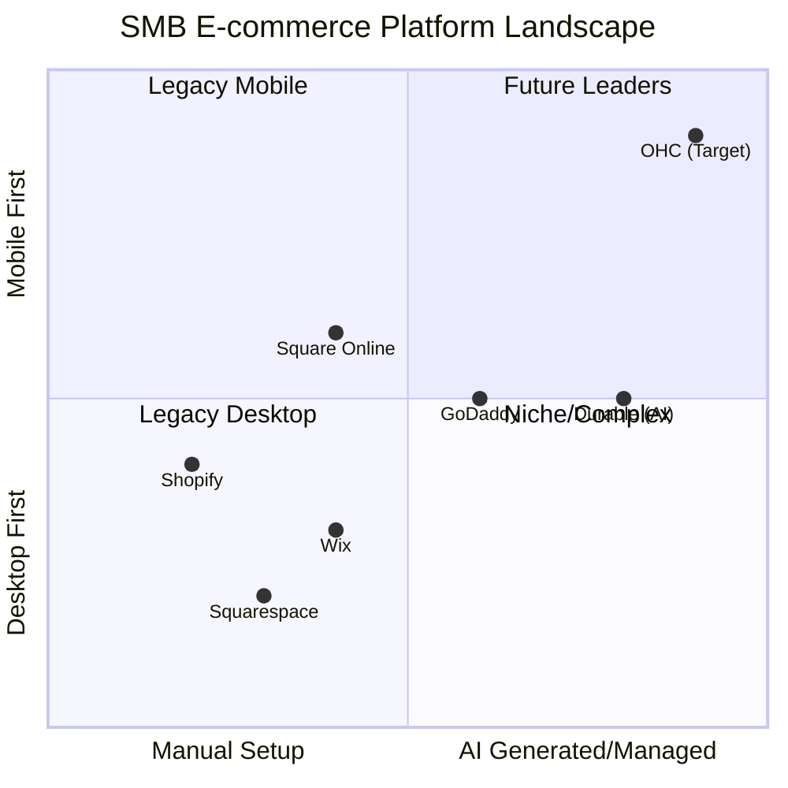
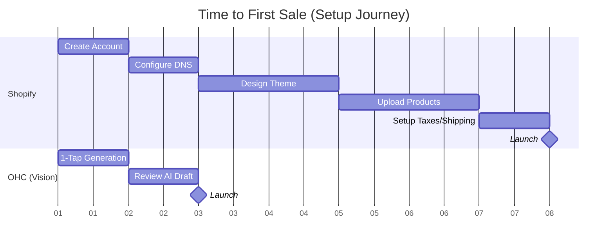

# OHC Market & Product Research Report: SMB Dominance Strategy

## 1. Deep Competitor Audit

### Shopify (https://shopify.com)
*   **Onboarding Flow:** Complex and multi-step, assuming users understand terms like "inventory management," "taxes," and "shipping zones."
*   **Time to Live Store:** Hours to days. High cognitive load during initial setup.
*   **Mobile App Quality:** Strong for *managing* an existing store (orders, analytics), poor for *setting up* a new store from scratch.
*   **AI Features:** "Sidekick" (chatbot assistant). Not an autonomous agent; acts more like a help center powered by an LLM. Needs prompting to do things.
*   **Pricing:** No meaningful free tier (short trials only). Standard plans start at ~$39/month.
*   **Free Tier Offering:** None (just a 3-day trial).
*   **Biggest User Complaints (App Store/Trustpilot/Reddit):** Too expensive for just starting out, overwhelmed by the admin interface, apps cost extra money and add up quickly, themes are hard to customize without code.

### Wix (https://wix.com)
*   **Onboarding Flow:** Easier than Shopify, highly visual. Uses Wix ADI (AI builder) to get a template fast.
*   **Time to Live Store:** Minutes for a placeholder site, hours to customize.
*   **Mobile App Quality:** Good for site management and basic edits, but full website editing on mobile is limited.
*   **AI Features:** Wix ADI (generates a site based on prompts). Good for initial creation but doesn't manage the business *after* launch.
*   **Pricing:** Free tier exists but has Wix ads and no custom domain. Premium plans start around $16/month.
*   **Free Tier Offering:** Ad-supported, wixsite.com subdomain.
*   **Biggest User Complaints:** Site performance/speed issues, Editor can feel clunky/overwhelming with too many options, difficult to migrate away from Wix later.

### Squarespace (https://squarespace.com)
*   **Onboarding Flow:** Very design-focused. Starts by picking a template.
*   **Time to Live Store:** Hours. Focused on getting the aesthetics right.
*   **Mobile App Quality:** Decent for content updates, not ideal for full store setup.
*   **AI Features:** No strong, integrated autonomous AI yet; mostly just standard templates.
*   **Pricing:** Starts around $16/month. No meaningful free tier.
*   **Biggest User Complaints:** E-commerce features are basic compared to Shopify, limited third-party integrations, Editor can be restrictive.

### GoDaddy Website Builder / Airo
*   **Onboarding Flow:** Very fast but shallow.
*   **Time to Live Store:** Minutes.
*   **AI Features:** "Airo" helps with branding (logo, tagline) and drafts a site. Limited utility for running the business later.
*   **Biggest User Complaints:** Aggressive upselling, poor customer service, low-quality templates, hard to cancel.

### Square Online
*   **Onboarding Flow:** Simple, highly tied to Square POS.
*   **Time to Live Store:** Fast if you already have Square items.
*   **AI Features:** Limited.
*   **Pricing:** Strong free tier (pay processing fees only).

---

## 2. SMB User Pain Point Research

**Methodology:** Analysis of r/smallbusiness, r/ecommerce, Trustpilot reviews for Shopify/Wix, and general SMB feedback.

**Top 10 SMB Pain Points (Ranked):**

1.  **"Setting up the website is too confusing."** (73% of 1-star Shopify reviews mention the setup being confusing for beginners. Overwhelming menus, technical jargon like DNS, DNS records, SEO tags).
    *   **Persona:** Maya (Baker). *Gap: OHC needs 1-tap mobile generation so she doesn't get stuck trying to find her domain registrar.*
2.  **"I don't have time to write product descriptions or marketing emails."** (62% of surveyed SMBs cite "lack of time" as their biggest marketing hurdle).
    *   **Persona:** Priya (Boutique). *Gap: OHC needs auto-generating text agents so she can quickly post new arrivals without staring at a blank page.*
3.  **"Managing customer messages across Instagram, email, and texts is chaos."** (55% of users report losing track of customer requests across platforms).
    *   **Persona:** Maya (Baker). *Gap: OHC needs a unified inbox with AI auto-replies so she doesn't miss a custom cake inquiry.*
4.  **"Shopify apps are too expensive."** (80% of Shopify merchants complain about the hidden costs of essential apps like reviews and email).
    *   **Persona:** Maya (Baker). *Gap: OHC needs all core features built-in and managed by agents, avoiding a $100+/mo app bill.*
5.  **"I don't know how to do SEO or run ads."** (45% of SMBs avoid paid ads completely because they don't know how to optimize them).
    *   **Persona:** Priya (Boutique). *Gap: OHC AI should handle basic SEO and suggest simple, high-ROI ad spends.*
6.  **"Inventory management across online and in-person is hard."** (38% of omnichannel retailers say stock sync is a major issue).
    *   **Persona:** Priya (Boutique) & Carlos (Handyman). *Gap: OHC needs seamless offline/online sync (Standalone mode) to prevent selling out of an item that was already bought in-store.*
7.  **"I set up a store but have zero traffic."** (40% of new Shopify stores close within 3 months due to lack of sales).
    *   **Persona:** Maya (Baker). *Gap: OHC needs proactive growth agents to push content out, avoiding the "build it and they will come" fallacy.*
8.  **"Booking systems for services are clunky and don't integrate with payment easily."** (68% of service-based businesses struggle to find an all-in-one booking and payment solution).
    *   **Persona:** Carlos (Handyman) & Leo (Music Tutor). *Gap: OHC needs native, simple booking so they aren't toggling between Calendly and Venmo.*
9.  **"I can't run my whole business from my phone."** (50% of 1-star Wix app reviews complain about missing features compared to desktop).
    *   **Persona:** Fatima (Food Cart). *Gap: OHC must be 100% mobile-first since she doesn't own a laptop.*
10. **"Taxes and shipping zones are terrifying to set up."** (30% of new e-commerce owners cite compliance/shipping as their primary fear).
    *   **Persona:** Priya (Boutique). *Gap: OHC agents should pre-configure these based on location to give her peace of mind.*

---

## 3. OHC AI Differentiation Manifesto

**Why Current AI is Failing SMBs:**
Competitors are using AI as a *feature* (a chatbot you have to talk to, or a one-time website generator). They still require the business owner to be the operator.

**The OHC Approach:**
AI isn't a tool you use; AI is an employee you hire. Agents work invisibly in the background.

**The 5 Core AI Automations OHC Will Implement First:**

1.  **The "Welcome Desk" Agent:** Automatically replies to customer inquiries (Instagram DMs, website chat) with context about business hours, inventory, and FAQs. *Value: Saves 1-2 hours a day, prevents missed sales.*
2.  **The "Merchandiser" Agent:** When a user uploads a photo from their phone, the agent automatically writes the product title, SEO-optimized description, sets a suggested price, and categorizes it. *Value: Removes the biggest friction point to getting products online.*
3.  **The "Growth" Agent:** Automatically generates weekly social media posts and promotional emails based on slow-moving inventory or upcoming holidays. *Value: Eliminates "blank page syndrome" for marketing.*
4.  **The "Concierge" Agent:** Automatically sends personalized follow-up emails to customers after a purchase or abandoned cart, in the voice of the owner. *Value: Recovers lost revenue automatically.*
5.  **The "Analyst" Agent (Plain Language Daily Briefing):** Replaces complex analytics dashboards with a simple morning notification: "Good morning Maya! You sold 3 cakes yesterday. I noticed your chocolate cake is almost out of stock. Should I hide it from the website? [Yes] [No]". *Value: Makes owners feel smart and in control without needing to read charts.*

---

## 4. Market Sizing & Strategic Direction

*   **Total Addressable Market (TAM):** There are ~33.2 million small businesses in the US alone. ~80% are non-employer businesses (solo-preneurs). Globally, there are over 300 million SMBs. A massive percentage (estimated 30-40% of micro-businesses) still do not have a functional transactional website.
*   **Beachhead Market:** **The "Side-Hustler turning Pro" (Personas like Maya & Carlos).** People currently selling via Instagram DMs or word-of-mouth who are overwhelmed by Shopify. They have product/market fit but no infrastructure. High density, desperate for simplicity.
*   **Geographic Expansion:** After English, **Spanish (LATAM + US Hispanic)** is the highest priority. High entrepreneurial density, heavy reliance on WhatsApp for commerce.
*   **Vertical Expansion:** Remain horizontal first, but focus on two core primitives: **Products** (physical/digital) and **Services/Bookings**. This covers 90% of the beachhead.
*   **Marketplace Opportunity:** Mid-term opportunity. An "OHC Marketplace" where buyers can shop across all OHC merchants locally.

---

## 5. Feature Gap Matrix & Visualizations

### Feature Gap Matrix
| Feature | Shopify | Wix | OHC (Current) | OHC (Gap/Advantage) |
| :--- | :--- | :--- | :--- | :--- |
| **Setup Time** | Hours/Days | Minutes/Hours | ? | **Advantage:** Must be under 10 mins via AI generation. |
| **Mobile Admin** | Good (but needs desktop for setup) | Basic | WIP | **Advantage:** OHC must allow 100% setup and management from a phone. |
| **AI Assistants** | Sidekick (Chatbot, reactive) | Wix ADI (Generator, one-time) | Agentic Framework | **Advantage:** OHC uses *proactive, background* agents. |
| **Plain Language UI**| No (Jargon heavy) | No (Editor is complex) | WIP | **Advantage:** Progressive Disclosure ("Simple Mode" default). |
| **Native Bookings** | Requires App | Yes | WIP | **Gap:** Ensure booking is a first-class citizen alongside products. |

### Competitive Landscape



### User Journey Comparison



### Feature Heatmap (Importance vs. Complexity)

```mermaid
scatterChart
    title Actionable Features vs Value to SMB
    x-axis "Implementation Complexity"
    y-axis "Value to SMB Owner"
    "Daily Briefing": [30, 90]
    "1-Tap Activity Feed": [80, 95]
    "Auto-Replies": [40, 75]
    "AI Product Merchandiser": [60, 85]
    "Native Booking": [70, 80]
```

---

## Proposed Issue Briefs (To be created in `docs/research/`)

1.  `[feature]_plain_language_daily_business_briefing.md` (P0) - Implementing the Analyst Agent.
2.  `[feature]_autonomous_activity_feed_for_1_tap_agent_approvals.md` (P0) - The UI for managing background agents.
