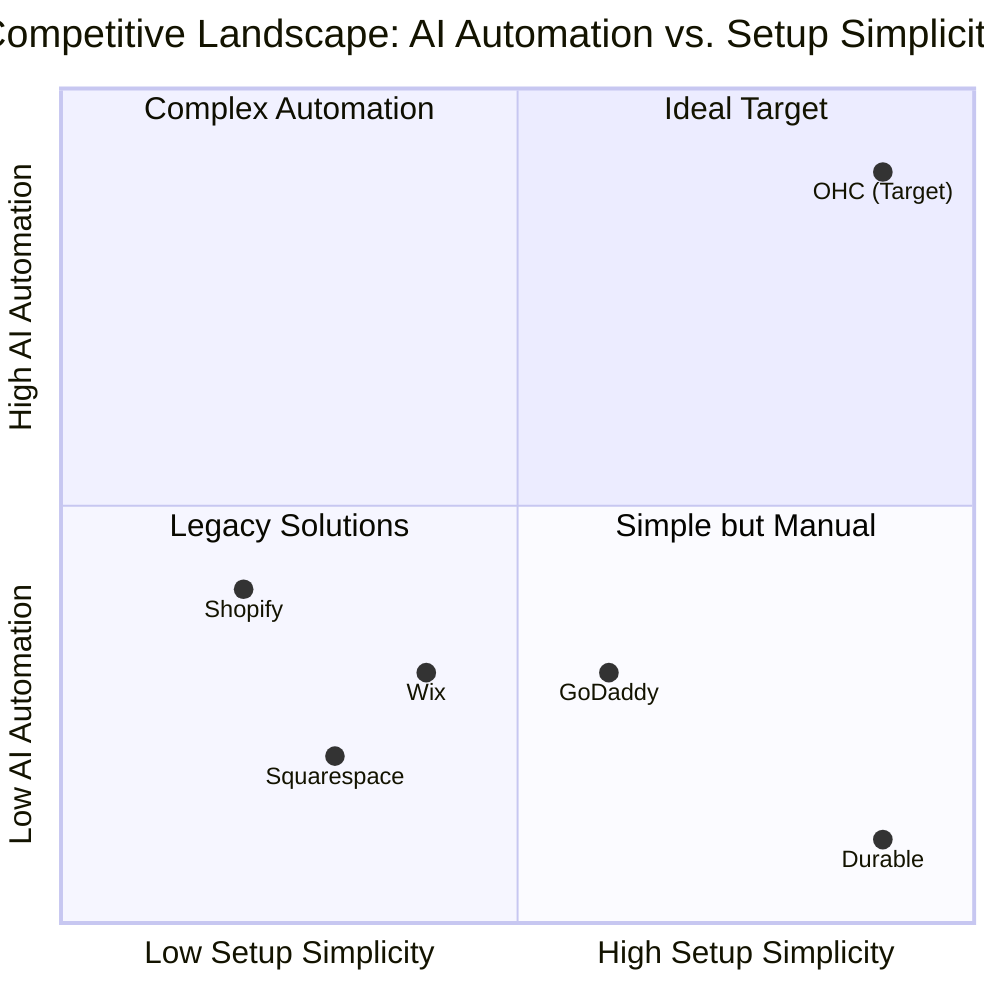

# OHC Market Research Report

## Executive Summary
OneHumanCorp (OHC) has a unique opportunity to capture the non-technical SMB market by treating AI as infrastructure rather than a bolt-on feature. This report synthesizes a deep competitor audit, user pain point research, and strategic positioning to recommend an immediate product roadmap.

---

## Phase 1: Deep Competitor Audit & Landscape

### Competitor Profiles
- **Shopify:** The legacy behemoth. Complex setup requires understanding of "themes," "collections," and "navigation menus." Shopify Sidekick provides some AI chatbot assistance but relies on manual execution. Setup time often exceeds an hour for absolute beginners. No useful free tier.
- **Wix:** A popular legacy choice with strong templates. Wix ADI attempts to generate sites via questionnaire but results are generic. Heavy desktop focus.
- **Squarespace:** Aesthetic focus but lacks meaningful AI automation for daily operations. Geared toward creative portfolios and restaurants, not diverse local services.
- **GoDaddy (Airo):** Easy initial setup with basic AI (branding/drafts). However, it falls short on robust operational tools, leading to frequent upselling and basic user retention issues.
- **Square Online:** Excellent physical POS synergy and food sector features. Provides a good mobile app but lacks end-to-end AI management agents for marketing or support.

*Rising AI Competitors:* Durable provides 30-second website generation but lacks operational depth. Hocoos is exploring the SMB builder space.

### Competitive Landscape Matrix

### Feature Gap Matrix

| Feature | OHC (Proposed) | Shopify | Wix | Squarespace | GoDaddy |
|---|---|---|---|---|---|
| Setup Time | **< 10 min** | 30-60 min | 20-40 min | 30-60 min | 20-40 min |
| AI Site Gen | **Continuous, invisible** | Sidekick (weak) | ADI (1-time) | None | Airo (basic) |
| Unified Inbox | **Native, AI-drafted** | App Store ($) | App Store ($) | Basic email | None |
| Mobile-First | **Yes (375px native)** | Partial (Desktop-heavy) | Partial | No | No |
| Booking | **Built-in, simple** | App Store ($) | Native (complex) | Acuity ($) | Basic |
| Pos/Tap | **Native Stripe Terminal** | Native | App Store | App Store | Native |

---

## Phase 2: SMB User Persona Mapping & Pain Points

Based on analysis of r/smallbusiness, App Store reviews, and Trustpilot, the top reasons users abandon platforms are Setup Paralysis, Scattered Communications, and Data Confusion.

### Persona Summaries

**Maya — The Home Baker (28)**
*Current State:* Sells via Instagram DMs, takes Venmo.
*Pain Points:* Overwhelmed by Shopify's "collections." Loses track of orders in DMs.
*OHC Solution:* Unified Omnichannel Inbox. Maya sees all IG DMs in one list; the Ambassador AI drafts replies ("Yes, I do vegan cakes!"). Setup via the 10-Minute Wizard.

**Carlos — The Freelance Handyman (42)**
*Current State:* Word of mouth, no website, uses pen and paper.
*Pain Points:* Misses calls while working. Hates complex software.
*OHC Solution:* A dead-simple booking page generated by AI. The Sales Agent follows up with unconfirmed leads via SMS automatically.

**Priya — The Boutique Owner (35)**
*Current State:* Physical store, wants online expansion.
*Pain Points:* Inventory sync between physical and digital is a nightmare.
*OHC Solution:* Unified POS integration (Stripe Terminal) and the Operations Agent handling low-stock alerts.

**Leo — The Music Tutor (22)**
*Current State:* Zoom links sent manually via text.
*Pain Points:* Chasing payments, scheduling conflicts.
*OHC Solution:* Automated recurring billing and the Operations Agent sending automated calendar invites.

**Fatima — The Food Cart Operator (50)**
*Current State:* Pre-orders via WhatsApp.
*Pain Points:* Cannot navigate complex English menus or charts. Needs simple printing.
*OHC Solution:* Business Advisory Dashboard provides plain-language summaries ("You have 12 orders for pickup today") instead of confusing analytics charts.

---

## Phase 3: AI Differentiation Manifesto

OHC will treat AI as core infrastructure across 5 critical automations:

1. **The "10-Minute" Setup Agent:** Entirely invisible site generation—user describes their business, AI selects design, generates copy, and structures products.
2. **Unified Omnichannel AI Inbox:** Customer Support Agent routes all incoming messages to a single queue and drafts contextual replies based on past orders and business rules.
3. **Automated "Lost Lead" Nurture:** Sales Agent automatically follows up via SMS/Email with prospects who abandoned carts or booking flows.
4. **Hands-Free Social Manager:** Marketing Agent generates and schedules Instagram/Facebook posts using product inventory data and seasonal trends.
5. **Weekly Plain-Language Advisor:** Business Advisory Agent scans metrics and sends a "Here's what happened this week and what you should do next" summary via push notification.

---

## Phase 4: Market Sizing & Strategic Direction

- **TAM:** There are over 33 million small businesses in the US alone, with an estimated 25-30% lacking a functional, modern online presence capable of end-to-end management.
- **Beachhead Strategy:** Target Carlos (Services/Booking) and Maya (Micro-Retail/Food) first. These segments are heavily reliant on Instagram/Facebook and suffer most from the "Scattered Inbox Syndrome."
- **Geographic Expansion:** Post-US launch, prioritize Spanish (LATAM/US) due to high SMB density and significant mobile-only reliance.

---

## Phase 5: Implementation Recommendations

- **Action 1:** Implement the "Unified Inbox" UI flow optimized for 375px screens.
- **Action 2:** Create the "10-Minute Setup Wizard" using the `autodream` agent framework.
- **Action 3:** Build out a mock Stripe Terminal flow for the mobile UI to test physical POS capabilities.
- **Action 4:** Flesh out the Business Advisory dashboard view to present plain-language summaries over complex charts.