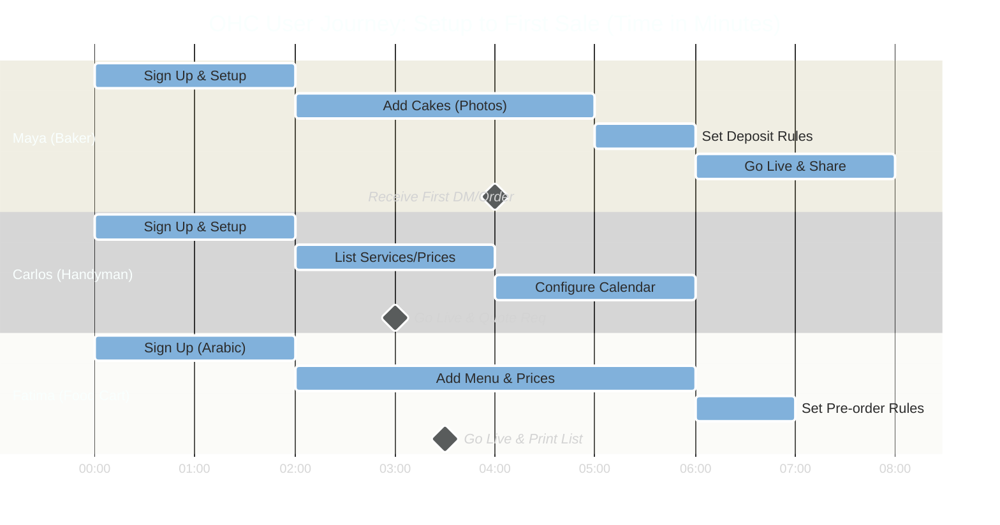
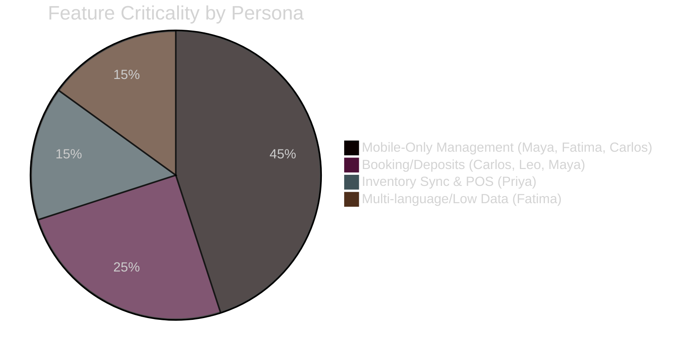
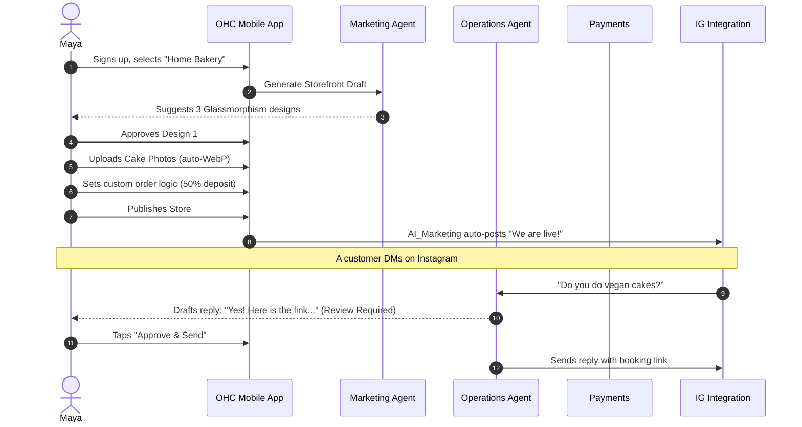
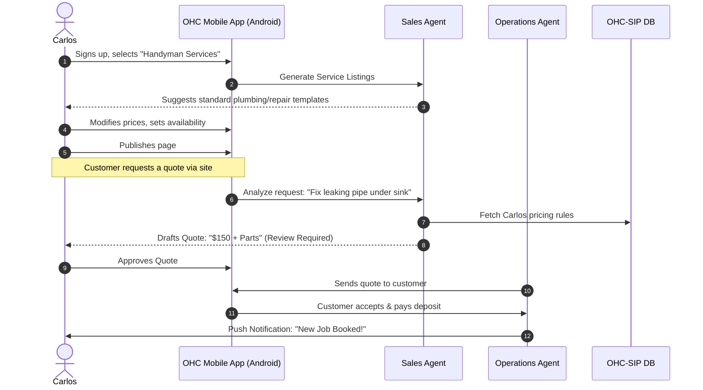
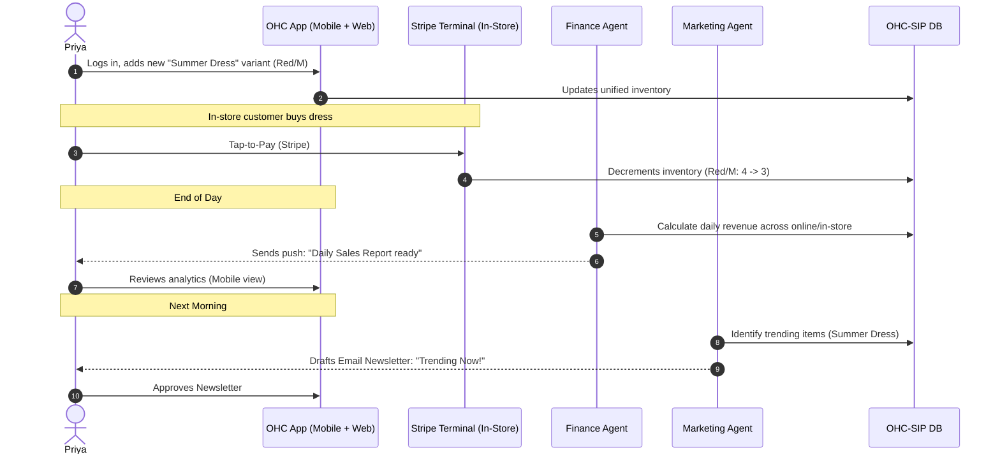
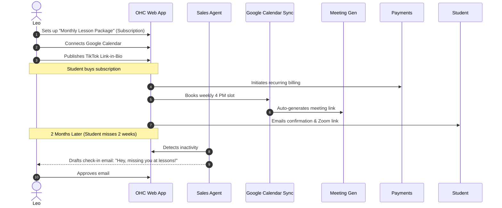
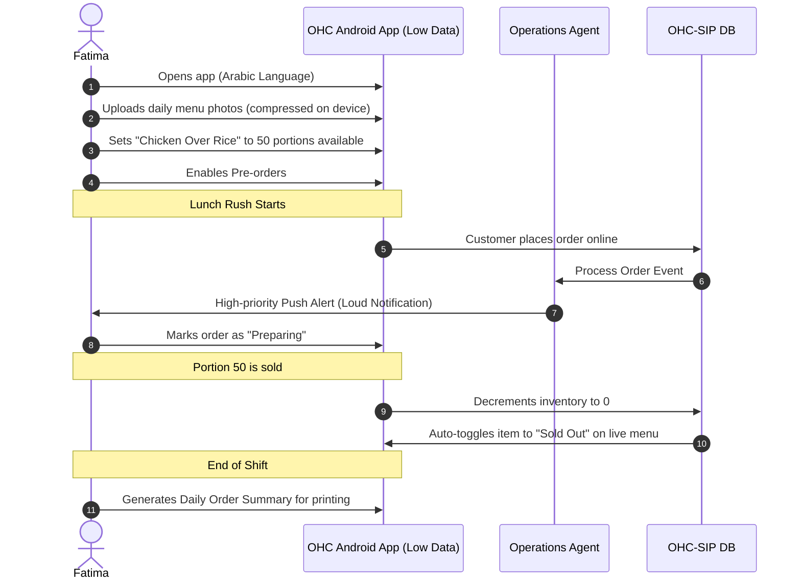

# Business Journey Architecture

## Problem Statement
The OHC platform must successfully guide a diverse range of non-technical users from initial discovery to managing a thriving online business, all from a mobile interface in under 10 minutes. The lack of a unified mapping of these end-to-end user journeys (from Acquisition to Referral) causes friction points that result in abandonment. Understanding the specific needs of diverse personas (like Maya the Baker, Carlos the Handyman, Priya the Boutique Owner, Leo the Music Tutor, and Fatima the Food Cart Operator) is critical to building intuitive AI-assisted workflows that eliminate technical complexity.

## Research Report
### Competitive Landscape
OHC targets the zero-technical-knowledge demographic, aiming for a setup time under 10 minutes from a mobile device.

| Feature | OHC | Shopify | Wix | Squarespace | GoDaddy |
|---|---|---|---|---|---|
| **Setup Time** | **< 10 min** | 30-60 min | 20-40 min | 30-60 min | 20-40 min |
| **Tech Knowledge Needed** | **Zero** | Low | Low | Low | Low |
| **Mobile-First Management**| **Yes** | Partial | Partial | No | No |
| **AI Agents (Invisible)** | **Yes (Built-in)** | Sidekick (Chat) | Wix AI | Limited | Airo (Limited) |
| **Target User** | **Non-technical** | SMB / Tech-Savvy | Semi-technical | Creative | Basic user |
| **Free Tier** | **Yes (Useful)** | No | Yes (Limited) | No | No |

### Persona Pain Points Summary
1.  **Maya (Home Baker):** Overwhelmed by complex e-commerce settings; needs mobile-only deposit payments and AI for simple DM inquiries.
2.  **Carlos (Freelance Handyman):** Relies on word-of-mouth; needs simple service listings, booking with deposits, and automated quote generation.
3.  **Priya (Boutique Owner):** Needs omni-channel inventory sync, tap-to-pay POS, and easy-to-read daily analytics.
4.  **Leo (Music Tutor):** Needs recurring subscription billing, zoom link generation, and a portfolio page for his TikTok "link-in-bio".
5.  **Fatima (Food Cart Operator):** Needs low-data mobile functionality, pre-order management, multi-language support (Arabic/English), and clear sold-out toggles.

## Design Doc: High-Level Architecture & User Journeys

### User Journey Comparisons



### Feature Gap Heatmap



### Persona Sequence Diagrams

#### 1. Maya (The Home Baker)


#### 2. Carlos (The Freelance Handyman)


#### 3. Priya (The Boutique Owner)


#### 4. Leo (The Music Tutor)


#### 5. Fatima (The Food Cart Operator)


### Key Design Decisions
1.  **Mobile-First is Mandatory:** All critical setup and management flows must be fully functional and optimized for a 375px screen size. Horizontal scrolling is prohibited.
2.  **AI as Background Infrastructure:** AI departments (Marketing, Sales, Ops, Finance) are event-driven and require 1-tap approvals ("Draft-for-Review") for high-risk external actions, building trust with non-technical users.
3.  **Unified State via KAIROS:** A single source of truth (OHC-SIP DB) ensures that an in-store POS sale instantly updates the online storefront inventory, triggering appropriate AI alerts if stock runs low.
4.  **Low-Data & Resilience Requirements:** For personas like Fatima, critical functionality (menu updates, offline order viewing) must work on slow networks with heavy media compression applied immediately.

### Actionable Recommendations
- **Implement 1-Tap Approvals:** Prioritize the mobile UX for the AI "Draft-for-Review" queue. Business owners must be able to confidently approve generated quotes, emails, or social posts with a single tap.
- **Develop Granular Onboarding:** Create branching onboarding flows. Maya's setup (deposits/images) is distinct from Fatima's (menu/sold-out toggles). Limit initial inputs to achieve "Live" status in under 10 minutes.
- **Enforce UI Standards:** Apply the Glassmorphism design system (`backdrop-filter: blur(20px) saturate(200%)`, Outfit/Inter fonts) across all persona interfaces to ensure a premium feel regardless of the business type.

## Implementation Prompt
**To the Implementer:**
Implement the branching onboarding flow and the unified mobile dashboard that supports the five distinct business types (Physical Product, Digital Product, Service/Booking, Food/Beverage, Subscription). Focus on the Critical User Journey (CUJ) where a new user selects their business type and completes the minimum necessary inputs to publish a live storefront in under 10 minutes. Ensure all UI components adhere to the OHC Premium Token library (Glassmorphism, 375px base breakpoint) and utilize Riverpod for state management. E2E tests must cover the successful setup for at least two diverse personas (e.g., Maya the Baker and Carlos the Handyman).

```yaml
issue_id: "arch-001-business-journeys"
priority: "P1"
estimated_scope: "Large"
```
