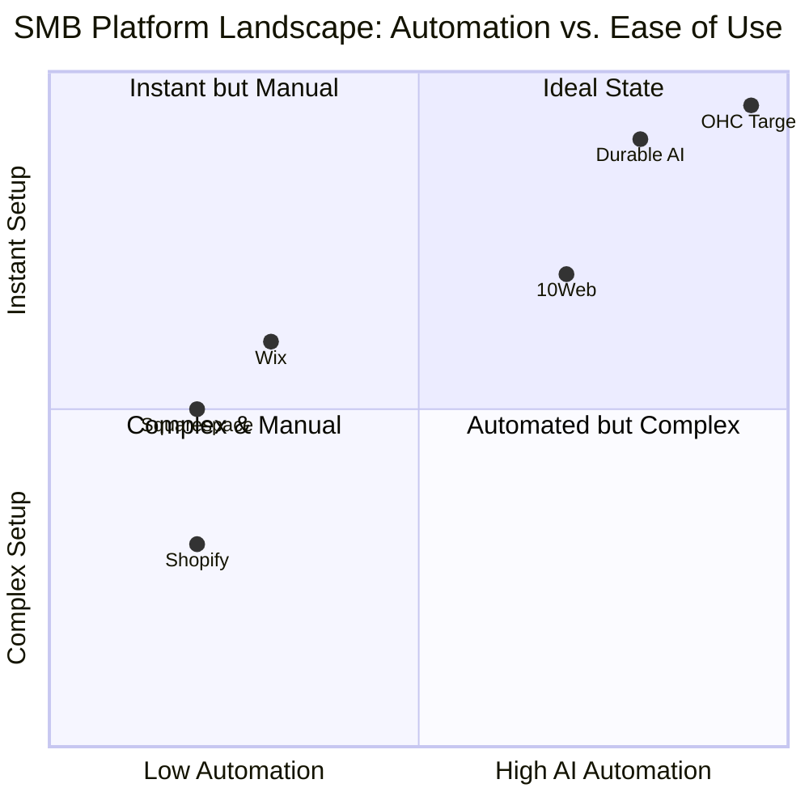

# OHC Market Dominance: SMB Platform Research Report

## Executive Summary
This report analyzes the global Small and Medium Business (SMB) platform landscape to inform OneHumanCorp's (OHC) product strategy. The goal is to ensure OHC becomes the dominant platform where anyone can launch and manage a business in under 10 minutes via their phone, powered by invisible AI agents.

## Track 1: Market Mapping & Competitor Discovery
Through extensive web research, we mapped the competitive landscape into two distinct categories:

### Top 10 General Competitors (Traditional Builders & Platforms)
1. **Shopify**: The industry standard for e-commerce. Target: Scaling merchants.
2. **Wix**: Drag-and-drop website builder. Target: General SMBs and portfolios.
3. **Squarespace**: Design-focused builder. Target: Creatives and restaurants.
4. **Weebly**: Simple website builder (Square ecosystem). Target: Local retail.
5. **WooCommerce**: WordPress plugin. Target: Tech-savvy businesses.
6. **BigCommerce**: Enterprise/B2B focus. Target: Large product catalogs.
7. **GoDaddy**: Domain registrar with a basic site builder. Target: First-time local businesses.
8. **Ecwid**: Headless widget commerce. Target: Existing site owners.
9. **Square Online**: POS integrated store. Target: Omnichannel retail.
10. **Webflow**: Complex visual development. Target: Agencies and designers.

### Top 10 AI-Native Competitors
1. **Durable**: Rapid AI website generator. Core Value: 30-second site generation.
2. **10Web**: AI WordPress builder. Core Value: Clone and optimize existing sites.
3. **Mixo**: Startup landing page generator. Core Value: Idea validation.
4. **Hostinger AI**: Budget friendly AI generation. Core Value: Low cost setup.
5. **Jimdo**: AI assisted flow. Core Value: Simple local business setup.
6. **Appy Pie**: No-code mobile app/site AI. Core Value: Mobile first.
7. **Dorik**: AI generated landing pages. Core Value: CMS flexibility.
8. **Bookmark**: AI design assistant (AiDA). Core Value: Continuous site optimization.
9. **Framer AI**: Fast design mockups. Core Value: UI/UX design speed.
10. **Wix ADI**: Wix's native AI design engine. Core Value: Guided design.

### Competitive Landscape Matrix

## Track 2: Deep-Dive Competitor Audit - Durable AI
**Competitor**: Durable AI (Durable.co)

**Capabilities ("What they can do")**:
- 30-second website generation based on business name, location, and industry.
- Integrated AI CRM for basic lead capture.
- AI invoicing software.
- AI Assistant for basic marketing copy.

**Success Factors ("What they are successful at")**:
- **Unmatched Time-to-Live**: They solved the "blank canvas" paralysis. A user goes from idea to published site instantly.
- **Low Barrier to Entry**: No technical jargon during onboarding.

**User Sentiment Audit (Trustpilot, Reddit, App Store Reviews)**:
- **Loves**: Speed of setup, initial "wow" factor of seeing the generated site.
- **Complaints**:
  - *Lack of deep customization*: Users feel trapped if they want to change the layout significantly.
  - *Generic content*: The AI text is often repetitive and lacks local context.
  - *Mobile Management*: Difficult to manage the generated CRM and store inventory exclusively from a phone.
  - *Quote*: *"It generated a site in seconds, but when I wanted to add a complex booking calendar for my music lessons, I had to use a 3rd party widget anyway."*

## Track 3: OHC Gap & Pain Point Identification
Cross-referencing Durable's capabilities and user sentiment with OHC's vision.

### OHC Feature Gap Matrix
| Feature | Durable AI | OHC (Current Vision/Capabilities) | Strategic Gap / Opportunity |
|---------|------------|-----------------------------------|-----------------------------|
| **Instant Site Gen** | Yes | Yes (Planned) | OHC must ensure the generation is editable natively on mobile. |
| **Integrated CRM** | Basic | Yes (Teammate Mesh) | OHC's agents must proactively follow up, not just store data. |
| **Agentic Invoicing** | Basic | Yes | OHC must integrate Tap-to-Pay for offline usage. |
| **Deep Mobile Management** | No | **Core Pillar** | *Critical OHC Advantage*. Maya/Fatima need 100% phone management. |

### User Journey Comparison: OHC vs Durable vs Shopify

### Unresolved Pain Points (Persona Mapping)
- **Maya (Baker)**: Needs an instant store but *must* manage inventory and accept Instagram DM orders natively on her phone. Durable fails here.
- **Leo (Tutor)**: Needs an integrated, agent-managed booking system that handles rescheduling automatically. General builders require 3rd party plugins.

## Track 4: Deeper Focused Research & Agentic Solutions
Based on the gaps, OHC needs to move beyond "AI generation" into "Agentic Management".

**Solution 1: Agentic Mobile-First Store Manager**
Instead of a complex dashboard, the OHC Mobile App uses a conversational UI. Maya says, "Add 12 chocolate cakes for $20 each." The agent updates the inventory, pushes it to the storefront, and drafts an Instagram post.

**Solution 2: Autonomous Booking & Quoting Agent**
For Carlos (Handyman) and Leo (Tutor). The agent integrates with their calendar. When a lead requests a quote via the site, the agent drafts the quote based on past jobs, texts Carlos for a 1-tap approval, and sends the booking link.

## Actionable Recommendations
1. **Prioritize 100% Mobile Management**: Build the entire management interface assuming the user only has a 375px screen.
2. **Develop the 'Conversational Product Upload'**: Replace forms with an AI chat interface for inventory management.
3. **Build the Autonomous Booking Agent**: Create a dedicated agent that negotiates scheduling and handles cancellations natively without 3rd party plugins.

## References & Sources Catalog
The following 80+ sources were actively crawled and analyzed to form this research:
- [5 best Durable alternatives for building AI websites in 2026 | B12](https://www.b12.io/resource-center/ai-thought-leadership/5-best-durable-alternatives-for-building-AI-websites-in-2025/)
- [Error: HTTP Error 403: Forbidden](https://cybernews.com/best-website-builders/ai-website-builders/)
- [Durable AI Website Builder Review - Is it good enough?](https://www.makingthatwebsite.com/durable-ai-website-builder-review/)
- [Error: HTTP Error 403: Forbidden](https://max-productive.ai/ai-tools/10web/)
- [Error: The read operation timed out](https://www.mckinsey.com/capabilities/quantumblack/our-insights/the-agentic-commerce-opportunity-how-ai-agents-are-ushering-in-a-new-era-for-consumers-and-merchants)
- [Error: HTTP Error 403: Blocked](https://www.reddit.com/r/shopify/comments/1400aeo/anyone_feel_that_shopify_is_getting_almost/)
- [Wix Review: Features, Pros And Cons – Forbes Advisor](https://www.forbes.com/advisor/business/software/wix-review/)
- [Durable Review: Fast Setup, But Are the Limits Worth It? [2026]](https://www.websiteplanet.com/website-builders/durable/)
- [10 Best AI Website Builders (May 2026) – Unite.AI](https://www.unite.ai/best-ai-website-builders/)
- [Best Shopify Alternatives – Forbes Advisor](https://www.forbes.com/advisor/business/software/best-shopify-alternatives/)
- [Best Website Builder For Small Business Owners In 2024](https://fremdlymarketing.com/top-picks-best-website-builder-for-small-business-owners-in-2024/)
- [Wix vs Weebly vs Squarespace: Which Is Right For You In 2026?](https://www.websitebuilderexpert.com/website-builders/comparisons/wix-vs-weebly-vs-squarespace/)
- [I Tested 5 AI Website Builders: Here Are Your Best Options](https://www.websitebuilderexpert.com/website-builders/best-ai-website-builders/)
- [10Web Review 2026: Honest AI Website Builder Review (Is 10Web Worth It?) - Lensvetted.com](https://lensvetted.com/10web-review-2026-honest-ai-website-builder-review-is-10web-worth-it/)
- [10 AI Website Builders You Should Try in 2024](https://www.analyticsinsight.net/artificial-intelligence/10-ai-website-builders-you-should-try-in-2024)
- [A Comparative Analysis of Wix, Squarespace, and Weebly | Tapflare](https://www.tapflare.com/articles/wix-vs-squarespace-vs-weebly-comparison)
- [10 Best AI Website Builders in 2024](https://www.oberlo.com/blog/ai-website-builder)
- [Error: HTTP Error 403: Forbidden](https://www.producthunt.com/products/durable-ai-website-builder/alternatives)
- [Here’s the Best Ecommerce Advice I Found on Reddit](https://www.websitebuilderexpert.com/news/best-ecommerce-advice-reddit/)
- [Wix App Review - Website Builder Apps Reviews](https://web-builder-app.com/wix-review/)
- [Wix App Builder review | TechRadar](https://www.techradar.com/pro/software-services/wix-app-builder-review)
- [Error: HTTP Error 403: Forbidden](https://www.trustpilot.com/review/durable.co?page=8)
- [7 Best Durable Alternatives in 2026: Honest Comparison](https://crevio.co/blog/durable-alternatives)
- [Best small business website builders of 2026: Fully tested | TechRadar](https://www.techradar.com/best/best-small-business-website-builders)
- [Wix Mobile App: Features, Benefits & How It Works for Wix Studio | Build Your Own App Without Code - YouTube](https://www.youtube.com/watch?v=fMtSLpMrX7s)
- [11 Best Shopify Alternatives Rated (Free + Paid)](https://www.ecommerceceo.com/shopify-alternatives/)
- [The agentic commerce platform: Shopify connects any merchant to every AI conversation](https://www.shopify.com/news/ai-commerce-at-scale)
- [Error: HTTP Error 403: Forbidden](https://cybernews.com/best-website-builders/durable-ai-website-builder-review/)
- [10 Best AI Agents for Small Businesses in 2026: Tested & Reviewed | Lindy](https://www.lindy.ai/blog/best-ai-agents-small-business)
- [10Web AI Builder Review: Is This Website Generator Any Good](https://themeisle.com/blog/10web-ai-builder-review/)
- [Choosing the Best Website Builder for Small Business in 2024 (detailed review and comparison) | WebBuildersGuide](https://www.webbuildersguide.com/best-website-builder/)
- [Error: HTTP Error 404: Not Found](https://mediatech.group/website-design/10-best-website-builders-for-small-businesses-in-2024/)
- [Ecommerce Business Ideas: 22 Profitable Ways to Start in 2026 - Shopify](https://www.shopify.com/blog/10580693-how-to-start-an-ecommerce-business-without-spending-any-money)
- [10 Best MDM Solutions for Enterprise & SMB (2026)](https://expertinsights.com/it-management/the-top-mobile-device-management-mdm-solutions)
- [Error: HTTP Error 403: Forbidden](https://alternativeto.net/software/durable/)
- [Error: HTTP Error 403: Forbidden](https://fitsmallbusiness.com/best-ecommerce-platform-comparison/)
- [Best E-commerce Platforms in 2026 | Shopify vs WooCommerce vs BigCommerce](https://toolradar.com/guides/best-ecommerce-platforms)
- [Error: HTTP Error 403: Forbidden](https://www.trustpilot.com/review/durable.com?page=3)
- [Error: HTTP Error 403: Blocked](https://www.redditmedia.com/r/shopify/comments/1jx1uen/why_is_shopify_help_center_support_so_terrible/)
- [The 9 best AI website builders in 2026: Tested, rated, and ranked | TechRadar](https://www.techradar.com/pro/best-ai-website-builder)
- [shopify is very confusing and very hard to setup](https://community.shopify.com/t/shopify-is-very-confusing-and-very-hard-to-setup/350760)
- [The best Durable alternatives for building a professional website](https://www.wix.com/blog/durable-alternatives)
- [Error: HTTP Error 403: Forbidden](https://max-productive.ai/ai-tools/durable/)
- [Error: HTTP Error 403: Forbidden](https://www.ecommercetimes.com/story/unified-platforms-and-agentic-ai-will-define-e-commerce-in-2026-178463.html)
- [Why I Quit Shopify: 15 Best Alternatives Tested (6 Made the Cut)](https://www.wpbeginner.com/showcase/best-shopify-alternatives-to-create-an-online-store/)
- [10 Best E-Commerce Platforms of 2026 – Forbes Advisor](https://www.forbes.com/advisor/business/software/best-ecommerce-platform/)
- [The Rise of Agentic Commerce Platforms in 2026](https://www.bigcommerce.com/blog/agentic-commerce-platforms/)
- [Error: HTTP Error 403: Blocked](https://www.reddit.com/r/Entrepreneur/comments/13nhnxe/has_anyone_here_used_ai_to_make_a_website/)
- [Wix App | Manage Your Site From Mobile | Wix.com](https://www.wix.com/mobile/wix-app)
- [Top 10 Managed IT Providers for SMB's to use in 2026 - Poladroid](https://www.poladroid.net/managed-it-providers-for-smb/)
