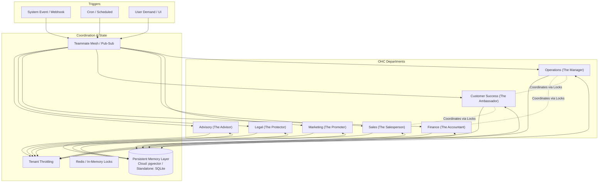

# [architecture] AI Agent Department Architecture Blueprint

## Problem Statement
Small business owners—whether they are a baker like Maya or a handyman like Carlos—are often overwhelmed by the technical and operational overhead of running their business. They must manage inventory, create websites, handle customer support, track finances, and ensure compliance without a dedicated staff. Existing tools either offer isolated chatbots or force owners to learn complex systems. There is a critical need for an invisible, continuous, and integrated "digital staff" that operates like functional business departments, proactively handling complexity and communicating in plain language, empowering non-technical owners to focus entirely on their craft.

## Research Report

### Competitive Analysis & Market Gap
| Competitor | AI Integration Level | Capabilities | Gap / Pain Point for OHC Personas |
|------------|----------------------|--------------|-----------------------------------|
| **Shopify** | Bolt-on (Sidekick) | Simple text/image generation | Isolated tool; not an autonomous integrated system. |
| **Wix** | Bolt-on | Basic chat, simple site gen | Requires manual prompting and connection of systems. |
| **Squarespace** | Surface-level | Site text generation | Lacks deep workflow automation (operations, finance). |
| **GoDaddy** | Surface-level | Promo generation | No multi-department coordination. |

**The OHC Unfair Advantage:** By treating AI as the core infrastructure and organizing it into "Departments" that mirror real-world business roles (Operations, Marketing, Sales, Customer Success, Finance, Legal, Advisory), we provide a full, invisible staff. This ensures the "zero technical knowledge required" mandate is met while providing robust, interconnected automation.

### Persona Pain Points Addressed
- **Maya (Baker):** Wants to wake up to sorted orders and drafted DM replies.
- **Carlos (Handyman):** Needs quotes generated automatically after a site visit without typing on a small screen.
- **Priya (Boutique):** Requires inventory synced between online/offline and immediate low-stock marketing.

## Design Doc

### Architecture Diagram

### Key Design Decisions
1. **Department Triggers:**
   - **On Schedule:** Tasks like weekly health reports (Advisor) or seasonal marketing campaigns (Promoter).
   - **On Event:** Reactive tasks such as an order completion triggering operations or an incoming Instagram DM triggering Customer Success.
   - **On Demand:** Directly invoked by the user from the mobile app (e.g., "Draft a new refund policy").
2. **Coordination & Communication:**
   - Departments coordinate via a Pub/Sub backplane (Teammate Mesh) and distributed locks (Redis for Cloud, in-memory for Standalone). For instance, when Operations processes a custom order, it signals Finance to manage the deposit and Customer Success to send a confirmation.
3. **Memory & Context:**
   - All past actions, customer profiles, and business rules are stored as embeddings in the Persistent Memory Layer (`pgvector` for Cloud, SQLite with vector extension for Standalone). This shared memory ensures continuity (e.g., Sales knows a customer’s previous issues resolved by Customer Success). Operations are strictly tenant-scoped.
4. **Approval Mechanisms:**
   - **Auto-Execute:** Routine tasks (like updating internal inventory counts) run without user intervention.
   - **Draft-for-Review:** High-stakes tasks (like generating legal contracts, issuing refunds, sending quotes, or external communication) create drafts requiring a simple 1-tap "Approve" from the user via the mobile app.
5. **Usage Budgeting:**
   - AI actions are tracked against tenant tier limits using Redis/PostgreSQL counters. When limits are approached, the Advisor suggests upgrading.

### Mobile UX Flow & UI Wireframes (375px First)
*Every screen adheres to the Visual Excellence Mandate: Glassmorphism (`backdrop-filter: blur(20px) saturate(200%)`), Outfit & Inter fonts, and ≥ 44x44px touch targets.*

- **Home Dashboard:** A feed of clean, glassmorphic cards summarizing department activities. "The Manager processed 5 orders" or "The Advisor has a new weekly report."
- **Action Required Notification:**
  1. **Trigger:** User receives a push notification: "The Ambassador drafted a reply to a new DM."
  2. **Review:** User taps the notification to open a 375px-optimized card displaying the drafted reply.
  3. **Action:** User taps a large, clear "Send" (Approve) or "Rewrite" (Demand trigger) button.
  4. **Conclusion:** State updates smoothly with a micro-animation, returning the user to the Home Dashboard.

## Implementation Prompt
**Task:** Implement the foundational AI Agent Department coordination system.
**CUJ:** Maya the baker receives a custom order request via Instagram DM. The system must autonomously route the event to the Customer Success department ("The Ambassador") to draft a confirmation and quote request, and to the Operations department ("The Manager") to tentatively schedule the request. Maya must be able to view these pending actions in her mobile dashboard and approve them with a single tap.
**Acceptance Criteria:**
- Define the base interface and triggers for AI Departments.
- Implement memory retrieval integration for context sharing between departments.
- Implement the "Draft-for-Review" vs "Auto-Execute" approval system with appropriate state tracking in the database.
- E2E tests must verify that an incoming event successfully invokes multiple departments, respects tenant throttling limits, and accurately persists memory. All E2E tests must traverse from the UI to the backend without mocking network requests (AI models may be mocked).
- Do not prescribe specific database schemas, API endpoints, or function signatures; implementers will design those details.

## Priority
P0

## Estimated Scope
Large
