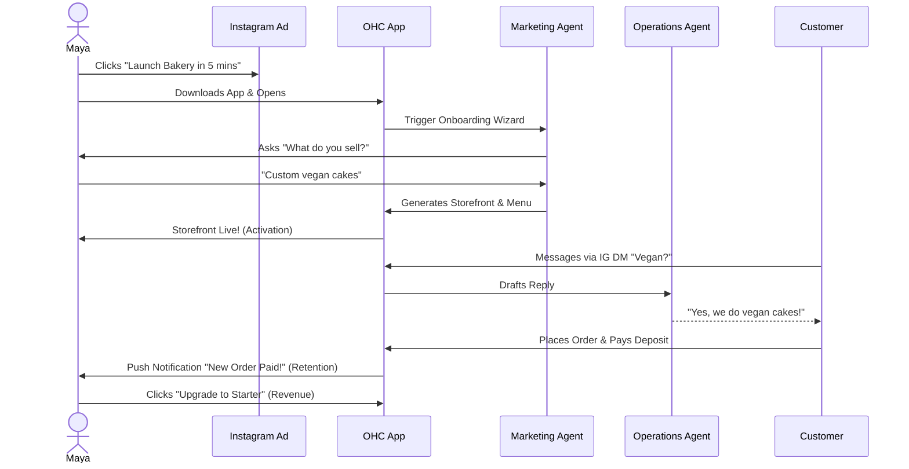
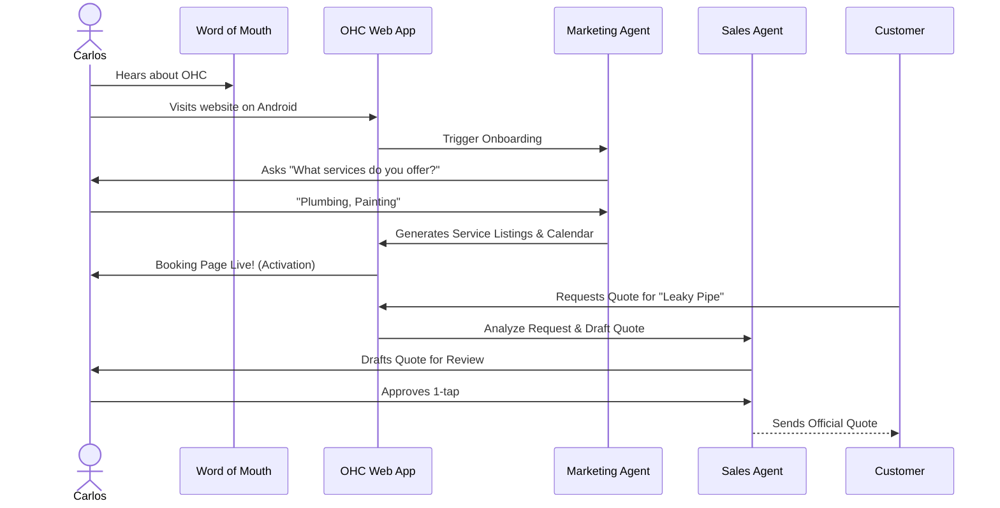
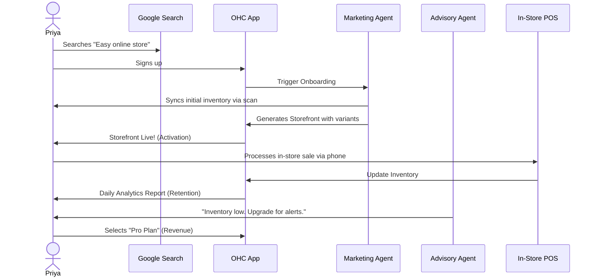
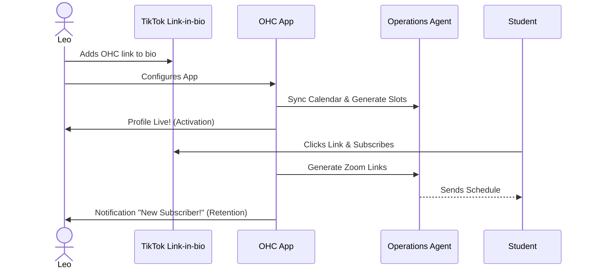
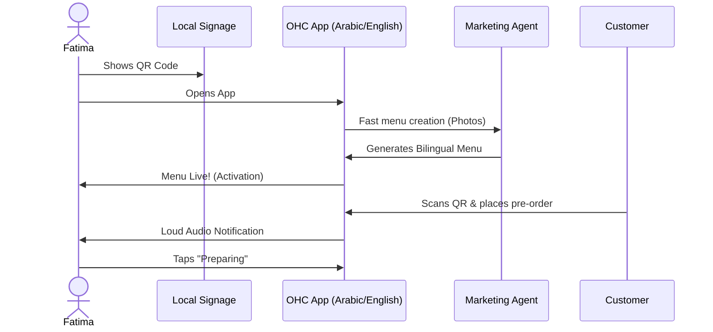
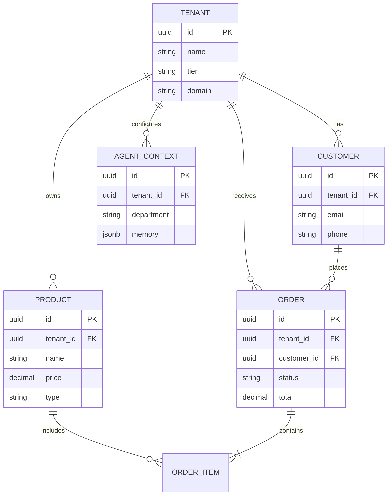

# Deep-Dive Architecture Report: Business Journey & System Evolution

## Executive Summary
This report defines the comprehensive end-to-end user journeys for OneHumanCorp (OHC) platform personas, capturing the core progression through Acquisition, Onboarding, Activation, Retention, Revenue, and Referral. The research synthesizes the current platform state, evolving the data model to support multi-tenancy and high-speed offline-first mobile usage, while seamlessly weaving AI departments into the business flow. All designs strictly adhere to the OHC Mobile-First Mandate and Visual Excellence criteria.

---

## Phase 1: Business Journey Mapping

### Core Principles
The guiding principle of OHC is to take a non-technical small business owner from zero to a live business in under 10 minutes. The journey removes all technical friction, hiding complexity behind conversational AI onboarding and progressive profiling.

### User Persona Journey Maps

#### 1. Maya (The Home Baker, 28)
**Goal:** Sell custom cakes via Instagram, manage deposits, offload DM replies.
- **Acquisition:** Clicks "Launch Bakery in 5 mins" via Instagram Ad.
- **Onboarding:** Downloads OHC. Guided by "The Promoter" (Marketing Agent), provides store name and primary product ("Custom vegan cakes").
- **Activation:** Live storefront generated instantly with photos and deposit rules.
- **Retention:** Receives push notifications on new orders and daily health reports.
- **Revenue:** Upgrades to Starter tier to handle more than 10 products and automated Instagram DM replies.
- **Referral:** Earns subscription credits by sharing her storefront builder link with other creators.

#### 2. Carlos (The Handyman, 42)
**Goal:** Reliable booking system, quote generator, unified inbox. Android-only.
- **Acquisition:** Word-of-mouth referral from another tradesperson.
- **Onboarding:** Enters basic trade ("Plumbing, Painting") and availability.
- **Activation:** Service listing page goes live with a built-in calendar and lead capture form.
- **Retention:** Push notification on new job inquiries.
- **Revenue:** Uses the "The Salesperson" agent to automatically generate quotes. When he hits 100 quotes, he upgrades.
- **Referral:** Invites sub-contractors to OHC to coordinate jobs.

#### 3. Priya (The Boutique Owner, 35)
**Goal:** Omnichannel store (physical POS + online), inventory sync, daily analytics.
- **Acquisition:** Organic search ("Easy online store for boutique").
- **Onboarding:** Scans barcode or imports basic CSV. "The Promoter" maps it to a digital catalog.
- **Activation:** E-commerce storefront goes live with variations (color/size).
- **Retention:** Daily "The Advisor" push notification detailing top sellers and inventory alerts.
- **Revenue:** Upgrades to Pro to get custom domain + SSL and multi-store inventory.
- **Referral:** Posts store analytics on business forums, driving inbound leads.

#### 4. Leo (The Music Tutor, 22)
**Goal:** Subscriptions, calendar sync, Zoom automation, TikTok integration.
- **Acquisition:** Sees OHC link in another creator's bio.
- **Onboarding:** Authorizes Google Calendar. "The Manager" auto-generates available slots.
- **Activation:** Link-in-bio portfolio is published.
- **Retention:** Receives "New Subscriber" alerts.
- **Revenue:** Upgrades for recurring subscription billing features.
- **Referral:** Shares affiliate code in his TikTok bio.

#### 5. Fatima (The Food Cart Operator, 50)
**Goal:** Fast pre-orders, QR code menu, low data usage, Arabic/English UI.
- **Acquisition:** Local community flyer.
- **Onboarding:** Takes photos of dishes. "The Promoter" translates and formats the menu.
- **Activation:** Bilingual QR code menu is active.
- **Retention:** Loud audio notifications on the app for incoming orders.
- **Revenue:** Standard tier is sufficient; monetization via small transaction fees on pre-orders.
- **Referral:** Neighboring food carts see her efficiency and sign up.

---

## Phase 2: Architecture & Data Model Evolution

### Core Entities and Multi-Tenancy Invariants
The system utilizes a strict multi-tenant architecture where data isolation is paramount. Every request must be strictly scoped to a `tenant_id` (the Business).
- **Tenant (Business):** The root aggregate. Owns all products, orders, and agent configurations.
- **Customer:** Scoped to a Tenant. Represents the end-user buying from the business.
- **Product/Service:** The catalog item or bookable time slot.
- **Order/Booking:** The transactional record.
- **Agent Context:** The memory and active tasks assigned to the AI for a specific Tenant.

**Key Invariant:** A business owner can only ever see data linked to their `tenant_id`. All database queries MUST include the `tenant_id` parameter to prevent cross-tenant data leakage.

### Entity-Relationship Diagram

### Migration Strategy
To transition from a flat data model to this robust multi-tenant model without downtime:
1. **Schema Extension:** Add `tenant_id` to all existing tables. Default to a global fallback tenant for legacy records.
2. **Dual-Write Phase:** Update the application layer to write the `tenant_id` to both old and new schema structures.
3. **Backfill:** Run an asynchronous job to populate `tenant_id` on all historical records based on ownership derivation.
4. **Enforcement Phase:** Introduce strict Row-Level Security (RLS) in PostgreSQL and application-level checks to mandate `tenant_id` presence on all reads and writes.

---

## Phase 3: AI Integration & Departments

AI agents are integrated not as standalone chatboxes, but as invisible workers assigned to "Departments". They operate asynchronously, triggered by events in the KAIROS Orchestrator.

### Department Workflows

- **Marketing & Advertising ("The Promoter"):**
  - *Trigger:* Onboarding wizard or "New Product Added" event.
  - *Action:* Generates optimized product descriptions, SEO tags, and drafts Instagram posts. Modifies the storefront layout dynamically.
- **Operations ("The Manager"):**
  - *Trigger:* "Order Placed" or "Inventory Low" event.
  - *Action:* Syncs inventory across physical and digital storefronts. Generates fulfillment slips and updates order status.
- **Sales & Acquisition ("The Salesperson"):**
  - *Trigger:* "Quote Requested" form submission.
  - *Action:* Cross-references the business's pricing rules, drafts a quote, and stages it for 1-tap approval by the owner.
- **Customer Success ("The Ambassador"):**
  - *Trigger:* Incoming DM or Email.
  - *Action:* Uses Semantic Search (RAG) over the business's FAQ and past orders to draft replies. Handles refund requests up to a pre-approved limit.
- **Business Advisory ("The Advisor"):**
  - *Trigger:* Scheduled weekly cron job.
  - *Action:* Analyzes revenue trends, suggests pricing optimizations, and prompts the owner to run promotional campaigns during slow periods.

**Integration Pattern:** Agents utilize the `AGENT_CONTEXT` to maintain long-term memory. They publish state changes via a Hybrid Event Mesh (e.g., NATS), which updates the mobile client via optimistic UI rendering.

---

## Phase 4: Mobile UX Flows & Visual Excellence

### Mobile-First Guidelines
- **Offline First:** All read operations are cached locally via SQLite/SQLCipher. Essential writes (like taking a booking) are queued locally and synced when network is restored.
- **Premium Aesthetics:** Strict adherence to OHC Design Tokens. UI elements feature Glassmorphism overlays, subtle entrance animations, and dual typography (Outfit for headings, Inter for body).
- **The "Grandmother Test":** Touch targets must be at least 44x44px. Critical paths (like approving a quote) require a single tap. Error messages must be actionable and plain-language.

### UX Flow: 1-Tap Agent Approval
1. **Push Notification:** "You have a new quote request from John for $150."
2. **Deep Link:** Tapping opens a specialized modal (Glassmorphism backdrop).
3. **Review Card:** Displays the AI-generated quote, highlighting the cost breakdown.
4. **Action Bar:** A large, primary "Approve & Send" button, and a secondary "Edit" button.
5. **Confirmation:** On tap, the modal smoothly collapses with a success haptic feedback, and the system seamlessly transitions the state via optimistic UI updates.

---
*End of Report*
