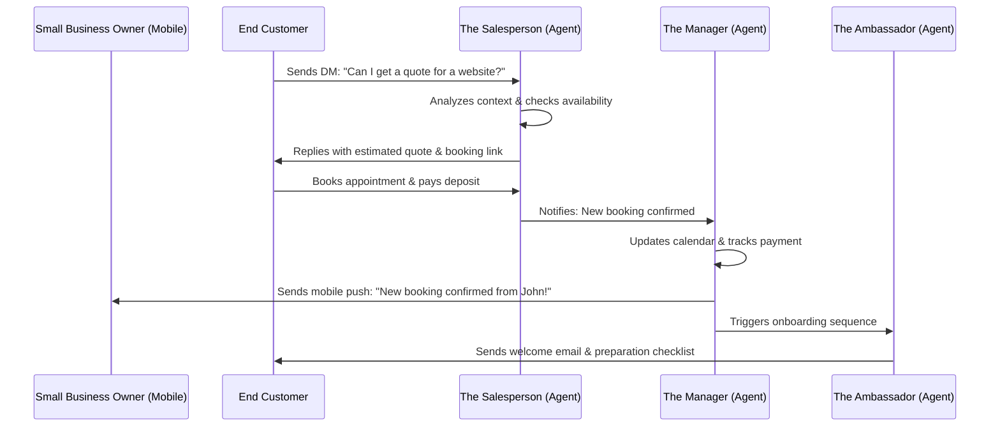

# [RESEARCH] AI Agent Department Architecture

## Problem Statement
Small business owners—bakers, handymen, boutique owners—are overwhelmed by the administrative burden of running a business. They spend hours replying to DMs, tracking inventory, following up on quotes, and managing schedules instead of focusing on their craft. They need an invisible "staff" to handle these complex operations autonomously, exactly like a real business operates, but without the overhead of hiring, managing, or learning complex software. They need their business to run seamlessly from their phone.

## Research Report
Current solutions in the market (Shopify, Wix, Squarespace) offer automations, but they are rigid, rule-based (If-This-Then-That), and require technical setup by the user. They don't handle context, nuance, or edge cases. For instance, a Shopify automation cannot politely answer an Instagram DM asking if a specific cake is vegan and seamlessly book a tasting appointment based on availability.

By structuring our AI agents as "Departments" (Operations, Marketing, Sales, Customer Success, Finance, Legal, Advisory), we map the platform directly to a non-technical owner's mental model. These departments will run invisibly in the background, communicating with each other and the user just like human employees would.

## Design Doc

### Architecture: Agent Interactions
The system architecture must support seamless inter-departmental communication and intuitive user interaction without prescribing complex API workflows.

### Mobile UX Flows
- **The "Staff" Dashboard:** The mobile app opens to a clean, consolidated dashboard showing what each "Department" did today (e.g., "The Manager processed 5 orders," "The Ambassador replied to 12 DMs").
- **Agent Interventions:** If an agent encounters an edge case it cannot handle confidently (e.g., an angry customer requesting a refund outside the standard policy), it sends a push notification to the owner: "Need your call on this refund request." The owner can tap "Approve", "Deny", or "Let me reply directly."
- **Budgeting & Throttling:** The AI usage is represented as "Staff Hours." The owner sees a visual progress bar of their AI budget. If approaching the limit, the system gracefully suggests upgrading their tier or prioritizing certain departments.

### Key Design Decisions
- **Familiar Terminology:** Departments mirror human roles (The Manager, The Promoter) to ensure immediate comprehension.
- **Graceful Degradation:** If an agent is uncertain, it defaults to human review (draft mode) rather than making a potentially harmful autonomous decision.
- **Context Sharing:** Departments must share a unified memory context for each customer. The Success agent must know what the Sales agent promised.

## Implementation Prompt
**Task:** Implement the foundation for the "Operations" (The Manager) and "Customer Success" (The Ambassador) AI departments.
**Outcome:** When a new order is received, The Manager must automatically update inventory and trigger a mobile push notification to the owner. Simultaneously, The Ambassador must send a customized confirmation message to the customer based on the product type (e.g., a digital download link vs. a shipping estimate).
**Acceptance Criteria:**
1. The departments operate completely autonomously once enabled.
2. The owner receives a single, clear push notification per critical event.
3. The customer receives accurate, context-aware communication.
4. The system seamlessly handles edge cases (e.g., low stock) by flagging them for owner review in the mobile UI.

## Priority
**P0** (Critical path for the "Invisible AI" value proposition)

## Estimated Scope
**Large**
