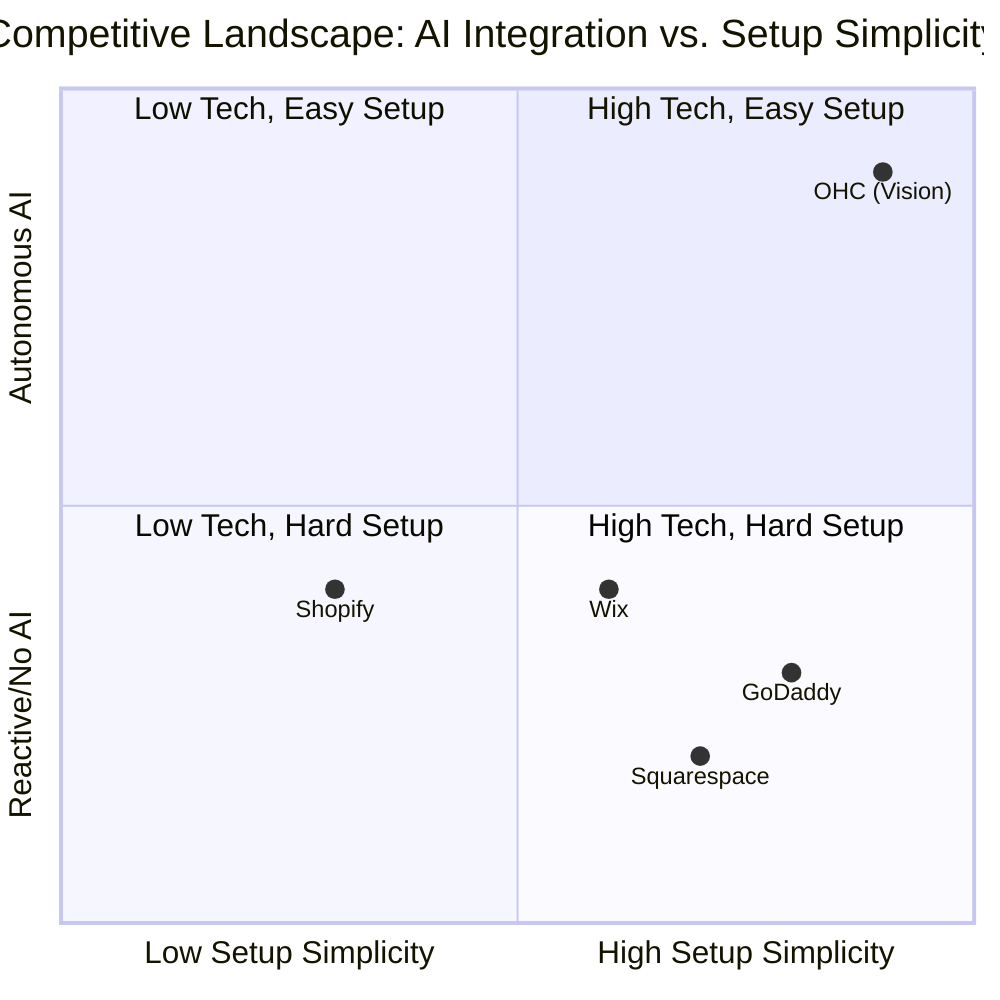
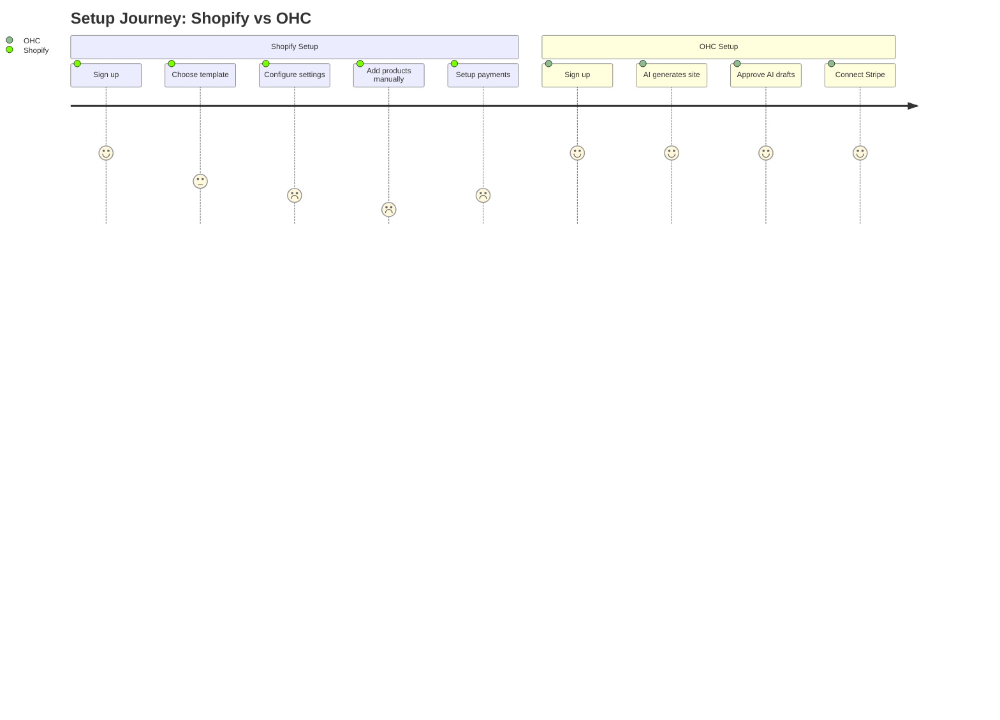
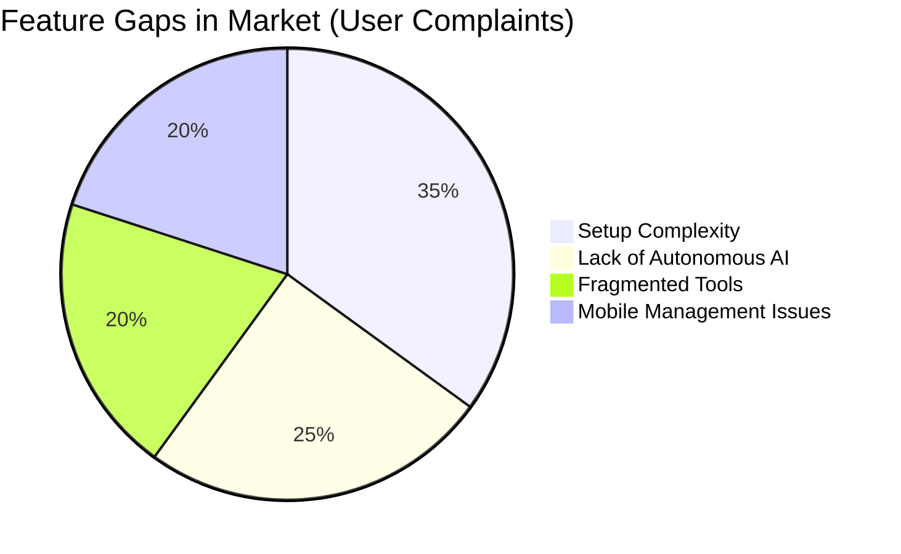

# Issue Brief: OHC Market Expansion & Competitive Advantage

## Title
Market Expansion & Competitive Advantage: Autonomous AI for SMBs

## Problem Statement
Small business owners (e.g., Maya the Baker, Carlos the Handyman) are frustrated by complex website builders and fragmented business management tools. Competitors like Shopify and Wix require significant time investment and technical understanding to set up. Users complain about setup difficulty, steep learning curves, and the lack of integrated, autonomous AI to help manage daily operations like customer queries, marketing, and inventory.

## Research Report

### Total Addressable Market (TAM) & Beachhead
The global small business market is vast, with over 30 million non-employer businesses in the US alone. Our beachhead market is non-technical solopreneurs (service providers, small food operators, creators) who lack the skills or time to string together multiple SaaS tools.

### Persona-Specific Pain Point Summaries
- **Maya (Baker, 28):** Currently selling via Instagram DMs. Pain: Shopify is too complex. Needs a mobile-first catalog, order deposit tracking, and an AI agent to auto-reply to Instagram DMs.
- **Carlos (Handyman, 42):** Word-of-mouth only. Pain: No booking system. Needs a simple service listing, calendar booking, and auto-quoting based on customer descriptions.
- **Priya (Boutique Owner, 35):** In-store + expanding online. Pain: Inventory sync is broken. Needs POS integration and automated email marketing.
- **Leo (Music Tutor, 22):** Online/in-person lessons. Pain: Manual booking chaos. Needs subscription billing and an AI follow-up system for inactive students.
- **Fatima (Food Cart, 50, limited English):** Pre-orders for pickup. Pain: Needs multi-language support and mobile notifications for orders.

### Top 10 SMB Pain Points (Ranked)
1. Setting up an online store is too confusing and takes too long.
2. Answering the same customer questions constantly (e.g., "Do you offer vegan?").
3. Managing inventory across multiple channels.
4. Keeping track of appointments and follow-ups.
5. Writing compelling product descriptions and social media posts.
6. Getting found on Google (SEO).
7. Syncing online and in-person payments.
8. Dealing with returns and customer complaints.
9. Generating financial reports and tracking expenses.
10. Complying with local business regulations and tax rules.

### Competitive Feature Gap Matrix

| Feature | OHC (Vision) | Shopify | Wix | Squarespace | GoDaddy |
|---|---|---|---|---|---|
| Setup time | **< 10 min** | 30-60 min | 20-40 min | 30-60 min | 20-40 min |
| Technical knowledge needed | **Zero** | Low | Low | Low | Low |
| AI agents (invisible) | **Yes, built-in** | Sidekick (chat only) | Wix AI | Limited | Airo (limited) |
| Mobile-first management | **Yes** | Partial | Partial | No | No |
| Booking + Store + Portfolio | **All-in-one** | Store only | All (complex) | Portfolio + store | Basic |
| Free tier | **Yes (useful)** | No | Yes (limited) | No | No |

### OHC AI Differentiation Manifesto
OHC leapfrogs competitors by treating AI not as a chatbot, but as autonomous background departments:
1. **Auto-replying to customer messages** to save hours per day.
2. **Auto-writing product descriptions** to reduce setup friction.
3. **Auto-generating social posts** to remove marketing barriers.
4. **Auto-sending follow-up emails** to recover abandoned carts.
5. **AI-generated weekly business insights** to empower owners without overwhelming them.

### Visualizations

#### Competitive Landscape (Mermaid)

#### User Journey Comparison (Mermaid)

#### Feature Gap Heatmap

## Design Doc

### High-Level Architecture
- **Unified Platform:** A single, mobile-first platform that integrates website building, storefront management, booking, and AI agents.
- **Autonomous AI Agents:** Agents that operate in the background based on system events (`MessageReceived`, `InventoryAdded`), coordinated via KAIROS orchestrator.
- **State Management:** PostgreSQL `SKIP LOCKED` pattern for the AI Job Queue to ensure reliable processing.

### UI/UX Flow (Mobile First - 375px)
- **Onboarding:** A simple, guided setup process that takes less than 10 minutes.
- **Dashboard:** A central hub showing key metrics.
- **Agent Activity Feed:** A transparent view of what the AI agents are doing (e.g., "The Ambassador drafted 3 replies"), with 1-tap "Approve & Send" or "Edit" buttons.

## Implementation Prompt
Develop the core autonomous AI agent infrastructure and integrate it seamlessly with the mobile-first dashboard. Implement the backend job queue and agent event processing loop to listen for standard business events and queue them for the appropriate AI agent. Create the Flutter mobile UI (ensuring perfect rendering at 375px) to display the "Agent Activity Feed" on the home dashboard, allowing users to review and approve drafted actions.

## Priority
P0

## Estimated Scope
Large
