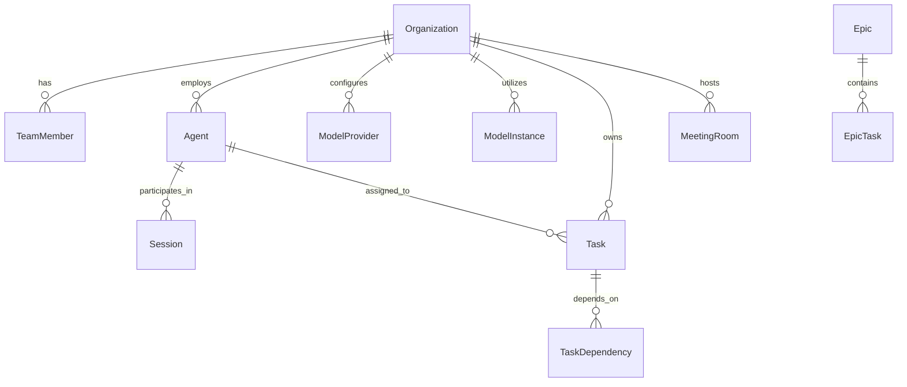

# OHC Data Model Architecture

## Problem Statement
The OneHumanCorp (OHC) platform needs a robust, scalable data model to support a multi-tenant environment where various business entities (e.g., bakeries, freelancers, boutiques) can operate seamlessly. The current data model lacks comprehensive documentation regarding entity relationships, multi-tenancy guarantees, and access patterns, which are critical for the invisible AI agents to function effectively and for maintaining data isolation between tenants.

## Research Report
- **Goal**: Review and document the OHC data model, focusing on entity types, relationships, multi-tenancy, and access patterns.
- **Findings**:
  - The system is multi-tenant, with each business represented as a `tenant` (often referred to as `organization`).
  - Key entities include `Organization`, `TeamMember`, `Agent`, `ModelInstance`, `ModelProvider`, `Task`, `Epic`, `MeetingRoom`, and `Session`.
  - The database layer utilizes PostgreSQL with Row Level Security (RLS) for tenant isolation (`organization_id` / `tenant_id`).
  - AI agents require access to customer history, task queues, and memory embeddings to function autonomously.

## Design Doc

### Entity-Relationship Diagram

### Key Invariants
- **Tenant Isolation**: Every query accessing tenant data MUST include the `organization_id` (or `tenant_id`) and respect Row Level Security (RLS) policies. A business owner can only see their own tenant's data.
- **Agent Autonomy**: AI agents operate within the bounds of their assigned `organization_id` and can only access memory and tasks associated with that tenant.
- **Task Dependency Management**: Tasks can have dependencies (`TaskDependency`), ensuring ordered execution by the KAIROS orchestrator.

### Access Patterns
- **AI Agent Context Retrieval**: Agents query the memory database (`autodream_memories`) and active sessions (`sessions`) using their `agent_id` and the `organization_id`.
- **Mobile App Data Fetching**: The mobile client fetches business data (e.g., active tasks, dashboard snapshots) via API endpoints that implicitly filter by the authenticated user's `organization_id`.
- **Background Orchestration**: The KAIROS orchestrator queries tasks by status and assigned agent role, scoped to the specific organization to ensure isolated job processing.

### Migration Strategy
- Future schema evolutions must be non-destructive and maintain backwards compatibility.
- Any new table storing tenant data MUST include an `organization_id` column and have an RLS policy applied immediately upon creation.
- Migrations should be executed in phases: Add new column/table -> Backfill data -> Update application logic -> Apply constraints (e.g., NOT NULL).

## Implementation Prompt
"Implement the foundational Row Level Security (RLS) policies for all core entity tables (`users`, `roles`, `tasks`, `agent_inbox`, `meeting_rooms`, etc.) in the PostgreSQL database. Ensure that the `organization_id` column is consistently used for isolation. Create a reusable migration script that applies these policies and a corresponding test suite to verify that tenant data is strictly isolated."

## Priority
P1

## Estimated Scope
Medium
