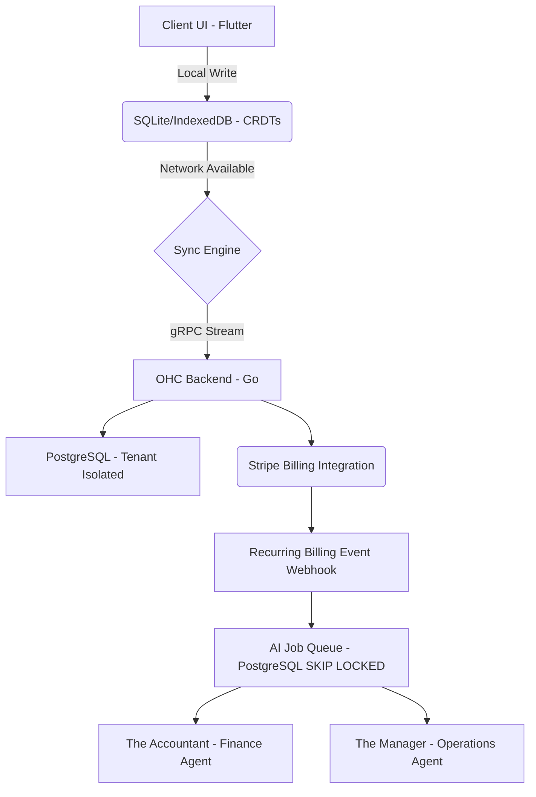

# Architectural Design: Autonomous Subscription and Recurring Billing Engine

## 1. Introduction

The Autonomous Subscription and Recurring Billing Engine empowers small businesses to establish predictable recurring revenue with zero technical setup. By removing the need for complex, expensive third-party apps, OneHumanCorp (OHC) enables business owners like Maya (the Home Baker) and Leo (the Music Tutor) to effortlessly offer subscription models (e.g., "Subscribe & Save") and recurring booking packages.

This design outlines an offline-first architecture using CRDT synchronization, enabling robust operation regardless of network connectivity, seamlessly managed by OHC's Finance AI Agent.

## 2. Target Personas & Use Cases

*   **Maya — The Home Baker (Physical Products):**
    *   **Goal:** Offer a weekly "Baker's Choice" cookie box subscription.
    *   **Needs:** A simple "Subscribe & Save" toggle on her product listings. She operates primarily from her iPhone, sometimes in her bakery basement where the cell signal is weak. She needs her fulfillment queue to accurately reflect upcoming subscription orders.
*   **Leo — The Music Tutor (Services & Bookings):**
    *   **Goal:** Sell monthly lesson packages (e.g., 4 guitar lessons/month).
    *   **Needs:** Recurring billing linked to his Google Calendar booking availability. He needs an autonomous system to handle missed payments (dunning) without him having to send awkward reminder emails to his students.

## 3. Architecture Overview

### 3.1. Offline-First CRDT Synchronization Architecture

To support users operating in environments with spotty connectivity (like Maya in her kitchen), the engine adopts an offline-first architecture utilizing Conflict-Free Replicated Data Types (CRDTs).

*   **Local Storage (Client-Side):**
    *   **IndexedDB (Web/PWA) / SQLite (Mobile Flutter):** The primary data store for the user interface. Subscription configurations, offline fulfillment queues, and dunning alerts are written locally first.
    *   **CRDT Implementation:** We utilize a hybrid logical clock (HLC) and CRDT structures (like LWW-Element-Set for subscription toggles) to manage state. When Maya toggles "Subscribe & Save" offline, it mutates the local CRDT.
*   **Synchronization (Sync Engine):**
    *   A background synchronization worker monitors network connectivity.
    *   Upon reconnection, local CRDT changes are pushed to the Cloud via gRPC streams.
    *   The OHC Main Server (Go) resolves conflicts deterministically using the CRDT properties, ensuring the local and cloud states eventually converge.

### 3.2. Data Flow & Integration

### 3.3. Autonomous Dunning Workflows (The Accountant)

The Finance & Payments AI Agent ("The Accountant") autonomously manages the entire dunning (payment recovery) process.

1.  **Payment Failure:** Stripe emits a `invoice.payment_failed` webhook.
2.  **Event Ingestion:** The OHC backend receives the webhook and drops an event into the AI Job Queue.
3.  **Agent Activation:** The Accountant agent picks up the job.
4.  **Contextual Action:**
    *   The agent analyzes the customer history (via `pgvector` memory).
    *   It drafts a personalized, polite SMS or email (e.g., "Hi [Student], looks like the card on file for your guitar lessons expired. Here's a secure link to update it: [Link]").
    *   If the user is offline (Standalone mode), the agent queues the message locally and dispatches it immediately upon reconnection.
5.  **Resolution:** Once the payment succeeds (via a `invoice.payment_succeeded` webhook), the Operations Agent ("The Manager") is notified to release the fulfilled order or booking slot.

## 4. Mode-Switching (Cloud vs. Standalone)

The interop layer ensures seamless transitions between Cloud and Standalone modes:

*   **Cloud Mode:** The Main Server coordinates with Stripe and dispatches jobs via Redis Pub/Sub to the AI Agent microservices.
*   **Standalone Mode:** If the internet connection drops, the local builtin agent takes over. It queues dunning actions and fulfillment updates in local SQLite. The CRDT engine ensures that when the device reconnects to the Cloud, the locally generated states sync perfectly without duplication, and deferred external API calls (like updating Stripe Customer objects) are executed idempotently.

## 5. Security & Isolation

*   **Row-Level Security (RLS):** All subscription data in PostgreSQL is strictly isolated by `tenant_id`.
*   **Idempotency:** Every interaction with Stripe (creating subscriptions, updating payment methods) utilizes strictly enforced idempotency keys to prevent double-charging, especially critical during CRDT sync resolution.
