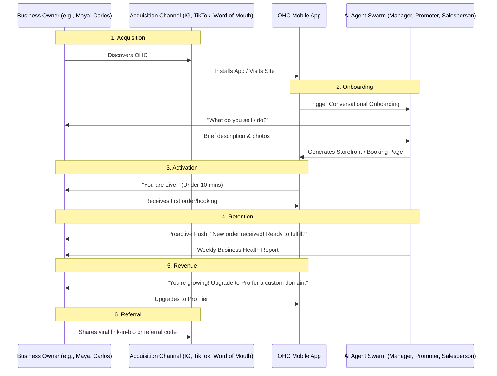

# 🔎 Scout: Tool Integration Research [Q3]

## Title
Business Journey Architecture: End-to-End User Flow for OHC Personas

## Problem Statement
The OneHumanCorp (OHC) platform aims to let anyone launch, run, and grow a real small business from their phone in under 10 minutes without code or manuals. However, we currently lack a holistic, mapped end-to-end journey spanning Acquisition, Onboarding, Activation, Retention, Revenue, and Referral tailored specifically to non-technical business owners. Small business owners often struggle to bridge the gap between initial setup and active business management. Without a unified business journey map, there is a risk of high friction, cognitive overload, and drop-offs, especially on mobile devices.

## Research Report
Based on evaluations of similar SaaS platforms (e.g., Shopify, Wix, Squarespace) and analyzing core user personas:
- **Shopify / Wix / Squarespace Comparison:** Traditional platforms require high cognitive load during onboarding (complex catalogs, domain configuration, theme builders). They target a desktop-first experience. OHC must differentiate with an AI-first, mobile-first approach where setup is an active conversation, not a form to fill.
- **Persona Specific Pain Points:**
  - *Maya (Baker, 28)*: Overwhelmed by "inventory variant" setups; needs visual, photo-first product adding.
  - *Carlos (Handyman, 42)*: Frustrated by syncing traditional calendar apps with business quoting tools.
  - *Priya (Boutique Owner, 35)*: Struggles to unify offline POS with an online storefront in real-time.
  - *Leo (Music Tutor, 22)*: Needs effortless, automated link-sharing for social media without managing multiple subscription tools.
  - *Fatima (Food Cart, 50)*: Language barriers and complex menus cause friction; requires simple toggles (e.g., "sold out").
- **Evidence-Based Recommendations:**
  - Shift onboarding from "build your store" to "tell me about your business."
  - Defer all non-essential configuration (e.g., custom domains, tax rules) until *after* the Activation phase (first sale or booking).
  - Use push notifications proactively for Retention (e.g., "You got a new order" or "Weekly business health summary").

## Design Doc

### Architecture Diagram: Business Journey Map

### UI Wireframes & Mobile UX Flow
- **375px First Focus:**
  - **Onboarding Screen:** A simple chat interface. Big, friendly typography (Outfit heading, Inter body). Glassmorphism chat bubbles.
  - **Dashboard (Post-Activation):** A unified "To-Do" feed managed by the AI Operations Agent ("The Manager"). Actionable cards with 1-tap approvals (e.g., "Approve Quote", "Mark Order as Shipped").
  - **Progressive Disclosure:** Simple mode active by default. Advanced configurations (JSON, detailed settings) are hidden behind an "Advanced" toggle.
  - **Offline Resilience:** The app remains fully functional offline, syncing drafts locally and synchronizing when the connection is restored.

### AI Agent Integration Points
- **The Promoter (Marketing):** Automatically generates the storefront layout, website copy, and SEO meta tags based on the onboarding chat.
- **The Manager (Operations):** Monitors incoming orders and creates simple, actionable task cards on the owner's dashboard.
- **The Advisor (Advisory):** Monitors usage and proactively suggests feature upgrades (Revenue phase) or new growth strategies.

### Key Design Decisions
- **Conversational Onboarding over Forms:** Reduces cognitive load and time-to-value.
- **Deferred Complexity:** Keep the initial setup under 10 minutes to guarantee Activation.
- **Actionable Task Feed:** Instead of a complex sidebar navigation, the primary UI is a prioritized feed of what the business owner needs to do *right now*.

## Implementation Prompt
Implement the initial, mobile-first (375px minimum) conversational onboarding UI. Create a chat-like interface where the user answers 2-3 simple questions about their business. Upon completion, trigger a mocked "Storefront Generation" sequence with a glassmorphism loading shimmer (max 300ms entrance animation). Transition the user to a unified Dashboard view displaying their first automatically generated product or service. Ensure the UI adheres to the OHC Premium Design Standards (Outfit/Inter fonts, progressive disclosure) and that the onboarding flow supports offline drafting with optimistic state updates. Write E2E tests covering the full Critical User Journey (CUJ) from chat start to the final dashboard presentation.

## Priority
P0

## Scope
Medium
